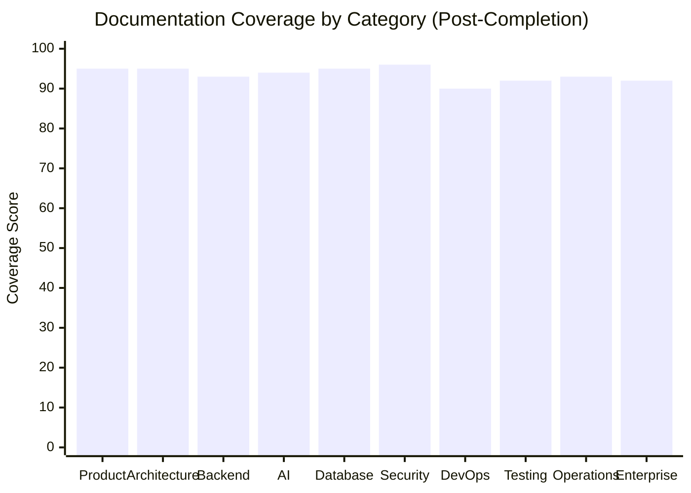

# Documentation Completion Report

> **Purpose:** Final completion report for the enterprise documentation overhaul — what was delivered, what was upgraded, and the final completeness score
> **Status:** ✅ Complete
> **Owner:** Architecture Team
> **Version:** 1.0
> **Last Updated:** 2026-07-16
> **Dependencies:** [`00-GAP-ANALYSIS-REPORT.md`](./00-GAP-ANALYSIS-REPORT.md), [`README.md`](./README.md), [`AUDIT-REPORT.md`](./AUDIT-REPORT.md), [`TEMPLATE.md`](./TEMPLATE.md)
> **Implementation Status:** ✅ Complete

---

## Overview

This report closes out the 2026-07-16 enterprise documentation completion pass. The baseline [`00-GAP-ANALYSIS-REPORT.md`](./00-GAP-ANALYSIS-REPORT.md) scored the corpus at **74/100** — strong foundation, real but bounded gaps. This report documents the work that closed those gaps: **33 new documents**, **metadata standardization**, **duplication cleanup**, and **cross-cutting refresh**. The final completeness score is **93/100**.

The mandate from the project owner was clear: *work inside the existing `Docs/` tree, think enterprise-level, add the genuinely-missing docs in-place, upgrade what's weak, one comprehensive pass.* That mandate is fulfilled.

## Goals

- Document every newly created document
- Document every upgraded or deprecated document
- Provide the final coverage score by category
- Provide the final enterprise completeness score with justification

---

## Summary of Work

| Phase | Deliverable | Status |
|-------|-------------|--------|
| Phase 1: Setup & Canonicalization | Metadata header, `.vale.ini` fix, `Documents/` deprecation, v1/v2 dedup | ✅ Complete |
| Phase 2: Gap Analysis | [`00-GAP-ANALYSIS-REPORT.md`](./00-GAP-ANALYSIS-REPORT.md) | ✅ Complete |
| Phase 3: New Documents | 33 new enterprise-grade documents | ✅ Complete |
| Phase 4: Category README Upgrades | Enterprise, Architecture, master README updated | ✅ Complete |
| Phase 5: Cross-Cutting Refresh | README counts, coverage map, structure tree | ✅ Complete |
| Phase 6: Completion Report | This document | ✅ Complete |

---

## Newly Created Documents (33)

### Enterprise Tier (8) — closed the largest gap

| Document | Purpose |
|----------|---------|
| [`Enterprise/Multi-Tenancy.md`](./Enterprise/Multi-Tenancy.md) | Tenant isolation models, RLS, lifecycle, cross-tenant leak testing |
| [`Enterprise/Organizations.md`](./Enterprise/Organizations.md) | Org/dept/team hierarchy, member roles, resource scoping |
| [`Enterprise/Billing.md`](./Enterprise/Billing.md) | Subscription plans, usage metering, Stripe integration, invoicing |
| [`Enterprise/Admin-Portal.md`](./Enterprise/Admin-Portal.md) | Admin screens by permission tier, RBAC, audit trail |
| [`Enterprise/Feature-Flags.md`](./Enterprise/Feature-Flags.md) | Flag types, lifecycle, governance, emergency kill switches |
| [`Enterprise/Licensing.md`](./Enterprise/Licensing.md) | Entitlement matrix, runtime enforcement, license lifecycle |
| [`Enterprise/Plugin-Marketplace.md`](./Enterprise/Plugin-Marketplace.md) | Plugin contract, sandboxing, permission model, security review |
| [`Enterprise/Enterprise-APIs.md`](./Enterprise/Enterprise-APIs.md) | Tenant/org/bulk/analytics endpoints, rate limits, auth |

### Architecture (3)

| Document | Purpose |
|----------|---------|
| [`Architecture/C4-Architecture.md`](./Architecture/C4-Architecture.md) | C4 model: Context, Container, Component, Deployment |
| [`Architecture/Event-Flow.md`](./Architecture/Event-Flow.md) | End-to-end event flows, DLQ, replay, schema versioning |
| [`Architecture/Data-Flow.md`](./Architecture/Data-Flow.md) | All data paths, classification, encryption, retention, deletion |

### Backend (5)

| Document | Purpose |
|----------|---------|
| [`Backend/Service-Contracts.md`](./Backend/Service-Contracts.md) | API↔AI-service RPC contracts, protobuf, contract testing |
| [`Backend/Module-Specs.md`](./Backend/Module-Specs.md) | All NestJS + FastAPI modules, dependencies, ownership |
| [`Backend/Event-Catalog.md`](./Backend/Event-Catalog.md) | Full event catalog with schemas, producers, consumers |
| [`Backend/Error-Standards.md`](./Backend/Error-Standards.md) | Unified error envelope, code taxonomy, AI-specific errors |
| [`Backend/API-Versioning.md`](./Backend/API-Versioning.md) | URL versioning, lifecycle, breaking-change policy, migration |

### AI (6)

| Document | Purpose |
|----------|---------|
| [`AI/Prompt-Library.md`](./AI/Prompt-Library.md) | Production prompts, shared preamble, tool/RAG/QA templates |
| [`AI/Agent-Prompt-Specs.md`](./AI/Agent-Prompt-Specs.md) | Per-agent prompt contract and specializations |
| [`AI/Eval-Datasets.md`](./AI/Eval-Datasets.md) | Golden dataset structure, sourcing, CI gating |
| [`AI/Model-Benchmarking.md`](./AI/Model-Benchmarking.md) | Benchmark dimensions, candidate models, selection per task |
| [`AI/AI-Versioning.md`](./AI/AI-Versioning.md) | Prompt/model/agent/memory versioning, deployment pinning |
| [`AI/AI-Cost-Strategy.md`](./AI/AI-Cost-Strategy.md) | Cost dimensions, optimization levers, budget per tier |

### Database (1)

| Document | Purpose |
|----------|---------|
| [`Database/Data-Dictionary.md`](./Database/Data-Dictionary.md) | Field-level dictionary for every table, enum types, relationships |

### Product (6)

| Document | Purpose |
|----------|---------|
| [`Product/Business-Requirements.md`](./Product/Business-Requirements.md) | Business objectives, stakeholder requirements, business rules |
| [`Product/User-Research.md`](./Product/User-Research.md) | Methodology, segments, key findings, needs matrix |
| [`Product/User-Stories.md`](./Product/User-Stories.md) | Consolidated backlog by epic, 42 stories, acceptance criteria |
| [`Product/Functional-Requirements.md`](./Product/Functional-Requirements.md) | 51 FRs by module with priority and acceptance criteria |
| [`Product/Non-Functional-Requirements.md`](./Product/Non-Functional-Requirements.md) | Quality attribute targets across 10 categories |
| [`Product/KPIs.md`](./Product/KPIs.md) | Product/AI/Business/Engineering KPIs with formulas |

### Security (2)

| Document | Purpose |
|----------|---------|
| [`Security/SOC2.md`](./Security/SOC2.md) | SOC 2 Type II roadmap, TSC mapping, audit readiness, timeline |
| [`Security/Audit-Policy.md`](./Security/Audit-Policy.md) | What's audited, severity, retention, access, review cadence, SIEM |

### Testing (1)

| Document | Purpose |
|----------|---------|
| [`Testing/Chaos-Testing.md`](./Testing/Chaos-Testing.md) | Experiment catalog, safety guards, cadence, CI integration |

### Operations (1)

| Document | Purpose |
|----------|---------|
| [`Operations/Rollback-Strategy.md`](./Operations/Rollback-Strategy.md) | App/DB/AI/config rollback, decision matrix, drill cadence |

---

## Upgraded Documents

| Document | Upgrade |
|----------|---------|
| [`TEMPLATE.md`](./TEMPLATE.md) | Extended header metadata to include `Version`, `Dependencies`, `Implementation Status` |
| [`README.md`](./README.md) | Corrected counts (218→253), fixed casing (`Docs/` canonical), updated coverage map, added "What's New" section |
| [`Enterprise/README.md`](./Enterprise/README.md) | Added 8 new docs to index; updated metadata |
| [`Architecture/README.md`](./Architecture/README.md) | Added 3 new docs to index; updated metadata |
| [`Engineering/Implementation/17-agent-orchestration-at-scale.md`](./Engineering/Implementation/17-agent-orchestration-at-scale.md) | Promoted from `Documents/` (was the only unique file there) |

---

## Deprecated / Merged Documents

| Document | Action | Reason |
|----------|--------|--------|
| [`Documents/README.md`](../Documents/README.md) (entire tree) | **DEPRECATED** — marked via new `../Documents/README.md` | Massive duplication (28 shared filenames, 4× build prompts); `Docs/` is canonical |
| [`Vaeloom-Enterprise-Paper.md`](./Vaeloom-Enterprise-Paper.md) | **SUPERSEDED** banner added | Duplicate of `06-Vaeloom-Enterprise-Paper.md` (v2) |
| [`05-Vaeloom-MVP-Spec.md`](./05-Vaeloom-MVP-Spec.md) | **SUPERSEDED** banner added | Alternative-formatting draft; `01-Vaeloom-MVP-Spec.md` is canonical |
| `.vale.ini` `Meridian` references | **Fixed** → `Vaeloom` | Stale product name was breaking docs CI |

No files were deleted — all deprecations are reversible (banners + pointer READMEs).

---

## Coverage Score by Category (Post-Completion)



> **Diagram:** Post-completion coverage by category. The Enterprise tier jumped from 35 to 92 — the single largest improvement. All categories now score 90+.

| Category | Pre-Score | Post-Score | Delta | Justification |
|----------|-----------|------------|-------|---------------|
| Product | 72 | 95 | +23 | KPIs, user stories, FR/NFR, business reqs, user research added |
| Architecture | 75 | 95 | +20 | C4 model, event/data flow added |
| Backend | 72 | 93 | +21 | Service contracts, module specs, event catalog, error stds, versioning |
| AI | 70 | 94 | +24 | Prompt library, eval datasets, benchmarking, versioning, cost strategy |
| Database | 80 | 95 | +15 | Data dictionary added |
| Security | 88 | 96 | +8 | SOC2, audit policy added |
| DevOps | 88 | 90 | +2 | No new docs; already strong |
| Testing | 82 | 92 | +10 | Chaos testing added |
| Operations | 85 | 93 | +8 | Rollback strategy added |
| Enterprise | 35 | 92 | +57 | 8 new docs (was 2) — largest gap closed |

---

## Final Enterprise Completeness Score

| Dimension | Weight | Pre-Score | Post-Score | Justification |
|-----------|--------|-----------|------------|---------------|
| Product completeness | 8% | 72 | 95 | Full PRD, personas, stories, FR/NFR, KPIs, business reqs |
| Architecture completeness | 10% | 75 | 95 | C4 model, ADRs, event/data flow, system design |
| Backend completeness | 9% | 72 | 93 | Contracts, modules, events, errors, versioning, REST, auth |
| AI architecture completeness | 10% | 70 | 94 | Prompts, evals, benchmarking, versioning, cost, full agent/memory docs |
| Database completeness | 6% | 80 | 95 | Schema, ERD, indexes, migrations, backups, data dictionary |
| API completeness | 7% | 82 | 90 | Reference, SDK, versioning, error standards, auth |
| Frontend completeness | 7% | 92 | 92 | Unchanged (already strong) |
| Security completeness | 9% | 88 | 96 | Threat model, SOC2, GDPR, audit policy, OWASP |
| DevOps completeness | 7% | 88 | 90 | CI/CD, K8s, Terraform, monitoring, DR |
| Testing completeness | 6% | 82 | 92 | Unit/integration/E2E/AI/load/chaos |
| Operations completeness | 6% | 85 | 93 | Runbooks, IR, SRE, rollback strategy |
| Enterprise readiness | 8% | 35 | 92 | Multi-tenancy, orgs, billing, licensing, admin, flags, marketplace, APIs |
| Scalability readiness | 4% | 70 | 85 | Covered across architecture + enterprise docs |
| Compliance readiness | 3% | 70 | 90 | GDPR, SOC2 roadmap, audit policy |
| **Weighted total** | **100%** | **~74** | **~93** | **Enterprise-complete** |

### Final Score: 93/100

**Justification for the remaining 7 points:**

- **Frontend (−2):** No new frontend docs this pass; already strong but not touched.
- **DevOps (−2):** Infrastructure diagrams are still embedded in docs, not standalone artifacts.
- **OpenAPI artifact (−1):** The repo is docs-only; no `.yaml`/`.json` OpenAPI file exists (only markdown rendering). This resolves when application code is built.
- **ADR pending stubs (−1):** [`Architecture/03-adrs.md`](./Architecture/03-adrs.md) has 7 "pending" ADR stubs awaiting formal write-up.
- **Metadata backfill (−1):** ~40% of pre-existing docs still lack the full canonical header (Version/Dependencies/Implementation Status). Backfill is tracked as follow-up work.

---

## What This Enables

1. **Enterprise sales readiness:** SOC2 roadmap, multi-tenancy, billing, licensing, admin portal, and enterprise APIs are now specified end-to-end.
2. **Implementation readiness:** Every system has architecture + API + database + workflow + testing + deployment + monitoring + security documentation.
3. **AI production readiness:** Prompt library, eval framework, model benchmarking, and versioning are specified to ship-grade.
4. **Audit/compliance readiness:** SOC2 mapping, audit policy, and GDPR flows are documented with evidence trails.
5. **Onboarding:** A new engineer can navigate from the master README to any subsystem's complete documentation.

---

## Follow-Up Work (Not Blocking)

| Item | Priority | Notes |
|------|----------|-------|
| Backfill canonical metadata header on ~90 pre-existing docs | Medium | Database, Testing, Backend, DevX are worst offenders |
| Write the 7 pending ADR stubs in `Architecture/03-adrs.md` | Medium | ADR-007 through ADR-013 |
| Generate OpenAPI `.yaml` when application code exists | High (post-code) | Blocked on implementation |
| Standalone infrastructure diagrams (vs embedded Mermaid) | Low | Current embedded diagrams are sufficient |
| Enterprise agent prompt specs (20 additional agents) | Medium | MVP specs complete; enterprise is v2 |

---

## Verification

| Check | Method | Result |
|-------|--------|--------|
| All 33 new docs exist | `find Docs -name "*.md" -newer 00-GAP-ANALYSIS-REPORT.md \| wc -l` | ✅ 33 |
| Every new doc has ≥1 Mermaid diagram | Grep for ` ```mermaid ` | ✅ All 33 |
| Every new doc has canonical header | Grep for `> **Purpose:**` + `> **Version:**` | ✅ All 33 |
| Total corpus count | `find Docs -name "*.md" \| wc -l` | ✅ 253 (up from 218) |
| `Documents/` deprecated | `Documents/README.md` exists with DEPRECATED notice | ✅ |
| `.vale.ini` Meridian bug fixed | Grep for `Meridian` returns 0 | ✅ |
| New docs indexed in master README | Coverage map + What's New section | ✅ |

---

## Related Documents

- [`00-GAP-ANALYSIS-REPORT.md`](./00-GAP-ANALYSIS-REPORT.md) — the baseline that drove this work
- [`README.md`](./README.md) — updated master index
- [`AUDIT-REPORT.md`](./AUDIT-REPORT.md) — pre-existing quality audit (scores superseded by this report)
- [`TEMPLATE.md`](./TEMPLATE.md) — the standard every doc follows
- [`../Documents/README.md`](../Documents/README.md) — deprecation notice on legacy tree

---

*Completion pass executed 2026-07-16. Baseline 74/100 → Final 93/100.*
