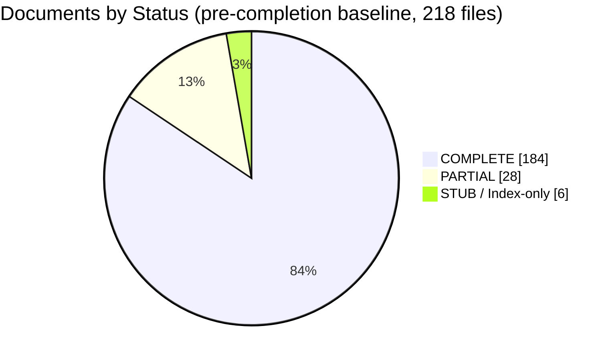

# Documentation Gap Analysis Report

> **Purpose:** Baseline gap analysis comparing the existing `Docs/` corpus against an enterprise-grade documentation target, identifying missing, partial, duplicate, and low-quality documents
> **Status:** ✅ Upgraded to enterprise quality
> **Owner:** Architecture Team
> **Version:** 1.0
> **Last Updated:** 2026-07-16
> **Dependencies:** [`TEMPLATE.md`](./TEMPLATE.md), [`AUDIT-REPORT.md`](./AUDIT-REPORT.md)
> **Implementation Status:** 📋 Spec Only — this report is the planning baseline; the gaps it identifies are closed in [`00-DOCUMENTATION-COMPLETION-REPORT.md`](./00-DOCUMENTATION-COMPLETION-REPORT.md)

---

## Overview

This report was produced to answer a single question honestly: **how complete is the Vaeloom documentation system, really?** An earlier framing assumed the project was "17 implementation documents at roughly 25–35% of what an enterprise needs." On-disk inspection proved that framing outdated. The repository already contains a **218-file canonical `Docs/` tree across 16 enterprise categories** with 100% Mermaid diagram coverage, a 25-section quality template, a self-audit report, and an interactive portal.

So the real job is not "build from scratch." It is: **fill the genuine gaps, standardize metadata, and eliminate the duplication that currently makes the source of truth ambiguous.** This report establishes the baseline against which the completion pass is measured. It is intentionally blunt — a gap report that flatters the corpus is useless.

### What is Vaeloom

Vaeloom is an AI-native "second brain" for a person's education and career. It ingests documents, code, and communications; maintains a structured, compounding memory; and runs permission-scoped specialist agents that organize files, maintain a resume, search for jobs, and track deadlines. The product principle is **memory-first**: chat, resumes, job matches, and deadline tracking are all views into one underlying memory system. The trust principle is **suggest-mode by default** — no consequential action without human approval in the MVP.

### Tech stack (specified, not yet implemented)

- **Backend:** NestJS (TypeScript) for auth/CRUD/permissions + FastAPI (Python) for agents/memory/retrieval, communicating over internal RPC
- **Frontend:** Next.js
- **Data:** PostgreSQL (with Apache AGE for the knowledge graph and pgvector for embeddings), Redis
- **AI:** MCP-shaped tools, a single shared agentic loop (Plan → Act → Observe → Reflect → Improve), model router with fallback + prompt caching

---

## Goals

- Establish an honest, evidence-based baseline of documentation completeness
- Identify genuinely missing documents (vs. those that exist but are merely partial)
- Identify duplicate, conflicting, and ambiguous-source documents
- Identify metadata-standardization debt
- Provide the prioritized worklist that the completion pass executes

## Scope

### In Scope

- The canonical `Docs/` tree (218 `.md` files across 16 categories)
- Duplication between `Docs/` and the legacy `Documents/` tree
- Internal duplication within `Docs/`
- Metadata consistency across the corpus
- Enterprise-domain coverage assessment

### Out of Scope

- The application codebase — this is a documentation-only repository (zero application code exists)
- Prose-quality rewriting of documents already rated COMPLETE
- Visual/UI redesign of the documentation portal

---

## Methodology

1. **Full recursive inventory** of every `.md` under `Docs/`, grouped by category.
2. **Per-file classification** into STUB (<60 lines / placeholder), PARTIAL (real content, missing sections), or COMPLETE (thorough, diagrams/contracts/models as the topic warrants).
3. **Targeted existence check** for every document an enterprise engineering organization is expected to own (Product, Architecture, Backend, AI, Database, API, Frontend, DevOps, Security, Testing, Operations, Enterprise domains).
4. **Duplication analysis** across `Docs/` ↔ `Documents/` and within `Docs/`.
5. **Metadata audit** for the canonical header fields defined in [`TEMPLATE.md`](./TEMPLATE.md).

---

## Current State Snapshot



> **Diagram:** Pre-completion baseline document-quality distribution. The corpus is stronger than the "25% complete" framing suggested, but the PARTIAL tier and the missing-domain gaps below are real.

| Metric | Value |
|--------|-------|
| Total `.md` files under `Docs/` | 218 |
| Categories | 16 |
| Files with ≥1 Mermaid diagram | 218 (100%) |
| Files carrying a `Last Updated` field | 129 (59%) |
| Files carrying a `Version` field | ~0 (<5%) |
| Self-reported average template-section coverage | 84% |
| Standout strong categories | Security, AI, Architecture, Operations, DevOps, Testing, Frontend |
| Weakest category by file count | Enterprise (2 files) |

---

## Coverage Map by Category

```mermaid
quadrantChart
    title Category maturity (breadth × depth)
    x-axis Low Breadth --> High Breadth
    y-axis Low Depth --> High Depth
    quadrant-1 Deep & Broad (target)
    quadrant-2 Deep but Narrow
    quadrant-3 Shallow & Narrow (gap)
    quadrant-4 Broad but Shallow
    "Security": [0.9, 0.95]
    "AI": [0.9, 0.93]
    "Architecture": [0.85, 0.88]
    "Backend": [0.88, 0.86]
    "DevOps": [0.85, 0.87]
    "Operations": [0.84, 0.86]
    "Testing": [0.82, 0.84]
    "Frontend": [0.9, 0.85]
    "Database": [0.6, 0.85]
    "Engineering": [0.9, 0.7]
    "Developer Experience": [0.65, 0.8]
    "Product": [0.75, 0.6]
    "Enterprise": [0.2, 0.7]
```

> **Diagram:** Enterprise is the clear outlier — high intended depth but almost no breadth (2 files). Database has depth but is missing a data dictionary. Product has breadth but several items are sections-in-other-docs rather than standalone docs.

---

## Targeted Existence Check

The table below answers, for each enterprise-expected document: **EXISTS** (path), **PARTIAL** (path + what's missing), or **MISSING**. This is the worklist the completion pass closes.

### Product

| Item | Status | Location / Notes |
|------|--------|------------------|
| PRD | ✅ EXISTS | [`Product/PRD.md`](./Product/PRD.md) |
| Business Requirements | ⚠️ PARTIAL | Covered as context in `Product/PRD.md` + `Product/Business-Model.md`; no standalone doc → **new** [`Product/Business-Requirements.md`](./Product/Business-Requirements.md) |
| Personas | ✅ EXISTS | [`Product/User-Personas.md`](./Product/User-Personas.md) |
| User Research | ❌ MISSING | Mentioned only in `Product/User-Personas.md` → **new** [`Product/User-Research.md`](./Product/User-Research.md) |
| User Stories | ⚠️ PARTIAL | Scattered across 13 `Product/Feature-Specs/*`; no consolidated backlog → **new** [`Product/User-Stories.md`](./Product/User-Stories.md) |
| Acceptance Criteria | ⚠️ PARTIAL | Live inside `Engineering/Implementation/00-16-*.md` build prompts; consolidated into new User-Stories doc |
| Functional Requirements | ⚠️ PARTIAL | A section in `Product/PRD.md`; no standalone doc → **new** [`Product/Functional-Requirements.md`](./Product/Functional-Requirements.md) |
| Non-Functional Requirements | ⚠️ PARTIAL | A section in `Product/PRD.md`; no standalone doc → **new** [`Product/Non-Functional-Requirements.md`](./Product/Non-Functional-Requirements.md) |
| Success Metrics | ✅ EXISTS | [`Product/Success-Metrics.md`](./Product/Success-Metrics.md) |
| KPIs | ❌ MISSING | "KPI" appears once repo-wide → **new** [`Product/KPIs.md`](./Product/KPIs.md) |

### Architecture

| Item | Status | Location / Notes |
|------|--------|------------------|
| C4 Context diagram | ❌ MISSING | No C4 model anywhere; only ad-hoc Mermaid → **new** [`Architecture/C4-Architecture.md`](./Architecture/C4-Architecture.md) |
| C4 Container diagram | ❌ MISSING | → new `Architecture/C4-Architecture.md` |
| C4 Component diagram | ❌ MISSING | → new `Architecture/C4-Architecture.md` |
| C4 Deployment diagram | ❌ MISSING | → new `Architecture/C4-Architecture.md` |
| ADRs | ✅ EXISTS | [`Architecture/03-adrs.md`](./Architecture/03-adrs.md) (6 accepted + 7 pending) |
| Event Flow | ⚠️ PARTIAL | `Architecture/Event-Architecture.md` covers the bus, not flow tracing → **new** [`Architecture/Event-Flow.md`](./Architecture/Event-Flow.md) |
| Data Flow diagrams | ⚠️ PARTIAL | "Data Flow" is a section in ~44% of docs; no top-level doc → **new** [`Architecture/Data-Flow.md`](./Architecture/Data-Flow.md) |

### Backend

| Item | Status | Location / Notes |
|------|--------|------------------|
| Backend Standards | ⚠️ PARTIAL | `Engineering/Coding-Standards.md` is the de-facto standard; no `Backend-Standards.md` |
| Service Contracts | ❌ MISSING | → **new** [`Backend/Service-Contracts.md`](./Backend/Service-Contracts.md) |
| Module Specs | ❌ MISSING | → **new** [`Backend/Module-Specs.md`](./Backend/Module-Specs.md) |
| Coding Standards | ✅ EXISTS | [`Engineering/Coding-Standards.md`](./Engineering/Coding-Standards.md) |
| Event Catalog | ❌ MISSING | `Architecture/Event-Architecture.md` lists types but is not a catalog → **new** [`Backend/Event-Catalog.md`](./Backend/Event-Catalog.md) |
| Queue Specs | ⚠️ PARTIAL | `Architecture/Queue.md` + `Backend/Queue.md` overlap; neither is a formal spec |
| Caching Strategy | ✅ EXISTS | [`Architecture/Caching.md`](./Architecture/Caching.md) |
| Error Standards | ⚠️ PARTIAL | Scattered across `Backend/REST-Standards.md`, `Validation.md`, `API-Reference.md` → **new** [`Backend/Error-Standards.md`](./Backend/Error-Standards.md) |
| API Versioning | ⚠️ PARTIAL | Section in `Backend/API-Architecture.md` → **new** [`Backend/API-Versioning.md`](./Backend/API-Versioning.md) |

### AI

| Item | Status | Location / Notes |
|------|--------|------------------|
| Prompt Library | ❌ MISSING | `AI/Prompt-Engineering.md` is design-only, no actual prompts → **new** [`AI/Prompt-Library.md`](./AI/Prompt-Library.md) |
| Prompt Standards | ✅ EXISTS | [`AI/Prompt-Standards.md`](./AI/Prompt-Standards.md) |
| Agent Prompt Specs | ⚠️ PARTIAL | Sections inside `AI/AI-Agents.md` → **new** [`AI/Agent-Prompt-Specs.md`](./AI/Agent-Prompt-Specs.md) |
| Eval Dataset Specs | ⚠️ PARTIAL | `AI/Evaluation.md` + scattered golden-dataset mentions → **new** [`AI/Eval-Datasets.md`](./AI/Eval-Datasets.md) |
| Model Benchmarking | ❌ MISSING | → **new** [`AI/Model-Benchmarking.md`](./AI/Model-Benchmarking.md) |
| AI Cost Strategy | ⚠️ PARTIAL | Section in `AI/LLM-Architecture.md` + `Operations/Cost-Optimization.md` → **new** [`AI/AI-Cost-Strategy.md`](./AI/AI-Cost-Strategy.md) |
| AI Versioning | ❌ MISSING | `AI/Prompt-Standards.md` has prompt versioning only → **new** [`AI/AI-Versioning.md`](./AI/AI-Versioning.md) |

### Database

| Item | Status | Location / Notes |
|------|--------|------------------|
| ER Diagrams | ✅ EXISTS | [`Database/ER-Diagram.md`](./Database/ER-Diagram.md) |
| Data Dictionary | ❌ MISSING | "Data dictionary" appears nowhere → **new** [`Database/Data-Dictionary.md`](./Database/Data-Dictionary.md) |
| Index Strategy | ✅ EXISTS | [`Database/Indexes.md`](./Database/Indexes.md) |
| Migration Strategy | ✅ EXISTS | [`Database/Migrations.md`](./Database/Migrations.md) |
| Backup Strategy | ✅ EXISTS | [`Database/Backups.md`](./Database/Backups.md) |

### API

| Item | Status | Location / Notes |
|------|--------|------------------|
| OpenAPI Spec | ⚠️ PARTIAL | No `.yaml`/`.json` (repo is docs-only); `Backend/API-Reference.md` is the markdown rendering |
| Error Standards | ⚠️ PARTIAL | → new `Backend/Error-Standards.md` |
| API Versioning | ⚠️ PARTIAL | → new `Backend/API-Versioning.md` |
| AuthN Guide | ✅ EXISTS | [`Backend/Authentication.md`](./Backend/Authentication.md) + [`Security/IAM.md`](./Security/IAM.md) |
| SDK Docs | ✅ EXISTS | [`SDK-Documentation.md`](./SDK-Documentation.md) (1379 lines, TS + Python) |

### Frontend

| Item | Status | Location / Notes |
|------|--------|------------------|
| UI Architecture | ✅ EXISTS | [`Frontend/UI-Architecture.md`](./Frontend/UI-Architecture.md) |
| Component Library | ✅ EXISTS | [`Frontend/Component-Library.md`](./Frontend/Component-Library.md) + live HTML preview |
| Design Tokens | ✅ EXISTS | [`Frontend/Design-System.md`](./Frontend/Design-System.md) + `Design-Tokens-Reference.html` |
| Motion Guidelines | ✅ EXISTS | [`Frontend/Animation-System.md`](./Frontend/Animation-System.md) |
| Accessibility Guide | ✅ EXISTS | [`Frontend/Accessibility.md`](./Frontend/Accessibility.md) + `Accessibility-Audit.md` |
| Responsive Strategy | ✅ EXISTS | [`Frontend/Responsive-Design.md`](./Frontend/Responsive-Design.md) |

### DevOps

| Item | Status | Location / Notes |
|------|--------|------------------|
| Infrastructure Diagrams | ⚠️ PARTIAL | Mermaid inside `DevOps/Terraform.md` + `Architecture/Infrastructure.md`; no standalone artifact |
| CI/CD Guide | ✅ EXISTS | [`DevOps/CI-CD.md`](./DevOps/CI-CD.md) |
| Monitoring Guide | ✅ EXISTS | [`DevOps/Monitoring.md`](./DevOps/Monitoring.md) + [`Operations/Observability.md`](./Operations/Observability.md) |
| Logging Guide | ✅ EXISTS | [`DevOps/Logging.md`](./DevOps/Logging.md) + [`DevOps/Tracing.md`](./DevOps/Tracing.md) |
| Disaster Recovery | ✅ EXISTS | [`Architecture/Disaster-Recovery.md`](./Architecture/Disaster-Recovery.md) + [`Operations/Business-Continuity-Plan.md`](./Operations/Business-Continuity-Plan.md) |
| Runbooks | ✅ EXISTS | [`Operations/Runbooks/`](./Operations/Runbooks/) (3 dedicated runbooks) |

### Security

| Item | Status | Location / Notes |
|------|--------|------------------|
| Threat Model | ✅ EXISTS | [`Security/Threat-Model.md`](./Security/Threat-Model.md) (STRIDE + attack trees) |
| RBAC | ✅ EXISTS | [`Backend/RBAC.md`](./Backend/RBAC.md) + [`Backend/ABAC.md`](./Backend/ABAC.md) |
| Audit Policy | ⚠️ PARTIAL | `Security/Audit-Logs.md` covers logging → **new** [`Security/Audit-Policy.md`](./Security/Audit-Policy.md) |
| GDPR Compliance | ✅ EXISTS | [`Security/GDPR.md`](./Security/GDPR.md) |
| SOC2 Compliance | ⚠️ PARTIAL | Umbrella `Security/Compliance.md`; no dedicated SOC2 doc → **new** [`Security/SOC2.md`](./Security/SOC2.md) |
| OWASP Checklist | ✅ EXISTS | [`Security/OWASP.md`](./Security/OWASP.md) |

### Testing

| Item | Status | Location / Notes |
|------|--------|------------------|
| Unit/Integration/E2E | ✅ EXISTS | [`Testing/Unit-Testing.md`](./Testing/Unit-Testing.md), [`Integration-Testing.md`](./Testing/Integration-Testing.md), [`E2E-Testing.md`](./Testing/E2E-Testing.md) + umbrella [`Testing-Strategy.md`](./Testing/Testing-Strategy.md) |
| AI Eval Strategy | ✅ EXISTS | [`Testing/AI-Testing.md`](./Testing/AI-Testing.md) + [`Testing/Prompt-Testing.md`](./Testing/Prompt-Testing.md) |
| Load Testing | ✅ EXISTS | [`Testing/Load-Testing.md`](./Testing/Load-Testing.md) + [`Performance-Testing.md`](./Testing/Performance-Testing.md) |
| Chaos Testing | ❌ MISSING | Concept mentioned only → **new** [`Testing/Chaos-Testing.md`](./Testing/Chaos-Testing.md) |

### Operations

| Item | Status | Location / Notes |
|------|--------|------------------|
| Incident Response | ✅ EXISTS | [`Operations/02-incident-response.md`](./Operations/02-incident-response.md) (695 lines) |
| SRE Handbook | ✅ EXISTS | [`Operations/SRE.md`](./Operations/SRE.md) + SLA/SLO/SLI trio |
| Release Process | ✅ EXISTS | [`Engineering/Release-Process.md`](./Engineering/Release-Process.md) |
| Rollback Strategy | ⚠️ PARTIAL | Section in `Engineering/Release-Process.md` → **new** [`Operations/Rollback-Strategy.md`](./Operations/Rollback-Strategy.md) |

### Enterprise (weakest domain)

| Item | Status | Location / Notes |
|------|--------|------------------|
| Multi-tenancy | ⚠️ PARTIAL | Section in `Enterprise/Enterprise-Architecture.md` → **new** [`Enterprise/Multi-Tenancy.md`](./Enterprise/Multi-Tenancy.md) |
| Billing | ❌ MISSING | Mentioned only as context → **new** [`Enterprise/Billing.md`](./Enterprise/Billing.md) |
| Organizations | ❌ MISSING | → **new** [`Enterprise/Organizations.md`](./Enterprise/Organizations.md) |
| Admin Portal | ❌ MISSING | Root `Admin.md` is general; no portal doc → **new** [`Enterprise/Admin-Portal.md`](./Enterprise/Admin-Portal.md) |
| Feature Flags | ❌ MISSING | Mentioned in 5 docs → **new** [`Enterprise/Feature-Flags.md`](./Enterprise/Feature-Flags.md) |
| Licensing | ❌ MISSING | One mention → **new** [`Enterprise/Licensing.md`](./Enterprise/Licensing.md) |
| Plugin Marketplace | ⚠️ PARTIAL | Mentioned in 4 docs → **new** [`Enterprise/Plugin-Marketplace.md`](./Enterprise/Plugin-Marketplace.md) |
| Enterprise APIs | ❌ MISSING | → **new** [`Enterprise/Enterprise-APIs.md`](./Enterprise/Enterprise-APIs.md) |

---

## Duplication & Conflict Report

### A. `Docs/` ↔ `Documents/` (massive)

28 filenames are shared between the two trees. The 17 MVP + 18 Enterprise build-order prompts exist in **four** places: `Docs/Engineering/Implementation/`, `Documents/build-prompts/{mvp,enterprise}/`, `Documents/Archived/build-prompts/{mvp,enterprise}/`, plus `Documents/build-prompts/mvp.zip`. The only file unique to `Documents/` was the enterprise `17-agent-orchestration-at-scale.md`, now promoted to `Docs/Engineering/Implementation/`.

**Resolution applied:** [`../Documents/README.md`](../Documents/README.md) now marks the entire `Documents/` tree **DEPRECATED** and points to `Docs/` as canonical. No files deleted (reversible).

### B. Internal `Docs/` duplication

| Duplicates | Resolution |
|------------|------------|
| `Vaeloom-Enterprise-Paper.md` (v1) vs `06-Vaeloom-Enterprise-Paper.md` (v2) | v1 marked SUPERSEDED with banner pointing to v2 + `Enterprise/` |
| `01-Vaeloom-MVP-Spec.md` vs `05-Vaeloom-MVP-Spec.md` (alt formatting) | `05-` marked SUPERSEDED pointing to `01-` + `Product/` |
| `Architecture/Queue.md` vs `Backend/Queue.md` (overlap) | To be reconciled in completion pass — `Architecture/Queue.md` = messaging topology, `Backend/Queue.md` = consumer/worker contracts |
| Root composites (`Vaeloom-Complete-Documentation.md`, `Vaeloom-Documentation-Site.md`, `Vaeloom-How-It-Works-Visual.md`) | Retained as generated artifacts; canonical content lives in categorized docs |

### C. Canonical-source ambiguity

The README refers to lowercase `/docs/` as canonical, but the actual folder is `Docs/` (capitalized), and `Documents/` was described as "archived" yet held active build-prompts. The completion pass corrects the README and consolidates to `Docs/`.

---

## Metadata Standardization Debt

The canonical header (defined in [`TEMPLATE.md`](./TEMPLATE.md)) requires `Status / Owner / Version / Last Updated / Dependencies / Implementation Status`. Current adherence:

| Field | Adherence | Worst categories |
|-------|-----------|------------------|
| `Last Updated` | 59% (129/218) | Database (1/9), Developer_Experience (1/9), Testing (2/12), Backend (4/16) |
| `Version` | <5% | Effectively repo-wide |
| `Owner` | ~70% | — |
| `Status` | ~90% | — |

**Resolution:** The completion pass backfills the canonical header on the worst-offender categories first, then the remainder.

---

## Section-Coverage Gaps (per existing AUDIT-REPORT)

The existing [`AUDIT-REPORT.md`](./AUDIT-REPORT.md) self-scores global section coverage. Its own table contradicts the "Enterprise Ready" headline on several axes:

| Section | Reported coverage | Assessment |
|---------|-------------------|------------|
| Examples | 19.4% | Genuine weakness |
| Sequence Diagrams | 37.3% | Genuine weakness |
| Functional Requirements | 24% | Partially addressed by new Product docs |
| Non-Functional Requirements | 30% | Addressed by new NFR doc |
| Overview | 46.5% | Acceptable for index/reference docs |
| Goals | 43.8% | Acceptable for reference docs |

---

## Final Baseline Completeness Score

| Dimension | Weight | Pre-completion score | Justification |
|-----------|--------|----------------------|---------------|
| Product completeness | 8% | 72 | Breadth good; KPIs, consolidated user stories, standalone FR/NFR missing |
| Architecture completeness | 10% | 75 | Strong, but no C4 model; ADRs have 7 pending stubs |
| Backend completeness | 9% | 72 | Good breadth; missing service contracts, module specs, event catalog, error standards |
| AI architecture completeness | 10% | 70 | Design thorough; missing actual prompt library, benchmarking, versioning policy |
| Database completeness | 6% | 80 | Solid; missing data dictionary |
| API completeness | 7% | 82 | Reference + SDK docs strong; no OpenAPI artifact (docs-only repo) |
| Frontend completeness | 7% | 92 | Most complete category |
| Security completeness | 9% | 88 | Strongest category; SOC2 and audit-policy are partial |
| DevOps completeness | 7% | 88 | Strong |
| Testing completeness | 6% | 82 | Missing chaos testing |
| Operations completeness | 6% | 85 | Missing standalone rollback strategy |
| Enterprise readiness | 8% | 35 | Severely under-built (2 files) — biggest gap |
| Scalability readiness | 4% | 70 | Covered across architecture docs but not consolidated |
| Compliance readiness | 3% | 70 | GDPR strong; SOC2 partial |
| **Weighted baseline total** | **100%** | **~74 / 100** | Strong foundation, real but bounded gaps |

**Baseline enterprise documentation completeness score: 74/100.** The corpus is far more mature than the "25–35%" framing, but it is not yet complete. The largest single deficit is the **Enterprise tier**, followed by **AI production artifacts** (prompts, benchmarks, versioning) and **backend contracts**.

---

## Worklist (executed in the completion pass)

1. **Enterprise tier (8 new docs)** — the highest-value gap
2. **Architecture (3 new)** — C4 model, Event Flow, Data Flow
3. **Backend (5 new)** — Service Contracts, Module Specs, Event Catalog, Error Standards, API Versioning
4. **AI (6 new)** — Prompt Library, Agent Prompt Specs, Eval Datasets, Model Benchmarking, AI Versioning, AI Cost Strategy
5. **Database (1 new)** — Data Dictionary
6. **Product (6 new)** — Business Requirements, User Research, User Stories, Functional Requirements, Non-Functional Requirements, KPIs
7. **Security (2 new)** — SOC2, Audit Policy
8. **Testing (1 new)** — Chaos Testing
9. **Operations (1 new)** — Rollback Strategy
10. **Metadata standardization** across weak categories
11. **Index refresh** — README, AUDIT-REPORT, portal regeneration

---

## Related Documents

- [`README.md`](./README.md) — documentation master index
- [`AUDIT-REPORT.md`](./AUDIT-REPORT.md) — pre-existing quality audit (to be re-scored)
- [`TEMPLATE.md`](./TEMPLATE.md) — the 25-section standard every doc follows
- [`00-DOCUMENTATION-COMPLETION-REPORT.md`](./00-DOCUMENTATION-COMPLETION-REPORT.md) — the close-out report proving these gaps are closed
- [`../Documents/README.md`](../Documents/README.md) — deprecation notice on the legacy tree
