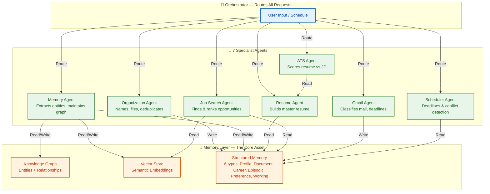

# Meridian — MVP Product Spec

| Metadata         | Value                                                                |
|------------------|----------------------------------------------------------------------|
| **Purpose**      | Define the v1/MVP product scope for Meridian |
| **Status**       | Draft |
| **Owner**        | Product Team |
| **Last Updated** | 2026-07-13 |

## Overview

Meridian is a second brain for students and early-career professionals — a personal intelligence platform that ingests documents, code, and communications; builds a continuously updated, structured memory; and runs specialized, permission-scoped agents to organize files, maintain a resume, search for jobs, and track deadlines. This document defines the v1/MVP scope: what we build first to prove the core loop before extending to enterprise scale.

## Goals

- **Define v1 product scope** — what's in, what's deferred to enterprise, and why
- **Specify agent architecture** — eight agents with defined roles, permissions, and autonomy defaults
- **Document memory system design** — knowledge graph, vector store, structured memory, and agentic RAG
- **Establish security foundations** — least-privilege connectors, suggest-mode-first, audit logging
- **Provide a phased build plan** — five phases from foundation to polish

## A second brain for students and early-career professionals

> **Scope note:** This is the v1/MVP spec — a buildable first version of the idea, not the full enterprise paper. A separate enterprise-grade vision document (multi-tenant, admin, SDK/marketplace, compliance, scale architecture) is a natural follow-up once this core loop is validated. Where useful, this doc flags which decisions are "v1 simple" vs "deferred to enterprise."



## 1. One-liner

Meridian reads everything a student or early-career professional creates — documents, code, email, certificates — quietly organizes it, remembers it, and turns it into a living resume, a career radar, and a workspace that organizes itself. Not a chatbot you talk to. A brain that works in the background and shows up when it has something useful to say.

## 2. The problem

Students and early professionals generate a huge amount of personal data — project files, certificates, transcripts, resumes, emails about internships, GitHub repos, course notes — and almost none of it is connected. The result:

- Resumes go stale because updating them is manual and tedious.
- Achievements get forgotten (a hackathon win in year 1 doesn't make it onto the resume in year 3).
- Job/internship search is reactive and manual — scrolling platforms, guessing what to apply to.
- Important emails (interview calls, deadline reminders) get buried in inboxes.
- Files live scattered across Drive, laptop folders, downloads, and email attachments with no single source of truth.

Generic AI chatbots don't solve this because they have no persistent, structured memory of *this specific person's* life and work. Generic file-organizer tools don't solve it because they don't understand career relevance. Meridian's bet: the value isn't a better chat UI, it's a **memory layer that's always being written to**, with agents that act on it.

## 3. Product philosophy

- **Passive by default, active on request.** The system should organize and remember in the background without being asked. It should only *act* in the world (apply to a job, send an email, delete a file) with explicit user approval.
- **Memory is the product.** Chat, resumes, job matches — all of these are *views* into one underlying memory. If the memory is good, every feature downstream gets easier to build.
- **Never destructive.** Files get archived, not deleted. Renames and moves are reversible. Nothing the user didn't create disappears without a trail.
- **Earn autonomy.** v1 ships in "suggest mode" everywhere (the agent proposes, the user confirms). Full autonomy for any action is a setting the user opts into per agent, once they've seen the agent be right enough times.

---

## 4. Core user flow (v1, expanded from your outline)

### 4.1 Onboarding & connectors

User signs up → connects what they want (Gmail, GitHub, Google Drive, a local folder via the desktop companion, VS Code) → grants scoped permissions per connector (read-only by default; write/organize permission is separate and explicit) → Meridian does an initial scan and shows a "here's what I found" summary before touching anything.

### 4.2 Files and workspace

User can upload files directly, connect Google Drive/Docs, or grant Meridian **edit access to one specific local folder** (not full disk — see Security, §11) through a lightweight desktop companion app. Supported content: education docs, certificates, resumes, transcripts, research papers, code, notes, spreadsheets, PDFs, images — same broad list as the enterprise version, just without the dozen extra cloud-storage integrations for v1.

### 4.3 Organization Agent

Reads each new/changed file, understands what it is, proposes a clean name and a destination folder, detects duplicates and version chains (`Resume_v2_final_FINAL.pdf` → recognized as a version of `Resume.pdf`), extracts metadata and a short summary, and **writes everything it learns into memory** — this is the critical link your outline implied but didn't say explicitly: organization isn't just filing, it's the main way memory gets populated.

In v1, every move/rename is shown as a proposed diff the user approves (batch-approve is fine). Full autonomy is a later setting once trust is established.

### 4.4 Memory system

Every document, email, and conversation gets parsed into structured memory: entities (skills, projects, people, organizations, dates), relationships between them, and a summary. This combines a **knowledge graph** (entities + relationships, navigable like a graph) with a **vector store** (semantic search over content) — agentic RAG means agents *choose* which retrieval strategy fits a query rather than always doing one fixed thing. See §7 for full detail. Conceptually similar in spirit to how Obsidian links notes or how GraphRAG builds entity graphs — but here the graph is built automatically by agents reading the user's real documents, not by manual linking.

### 4.5 Resume Agent

Maintains one always-current **master resume** assembled from memory. When a field is missing (e.g., no GPA found anywhere, no description for a listed project), it asks the user a short, specific question rather than guessing or leaving it blank.

### 4.6 ATS templates & scoring

Multiple ATS-safe resume templates (single-column, no tables/graphics, standard fonts). An ATS Agent scores the master resume against a pasted job description, returns a match score, flags missing keywords, and suggests specific rewrites — never silently rewrites the resume without showing what changed.

### 4.7 Job search & auto-apply

A Job Search Agent searches connected platforms, ranks results by fit against the user's memory (skills, interests, past applications), and presents a shortlist. The user picks which ones to pursue. For each selected role, the agent tailors a resume and cover letter, shows a match-likelihood estimate and a gap list ("you're missing: Docker, 1 more DSA project"), and only proceeds to apply after approval. See §9 for the realistic constraints here — this is the part of your outline that needs the most grounding.

### 4.8 Pages

History/activity log, current-status dashboard, chat-with-agents, memory graph view, file/folder workspace with an in-app viewer (PDF, DOCX, images, code), connectors page, providers page, schedule/important-dates page, settings. Full v1 sitemap in §10.

### 4.9 Gmail Agent

Checks Gmail on a schedule (default: once daily at 6 AM, configurable), classifies new mail (interview, deadline, document, spam, etc.), extracts dates and tasks, and surfaces anything time-sensitive on the Schedule page — not just a "6 AM check," see §8 for why a single daily pass needs a companion real-time path for truly urgent mail.

### 4.10 Memory updates

Everything above writes back into memory in a consistent schema (§7.4) so that, e.g., a job application's outcome becomes part of Career Memory, which the Job Search Agent uses next time to avoid resurfacing roles the user already rejected.

---

## 5. Agent roster (v1)

A small number of well-scoped agents beats a large number of vague ones. v1 ships with eight:

| Agent | Mission | Reads from | Writes to | Default autonomy |
|---|---|---|---|---|
| **Orchestrator** | Routes chat/requests to the right specialist agent, holds short-term conversation context | Working memory | Working memory | Full (it's just routing) |
| **Organization Agent** | Names, categorizes, deduplicates, files documents | Connectors, uploads | Document memory, file system (proposed) | Suggest-only |
| **Memory Agent** | Extracts entities/relationships from everything other agents touch, maintains the knowledge graph and vector store, runs periodic consolidation | All agent outputs | Knowledge graph, vector store | Full (internal, no external effect) |
| **Resume Agent** | Builds and maintains the master resume; generates role-specific variants | Profile/Career memory | Resume documents | Suggest-only |
| **ATS Agent** | Scores resume vs. job description, finds keyword gaps | Resume + pasted JD | ATS score, suggestions | Read-only (never edits) |
| **Job Search Agent** | Searches connected platforms, ranks matches, drafts applications | Career memory, connectors | Shortlist, tailored docs | Suggest-only |
| **Gmail Agent** | Classifies mail, extracts deadlines/tasks | Gmail connector | Schedule, episodic memory | Suggest-only (drafts, never sends) |
| **Scheduler Agent** | Maintains calendar, deadlines, conflict detection | All agent outputs, calendar connector | Schedule page, reminders | Suggest-only for new entries, full for reminders |

Each agent: a fixed system prompt defining its mission and boundaries, a defined tool list (it can only call what it's scoped for), read/write memory permissions, and a fallback behavior when it's unsure (ask the user, don't guess).

---

## 6. Connector & plugin architecture

**v1 approach:** build connectors as internal "tools" with the same shape as an MCP tool call (name, input schema, output schema, required permission scope) even before wiring up real MCP servers. That makes the eventual move to actual MCP — either consuming third-party MCP servers or exposing Meridian's own — a transport change, not a rewrite.

- **Hosted services (Gmail, Google Drive, GitHub):** official OAuth + API integration. Scoped tokens, read-only by default.
- **VS Code:** lightweight extension that reports workspace/git activity to the local agent — no need to ingest entire repos by polling, just diffs and commit metadata plus on-demand "summarize this project" actions.
- **Local folder:** a small desktop companion app (not a background daemon with broad disk access) that asks the OS for permission to **one user-chosen folder**, watches it for changes, and proxies file reads/writes through that single scoped grant. This is the safe version of "edit access to a folder" — never request whole-filesystem access.
- **Plugin SDK (v1, minimal):** a JSON schema for defining a new tool (inputs, outputs, required scopes, auth type). Third-party/community connectors can be added without touching core agent code. Full plugin marketplace, sandboxing, and revenue share are enterprise-paper territory.

---

## 7. Memory architecture (the core of the product)

### 7.1 Memory types (v1 — trimmed from the larger enterprise list to what's actually load-bearing)

| Type | What it holds | Example |
|---|---|---|
| **Profile memory** | Stable facts: education, skills, certifications | "B.Tech CSE, graduating 2027" |
| **Document memory** | Per-file summary, entities, embedding, source path | Summary of a research paper PDF |
| **Career memory** | Applications, outcomes, job/internship interactions | "Applied to X Corp SDE intern, rejected, missing: system design" |
| **Episodic memory** | Timestamped events — what happened, when | "Won runner-up at HackX, March 2026" |
| **Preference memory** | Inferred patterns and stated preferences | "Prefers backend roles over frontend" |
| **Working memory** | Current chat/task context, cleared per session | Current conversation thread |

### 7.2 Knowledge graph

Entities (Person, Skill, Project, Organization, Certificate, Event, Job) connected by typed relationships (`worked_on`, `awarded_to`, `requires_skill`, `applied_to`). Built automatically as the Memory Agent processes documents — the user never manually links anything, though they can view and correct the graph.

### 7.3 Agentic RAG — retrieval path

When an agent needs context, it doesn't run one fixed search — it chooses a strategy based on the question:

1. **Query comes in** (from the Resume Agent, Job Search Agent, or user chat).
2. **Hybrid search**: vector similarity (semantic match) + keyword search (exact terms like a tool name) + graph traversal (e.g., "find all projects connected to the skill 'React'").
3. **Re-rank** by relevance, recency, and confidence — newer or more-confirmed facts outrank stale or single-source ones.
4. **Assemble context** and hand it to the requesting agent.

### 7.4 Write path

1. An agent produces new information (a parsed document, a chat exchange, an application outcome).
2. The Memory Agent extracts entities/facts.
3. Dedup/merge against existing memory (avoid five separate nodes for "React" / "React.js" / "ReactJS").
4. Write to knowledge graph + vector store.
5. Periodic **consolidation**: old, low-confidence, or superseded memories get compressed or archived rather than kept verbatim forever — keeps retrieval fast and relevant as the graph grows over years.

### 7.5 What v1 deliberately skips

Full memory versioning/audit trail, memory export/import, cross-user memory sharing, and fine-grained per-field encryption policies are real requirements — just enterprise-paper requirements. v1 needs encryption at rest and a basic delete-everything control, not a full provenance system.

---

## 8. Gmail Agent — closing a gap in the original plan

A once-a-day 6 AM check is good for digesting routine mail but creates an obvious problem: an interview confirmation that needs a same-day reply doesn't wait for tomorrow's scan. v1 design:

- **Scheduled pass** (default 6 AM, user-configurable): full inbox classification, daily digest generated, deadlines extracted to Schedule.
- **Lightweight real-time hook** (Gmail push notifications, not polling): only fires for mail matching high-priority classifiers (interview, deadline-today, urgent-from-known-contact) so the user isn't paying for constant full-inbox scanning but also isn't missing same-day items.
- Drafts only — the Gmail Agent never sends mail on its own in v1.

---

## 9. Job search & auto-apply — the part that needs grounding

Your outline describes the agent finding jobs, applying after approval, and filling forms automatically. That's the right *user experience* to aim for, but it runs into a real constraint worth designing around now rather than discovering later: most job platforms (LinkedIn, Naukri, Indeed) restrict automated scraping and form-submission in their terms of service, and a few have official, narrow APIs instead.

**v1 approach:**

- Where a platform has an **official job-search/application API** (e.g., Indeed's publisher APIs, or partner integrations), use it directly — full automation is fine here.
- Where no API exists, the agent still does the valuable part — finding matches, scoring fit, tailoring the resume and cover letter, identifying skill gaps — and then **deep-links the user to the actual listing** to submit manually, with the tailored documents ready to attach. This keeps 90% of the value without building something that breaks the moment a platform changes its anti-bot measures or flags the account.
- Auto-filling a platform's *own* application form using the user's own logged-in browser session (vs. scraping/headless automation against ToS) is a reasonable middle ground worth exploring for a later version — closer to a browser extension assisting a logged-in human than a bot acting as them.
- Every application — auto or manual — gets logged to Career memory with status tracking, so this part of the original vision (track status, interviews, offers, success-probability learning) still works regardless of which apply path was used.

---

## 10. v1 pages (trimmed sitemap)

| Page | Purpose |
|---|---|
| Dashboard | At-a-glance: memory growth, active applications, upcoming deadlines, recent agent activity |
| Workspace | Folder/file browser with in-app viewer (PDF, DOCX, image, code) |
| Memory Graph | Visual, navigable view of the knowledge graph |
| Resume & Career | Master resume editor, ATS scores, version history |
| Jobs & Internships | Shortlist, match scores, application tracker |
| Chat | Talk to the Orchestrator / any specific agent |
| Schedule | Calendar + deadlines + Gmail-extracted dates |
| Connectors | Manage Gmail, GitHub, Drive, VS Code, local folder |
| History | Full activity/audit log of what every agent did |
| Settings | Permissions, autonomy levels per agent, privacy, data export/delete |

(Admin, multi-tenant, billing, and developer-mode pages are enterprise-paper scope.)

---

## 11. Security & permissions (v1, lean but non-negotiable)

- **Least privilege by default**: every connector starts read-only; write/organize access is a separate, explicit grant.
- **Local folder access is scoped to one folder**, never the whole filesystem, requested through the OS's native permission dialog via the desktop companion.
- **Nothing destructive without approval**: renames/moves are proposed first in v1; deletions don't exist — files go to an Archive, not the trash.
- **Reversibility**: every Organization Agent action is logged with enough detail to undo it.
- **Encryption at rest** for documents and memory stores; OAuth tokens stored in a secrets manager, never in plaintext.
- **One clear data control**: "export everything" and "delete everything," visible and unconditional, from day one — full granular memory-provenance/audit tooling can come later, but the basic right to leave with your data (or erase it) shouldn't wait for the enterprise version.

---

## 12. Gaps filled / additions beyond the original outline

A few things worth calling out explicitly since they weren't in the original notes but matter for a product like this to actually work and be trusted:

1. **Suggest-mode-first design** — the single biggest trust risk in "an agent that organizes/renames/applies on your behalf" is doing the wrong thing autonomously. v1 defaults every agent to proposing actions for approval; autonomy is something the user grants per-agent over time, not a default.
2. **Undo/versioning for file operations** — if the Organization Agent renames or moves something incorrectly, there needs to be a one-click way back. This is cheap to build and expensive to skip.
3. **Memory consolidation** — without periodic compression of old/low-value memory, the graph degrades into noise within a year of daily use. This needs to exist from v1, not bolted on later.
4. **Realistic job-platform constraints** — covered in §9. Better to design around ToS limits now than build a feature that gets the user's accounts flagged.
5. **A real-time path for the Gmail Agent** — covered in §8. A purely scheduled check misses same-day-urgent mail.
6. **Explicit autonomy settings per agent**, not a single global toggle — a user might trust the Organization Agent fully but want every job application reviewed by hand indefinitely.
7. **Cost/latency awareness** — embedding and re-summarizing every file on every change gets expensive at scale; v1 should debounce re-processing and only re-embed on meaningful content changes, not every file touch.
8. **A lightweight feedback loop** — when the user corrects an agent (renames a file the agent named wrong, rejects a job match), that correction should feed back into memory so the same mistake doesn't repeat. Without this, "intelligent" agents just repeat the same errors forever.
9. **Desktop companion, not a browser extension, for local folder access** — a browser extension can't get real filesystem permission for a folder; this needs a small native/Electron-style companion app, which is a real build item to plan for, not an afterthought.

---

## 13. Build phases

1. **Phase 1 — Foundation**: connectors (Drive, GitHub, local folder), ingestion pipeline, Organization Agent (suggest-mode), Memory Agent + knowledge graph + vector store, Workspace page, Memory Graph page.
2. **Phase 2 — Resume**: Resume Agent, ATS templates, ATS Agent, Resume & Career page.
3. **Phase 3 — Career**: Job Search Agent (API-based platforms first), application tracking, Jobs & Internships page.
4. **Phase 4 — Communication & time**: Gmail Agent (scheduled + push hook), Scheduler Agent, Schedule page.
5. **Phase 5 — Polish & autonomy**: Dashboard, History/audit log, per-agent autonomy settings, Settings/privacy controls.

## 14. What's deferred to the enterprise paper

Multi-tenant/org accounts, SSO/RBAC, full plugin marketplace, public API/SDK platform, the full 20-type memory taxonomy with provenance and explainability tooling, the complete enterprise connector list (Slack, Notion, Figma, Coursera, etc.), education-edition vs. enterprise-edition product splits, monetization/business model, and infra-scale architecture (multi-region, observability, cost optimization at scale). v1's job is to prove the core loop — ingest, organize, remember, assist — works and is trusted by real users first.

---

## Scope

### In Scope
- Eight-agent architecture (Orchestrator + 7 specialist agents) with fixed prompts, tool lists, and autonomy defaults
- Six-type memory system: Profile, Document, Career, Episodic, Preference, Working
- Connectors: Gmail, GitHub, Google Drive, local folder (via desktop companion), VS Code extension
- Suggest-mode-first for all agents with per-agent autonomy progression
- Knowledge graph + vector store + agentic RAG retrieval
- Phased build plan (5 phases from foundation to polish)
- In-app document viewer, memory graph explorer, resume editor, chat interface

### Out of Scope
- Multi-tenancy and organizational accounts
- Full plugin marketplace and public SDK
- Enterprise connector ecosystem (Slack, Notion, Figma, Coursera, etc.)
- 22+ type memory taxonomy with full provenance
- Admin console, billing, and enterprise compliance features
- Mobile applications (future surface)

---

## Examples

### Initialize a workspace

```bash
meridian init --name "Career Hub" --connector gmail,github,drive
```

### Connect an email account in suggest mode

```bash
meridian connect gmail --scope read,draft --suggest-mode
```

### Ingest a resume and auto-organize

```bash
meridian upload --path ~/Documents/Resume_2026.pdf --agent organize
```

### Query your memory graph

```bash
meridian memory query --entity "React" --type skills
```

## Future Improvements

| Improvement | Priority | Complexity | Timeline |
|-------------|----------|------------|----------|
| Agent autonomy earning algorithm | High | Medium | Q1 2027 |
| Multi-platform connector expansion | Medium | Medium | Q2 2027 |
| Memory consolidation automation | High | Low | Q4 2026 |

## Related Documents

| Document | Description |
|----------|-------------|
| [System Architecture](02-system-architecture.md) | Six-layer system architecture overview |
| [Agent Workflow](03-agent-workflow.md) | End-to-end agent interaction flow from file to application |
| [Memory & Knowledge Graph](04-memory-knowledge-graph.md) | Memory system design in detail |
| [Enterprise Product Vision](06-Meridian-Enterprise-Paper.md) | Enterprise-scale vision building on this MVP spec |
