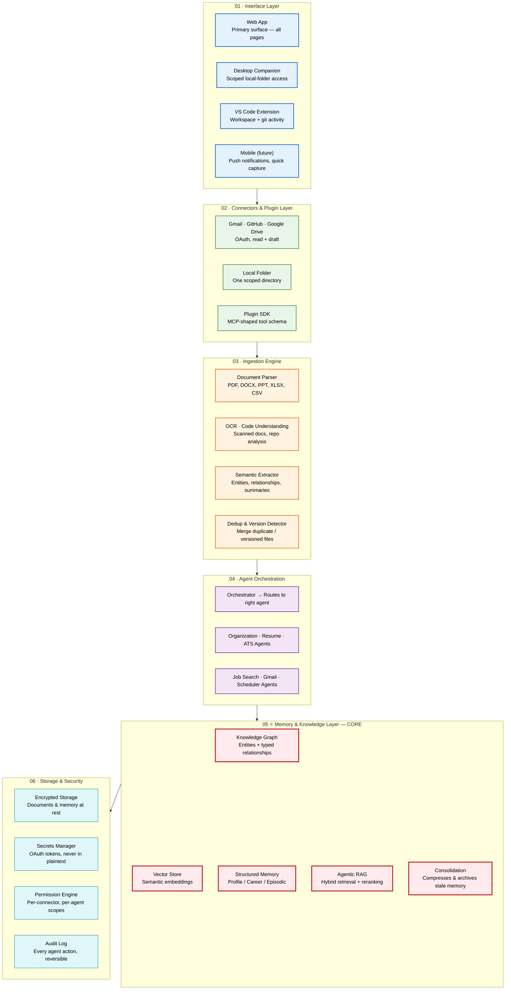

Meridian · System Architecture

| Metadata         | Value                                                                |
|------------------|----------------------------------------------------------------------|
| **Purpose**      | Document the six-layer system architecture for Meridian |
| **Status**       | Draft |
| **Owner**        | Engineering Team |
| **Last Updated** | 2026-07-13 |

## Overview

Meridian's architecture is organized into six layers: Interface, Connectors & Plugins, Ingestion Engine, Agent Orchestration, Memory & Knowledge Layer (the core), and Storage & Security. Every layer exists to feed the memory layer in the middle — interfaces and connectors bring data in, agents act on it, and everything that happens gets written back to memory, which is what every feature ultimately reads from.

## Goals

- **Define the six-layer architecture** — clearly delineate each layer's responsibility and interfaces
- **Establish memory as the architectural spine** — show how all layers feed and read from the core memory layer
- **Document connector and agent boundaries** — permission scopes, data flow, and isolation between components
- **Provide unambiguous layer contracts** — what each layer guarantees to the layers above and below

# Six layers, one spine of memory

Every layer exists to feed the one in the middle. Interfaces and connectors bring data in; agents act on it; everything that happens gets written back to memory — which is what every feature above ultimately reads from.



> **Diagram:** Six-layer system architecture. **Interface Layer** (web, desktop, VS Code, mobile) feeds **Connectors & Plugins** (Gmail, GitHub, Drive, local folders, SDK) which feed the **Ingestion Engine** (parsers, OCR, semantic extraction, dedup). **Agent Orchestration** routes requests to specialized agents. **Memory & Knowledge Layer** (the CORE — knowledge graph, vector store, structured memory, RAG, consolidation) is the spine everything reads from and writes to. **Storage & Security** provides encryption, secrets management, permissions, and audit logging.

---

01

## Interface Layer

Where the person actually touches the product.

Web AppPrimary surface — all pages live here

Desktop CompanionScoped local-folder access, file watcher

VS Code ExtensionWorkspace + git activity, on-demand summaries

Mobile (future)Push notifications, quick capture

02

## Connectors & Plugin Layer

Scoped, OAuth-based access — read-only until the user grants more.

GmailOAuth, read + draft scope only

GitHubRepos, commits, README content

Google DriveDocs, Sheets, Slides

Local FolderOne scoped directory, not full disk

Plugin SDKMCP-shaped tool schema for new connectors

03

## Ingestion Engine

Turns raw files into something agents can reason about.

Document ParserPDF, DOCX, PPT, XLSX, CSV

OCRScanned certificates, transcripts

Code UnderstandingRepo structure, README, language detection

Semantic ExtractorEntities, relationships, summaries

Dedup & Version DetectorMerges duplicate / versioned files

04

## Agent Orchestration

Specialized agents, each scoped to one job and one tool list.

OrchestratorRoutes chat & requests to the right agent

Organization AgentNaming, foldering, dedup proposals

Resume AgentBuilds & maintains the master resume

ATS AgentScores resume against a job description

Job Search AgentFinds, ranks, and shortlists roles

Gmail AgentClassifies mail, extracts deadlines

Scheduler AgentDeadlines, reminders, conflict checks

05

## Memory & Knowledge Layer — CORE

Everything above reads from and writes to this layer. This is the actual product.

Knowledge GraphEntities + typed relationships

Vector StoreSemantic embeddings for search

Structured MemoryProfile / Career / Episodic / Preference

Agentic RAGHybrid retrieval + relevance re-ranking

ConsolidationCompresses & archives stale memory over time

06

## Storage & Security

The floor every other layer stands on.

Encrypted StorageDocuments & memory at rest

Secrets ManagerOAuth tokens, never in plaintext

Permission EnginePer-connector, per-agent scopes

Audit LogEvery agent action, reversible

● Core layer — the knowledge graph + memory store everything else depends on

Read access is default · Write access is always a separate, explicit grant

---

## Scope

### In Scope
- Six-layer architecture design: Interface, Connectors, Ingestion, Agent Orchestration, Memory & Knowledge (core), Storage & Security
- Layer contracts — what each layer guarantees to layers above and below
- Web app, desktop companion, VS Code extension, and future mobile interface points
- Connector architecture using MCP-shaped tool definitions
- Agent orchestration with Orchestrator + 7 specialist agents
- Memory layer: knowledge graph, vector store, structured memory, agentic RAG

### Out of Scope
- Enterprise multi-region deployment topology
- Service mesh and layer-level observability instrumentation
- Event-driven architecture for layer decoupling
- Mobile application architecture (future)
- Third-party plugin sandboxing infrastructure

---

## Examples

### Query the orchestrator endpoint

```typescript
const response = await meridian.orchestrator.invoke({
  agent: "resume-agent",
  payload: { action: "update", files: ["resume.pdf"] }
});
```

### Register a new connector

```typescript
meridian.connectors.register({
  name: "gmail",
  auth: "oauth2",
  scopes: ["read", "draft"],
  suggestMode: true
});
```

### Route a user request through layers

```typescript
const result = await meridian.layers.execute({
  from: "interface",
  to: "memory",
  data: { query: "find my latest resume" }
});
```

## Future Improvements

| Improvement | Priority | Complexity | Timeline |
|-------------|----------|------------|----------|
| Service mesh for inter-layer communication | High | High | Q2 2027 |
| Layer-level observability instrumentation | Medium | Medium | Q1 2027 |
| Event-driven architecture for layer decoupling | Medium | High | Q3 2027 |

## Related Documents

| Document | Description |
|----------|-------------|
| [MVP Product Spec](01-Meridian-MVP-Spec.md) | v1/MVP product specification |
| [Agent Workflow](03-agent-workflow.md) | How agents interact across the six layers |
| [Memory & Knowledge Graph](04-memory-knowledge-graph.md) | Deep dive into the core memory layer |
| [Enterprise Architecture](06-Meridian-Enterprise-Paper.md) | Enterprise-scale architecture vision |
