Vaeloom · Agent Workflow

| Metadata         | Value                                                                |
|------------------|----------------------------------------------------------------------|
| **Purpose**      | Document end-to-end agent workflow from file upload to application outcome |
| **Status**       | Draft |
| **Owner**        | Engineering Team |
| **Last Updated** | 2026-07-13 |

## Overview

This document traces a single end-to-end flow through Vaeloom's agent system: a student uploads a resume draft, the system processes it through the Organization Agent, Memory Agent, and Resume Agent, then responds to a job search request by routing through the Job Search Agent, ATS Agent, and Application Agent — all feeding back into memory. The same 10-step memory loop runs underneath every feature.

## Goals

- **Trace a complete user scenario** — from file upload to application outcome
- **Show agent handoffs and data flow** — what reads from and writes to memory at each step
- **Illustrate the feedback loop** — how application outcomes make future searches smarter
- **Document the permission and approval gates** — where the user confirms versus where agents act autonomously

# One file in, one application out

The same memory loop runs underneath every feature. This is what actually happens between a student uploading a resume draft and an application landing in front of a recruiter.

**Scenario:** A student drags **Resume\_draft\_v3.pdf** into Vaeloom, then later asks: "find me backend internships."

```mermaid
graph TD
    classDef trigger fill:#e3f2fd,stroke:#1565c0,color:#000,stroke-width:2px
    classDef org fill:#e8f5e9,stroke:#2e7d32,color:#000,stroke-width:1.5px
    classDef memory fill:#fff3e0,stroke:#e65100,color:#000,stroke-width:1.5px
    classDef resume fill:#f3e5f5,stroke:#6a1b9a,color:#000,stroke-width:1.5px
    classDef search fill:#ffebee,stroke:#c62828,color:#000,stroke-width:1.5px
    classDef ats fill:#e0f7fa,stroke:#00838f,color:#000,stroke-width:1px
    classDef apply fill:#c8e6c9,stroke:#1b5e20,color:#000,stroke-width:2px

    T["1. File uploaded<br/>Resume draft dragged in"]:::trigger
    O["2. Organization Agent<br/>Reads, names, files it<br/>→ Proposes rename + folder"]:::org
    MEM["3. Memory Agent<br/>Extracts & merges into graph<br/>→ Skills, projects, education"]:::memory
    R["4. Resume Agent<br/>Updates master resume<br/>→ Folds in new content"]:::resume
    U["5. User: Find me backend internships<br/>→ Orchestrator routes request"]:::trigger
    J["6. Job Search Agent<br/>Searches, ranks, shortlists<br/>→ Returns 8 ranked roles"]:::search
    ATS["7. ATS Agent<br/>Scores fit per role<br/>→ 78% match, 2 suggested edits"]:::ats
    AP["8. User picks 3 of 8 to pursue"]:::trigger
    APP["9. Application Agent<br/>Tailors + submits each app<br/>→ Resume + cover letter per role"]:::apply
    FB["10. Outcome feeds the next loop<br/>Interview / rejection → logged→ Episodic memory updated"]:::memory

    T --> O --> MEM --> R --> U --> J --> ATS --> AP --> APP --> FB
    FB -.->|feedback loop| MEM & R & J
```



> **Diagram:** End-to-end agent workflow from file upload to application outcome. **10 sequential steps** flow left-to-right: file trigger → Organization Agent (name/file) → Memory Agent (extract/merge) → Resume Agent (update master) → User request → Job Search Agent (search/rank) → ATS Agent (score) → User picks → Application Agent (tailor/submit) → Memory Agent logs outcome. The **feedback loop** closes back to memory, making future searches smarter.

---

1

TRIGGER

## File uploaded

User drags in a resume draft. No action required from the user beyond this.

reads: nothing yet

2

ORGANIZATION AGENT

## Reads, names, files it

Recognizes it as a resume, detects it's a newer version of an existing one, proposes: rename to `Resume_2026.pdf`, move to `/Career/Resume`, archive the older version.

reads: document memory
writes: document memory, version chain

3

MEMORY AGENT

## Extracts & merges into the graph

Pulls out skills, projects, education, dates. Merges "React" and "React.js" into one node. Links the new project to the skills it used.

reads: knowledge graph
writes: entities, relationships, vector store

4

RESUME AGENT

## Updates the master resume

Folds new content into the always-current master resume. Notices no GPA is recorded anywhere and asks one specific question instead of guessing.

reads: profile + career memory
writes: master resume, profile memory (on answer)

5

USER

## "Find me backend internships"

A normal chat request — the Orchestrator routes it to the Job Search Agent.

reads: working memory (conversation)

6

JOB SEARCH AGENT

## Searches, ranks, shortlists

Searches connected platforms, ranks results against the skill graph, filters out roles already rejected before, returns a ranked shortlist of 8 with a fit reason for each.

reads: skill graph, career memory (past outcomes)
writes: shortlist (pending)

7

ATS AGENT

## Scores fit per role

For each shortlisted role: 78% match, missing keywords "Docker," "system design," suggests two specific resume edits — shown as a diff, not applied automatically.

reads: master resume, job description

8

USER APPROVAL

## Picks 3 of the 8 to pursue

Nothing leaves the system until this point. The user selects which roles to actually apply to.

9

APPLICATION AGENT

## Tailors and submits — or hands off

Builds a tailored resume + cover letter per role. Where the platform has an official API, applies directly. Where it doesn't, deep-links the user to the listing with documents ready to attach, rather than scraping the form.

reads: master resume, ATS suggestions
writes: career memory — application + status

10

MEMORY AGENT

## Outcome feeds the next loop

Whatever happens next — interview, rejection, silence — gets logged. The next time the Job Search Agent ranks roles, this outcome is part of what it's reading.

writes: episodic memory, preference memory

---

## Scope

### In Scope
- End-to-end agent workflow from file upload to application outcome
- Agent handoffs: Organization Agent → Memory Agent → Resume Agent → Job Search Agent → ATS Agent → Application Agent
- Memory read/write permissions at each step of the workflow
- User approval gates and permission boundaries
- Feedback loop where outcomes feed back into memory for future searches

### Out of Scope
- Cross-agent dependency orchestration (future improvement)
- Parallel agent execution paths (future improvement)
- Agent workflow visualization dashboard (future improvement)
- Enterprise-scale agent roster (28 agents vs. 8 MVP agents)

---

## Examples

### Trigger agent from a file upload

```bash
Vaeloom workflow run --trigger upload --file resume.pdf
```

### Orchestrate a multi-agent pipeline

```typescript
await Vaeloom.workflow.create({
  steps: [
    { agent: "organization", action: "classify" },
    { agent: "memory", action: "extract" },
    { agent: "resume", action: "merge" }
  ]
});
```

### Check agent execution status

```bash
Vaeloom workflow status --id wf_abc123
```

## Future Improvements

| Improvement | Priority | Complexity | Timeline |
|-------------|----------|------------|----------|
| Cross-agent dependency orchestration | High | High | Q2 2027 |
| Agent workflow visualization dashboard | Medium | Medium | Q1 2027 |
| Parallel agent execution path support | Medium | High | Q3 2027 |

## Related Documents

| Document | Description |
|----------|-------------|
| [MVP Product Spec](01-Vaeloom-MVP-Spec.md) | Full MVP product specification |
| [System Architecture](02-system-architecture.md) | Six-layer architecture that supports agent orchestration |
| [Memory & Knowledge Graph](04-memory-knowledge-graph.md) | Memory system agents read from and write to |
| [Enterprise Product Vision](06-Vaeloom-Enterprise-Paper.md) | Enterprise-scale agent roster expansion |
