Vaeloom · Memory System

| Metadata         | Value                                                                |
|------------------|----------------------------------------------------------------------|
| **Purpose**      | Document Vaeloom's memory system: knowledge graph, six memory types, and agentic RAG |
| **Status**       | Draft |
| **Owner**        | Engineering Team |
| **Last Updated** | 2026-07-13 |

## Overview

Vaeloom's memory system is the core asset everything else is built on. Every agent reads from and writes to the same underlying knowledge graph — this is what makes the resume, the job search, and the chat all feel like they know the same person. Six kinds of structured memory (Profile, Document, Career, Episodic, Preference, Working) connect to a central knowledge graph, accessed through an agentic RAG read path and maintained through a write path that extracts, deduplicates, merges, and consolidates.

## Goals

- **Define the six memory types** — what each stores, when it's written, and how it's queried
- **Describe the knowledge graph structure** — entity types, relationship types, and how they're built automatically
- **Document the agentic RAG read path** — how agents choose retrieval strategy per query
- **Explain the write and consolidation path** — extraction, dedup, merge, and periodic compression

# One graph, six kinds of memory

Every agent reads from and writes to the same underlying graph — this is what makes the resume, the job search, and the chat all feel like they "know" the same person.

```mermaid
graph TD
    classDef knowledge fill:#e3f2fd,stroke:#1565c0,color:#000,stroke-width:2px
    classDef memory fill:#e8f5e9,stroke:#2e7d32,color:#000,stroke-width:1.5px
    classDef ephemeral fill:#fff3e0,stroke:#e65100,color:#000,stroke-width:1.5px
    classDef read fill:#f3e5f5,stroke:#6a1b9a,color:#000,stroke-width:1px
    classDef write fill:#ffebee,stroke:#c62828,color:#000,stroke-width:1px

    subgraph Graph["🧠 Knowledge Graph -- The Second Brain"]
        KG["Entities + typed relationships<br/>The central structure everything links to"]
    end

    subgraph MemTypes["ðŸ--‚️ Six Kinds of Memory"]
        P["Profile Memory<br/>Education, skills, certifications"]
        D["Document Memory<br/>Per-file summary & embedding"]
        C["Career Memory<br/>Applications, outcomes"]
        E["Episodic Memory<br/>Timestamped events"]
        R["Preference Memory<br/>Inferred & stated patterns"]
        W["Working Memory<br/>Current session context<br/>(cleared per session)"]
    end

    subgraph ReadPath["ðŸ“- Read Path -- Agentic RAG Retrieval"]
        R1["Query from agent"]
        R2["Hybrid search<br/>Vector + keyword + graph traversal"]
        R3["Re-rank by relevance, recency, confidence"]
        R4["Assembled context returned to agent"]
    end

    subgraph WritePath["✏️ Write Path -- How Memory Gets Updated"]
        W1["New info from any agent"]
        W2["Extract entities & facts"]
        W3["Dedup / merge against existing nodes"]
        W4["Write to graph + vector store<br/>Consolidate over time"]
    end

    P & D & C & E & R -.-> KG
    W -.->|session context| KG
    KG -.->|retrieval| R1 --> R2 --> R3 --> R4
    W1 --> W2 --> W3 --> W4 --> KG

    class KG knowledge
    class P,D,C,E,R,W memory
    class W ephemeral
    class R1,R2,R3,R4 read
    class W1,W2,W3,W4 write
```



> **Diagram:** Memory system architecture. **Knowledge Graph** is the central structure — 6 memory types connect to it: **Profile** (education/skills), **Document** (file summaries), **Career** (applications/outcomes), **Episodic** (events), **Preference** (patterns), and **Working** (session context, cleared per session). **Read path** (Agentic RAG): query → hybrid search → re-rank → assembled context. **Write path**: new info → extract → dedup/merge → write to graph + vector store → consolidated.

---

Knowledge
Graph

the second brain

Profile
Memory

education, skills, certifications

Document
Memory

per-file summary & embedding

Career
Memory

applications, outcomes

Episodic
Memory

timestamped events

Preference
Memory

inferred & stated patterns

Working
Memory

current session context

Read path

## Agentic RAG retrieval

When an agent needs context, it doesn't run one fixed search — it picks a strategy for the question in front of it.

Query from an agent

↓

Hybrid search — vector + keyword + graph traversal

↓

Re-rank by relevance, recency, confidence

↓

Assembled context returned to agent

Write path

### How memory gets updated

Every agent action is a potential memory update — this is what keeps the graph current without the user doing any manual linking.

New info from any agent

↓

Extract entities & facts

↓

Dedup / merge against existing nodes

↓

Write to graph + vector store, consolidate over time

Working Memory is the only type that's cleared per session — everything else persists and compounds over years of use.

---

## Scope

### In Scope

- Six memory types: Profile, Document, Career, Episodic, Preference, Working
- Knowledge graph structure: entity types and typed relationships
- Agentic RAG read path — hybrid search combining vector, keyword, and graph traversal
- Write path: extraction, dedup/merge, write to graph + vector store, consolidation
- Read/re-rank by relevance, recency, and confidence

### Out of Scope

- Full 22-type enterprise memory taxonomy (enterprise paper)
- Memory versioning and provenance audit trail
- Cross-user memory sharing and anonymization framework
- Real-time graph traversal optimization
- Automated graph consolidation and pruning (future improvement)

---

## Examples

### Extract entities from a document

```python
from Vaeloom import MemoryClient

client = MemoryClient()
entities = client.extract(
  text="Started internship at Acme Corp working on React",
  types=["skill", "organization", "role"]
)
```

### Query the knowledge graph

```typescript
const results = await Vaeloom.memory.graph.query({
  entity: "React",
  relationships: ["used_in", "taught_at"],
  depth: 2
});
```

### Write to episodic memory

```bash
Vaeloom memory write --type episodic --event "Applied to Stripe internship" --timestamp 2026-07-13
```

## Future Improvements

| Improvement | Priority | Complexity | Timeline |
|-------------|----------|------------|----------|
| Automated graph consolidation and pruning | High | Medium | Q1 2027 |
| Real-time graph traversal optimization | Medium | Medium | Q2 2027 |
| Cross-user memory anonymization framework | Low | High | Q3 2027 |

## Related Documents

| Document | Description |
|----------|-------------|
| [MVP Product Spec](01-Vaeloom-MVP-Spec.md) | v1 memory architecture defined in product context |
| [System Architecture](02-system-architecture.md) | Where the memory layer fits in the six-layer stack |
| [Agent Workflow](03-agent-workflow.md) | How agents read from and write to memory in practice |
| [Enterprise Product Vision](06-Vaeloom-Enterprise-Paper.md) | Full enterprise memory taxonomy (22 types) |
