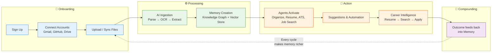

Meridian — MVP Product Spec

| Metadata         | Value                                                                |
|------------------|----------------------------------------------------------------------|
| **Purpose**      | Alternative MVP product specification for Meridian v1 |
| **Status**       | Draft |
| **Owner**        | Product Team |
| **Last Updated** | 2026-07-13 |

## Overview

Meridian reads everything a student or early-career professional creates — documents, code, email, certificates — quietly organizes it, remembers it, and turns it into a living resume, a career radar, and a workspace that organizes itself. This document is an alternative formatting of the MVP product spec with inline anchors, covering the same scope: v1 agents, memory architecture, security foundations, and a phased build plan.

## Goals

- **Define v1 product scope** — what's in and what's deferred to enterprise
- **Specify the eight-agent architecture** — agent roles, permissions, and autonomy defaults
- **Document the memory system** — six memory types, knowledge graph, and agentic RAG
- **Establish security and permission model** — least privilege, suggest-mode, audit trail
- **Provide a phased build plan** — five implementation phases

# A second brain for students and early-career professionals {#s1}

v1 scope · the buildable first version of the idea

**Scope note:** This is the v1/MVP spec — a buildable first version, not the full enterprise paper. A separate enterprise-grade vision document (multi-tenant, admin, SDK/marketplace, compliance, scale architecture) is the natural follow-up once this core loop is validated. Where useful, this doc flags which decisions are "v1 simple" vs "deferred to enterprise."



## Contents {#s2}

1. [One-liner](#s1)
2. [The problem](#s2)
3. [Product philosophy](#s3)
4. [Core user flow](#s4)
5. [Agent roster (v1)](#s5)
6. [Connector & plugin architecture](#s6)
7. [Memory architecture](#s7)
8. [Gmail Agent](#s8)
9. [Job search & auto-apply](#s9)
10. [v1 pages](#s10)
11. [Security & permissions](#s11)
12. [Gaps filled / additions](#s12)
13. [Build phases](#s13)
14. [Deferred to enterprise](#s14)

## 1. One-liner {#s3}

Meridian reads everything a student or early-career professional creates — documents, code, email, certificates — quietly organizes it, remembers it, and turns it into a living resume, a career radar, and a workspace that organizes itself. Not a chatbot you talk to. A brain that works in the background and shows up when it has something useful to say.

## 2. The problem {#s4}

Students and early professionals generate a huge amount of personal data — project files, certificates, transcripts, resumes, emails about internships, GitHub repos, course notes — and almost none of it is connected. The result:

* Resumes go stale because updating them is manual and tedious.
* Achievements get forgotten (a hackathon win in year 1 doesn't make it onto the resume in year 3).
* Job/internship search is reactive and manual — scrolling platforms, guessing what to apply to.
* Important emails (interview calls, deadline reminders) get buried in inboxes.
* Files live scattered across Drive, laptop folders, downloads, and email attachments with no single source of truth.

Generic AI chatbots don't solve this because they have no persistent, structured memory of *this specific person's* life and work. Generic file-organizer tools don't solve it because they don't understand career relevance. Meridian's bet: the value isn't a better chat UI, it's a **memory layer that's always being written to**, with agents that act on it.

## 3. Product philosophy {#s5}

* **Passive by default, active on request.** The system should organize and remember in the background without being asked. It should only act in the world (apply to a job, send an email, delete a file) with explicit user approval.
* **Memory is the product.** Chat, resumes, job matches — all of these are views into one underlying memory. If the memory is good, every feature downstream gets easier to build.
* **Never destructive.** Files get archived, not deleted. Renames and moves are reversible. Nothing the user didn't create disappears without a trail.
* **Earn autonomy.** v1 ships in "suggest mode" everywhere (the agent proposes, the user confirms). Full autonomy for any action is a setting the user opts into per agent, once they've seen the agent be right enough times.

## 4. Core user flow (v1, expanded) {#s6}

### 4.1 Onboarding & connectors {#s7}

User signs up → connects what they want (Gmail, GitHub, Google Drive, a local folder via the desktop companion, VS Code) → grants scoped permissions per connector (read-only by default; write/organize permission is separate and explicit) → Meridian does an initial scan and shows a "here's what I found" summary before touching anything.

### 4.2 Files and workspace {#s8}

User can upload files directly, connect Google Drive/Docs, or grant Meridian **edit access to one specific local folder** (not full disk — see Security, §11) through a lightweight desktop companion app. Supported content: education docs, certificates, resumes, transcripts, research papers, code, notes, spreadsheets, PDFs, images — same broad list as the enterprise version, just without the dozen extra cloud-storage integrations for v1.

### 4.3 Organization Agent {#s9}

Reads each new/changed file, understands what it is, proposes a clean name and a destination folder, detects duplicates and version chains (`Resume_v2_final_FINAL.pdf` → recognized as a version of `Resume.pdf`), extracts metadata and a short summary, and **writes everything it learns into memory** — this is the critical link the original outline implied but didn't say explicitly: organization isn't just filing, it's the main way memory gets populated.

In v1, every move/rename is shown as a proposed diff the user approves (batch-approve is fine). Full autonomy is a later setting once trust is established.

### 4.4 Memory system {#s10}

Every document, email, and conversation gets parsed into structured memory: entities (skills, projects, people, organizations, dates), relationships between them, and a summary. This combines a **knowledge graph** (entities + relationships, navigable like a graph) with a **vector store** (semantic search over content) — agentic RAG means agents choose which retrieval strategy fits a query rather than always doing one fixed thing. See §7 for full detail.

### 4.5 Resume Agent {#s11}

Maintains one always-current **master resume** assembled from memory. When a field is missing (e.g., no GPA found anywhere, no description for a listed project), it asks the user a short, specific question rather than guessing or leaving it blank.

### 4.6 ATS templates & scoring {#s12}

Multiple ATS-safe resume templates (single-column, no tables/graphics, standard fonts). An ATS Agent scores the master resume against a pasted job description, returns a match score, flags missing keywords, and suggests specific rewrites — never silently rewrites the resume without showing what changed.

### 4.7 Job search & auto-apply {#s13}

A Job Search Agent searches connected platforms, ranks results by fit against the user's memory, and presents a shortlist. The user picks which ones to pursue. For each selected role, the agent tailors a resume and cover letter, shows a match-likelihood estimate and a gap list, and only proceeds to apply after approval. See §9 for the realistic constraints here.

### 4.8 Pages {#s14}

History/activity log, current-status dashboard, chat-with-agents, memory graph view, file/folder workspace with an in-app viewer, connectors page, providers page, schedule/important-dates page, settings. Full v1 sitemap in §10.

### 4.9 Gmail Agent

Checks Gmail on a schedule (default: once daily at 6 AM, configurable), classifies new mail, extracts dates and tasks, and surfaces anything time-sensitive on the Schedule page. See §8 for why a single daily pass needs a companion real-time path.

### 4.10 Memory updates

Everything above writes back into memory in a consistent schema (§7.4) so that, e.g., a job application's outcome becomes part of Career Memory, which the Job Search Agent uses next time to avoid resurfacing roles the user already rejected.

## 5. Agent roster (v1)

A small number of well-scoped agents beats a large number of vague ones. v1 ships with eight:

| Agent | Mission | Reads from | Writes to | Default autonomy |
| --- | --- | --- | --- | --- |
| Orchestrator | Routes chat/requests to the right specialist agent | Working memory | Working memory | Full |
| Organization Agent | Names, categorizes, deduplicates, files documents | Connectors, uploads | Document memory, file system (proposed) | Suggest-only |
| Memory Agent | Extracts entities, maintains knowledge graph & vector store | All agent outputs | Knowledge graph, vector store | Full (internal) |
| Resume Agent | Builds & maintains the master resume | Profile/Career memory | Resume documents | Suggest-only |
| ATS Agent | Scores resume vs. job description | Resume + pasted JD | ATS score, suggestions | Read-only |
| Job Search Agent | Searches platforms, ranks matches, drafts applications | Career memory, connectors | Shortlist, tailored docs | Suggest-only |
| Gmail Agent | Classifies mail, extracts deadlines/tasks | Gmail connector | Schedule, episodic memory | Suggest-only (drafts only) |
| Scheduler Agent | Maintains calendar, deadlines, conflicts | All agent outputs, calendar | Schedule page, reminders | Suggest-only / full for reminders |

Each agent: a fixed system prompt defining mission and boundaries, a defined tool list it can only call within, read/write memory permissions, and a fallback behavior when unsure (ask the user, don't guess).

## 6. Connector & plugin architecture

**v1 approach:** build connectors as internal "tools" with the same shape as an MCP tool call (name, input schema, output schema, required permission scope) even before wiring up real MCP servers. That makes the eventual move to actual MCP a transport change, not a rewrite.

* **Hosted services** (Gmail, Drive, GitHub) — official OAuth + API integration, scoped tokens, read-only by default.
* **VS Code** — lightweight extension reporting workspace/git activity to the local agent.
* **Local folder** — a small desktop companion app that asks the OS for permission to one user-chosen folder, never broad disk access.
* **Plugin SDK (v1, minimal)** — a JSON schema for defining a new tool (inputs, outputs, scopes, auth type). Full marketplace/sandboxing is enterprise-paper territory.

## 7. Memory architecture (the core of the product)

### 7.1 Memory types (v1)

| Type | What it holds | Example |
| --- | --- | --- |
| Profile | Stable facts: education, skills, certifications | "B.Tech CSE, graduating 2027" |
| Document | Per-file summary, entities, embedding, source path | Summary of a research paper PDF |
| Career | Applications, outcomes, job/internship interactions | "Applied to X Corp SDE intern, rejected, missing: system design" |
| Episodic | Timestamped events | "Won runner-up at HackX, March 2026" |
| Preference | Inferred patterns and stated preferences | "Prefers backend roles over frontend" |
| Working | Current chat/task context, cleared per session | Current conversation thread |

### 7.2 Knowledge graph

Entities (Person, Skill, Project, Organization, Certificate, Event, Job) connected by typed relationships (`worked_on`, `awarded_to`, `requires_skill`, `applied_to`). Built automatically as the Memory Agent processes documents — the user never manually links anything, though they can view and correct the graph.

### 7.3 Agentic RAG — retrieval path

1. Query comes in from any agent or user chat.
2. Hybrid search: vector similarity + keyword search + graph traversal.
3. Re-rank by relevance, recency, and confidence.
4. Assemble context and hand it to the requesting agent.

### 7.4 Write path

1. An agent produces new information.
2. The Memory Agent extracts entities/facts.
3. Dedup/merge against existing memory.
4. Write to knowledge graph + vector store.
5. Periodic consolidation — old, low-confidence, or superseded memories get compressed or archived.

### 7.5 What v1 deliberately skips

Full memory versioning/audit trail, memory export/import, cross-user memory sharing, and fine-grained per-field encryption policies are real requirements — just enterprise-paper requirements. v1 needs encryption at rest and a basic delete-everything control, not a full provenance system.

## 8. Gmail Agent — closing a gap in the original plan

A once-a-day 6 AM check is good for digesting routine mail but creates an obvious problem: an interview confirmation that needs a same-day reply doesn't wait for tomorrow's scan.

* **Scheduled pass** (default 6 AM, configurable) — full inbox classification, daily digest, deadlines extracted to Schedule.
* **Lightweight real-time hook** (Gmail push notifications, not polling) — fires only for high-priority classifiers (interview, deadline-today, urgent-from-known-contact).
* Drafts only — the Gmail Agent never sends mail on its own in v1.

## 9. Job search & auto-apply — the part that needs grounding

The original outline describes the agent finding jobs, applying after approval, and filling forms automatically. That's the right user experience to aim for, but it runs into a real constraint: most job platforms (LinkedIn, Naukri, Indeed) restrict automated scraping and form-submission in their terms of service, and only a few offer official, narrow APIs.

**v1 approach:** Use official APIs where they exist (full automation). Where they don't, the agent still does the valuable part — find, score, tailor — then deep-links the user to the listing with documents ready to attach, rather than scraping a form. Every application, auto or manual, logs to Career memory.

## 10. v1 pages (trimmed sitemap)

| Page | Purpose |
| --- | --- |
| Dashboard | At-a-glance: memory growth, active applications, deadlines, recent activity |
| Workspace | Folder/file browser with in-app viewer (PDF, DOCX, image, code) |
| Memory Graph | Visual, navigable view of the knowledge graph |
| Resume & Career | Master resume editor, ATS scores, version history |
| Jobs & Internships | Shortlist, match scores, application tracker |
| Chat | Talk to the Orchestrator / any specific agent |
| Schedule | Calendar + deadlines + Gmail-extracted dates |
| Connectors | Manage Gmail, GitHub, Drive, VS Code, local folder |
| History | Full activity/audit log of what every agent did |
| Settings | Permissions, autonomy levels per agent, privacy, data export/delete |

Admin, multi-tenant, billing, and developer-mode pages are enterprise-paper scope.

## 11. Security & permissions (v1, lean but non-negotiable)

* **Least privilege by default** — every connector starts read-only; write/organize access is a separate, explicit grant.
* **Local folder access is scoped to one folder**, never the whole filesystem.
* **Nothing destructive without approval** — renames/moves are proposed first; deletions don't exist, files go to Archive.
* **Reversibility** — every Organization Agent action is logged with enough detail to undo it.
* **Encryption at rest** for documents and memory; OAuth tokens stored in a secrets manager, never in plaintext.
* **One clear data control** — "export everything" and "delete everything," visible and unconditional, from day one.

## 12. Gaps filled / additions beyond the original outline

1. **Suggest-mode-first design** — the single biggest trust risk in "an agent that organizes/renames/applies on your behalf" is doing the wrong thing autonomously.
2. **Undo/versioning for file operations** — cheap to build, expensive to skip.
3. **Memory consolidation** — without it the graph degrades into noise within a year of daily use.
4. **Realistic job-platform constraints** — covered in §9.
5. **A real-time path for the Gmail Agent** — covered in §8.
6. **Explicit autonomy settings per agent**, not a single global toggle.
7. **Cost/latency awareness** — debounce re-processing, don't re-embed on every file touch.
8. **A lightweight feedback loop** — corrections should feed back into memory so mistakes don't repeat.
9. **Desktop companion, not a browser extension**, for local folder access — a real build item to plan for.

## 13. Build phases

01**Foundation** — connectors (Drive, GitHub, local folder), ingestion pipeline, Organization Agent (suggest-mode), Memory Agent + knowledge graph + vector store, Workspace page, Memory Graph page.

02**Resume** — Resume Agent, ATS templates, ATS Agent, Resume & Career page.

03**Career** — Job Search Agent (API-based platforms first), application tracking, Jobs & Internships page.

04**Communication & time** — Gmail Agent (scheduled + push hook), Scheduler Agent, Schedule page.

05**Polish & autonomy** — Dashboard, History/audit log, per-agent autonomy settings, Settings/privacy controls.

## 14. What's deferred to the enterprise paper

Multi-tenant/org accounts, SSO/RBAC, full plugin marketplace, public API/SDK platform, the full 20-type memory taxonomy with provenance and explainability tooling, the complete enterprise connector list, education-edition vs. enterprise-edition product splits, monetization/business model, and infra-scale architecture. v1's job is to prove the core loop — ingest, organize, remember, assist — works and is trusted by real users first.

MERIDIAN · MVP PRODUCT SPEC · v1

---

## Scope

### In Scope
- Eight-agent architecture (Orchestrator + 7 specialist agents)
- Six-type memory: Profile, Document, Career, Episodic, Preference, Working
- Knowledge graph + vector store + agentic RAG
- Connectors: Gmail, GitHub, Google Drive, local folder, VS Code
- Suggest-mode-first design with per-agent autonomy progression
- Five-phase build plan from foundation to polish
- Per-agent permission scopes and audit logging

### Out of Scope
- Multi-tenant and organizational accounts
- Full plugin marketplace and third-party SDK
- Enterprise connector catalog (Slack, Notion, Figma)
- Complete 22-type memory taxonomy with provenance
- Admin console, billing, SSO/RBAC
- Mobile applications

---

## Examples

### Create a workspace with full connector set

```bash
meridian init --name "My Second Brain" --connectors gmail,github,drive,local
```

### Generate a master resume

```bash
meridian resume generate --format pdf --include projects,skills,education
```

### Search jobs via ATS agent

```bash
meridian ats search --query "backend engineer intern" --limit 10 --min-score 70
```

### Schedule a deadline reminder

```bash
meridian schedule add --date 2026-09-01 --event "Google SWE application due" --reminder 7d
```

## Future Improvements

| Improvement | Priority | Complexity | Timeline |
|-------------|----------|------------|----------|
| Multi-language document ingestion pipeline | High | Medium | Q1 2027 |
| Plugin SDK public beta release | Medium | High | Q2 2027 |
| Accessibility audit and remediation | Medium | Medium | Q4 2026 |

## Related Documents

| Document | Description |
|----------|-------------|
| [System Architecture](02-system-architecture.md) | Six-layer system architecture |
| [Agent Workflow](03-agent-workflow.md) | End-to-end agent interaction flow |
| [Memory & Knowledge Graph](04-memory-knowledge-graph.md) | Memory system in depth |
| [Enterprise Product Vision](06-Meridian-Enterprise-Paper.md) | Enterprise-scale vision and migration path |
