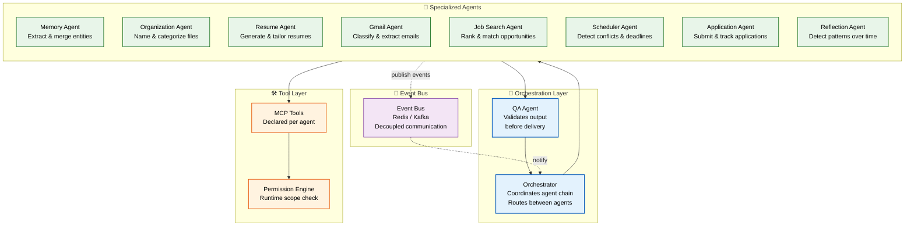
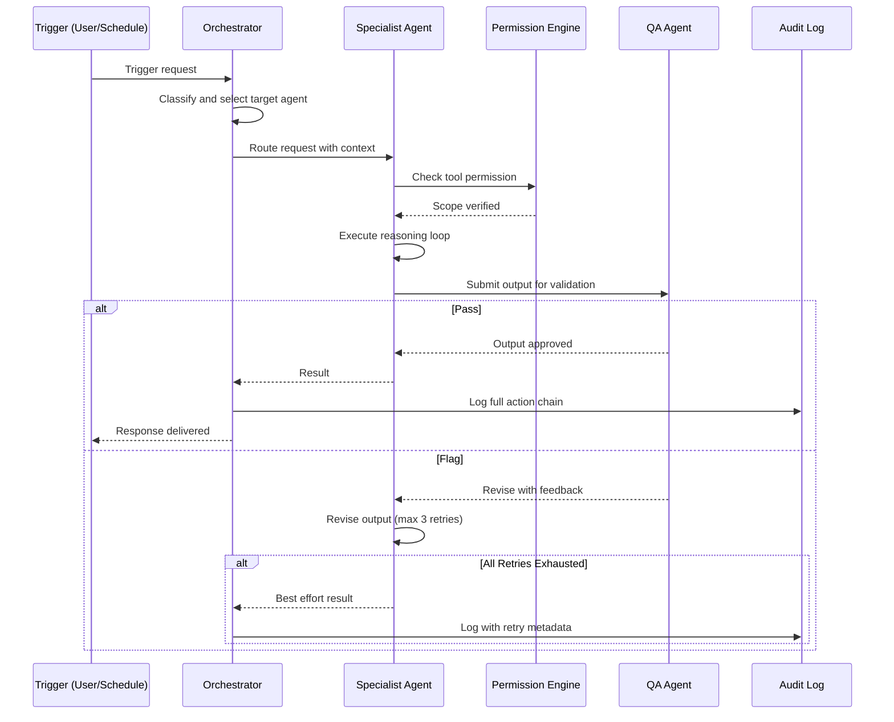

# AI Agents

> **Purpose:** Define the AI agent system architecture for Meridian
> **Status:** ✅ Upgraded to enterprise quality
> **Owner:** AI Team
> **Last Updated:** 2026-07-13
> **Canonical source:** [`/Docs/Meridian-Complete-Documentation.md#5-ai-agents`](../../Docs/Meridian-Complete-Documentation.md#5-ai-agents)

## Overview

Meridian's AI agent system is a coordinated ecosystem of specialized agents that work together through an Orchestrator to perform complex workflows on behalf of users. Each agent has a fixed mission, a declared set of MCP-shaped tools, explicit memory read/write permissions, a defined autonomy level, and a fallback behavior for low-confidence situations. Agents never call each other directly — all inter-agent communication flows through the Orchestrator, ensuring every action is logged, permission-checked, and auditable.

This document defines the agent architecture, the agent contract (mission, tools, permissions, autonomy, fallback), communication patterns, and the QA Agent validation gate. It serves as the reference for AI engineers building new agents, platform engineers integrating agent workflows, and operations engineers monitoring agent health. The architecture supports 8 agents at MVP scale, scaling to 28 agents at Enterprise scale, with strict isolation boundaries to prevent agent interference.

---

## Agent Architecture



> **Diagram:** Agents never call each other directly — all communication flows through the **Orchestrator**. Each agent has declared **MCP-shaped tools** checked at runtime by the **Permission Engine**. Every action publishes an **event** to the bus. The **QA Agent** validates every output before delivery.

---

## Agent Contract

Every agent in Meridian shares the same structure:

| Component | Description |
|-----------|-------------|
| Mission | Fixed purpose it cannot exceed |
| Tool list | Declared tools it can call |
| Memory permissions | Explicit read/write scopes |
| Autonomy level | Suggest / Read-only / Full |
| Fallback behavior | Ask user when uncertain |

## Agent Architecture

```text
agents/
├── organization_agent/
│   ├── prompt.py      # Versioned system prompt
│   ├── tools.py       # Declared tool list (MCP-shaped)
│   ├── handler.py     # Core logic: retrieve → reason → output
│   └── permissions.py # Runtime-checked read/write scopes
├── memory_agent/
├── resume_agent/
├── ats_agent/
├── job_search_agent/
├── application_agent/
├── gmail_agent/
├── scheduler_agent/
├── reflection_agent/
└── qa_agent/
```

## Agent Communication

- Agents never call each other directly
- All inter-agent communication flows through the Orchestrator
- Every agent action publishes an event to the event bus
- The QA Agent sits between every action-capable agent and delivery

## Common Mistakes

| Mistake | Why It's a Problem |
|---------|-------------------|
| Letting agents call each other directly instead of routing through the Orchestrator | Direct agent-to-agent calls bypass the audit log, permission engine, and QA gate — every inter-agent request becomes invisible and ungoverned |
| Giving an agent tools beyond its declared mission | An agent whose tool list exceeds its mission scope can perform actions its prompt never intended — tools must be scoped to the agent's exact responsibilities |
| Not defining a fallback behavior for low-confidence outputs | An agent that doesn't know what to do should ask the user, not guess — guessing produces plausible-looking errors that are harder to detect than a clear "I'm not sure" |
| Skipping the QA gate on any agent output that reaches the user | The QA Agent is the last line of defense against incorrect, unsafe, or out-of-policy outputs — every user-facing output must pass through it |

## Best Practices

| Practice | Rationale |
|----------|-----------|
| Route all inter-agent communication through the Orchestrator | Every request is logged, permission-checked, and auditable — no invisible agent-to-agent calls that bypass governance |
| Declare each agent's tool list explicitly and scope it to the agent's mission | Tools define the boundary of what an agent can do — a Resume Agent should not have access to `search_gmail` or `draft_email` |
| Define a fallback behavior in every agent's system prompt | When confidence is low (<80%), the agent must ask a specific clarifying question rather than inferring or guessing the answer |
| Run every consequential output through the QA Agent before delivery | File renames, email drafts, application submissions, and memory writes should all be validated by the QA gate before reaching the user or executing in the world |

## Security

| Concern | Mitigation |
|---------|------------|
| Agent tool escalation via crafted prompts | A malicious user could attempt to craft inputs that trick an agent into calling a tool outside its scope — the Permission Engine checks every tool call at runtime, not just during prompt design |
| QA gate bypass through direct Orchestrator manipulation | The Orchestrator itself should not be able to bypass the QA gate — any consequential output from any agent (including the Orchestrator) must pass validation |
| Agent identity spoofing in event bus messages | Events published by agents include `agent_id` — this must be authenticated by the event bus; one agent should not be able to publish events under another agent's identity |

## Performance

| Concern | Guideline |
|---------|-----------|
| Orchestrator routing latency | The Orchestrator adds ~50-100ms per request for routing, classification, and permission checking — ensure this overhead is accounted for in the total latency budget (<10s per agent request) |
| QA gate throughput under load | The QA Agent validates every agent output — if multiple agents produce output simultaneously, the QA gate must scale or queue to avoid becoming a bottleneck |
| Agent cold-start initialization | Loading an agent's prompt, tools, and memory scopes takes ~200ms on first invocation — pre-warm frequently-used agents (Memory Agent, Gmail Agent) on service start |

## Goals

- Enable 8 specialized agents to perform autonomous workflows without direct inter-agent coupling
- Ensure every agent output is validated by the QA Agent before reaching users or executing actions
- Maintain full audit trail of every agent action through event publishing
- Allow agents to be added, removed, or modified without disrupting other agents
- Enforce strict runtime permission boundaries per agent via the Permission Engine

## Scope

**In Scope:**
- 8 specialized agents: Memory, Organization, Resume, Gmail, Job Search, Scheduler, Application, Reflection
- Orchestrator coordinating all inter-agent communication
- QA Agent for output validation and quality gating
- MCP-shaped tool declarations per agent with runtime permission checking
- Event bus for asynchronous agent event publishing
- Per-agent mission, tool list, memory permissions, autonomy level, and fallback behavior

**Out of Scope:**
- Direct agent-to-agent communication (all routed through Orchestrator)
- Agents modifying their own system prompts or mission definitions
- User-facing agent configuration interfaces
- Auto-scaling agent instances based on workload
- Cross-user agent collaboration

## Functional Requirements

| ID | Requirement | Priority |
|----|-------------|----------|
| FR-001 | Every agent shall have a declared mission that defines its fixed purpose | Critical |
| FR-002 | All inter-agent communication shall route through the Orchestrator | Critical |
| FR-003 | Every agent output bound for the user shall pass through QA Agent validation | Critical |
| FR-004 | Every agent action shall publish an event to the event bus | Critical |
| FR-005 | Agents shall declare their tool list explicitly with MCP-shaped schemas | High |
| FR-006 | Permission Engine shall check every tool call at runtime against agent scopes | High |
| FR-007 | Agents shall define fallback behavior for low-confidence (<80%) outputs | High |
| FR-008 | Orchestrator shall maintain an append-only audit log of all agent actions | Medium |

## Non-Functional Requirements

| ID | Requirement | Target | Measurement |
|----|-------------|--------|-------------|
| NFR-001 | Orchestrator routing decision shall complete within 100ms | p95 < 100ms | Router decision time |
| NFR-002 | QA Agent validation shall complete within 500ms per output | p95 < 500ms | QA validation duration |
| NFR-003 | Agent cold-start initialization shall not exceed 300ms | p95 < 300ms | Agent load time |
| NFR-004 | Event bus publish latency from any agent shall not exceed 100ms | p99 < 100ms | Event publish duration |
| NFR-005 | System shall support 10 concurrent agent workflows | Throughput | Concurrent workflow count |
| NFR-006 | Audit log write shall complete within 50ms | p95 < 50ms | Audit log write latency |

## Components

| Component | Responsibility | Technology | Scale Strategy |
|-----------|---------------|------------|----------------|
| Orchestrator | Route requests between agents, maintain workflow state | FastAPI + Python | Horizontal with session affinity |
| Agent Runtime | Load agent prompts, tools, and execute reasoning | Python + LangChain | Stateless, horizontal scale |
| QA Agent | Validate agent outputs for correctness and policy | FastAPI + LLM | Standalone instance, auto-scale under load |
| Permission Engine | Runtime scope checking for every tool call | FastAPI middleware | Cached permission resolution, horizontal |
| Event Bus Client | Publish and subscribe to domain events | Redis Pub/Sub | Event-driven, no direct coupling |
| Audit Logger | Append-only log of all agent actions | PostgreSQL | Batch writes, partitioned by month |

## Data Flow

1. **Trigger Reception** — External event (user action, webhook, schedule) or internal event (another agent's output) triggers a workflow via the Orchestrator
2. **Agent Selection and Routing** — Orchestrator classifies the trigger and selects the target agent; loads agent's prompt, tool list, and memory permissions from configuration
3. **Agent Execution** — Agent receives context and query, retrieves relevant memory from vector store, constructs prompt, calls Model Router for inference, and calls tools via MCP interface with Permission Engine checking each call
4. **QA Validation** — Agent output is sent to QA Agent which validates against mission policy, checks for hallucinations, and confirms scope compliance before delivery
5. **Event Publication and Audit** — Approved action is published to event bus (enabling downstream agents to react) and written to append-only audit log with agent_id, action, workspace_id, and timestamp

## Scalability

| Dimension | Current Limit | 10x Strategy | 100x Strategy |
|-----------|---------------|--------------|---------------|
| Concurrent agent workflows | 10 workflows | 100 workflows with pooled agent instances | 1000 workflows with priority queuing |
| Orchestrator throughput | 50 req/s | 500 req/s with horizontal scaling | 5000 req/s with sharded orchestration |
| QA Agent throughput | 20 validations/s | 200 validations/s with parallel validation | 2000 validations/s with lightweight pre-validation |
| Audit log writes | 100 writes/s | 1000 writes/s with batch inserts | 10000 writes/s with partitioned tables |
| Tool call permission checks | 200 checks/s | 2000 checks/s with cached resolutions | 20000 checks/s with distributed cache |

## Error Handling

| Error Scenario | Detection | Mitigation | Recovery |
|----------------|-----------|------------|----------|
| Agent tool call fails | Tool call exception or timeout | Log failure, retry once, skip tool if optional | Notification to user if critical tool fails |
| QA Agent rejects output | QA validation returns fail or low confidence | Return to agent for revision, limit to 3 retries | Escalate to user if retries exhausted |
| Orchestrator workflow timeout | Workflow duration exceeds max time | Save workflow state, return partial results | User can resume or cancel workflow |
| Agent prompt loading failure | File not found or parse error | Load default prompt, alert operator | Operator fixes prompt file, reload agent |
| Event bus consumer backlog | Queue depth exceeds threshold | Slow down event publication, apply backpressure | Scale consumers, reprocess failed events |

## Monitoring

| Metric | Alert Threshold | Severity | Dashboard |
|--------|----------------|----------|-----------|
| Agent workflow success rate | < 95% over 10 minutes | Critical | Agent Health Dashboard |
| Orchestrator routing latency | > 500ms for 5 minutes | Critical | Orchestrator Performance |
| QA Agent rejection rate | > 10% over 30 minutes | Warning | QA Quality Dashboard |
| Tool call failure rate | > 5% over 5 minutes | Warning | Agent Tool Errors |
| Agent cold-start time | > 1 second for 5 minutes | Warning | Agent Initialization |
| Workflow completion time | > 30 seconds for any workflow | Info | Workflow Duration Dashboard |

## Configuration

| Variable | Purpose | Default | Required |
|----------|---------|---------|----------|
| AGENT_CONFIG_PATH | Path to agent definitions YAML | ./config/agents.yaml | Yes |
| QA_MODEL | Model used for QA validation | claude-sonnet-4-20250514 | Yes |
| MAX_WORKFLOW_DURATION | Max workflow execution time in seconds | 60 | No |
| MAX_QA_RETRIES | Max retries per failed QA validation | 3 | No |
| ORCHESTRATOR_TIMEOUT | Orchestrator decision timeout in ms | 5000 | No |
| EVENT_BUS_PREFIX | Prefix for event bus channels | meridian.agents | No |
| AUDIT_LOG_BATCH_SIZE | Batch size for audit log writes | 100 | No |
| DEFAULT_CONFIDENCE_THRESHOLD | Minimum confidence for agent fallback | 0.8 | No |

## Risks

| Risk | Likelihood | Impact | Mitigation |
|------|------------|--------|------------|
| Agent tool escalation via prompt injection | Medium | Critical | Runtime Permission Engine, input sanitization, QA gate |
| QA gate becomes bottleneck under high load | Medium | High | Pre-validation layer, auto-scaling QA instances |
| Agent identity spoofing on event bus | Low | High | Authenticated agent_id, signed event payloads |
| Orphaned workflows consuming resources | Medium | Medium | Workflow TTL, watchdog process for stale workflows |
| Configuration drift between agent definitions | Medium | Medium | CI validation of agent config, schema enforcement |

## Examples

### Example 1: Agent Orchestration Flow

```python
# Orchestrator routes a document ingestion request
orchestrator_request = {
    "trigger": "document_uploaded",
    "source": "connector_gdrive",
    "payload": {"document_id": "doc_123", "path": "/resumes/john_doe.pdf"},
    "workspace_id": "ws_abc"
}

# Orchestrator routes to Memory Agent for entity extraction
response = await orchestrator.route(
    agent="memory_agent",
    action="extract_entities",
    context=orchestrator_request
)
# Memory Agent extracts entities, writes to knowledge graph
# QA Agent validates the output
# Audit log records the entire workflow chain
```

### Example 2: Agent Contract Definition

```json
{
  "agent_name": "memory_agent",
  "mission": "Extract structured entities from user documents",
  "tools": ["search_documents", "create_entity", "merge_entities", "query_graph"],
  "memory_permissions": {"read": ["profile", "document"], "write": ["profile", "document"]},
  "autonomy_level": "suggest",
  "fallback_behavior": "ask_user",
  "model_preference": "claude-sonnet"
}
```

---

## Sequence Diagrams



> **Diagram:** End-to-end agent workflow showing trigger → orchestrator routing → agent execution with permission checks → QA validation → audit logging. The QA gate can request revision up to 3 times before delivering the best-effort result.

---

## Limitations

| Limitation | Impact | Workaround | Future Resolution |
|------------|--------|------------|-------------------|
| No parallel agent execution within single workflow | Sequential processing increases total time | Decompose into independent sub-workflows | Parallel workflow branches in Orchestrator |
| QA Agent uses same model as source agents | Shared failure modes | Use different model for QA (GPT-4o vs Sonnet) | Independent validation model provider |
| Agent tool list is static per session | Cannot add tools mid-workflow | Restart agent session with updated config | Dynamic tool discovery and registration |
| No workflow persistence across service restarts | In-flight workflows lost on restart | Keep workflow duration short (<60s) | Stateful workflow persistence in PostgreSQL |

## Future Improvements

| Improvement | Priority | Complexity | Timeline |
|-------------|----------|------------|----------|
| Parallel workflow branches in Orchestrator | High | High | Q4 2026 |
| Stateful workflow persistence with resume capability | High | Medium | Q3 2026 |
| Dynamic tool registration without agent restart | Medium | Low | Q2 2026 |
| Agent performance scoring and automated version rollback | Medium | Medium | Q3 2026 |
| Multi-tenant agent isolation boundaries | Low | High | Q1 2027 |

## Related Documents

- [LLM Architecture.md](./LLM-Architecture.md)
- [Tool Calling.md](./Tool-Calling.md)
- [`/Docs/Meridian-Complete-Documentation.md#5-ai-agents`](../../Docs/Meridian-Complete-Documentation.md#5-ai-agents)
