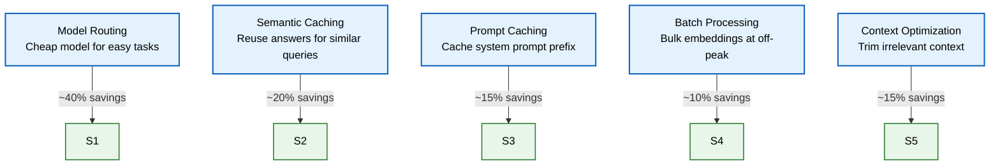

# AI Cost Strategy

> **Purpose:** Define how Vaeloom manages, optimizes, and monitors AI operational costs — LLM inference, embeddings, vector storage, and GPU hosting
> **Status:** 🆕 New
> **Owner:** AI Team
> **Version:** 1.0
> **Last Updated:** 2026-07-16
> **Dependencies:** [`Model-Routing.md`](./Model-Routing.md), [`Model-Benchmarking.md`](./Model-Benchmarking.md), [`LLM-Architecture.md`](./LLM-Architecture.md), [`../Operations/Cost-Optimization.md`](../Operations/Cost-Optimization.md), [`../Enterprise/Billing.md`](../Enterprise/Billing.md)
> **Implementation Status:** 📋 Spec Only

## Overview

AI inference is Vaeloom's largest variable cost. Every agent run consumes LLM tokens; every document ingestion generates embeddings; every RAG query touches the vector store. Left unmanaged, these costs scale linearly with users and can exceed revenue. This document defines the cost strategy: per-task cost estimates, optimization levers (model routing, caching, batching), budget allocation per user tier, and the monitoring that catches cost anomalies before they become crises.

## Goals

- Define cost dimensions and per-task estimates
- Specify cost optimization levers and their expected savings
- Establish budget allocation per user tier
- Define cost monitoring and alerting
- Document token usage tracking and attribution

## Scope

### In Scope

- Cost dimensions (LLM, embeddings, vector storage, GPU)
- Per-task cost estimates
- Optimization levers (routing, caching, batching, context optimization)
- Budget allocation and enforcement
- Cost monitoring and alerting

### Out of Scope

- General infrastructure cost optimization (see [`../Operations/Cost-Optimization.md`](../Operations/Cost-Optimization.md))
- Billing system (see [`../Enterprise/Billing.md`](../Enterprise/Billing.md))

## Cost Dimensions

| Dimension | Description | Primary Driver |
|-----------|-------------|----------------|
| **LLM inference** | Per-token cost for generation/classification | Input + output token count × model price |
| **Embeddings** | Per-token cost for text-to-vector | Document size × embedding model price |
| **Vector storage** | pgvector storage in PostgreSQL | Number of vectors × dimensions × storage cost |
| **Knowledge graph** | Apache AGE storage + traversal | Number of nodes/edges |
| **GPU hosting** | Self-hosted model serving | GPU-hours (for self-hosted models) |

## Per-Task Cost Estimates

| Task | Model | Avg Tokens (in/out) | Cost per Task |
|------|-------|---------------------|---------------|
| Intent classification (routing) | GPT-4o-mini | 200 / 20 | ~$0.0004 |
| Resume achievement extraction | Claude 3.5 Sonnet | 2000 / 500 | ~$0.013 |
| Cover letter generation | GPT-4o | 1500 / 800 | ~$0.012 |
| RAG answer synthesis | Claude 3.5 Sonnet | 3000 / 400 | ~$0.015 |
| Document embedding (per doc) | text-embedding-3-small | 2000 / 0 | ~$0.0001 |
| ATS scoring | Claude 3.5 Sonnet | 2500 / 300 | ~$0.012 |
| **Average agent run (blended)** | Mixed | ~2000 / ~400 | **~$0.011** |

## Optimization Levers



> **Diagram:** Cost optimization levers and estimated savings. Combined, these can reduce AI costs by 50-70% versus naive single-model, no-cache usage.

### 1. Model Routing (~40% savings)

Route easy tasks to cheap models; reserve expensive models for tasks that need them.

| Task Type | Routed To | Rationale |
|-----------|-----------|-----------|
| Intent classification | GPT-4o-mini ($0.15/$0.60) | Simple; doesn't need GPT-4o |
| Format validation | GPT-4o-mini | Pattern matching |
| Complex generation | Claude 3.5 Sonnet | Needs strong reasoning |
| Long-context analysis | Gemini 1.5 Pro | Large context window |

### 2. Semantic Caching (~20% savings)

Cache LLM responses keyed by semantic similarity. If a new query is >95% similar to a cached query, return the cached answer.

| Cache Hit Condition | Action |
|---------------------|--------|
| Exact match (same input) | Return cached (100% savings) |
| Semantic match (>0.95 cosine similarity) | Return cached (100% savings) |
| No match | Call LLM, cache result |

### 3. Prompt Caching (~15% savings)

Cache the system prompt prefix (shared across all calls for an agent). Providers like Anthropic offer prompt caching that reduces cost for repeated prefixes.

### 4. Batch Processing (~10% savings)

Embeddings and bulk operations run in batches at off-peak hours (lower priority, batch pricing).

### 5. Context Optimization (~15% savings)

Trim retrieved context to only the most relevant chunks before sending to the LLM. Reduces input tokens without sacrificing answer quality.

## Budget Allocation

| User Tier | Monthly AI Budget | Agent Runs/month | RAG Queries/month |
|-----------|-------------------|-------------------|-------------------|
| **Free** | ~$0.50/user | 50 | 100 |
| **Pro** ($19/mo) | ~$5.00/user | 500 | 5,000 |
| **Team** ($49/mo) | ~$15.00/user | 1,000 | 10,000 |
| **Enterprise** | Custom | Custom | Custom |

**Target gross margin:** AI cost should not exceed 25% of subscription revenue per user.

## Token Usage Tracking

```typescript
// Every LLM call is wrapped to track token usage
async function callLLM(request: LLMRequest): Promise<LLMResponse> {
  const start = Date.now();
  const response = await modelGateway.complete(request);
  const duration = Date.now() - start;

  // Record usage for billing + cost analytics
  await usageTracker.record({
    user_id: request.user_id,
    tenant_id: request.tenant_id,
    agent_type: request.agent_type,
    model: request.model,
    tokens_input: response.usage.input_tokens,
    tokens_output: response.usage.output_tokens,
    cost_usd: calculateCost(request.model, response.usage),
    duration_ms: duration,
    timestamp: new Date(),
  });

  return response;
}
```

## Monitoring

| Metric | Alert Threshold | Severity | Dashboard |
|--------|-----------------|----------|-----------|
| `ai_cost_per_user_daily` | >150% of plan budget | P2 | AI Cost |
| `ai_cost_total_daily` | >120% of forecast | P2 | AI Cost |
| `ai_token_usage_anomaly` | Sudden 3× spike | P2 | AI Cost |
| `semantic_cache_hit_rate` | <15% | P3 | AI Cost |
| `gross_margin_pct` | <75% | P2 | Finance |

## Best Practices

| # | Practice | Rationale |
|---|----------|-----------|
| 1 | Track cost per user, per task, per model | You can't optimize what you don't measure |
| 2 | Default to the cheapest model that meets quality bar | Most tasks don't need the most expensive model |
| 3 | Alert on cost anomalies, not just totals | A spike signals a bug (infinite loop, context bloat) |
| 4 | Review model pricing monthly | Providers change pricing; routing should adapt |

## Risks

| Risk | Likelihood | Impact | Mitigation |
|------|-----------|--------|------------|
| AI cost exceeds revenue per user | Medium | Critical | Hard usage caps per tier; cost monitoring; model routing |
| Provider raises prices unexpectedly | Medium | High | Multi-provider strategy; self-hosted fallback |
| Caching serves stale/incorrect answers | Low | Medium (quality) | TTL on cache; invalidate on memory updates |

## Future Improvements

| Improvement | Priority | Complexity | Timeline |
|-------------|----------|------------|----------|
| Real-time cost dashboard for users | High | Medium | Q4 2026 |
| Predictive cost forecasting | Medium | High | Q2 2027 |
| Self-hosted model for high-volume tasks | Medium | High | Q2 2027 |

## Related Documents

- [`Model-Routing.md`](./Model-Routing.md) — model router (primary cost lever)
- [`Model-Benchmarking.md`](./Model-Benchmarking.md) — model comparison
- [`LLM-Architecture.md`](./LLM-Architecture.md) — LLM architecture
- [`../Operations/Cost-Optimization.md`](../Operations/Cost-Optimization.md) — general cost optimization
- [`../Enterprise/Billing.md`](../Enterprise/Billing.md) — usage metering for billing
