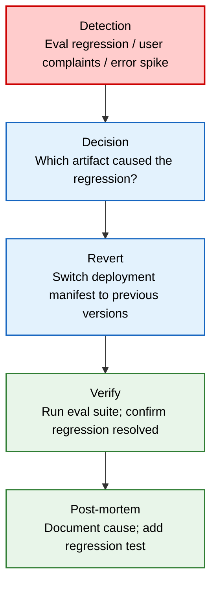

# AI Versioning

> **Purpose:** Define versioning strategy for all AI artifacts — prompts, models, agents, memory schemas, and eval datasets — with deployment pinning and rollback
> **Status:** 🆕 New
> **Owner:** AI Team
> **Version:** 1.0
> **Last Updated:** 2026-07-16
> **Dependencies:** [`Prompt-Standards.md`](./Prompt-Standards.md), [`Prompt-Library.md`](./Prompt-Library.md), [`Model-Routing.md`](./Model-Routing.md), [`Eval-Datasets.md`](./Eval-Datasets.md), [`../Engineering/Versioning.md`](../Engineering/Versioning.md)
> **Implementation Status:** 📋 Spec Only

## Overview

Vaeloom's AI system is composed of many versioned artifacts: prompts, models, agent contracts, memory schemas, and eval datasets. Each evolves independently, and each can break the others if changed carelessly. This document defines how every AI artifact is versioned, how versions are pinned at deployment, how backward compatibility is maintained, and how rollbacks work when something breaks.

## Goals

- Define versioning for prompts, models, agents, memory schemas, eval datasets
- Establish deployment pinning (every deployment records exact versions)
- Define backward-compatibility rules per artifact type
- Document rollback procedures

## Scope

### In Scope

- Prompt versioning (semver + A/B testing)
- Model versioning (pinned per deployment)
- Agent contract versioning
- Memory schema versioning (embedding model changes)
- Eval dataset versioning
- Deployment pinning and rollback

### Out of Scope

- General software versioning (see [`../Engineering/Versioning.md`](../Engineering/Versioning.md))

## Versioning by Artifact Type

| Artifact | Scheme | Storage | Backward Compat |
|----------|--------|---------|-----------------|
| **Prompts** | Semver (MAJOR.MINOR.PATCH) | `/prompts/` files + git | Old versions retained for rollback |
| **Models** | Provider version string (e.g., `claude-3-5-sonnet-20241022`) | Model router config | Pinned per deployment |
| **Agent contracts** | Semver | Agent registry (DB) | v1 and v2 coexist for 90 days |
| **Memory schemas** | Schema version int | Migration files | Forward + backward migrations |
| **Eval datasets** | Semver | Dataset store (DB + files) | Old versions retained for comparison |

## Prompt Versioning

```text
Prompt file: /prompts/resume/system.md
Version line at top:
  # Resume Agent — System Prompt v2.1.0

Semver rules:
  MAJOR: Breaking change (new required variable, changed output format)
  MINOR: Additive change (new optional section, improved instructions)
  PATCH: Fix (typo, clarification, guardrail tweak)

Changelog maintained at bottom of each prompt file.
```

### A/B Testing

```text
Prompt A/B test:
  1. Create variant: /prompts/resume/system.v2.2.0-experiment.md
  2. Configure router: 10% of requests use experiment; 90% use production (v2.1.0).
  3. Run for minimum 7 days or 1000 samples (whichever is first).
  4. Compare eval scores + user feedback.
  5. If experiment wins: promote to v2.2.0; retire v2.1.0 after 30 days.
  6. If experiment loses: archive with results logged.
```

## Model Versioning

| Rule | Detail |
|------|--------|
| Never use "latest" | Pin exact version: `claude-3-5-sonnet-20241022`, not `claude-3-5-sonnet-latest` |
| Model update procedure | New version → benchmark → eval → staging deploy → canary 10% → full deploy |
| Deployment records model versions | Every deployment manifest lists exact model versions |
| Rollback | Revert deployment manifest to previous model versions |

## Memory Schema Versioning

```text
Embedding model change scenario:
  1. Current: text-embedding-3-small (1536 dims), schema v1
  2. Upgrade to: text-embedding-3-large (3072 dims), schema v2
  3. Migration:
     a. Add new vector column (v2) alongside old (v1).
     b. Backfill: re-embed all documents with new model (batch, background job).
     c. Dual-query: RAG queries both v1 and v2 during migration.
     d. Cutover: switch router to v2 only.
     e. Cleanup: drop v1 column after 30-day verification.
```

## Deployment Pinning

Every deployment records a manifest of exact AI artifact versions:

```yaml
# deployment-manifest-2026-07-16.yaml
deployment_id: dep_20260716_001
deployed_at: 2026-07-16T10:00:00Z
ai_artifacts:
  prompts:
    shared/preamble: v1.2.0
    orchestrator/system: v1.3.0
    resume/system: v2.1.0
    ats/system: v1.0.0
    # ... all prompts
  models:
    routing: claude-3-5-sonnet-20241022
    extraction: gpt-4o-2024-08-06
    classification: gpt-4o-mini-2024-07-18
    embedding: text-embedding-3-small
  agent_contracts:
    orchestrator: v1.0.0
    resume: v2.0.0
    # ... all agents
  memory_schema: v1
  eval_datasets:
    resume_extraction: v3.2.0
    # ... all datasets
```

## Rollback Procedure



> **Diagram:** AI artifact rollback flow. Detection → identify cause → revert manifest → verify → post-mortem.

## Best Practices

| # | Practice | Rationale |
|---|----------|-----------|
| 1 | Pin exact model versions | "latest" silently changes behavior; breaks reproducibility |
| 2 | Record full artifact manifest per deployment | Enables precise rollback to known-good state |
| 3 | Run eval before and after every AI artifact change | Catches regressions before they reach users |
| 4 | Dual-support memory schema migrations | Re-embedding is slow; don't block on it |

## Risks

| Risk | Likelihood | Impact | Mitigation |
|------|-----------|--------|------------|
| Provider deprecates pinned model with short notice | Medium | High | Monitor announcements; maintain 2+ providers |
| Embedding migration leaves orphaned vectors | Low | Medium (search quality) | Verification scan post-migration |
| Prompt change breaks agent contract | Medium | Medium | Contract test in CI |

## Future Improvements

| Improvement | Priority | Complexity | Timeline |
|-------------|----------|------------|----------|
| Automated rollback on eval regression | High | Medium | Q1 2027 |
| Version diff visualization (what changed between deployments) | Medium | Low | Q4 2026 |
| Shadow deployment (run new version in parallel, compare) | Medium | High | Q2 2027 |

## Related Documents

- [`Prompt-Standards.md`](./Prompt-Standards.md) — prompt versioning section
- [`Prompt-Library.md`](./Prompt-Library.md) — prompt catalog with versions
- [`Model-Routing.md`](./Model-Routing.md) — model version pinning in router
- [`Eval-Datasets.md`](./Eval-Datasets.md) — dataset versioning
- [`../Engineering/Versioning.md`](../Engineering/Versioning.md) — general versioning policy
