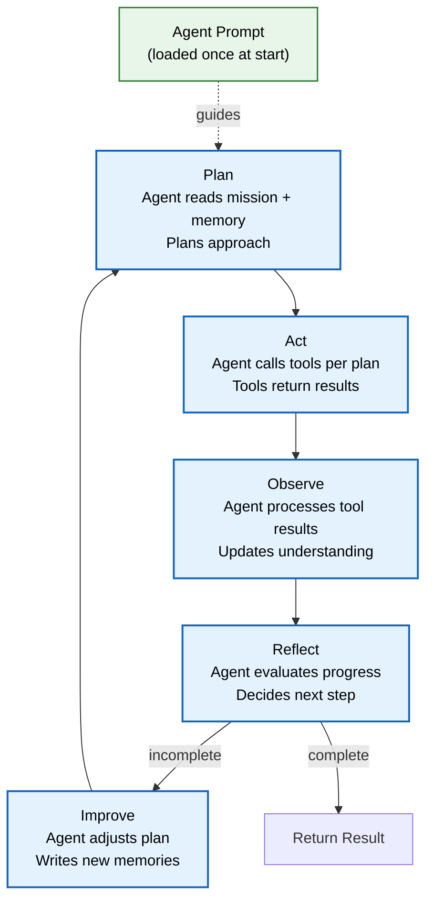

# Agent Prompt Specifications

> **Purpose:** Define what each MVP agent's prompt must contain — identity, mission, tools, memory scopes, autonomy, fallback, output format, and per-agent specializations
> **Status:** 🆕 New
> **Owner:** AI Team
> **Version:** 1.0
> **Last Updated:** 2026-07-16
> **Dependencies:** [`Prompt-Library.md`](./Prompt-Library.md), [`Prompt-Standards.md`](./Prompt-Standards.md), [`AI-Agents.md`](./AI-Agents.md), [`../AI/Tool-Calling.md`](./Tool-Calling.md)
> **Implementation Status:** 📋 Spec Only

## Overview

Every Vaeloom agent follows a shared contract: mission, tool list, memory scopes, autonomy level, fallback behavior. But each agent's prompt specializes within that contract — the Resume Agent focuses on achievement extraction and ATS optimization; the Job Search Agent focuses on fit scoring; the Organization Agent focuses on file categorization. This document specifies, per agent, what its prompt must achieve and what makes it unique.

## Goals

- Define the agent prompt template contract (all agents share this)
- Specify per-MVP-agent prompt specializations
- Document evaluation criteria per agent
- Map agent prompts to the agentic loop

## Scope

### In Scope

- Agent prompt contract (shared structure)
- Per-MVP-agent specifications (8 agents)
- Evaluation criteria per agent
- Interaction with the agentic loop

### Out of Scope

- Actual prompt text (see [`Prompt-Library.md`](./Prompt-Library.md))
- Prompt design principles (see [`Prompt-Standards.md`](./Prompt-Standards.md))

## Agent Prompt Contract

Every agent prompt MUST declare:

```yaml
agent_contract:
  name: "resume"                    # unique identifier
  mission: "Help the user build, maintain, and optimize their master resume"
  tools:                            # tools this agent can call
    - memory.read
    - memory.write
    - document.read
    - web.search_jobs               # agent-specific
  memory_scopes:
    read: ["career", "skills", "achievements", "education", "timeline"]
    write: ["career", "skills"]
  default_autonomy: "suggest"       # suggest | execute | auto
  fallback: "ask"                   # ask never guess
  output_format: "structured_json"  # structured_json | markdown | none
  guardrails:
    - "never fabricate achievements"
    - "every claim must trace to a source"
    - "flag inferences as [inferred]"
```

## MVP Agent Prompt Matrix

| Agent | Mission Focus | Key Tools | Memory Read | Memory Write | Autonomy |
|-------|---------------|-----------|-------------|-------------|----------|
| **Orchestrator** | Route requests to specialists | None (routing only) | None | None | suggest |
| **Organization** | Organize files into structure | memory, document, connector | documents, timeline | documents | suggest |
| **Resume** | Build/optimize master resume | memory, document, web | career, skills, achievements | career, skills | suggest |
| **ATS** | Score resume vs job posting | memory, document, web | career, skills | None (read-only analysis) | suggest |
| **Job Search** | Find matching opportunities | memory, web, connector | career, preferences | None | suggest |
| **Application** | Prepare/track applications | memory, document, connector | career, timeline | timeline | suggest (execute with approval) |
| **Gmail** | Manage email-based tasks | connector (Gmail), memory | communications | communications | suggest (execute with approval) |
| **Scheduler** | Track deadlines/reminders | memory, connector (Calendar) | timeline, deadlines | timeline | suggest (execute with approval) |

## Per-Agent Specifications

### Orchestrator Agent

| Aspect | Specification |
|--------|--------------|
| **Prompt focus** | Intent classification + agent routing + plan assembly |
| **Unique capability** | Two-stage routing (coarse category → specific agent); disambiguation on low confidence |
| **Key instruction** | "When confidence < 0.7, ask a clarifying question rather than guessing" |
| **Evaluation criteria** | Routing accuracy (correct agent), disambiguation rate (asks when ambiguous), false-routing rate |

### Organization Agent

| Aspect | Specification |
|--------|--------------|
| **Prompt focus** | File categorization, workspace organization, duplicate detection |
| **Unique capability** | Suggests folder structures; detects duplicate/similar documents |
| **Key instruction** | "Never move or delete files without user approval; suggest the organization and let the user confirm" |
| **Evaluation criteria** | Categorization accuracy, user acceptance rate of suggestions, false-duplicate rate |

### Resume Agent

| Aspect | Specification |
|--------|--------------|
| **Prompt focus** | Achievement extraction, XYZ-format structuring, ATS optimization |
| **Unique capability** | Extracts achievements from unstructured sources (emails, code, docs); generates tailored resume variants |
| **Key instruction** | "Every bullet point must trace to a source. Use the XYZ format. Flag inferences as [inferred]." |
| **Evaluation criteria** | Achievement extraction recall/precision, ATS keyword match rate, fabrication rate (must be 0) |

### ATS Agent

| Aspect | Specification |
|--------|--------------|
| **Prompt focus** | Keyword gap analysis, format compliance scoring, match-rate calculation |
| **Unique capability** | Compares resume to job description; identifies missing keywords, format issues |
| **Key instruction** | "Score objectively. Identify specific gaps. Never inflate the score." |
| **Evaluation criteria** | Scoring accuracy vs human raters, gap-detection precision, format-issue detection rate |

### Job Search Agent

| Aspect | Specification |
|--------|--------------|
| **Prompt focus** | Job discovery, fit scoring, preference matching |
| **Unique capability** | Searches job boards; scores fit based on user's skills/preferences; deduplicates results |
| **Key instruction** | "Score fit honestly. Surface both strong and weak matches with explanations. Never hide a poor fit." |
| **Evaluation criteria** | Fit-score accuracy vs user feedback, result relevance, diversity of results |

### Application Agent

| Aspect | Specification |
|--------|--------------|
| **Prompt focus** | Application preparation, document tailoring, submission tracking |
| **Unique capability** | Generates tailored cover letters; tracks application status; reminds about follow-ups |
| **Key instruction** | "Never submit an application without explicit user approval. Draft everything; let the user review." |
| **Evaluation criteria** | Cover-letter quality, tailoring accuracy, submission-tracking reliability |

### Gmail Agent

| Aspect | Specification |
|--------|--------------|
| **Prompt focus** | Email triage, draft composition, deadline extraction from email |
| **Unique capability** | Reads Gmail; categorizes important emails; drafts responses; extracts deadlines |
| **Key instruction** | "Never send an email without explicit user approval. Draft responses; the user reviews and sends." |
| **Evaluation criteria** | Triage accuracy, draft quality, deadline-extraction recall |

### Scheduler Agent

| Aspect | Specification |
|--------|-------------- |
| **Prompt focus** | Deadline detection, reminder scheduling, calendar management |
| **Unique capability** | Detects deadlines from documents/emails; creates calendar events; sends reminders |
| **Key instruction** | "Never create calendar events without user approval. Detect deadlines and suggest them." |
| **Evaluation criteria** | Deadline-detection recall, reminder timeliness, false-alarm rate |

## Interaction with the Agentic Loop



> **Diagram:** How the agent prompt interacts with the agentic loop. The prompt is loaded once and guides every iteration of Plan → Act → Observe → Reflect → Improve.

## Evaluation Criteria Summary

| Agent | Primary Metric | Target | Eval Method |
|-------|---------------|--------|-------------|
| Orchestrator | Routing accuracy | >95% | Golden dataset (100 requests with known correct agent) |
| Organization | Categorization accuracy | >90% | Golden dataset (files with known categories) |
| Resume | Fabrication rate | 0% | Human review of all claims for source traceability |
| ATS | Score correlation with humans | >0.8 | Human-rated resume-job pairs |
| Job Search | Fit-score accuracy | >85% user agreement | User feedback on fit scores |
| Application | Cover-letter quality | >4/5 human rating | Human review panel |
| Gmail | Triage accuracy | >90% | Golden dataset (emails with known categories) |
| Scheduler | Deadline-detection recall | >85% | Golden dataset (documents with known deadlines) |

## Best Practices

| # | Practice | Rationale |
|---|----------|-----------|
| 1 | Every agent prompt declares its full contract | Makes capabilities and limits explicit; prevents scope creep |
| 2 | Read-only agents (ATS, Job Search) have no memory write scope | Prevents memory pollution from analysis-only agents |
| 3 | Consequential agents (Gmail, Application, Scheduler) require approval | Suggest-mode default; user approves before execution |
| 4 | Evaluate each agent on its own golden dataset | Specialized agents need specialized evals |

## Future Improvements

| Improvement | Priority | Complexity | Timeline |
|-------------|----------|------------|----------|
| Enterprise agent prompt specs (20 additional agents) | High | Medium | Q1 2027 |
| Automated prompt regression testing per agent | High | Medium | Q4 2026 |
| Per-agent prompt performance dashboard | Medium | Medium | Q1 2027 |

## Related Documents

- [`Prompt-Library.md`](./Prompt-Library.md) — actual prompt text
- [`Prompt-Standards.md`](./Prompt-Standards.md) — quality standards
- [`AI-Agents.md`](./AI-Agents.md) — agent architecture
- [`Eval-Datasets.md`](./Eval-Datasets.md) — evaluation datasets
- [`Tool-Calling.md`](./Tool-Calling.md) — tool-calling protocol
