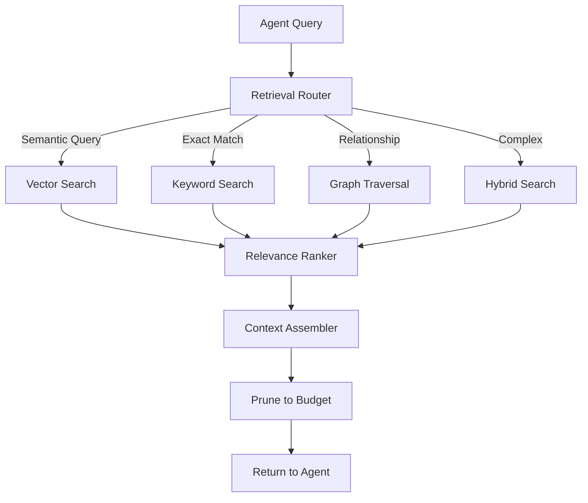
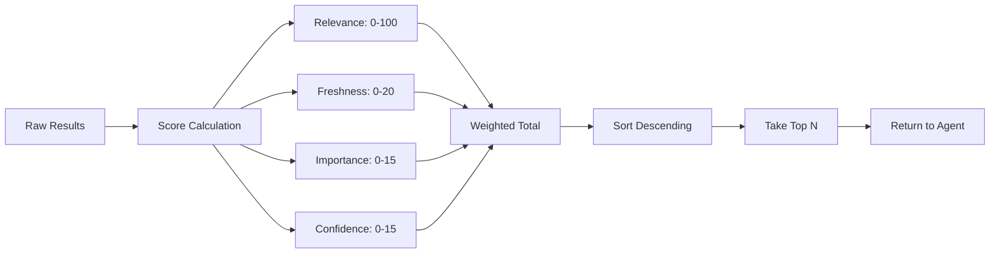
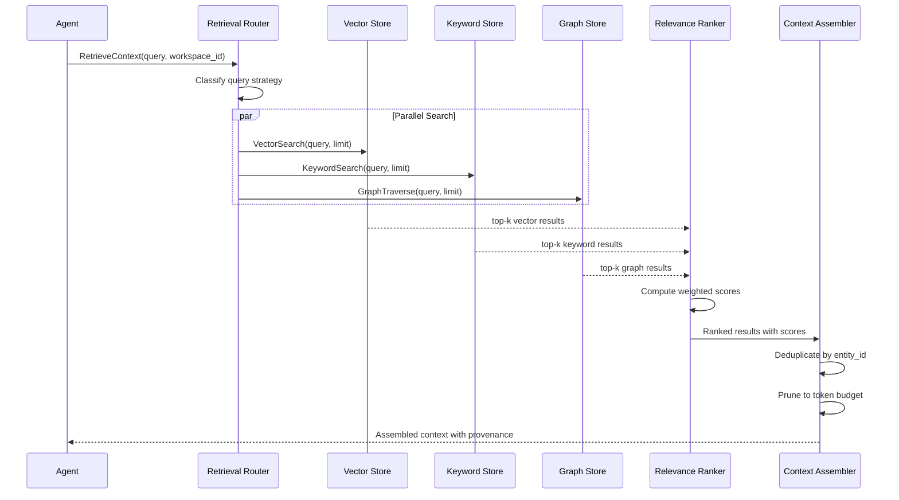

# Agentic RAG

> **Purpose:** Define the Agentic RAG architecture — retrieval that chooses its own strategy per query, rather than a fixed pipeline
> **Status:** ✅ Upgraded to enterprise quality
> **Owner:** AI Team
> **Last Updated:** 2026-07-12
> **Canonical source:** [`/Docs/Meridian-Complete-Documentation.md#65-agentic-rag`](../../Docs/Meridian-Complete-Documentation.md#65-agentic-rag)

---

## Overview

Traditional RAG runs one fixed retrieval pipeline for every query. Agentic RAG means the requesting agent decides, per query, which combination of strategies (vector, keyword, graph, or hybrid) actually answers the question. This is a core differentiator for Meridian — it allows agents to ask the right kind of question for the context, rather than forcing every query through the same funnel.

This document covers the agentic RAG architecture, retrieval strategy selection, ranking, context assembly, and implementation patterns.

## Goals

- Enable per-query retrieval strategy selection so agents choose the optimal search method (vector, keyword, graph, or hybrid) for each context need
- Achieve sub-2-second end-to-end retrieval latency through parallel store queries and efficient context assembly
- Maintain >90% relevance precision (Precision@5) via multi-factor ranking across relevance, freshness, importance, and confidence
- Ensure zero cross-tenant data leakage by scoping every retrieval operation to the originating workspace_id
- Provide full source provenance on every assembled context result for auditability and explainability

---

## Query Lifecycle State Machine

```mermaid
stateDiagram-v2
    direction LR

    %% ─── State Definitions ───
    state Idle      : ⏸️ Waiting for agent query
    state Received  : 📥 Query received by Router
    state Analyzing : 🔍 Router classifies intent

    state Fork_strategy <<fork>>

    state Vector   : 📐 Vector Search
    state Keyword  : ⌨️ Keyword Search
    state Graph    : 🔗 Graph Traversal
    state Hybrid   : 🧬 Hybrid Search

    state Join_results <<join>>

    state Ranking    : 📊 Multi-factor scoring
    state Assembling : 🧩 Context assembly
    state Pruning    : ✂️ Prune to token budget
    state Returned   : ✅ Context delivered to Agent
    state Error      : ❌ Error / No results

    %% ─── Transitions ───
    [*] --> Idle : System ready
    Idle --> Received : Agent sends query
    Received --> Analyzing : Router parses query

    Analyzing --> Fork_strategy
    Fork_strategy --> Vector : "related to" / fuzzy
    Fork_strategy --> Keyword : exact match / course code
    Fork_strategy --> Graph : relationship / "connected"
    Fork_strategy --> Hybrid : complex / multi-dim

    Vector  --> Join_results : top-k results
    Keyword --> Join_results : top-k results
    Graph   --> Join_results : top-k results
    Hybrid  --> Join_results : weighted top-k

    Join_results --> Ranking : Results from all stores

    Ranking --> Assembling : Scores computed
    Assembling --> Pruning : Dedup + prioritize

    Pruning --> Returned : Context fits within max_tokens
    Pruning --> Returned : Truncated to budget

    Returned --> Generating : 🤖 LLM generates response<br/>using assembled context
    Generating --> [*] : Response delivered to user
    Generating --> Idle : Ready for next query

    %% ─── Error transitions ───
    Analyzing --> Error : Strategy cannot be determined
    Ranking --> Error : Zero results across all stores
    Assembling --> Error : All results deduplicated away

    Error --> Idle : Log error, return empty context

    %% ─── Notes ───
    note right of Analyzing
        Router analyzes query signals:
        exact terms, relationships,
        time bounds, entity refs
    end note

    note right of Ranking
        Weighted score =
        Relevance(0.50) +
        Freshness(0.20) +
        Importance(0.15) +
        Confidence(0.15)
    end note

    note right of Pruning
        Deduplicate by entity_id
        Sort by score descending
        Truncate at max_tokens
    end note
```



> **Diagram:** The RAG query lifecycle as a state machine. A query flows through five phases — **Receive** → **Analyze** → **Strategy Fork** (vector/keyword/graph/hybrid) → **Rank & Assemble** → **Return**. Error states handle strategy failures, empty results, and deduplication edge cases. The system returns to `Idle` after each query, ready for the next.

---

## Architecture



## Retrieval Strategy Selection

The Router analyzes the query to determine the optimal strategy:

| Query Signal | Selected Strategy | Example Query |
|-------------|-------------------|---------------|
| "things related to..." | Vector (semantic similarity) | "Find projects involving machine learning" |
| Exact term match needed | Keyword (exact search) | "Course code CS106A" |
| Entity relationship traversal | Graph (relationship walk) | "What skills does John have?" |
| Multi-dimensional | Hybrid (weighted combination) | "Find backend internships matching my skills" |
| Time-bounded | Vector + time filter | "Projects from last semester" |

### Router Implementation

```python
# apps/ai-service/retrieval/router.py
from enum import Enum
from dataclasses import dataclass
from typing import List, Optional

class RetrievalStrategy(Enum):
    VECTOR = "vector"
    KEYWORD = "keyword"
    GRAPH = "graph"
    HYBRID = "hybrid"

@dataclass
class RetrievalPlan:
    strategy: RetrievalStrategy
    weights: Optional[dict] = None  # For hybrid: {"vector": 0.6, "keyword": 0.2, "graph": 0.2}
    filters: Optional[dict] = None  # Time range, entity type, workspace_id
    
def plan_retrieval(query: str, context: dict) -> RetrievalPlan:
    """
    Analyzes the query to determine the optimal retrieval strategy.
    
    Args:
        query: The agent's query string
        context: Agent context (workspace_id, memory types available)
        
    Returns:
        RetrievalPlan with strategy and parameters
    """
    # Check for exact match signals
    has_exact_terms = bool(re.search(r'"[^"]+"', query))
    has_course_code = bool(re.search(r'[A-Z]{2,4}\s*\d{3,4}', query))
    
    # Check for relationship signals
    has_relationship = any(word in query.lower() 
                          for word in ['connected', 'related', 'linked', 'using'])
    
    # Check for time signals
    has_time = any(word in query.lower()
                  for word in ['last', 'recent', 'this', 'previous'])
    
    if has_exact_terms or has_course_code:
        return RetrievalPlan(
            strategy=RetrievalStrategy.HYBRID,
            weights={"keyword": 0.7, "vector": 0.2, "graph": 0.1}
        )
    elif has_relationship:
        return RetrievalPlan(
            strategy=RetrievalStrategy.GRAPH
        )
    elif has_time:
        return RetrievalPlan(
            strategy=RetrievalStrategy.VECTOR,
            filters={"time_range": extract_time_range(query)}
        )
    else:
        # Default to hybrid for complex queries
        return RetrievalPlan(
            strategy=RetrievalStrategy.HYBRID,
            weights={"vector": 0.5, "keyword": 0.3, "graph": 0.2}
        )
```

## Hybrid Search Execution

```python
# apps/ai-service/retrieval/executor.py
async def execute_hybrid_search(
    plan: RetrievalPlan,
    workspace_id: str,
    limit: int = 20
) -> List[MemoryResult]:
    """Execute a hybrid search across vector, keyword, and graph stores."""
    
    results = []
    
    if plan.weights.get("vector", 0) > 0:
        vector_results = await vector_store.search(
            query=plan.query,
            workspace_id=workspace_id,
            limit=int(limit * plan.weights["vector"]),
            filters=plan.filters
        )
        results.extend(vector_results)
    
    if plan.weights.get("keyword", 0) > 0:
        keyword_results = await keyword_store.search(
            query=plan.query,
            workspace_id=workspace_id,
            limit=int(limit * plan.weights["keyword"])
        )
        results.extend(keyword_results)
    
    if plan.weights.get("graph", 0) > 0:
        graph_results = await graph_store.traverse(
            query=plan.query,
            workspace_id=workspace_id,
            limit=int(limit * plan.weights["graph"])
        )
        results.extend(graph_results)
    
    return results
```

## Ranking Pipeline

Once results are retrieved, they go through the re-ranking pipeline:



### Score Calculation

| Factor | Weight | Source | Calculation |
|--------|--------|--------|-------------|
| Relevance | 0.50 | Cross-encoder reranker | `reranker.score(query, memory)` → 0-1 |
| Freshness | 0.20 | Timestamp | `max(0, 1 - days_since_update / 365)` |
| Importance | 0.15 | Entity centrality | `entity.degree_centrality / max_centrality` |
| Confidence | 0.15 | Source reliability | `min(1, source_documents / 3)` |

## Context Assembly

```python
# apps/ai-service/retrieval/assembler.py
def assemble_context(
    results: List[MemoryResult],
    max_tokens: int = 8000
) -> str:
    """
    Assembles retrieved memories into a context string for the agent.
    
    - Deduplicates overlapping memories
    - Prioritizes by score
    - Prunes to fit within max_tokens
    - Attaches source provenance to each item
    """
    seen_entities = set()
    unique_results = []
    
    for r in sorted(results, key=lambda x: x.score, reverse=True):
        if r.entity_id not in seen_entities:
            seen_entities.add(r.entity_id)
            unique_results.append(r)
    
    # Build context with provenance
    context_parts = []
    token_count = 0
    
    for r in unique_results:
        entry = f"[Source: {r.source_document} | Score: {r.score:.2f}]\n{r.content}\n"
        entry_tokens = estimate_tokens(entry)
        
        if token_count + entry_tokens > max_tokens:
            break
            
        context_parts.append(entry)
        token_count += entry_tokens
    
    return "\n---\n".join(context_parts)
```

## Best Practices

| Practice | Rationale |
|----------|-----------|
| Always include source provenance | Enables traceability and explainability |
| Deduplicate before returning | Prevents redundant context and token waste |
| Set max_tokens per agent type | Different agents need different context budgets |
| Cache frequent queries | Identical queries (e.g., "find my skills") can be cached for 5 min |
| Log retrieval strategy chosen | Debugging and optimization data |

## Common Mistakes

| Mistake | Consequence | Fix |
|---------|-------------|-----|
| Using vector search for everything | Misses exact matches, relationship queries | Let router choose strategy |
| No deduplication | Wasted tokens, redundant context | Deduplicate by entity_id |
| Single score ranking | Stale, low-importance results dominate | Use weighted multi-factor ranking |
| Ignoring workspace_id | Cross-tenant data leakage | Always scope queries to workspace_id |

## Performance Considerations

| Concern | Mitigation |
|---------|------------|
| Vector search latency at scale | Dedicated vector DB (Qdrant) at enterprise |
| Context assembly cost | Prune to budget, cache frequent queries |
| Router latency | Router is a lightweight classifier (Haiku model) |
| Hybrid search overhead | Parallel execution across stores |

## Security Considerations

| Concern | Mitigation |
|---------|------------|
| Data leakage across tenants | Workspace_id scoped on every query |
| Source document exposure | Only return approved metadata, not raw content |
| Query injection | Sanitize input before passing to stores |

## Scope

This document covers the Agentic RAG system for Meridian, including retrieval strategy selection, hybrid search execution, multi-factor ranking, context assembly, and the routing classifier. It applies to all AI agents in the Meridian system (MVP: 8 agents, Enterprise: 28 agents). Out of scope: base RAG pipeline details (see [RAG.md](./RAG.md)), embedding model selection (see [Embeddings.md](./Embeddings.md)), and knowledge graph traversal specifics (see [Knowledge-Graph.md](./Knowledge-Graph.md)).

---

## Functional Requirements

| ID | Requirement | Priority | Notes |
|----|-------------|----------|-------|
| AR-FR-01 | Router must classify query into vector/keyword/graph/hybrid strategy | P0 | Classification must complete in <50ms |
| AR-FR-02 | Hybrid search must weight results from vector+keyword+graph stores | P0 | Weights configurable per agent type |
| AR-FR-03 | Results must be deduplicated by entity_id before assembly | P0 | Prevents redundant context |
| AR-FR-04 | Assembled context must not exceed configurable token budget per agent | P0 | Budget set per agent type (4K-8K tokens) |
| AR-FR-05 | Every returned result must include source provenance | P1 | Source document ID + score + retrieval strategy |
| AR-FR-06 | Router must log selected strategy and all sub-decisions | P1 | Enables debugging and optimization |
| AR-FR-07 | Cache identical queries per workspace (TTL: 5 min) | P2 | Reduces latency for repeated queries |

---

## Non-Functional Requirements

| ID | Requirement | Target | Measurement |
|----|-------------|--------|-------------|
| AR-NFR-01 | Router classification latency | <50ms | p99 latency across all query types |
| AR-NFR-02 | Total retrieval latency (end-to-end) | <2s | p95 from query receipt to context delivery |
| AR-NFR-03 | Relevance score accuracy | >90% | Precision@5 against golden dataset |
| AR-NFR-04 | Query throughput | >100 QPS per workspace | Requests per second at p50 latency |
| AR-NFR-05 | Availability | 99.9% | Uptime of retrieval service |
| AR-NFR-06 | Context assembly success rate | >99.5% | Ratio of queries that return usable context |

---

## Components

| Component | Responsibility | Technology | Scale Strategy |
|-----------|---------------|------------|----------------|
| Retrieval Router | Classifies query, selects strategy, dispatches to stores | Python async service (FastAPI) | Horizontal scaling with queue buffer |
| Vector Search Engine | Semantic similarity search over embeddings | pgvector (MVP) → Qdrant (Enterprise) | Shard by workspace_id |
| Keyword Search Engine | Exact-term full-text search | PostgreSQL FTS (GIN indexes) | Read replicas for search volume |
| Graph Traversal Engine | Entity relationship navigation | AGE (MVP) → Neo4j (Enterprise) | Graph partitioning by entity cluster |
| Relevance Ranker | Cross-encoder re-ranking of results | SentenceTransformers (cross-encoder) | Dedicated GPU workers at scale |
| Context Assembler | Dedup, prioritize, prune, build prompt context | In-memory Python | Stateless, scales horizontally |

---

## Workflows

### 1. Query Classification Workflow

1. Agent sends query to Retrieval Router with workspace_id and agent context
2. Router parses query for signals: exact terms, course codes, relationship keywords, time bounds
3. Router selects strategy based on signal analysis
4. If hybrid: weight components (vector:keyword:graph) proportional to signal mix
5. Router dispatches to selected stores in parallel
6. Stores return top-k results with scores
7. Results merged into unified result set

### 2. Context Assembly Workflow

1. Ranker computes weighted score for each result (Relevance × 0.50 + Freshness × 0.20 + Importance × 0.15 + Confidence × 0.15)
2. Results sorted descending by score
3. Deduplication: skip results with duplicate entity_id (keep highest score)
4. Iterate through results, building context string with source provenance
5. Stop when accumulated tokens exceed agent's max_tokens budget
6. Return assembled context string to requesting agent

### 3. Cache-Then-Retrieve Workflow

1. Router checks cache for (workspace_id, query_hash)
2. If cache hit (age < 5 min): return cached context immediately
3. If cache miss: execute full retrieval pipeline
4. Store result in cache with TTL

---

## Sequence Diagrams



> **Diagram:** The Agentic RAG retrieval flow showing parallel search execution across three stores, followed by ranking, deduplication, and pruning before delivery to the requesting agent.

---

## Data Flow

```
┌─────────────┐     ┌──────────────────┐     ┌─────────────────┐
│  Agent       │────>│ Retrieval Router  │────>│ Strategy Select  │
│  Query       │     │ (classify + route)│     │ (signal analysis)│
└─────────────┘     └──────────────────┘     └─────────────────┘
                                                    │
                          ┌─────────────────────────┼─────────────────────┐
                          ▼                         ▼                     ▼
                   ┌────────────┐          ┌──────────────┐      ┌──────────────┐
                   │Vector Store│          │Keyword Store  │      │ Graph Store  │
                   │(pgvector)  │          │(PG FTS)       │      │(AGE/Neo4j)  │
                   └────────────┘          └──────────────┘      └──────────────┘
                          │                         │                     │
                          └──────────────┬──────────┘─────────────────────┘
                                         ▼
                                  ┌──────────────┐
                                  │Relevance Rank│
                                  │(cross-encoder)│
                                  └──────────────┘
                                         │
                                         ▼
                                  ┌──────────────┐
                                  │Context Assemb│
                                  │(dedup + prune)│
                                  └──────────────┘
                                         │
                                         ▼
                                  ┌──────────────┐
                                  │   Agent      │
                                  │  Response    │
                                  └──────────────┘
```

**Data Flow Description:** Agent queries flow through Router for strategy selection, which dispatches to the appropriate stores in parallel. Results converge at the Ranker for scoring, then the Context Assembler for deduplication and token-budget pruning. The final context payload is delivered to the requesting agent with full source provenance.

---

## APIs

| Endpoint | Method | Purpose | Auth |
|----------|--------|---------|------|
| `/api/v1/retrieval/context` | POST | Retrieve assembled context for an agent query | Agent token + workspace_id |
| `/api/v1/retrieval/strategies` | GET | List available retrieval strategies and their weights | Internal service auth |
| `/api/v1/retrieval/cache/flush` | POST | Flush query cache for a specific workspace | Admin token |
| `/api/v1/retrieval/metrics` | GET | Get retrieval latency and hit-rate metrics | Monitoring service auth |

---

## Database

| Table | Purpose | Key Columns | Indexes |
|-------|---------|-------------|---------|
| `retrieval_cache` | Cache assembled context results | `workspace_id`, `query_hash`, `context_json`, `created_at` | `(workspace_id, query_hash)` UNIQUE, `(created_at)` |
| `retrieval_audit` | Log every retrieval request | `id`, `workspace_id`, `agent_name`, `strategy`, `result_count`, `latency_ms` | `(workspace_id, created_at)` |
| `strategy_config` | Per-agent retrieval strategy overrides | `agent_name`, `strategy_name`, `weights_json`, `default_limit` | `(agent_name)` UNIQUE |

---

## Scalability

| Dimension | Current Limit | 10x Strategy | 100x Strategy |
|-----------|--------------|--------------|---------------|
| Queries per second | 100 QPS per workspace | Horizontal scaling of Router + Redis cache layer | Global query routing with regional caches |
| Vector store size | 10M vectors (pgvector) | Migrate to Qdrant with auto-sharding | Distributed Qdrant cluster with multi-region replication |
| Document corpus | 100K documents | AGE → Neo4j for graph store; document chunking increases embedding count | Dedicated GPU cluster for embedding generation |
| Concurrent agents | 8 agents (MVP) | Agent-specific router instances with shared cache | Full mesh agent-router topology with affinity routing |
| Context assembly | 10 results per query | Tiered assembly: preview (top-3) → full (top-10) | Streaming assembly with progressive context delivery |

---

## Error Handling

| Scenario | Detection | Mitigation | Recovery |
|----------|-----------|------------|----------|
| All stores return empty results | Ranker receives zero results | Return empty context with `status: "no_results"` flag | Router retries with broader strategy (hybrid with 100% weight on least-used store) |
| One store times out | Per-store timeout exceeds 500ms | Continue with results from other stores; log timeout | Retry failed store on next query (circuit breaker: 3 failures → 30s cooldown) |
| Router cannot classify query | Confidence below 0.3 threshold | Default to hybrid search with balanced weights | Log classification failure for prompt improvement |
| Context exceeds token budget | Accumulated tokens > max_tokens | Prune lowest-scored results until within budget | Log pruning count for context budget optimization |
| Vector store unavailable | Connection error / 503 | Fall back to keyword + graph only | Alert on-call; auto-reconnect with backoff |

---

## Monitoring

| Metric | Alert Threshold | Severity | Dashboard |
|--------|----------------|----------|-----------|
| Router classification latency | p99 > 100ms | Warning | Retrieval Overview |
| Total retrieval latency | p95 > 3s | Critical | Retrieval Overview |
| Empty result rate | > 5% of queries | Warning | Retrieval Quality |
| Cache hit rate | < 20% | Info | Retrieval Cache |
| Store timeout rate | > 1% of queries | Critical | Retrieval Health |
| Context assembly pruning rate | > 50% | Warning | Context Budget |

---

## Deployment

| Environment | Method | Trigger | Verification |
|-------------|--------|---------|-------------|
| Development | Docker Compose with local services | Code push to `develop` branch | Unit tests + integration tests |
| Staging | Helm chart to staging Kubernetes cluster | PR merge to `main` | Golden dataset evals pass |
| Production (canary) | Progressive rollout (10% → 50% → 100%) | Manual approval after staging | Shadow mode compare vs production baseline |
| Production (full) | Full cluster rollout | 24h canary observation | Latency + accuracy metrics within SLO |

---

## Configuration

| Variable | Purpose | Default | Required |
|----------|---------|---------|----------|
| `RETRIEVAL_MAX_TOKENS` | Max context tokens per query | 8000 | Yes |
| `RETRIEVAL_DEFAULT_LIMIT` | Default top-k per store | 20 | Yes |
| `RETRIEVAL_CACHE_TTL_SECONDS` | Query cache lifetime | 300 | No |
| `RETRIEVAL_STORE_TIMEOUT_MS` | Per-store timeout | 500 | Yes |
| `ROUTER_CONFIDENCE_THRESHOLD` | Minimum confidence for specific strategy | 0.3 | Yes |
| `HYBRID_DEFAULT_WEIGHTS` | Default vector:keyword:graph weights | `0.5:0.3:0.2` | No |

---

## Examples

### Example 1: Course Code Query

```python
# Input
query = "Find documents about course CS229"
# Router analysis: has course code -> hybrid with keyword bias
plan = plan_retrieval(query, {"workspace_id": "ws_123"})
assert plan.strategy == RetrievalStrategy.HYBRID
assert plan.weights == {"keyword": 0.7, "vector": 0.2, "graph": 0.1}

# Output context assembled with source provenance
# [Source: course_catalog.pdf | Score: 0.94]
# CS229: Machine Learning — Stanford course covering supervised learning...
```

### Example 2: Relationship Query

```python
# Input
query = "What skills are connected to React?"
# Router analysis: has relationship keyword -> graph traversal
plan = plan_retrieval(query, {"workspace_id": "ws_456"})
assert plan.strategy == RetrievalStrategy.GRAPH

# Output: traverses from React node to connected Skill nodes
# [Source: knowledge_graph | Score: 0.88]
# React → requires_skill → JavaScript, TypeScript, CSS
```

---

## Risks

| Risk | Likelihood | Impact | Mitigation |
|------|------------|--------|------------|
| Router misclassifies critical query | Medium | High | Default to hybrid when confidence < threshold; log misclassifications for retraining |
| Vector store becomes stale | Medium | Medium | Re-embedding job runs nightly; cache invalidation on document change |
| Cross-store score normalization drift | Low | High | Periodic calibration runs compare score distributions across stores |
| Query cache serves stale results | Low | Medium | TTL-based expiry; invalidate cache on workspace document changes |

---

## Limitations

| Limitation | Impact | Workaround | Future Resolution |
|------------|--------|------------|-------------------|
| Router is rule-based, not ML-classified | Misses nuanced query intents | Expand rule patterns based on production logs | Train ML classifier on labeled query logs (Phase 2) |
| Cross-encoder reranker limited to top-30 results | Low-ranking relevant items may be missed | Increase top-k to 50 with caching | Implement two-stage ranking (bi-encoder pre-filter + cross-encoder re-rank) |
| No multi-turn query context | Each query is independent | Include conversation history in agent context | Add session-aware router that considers query history |
| Cache per workspace only | Cross-workspace duplicates | No workaround in MVP | Global cache with workspace filter (Phase 3) |

---

## Future Improvements

| Improvement | Priority | Complexity | Timeline |
|-------------|----------|------------|----------|
| ML-based query classifier replacing rule-based router | High | High | Phase 2 (Q4 2026) |
| Two-stage ranking with bi-encoder pre-filter | Medium | Medium | Phase 2 (Q4 2026) |
| Session-aware retrieval with multi-turn context | Medium | High | Phase 3 (Q1 2027) |
| Global query result cache with workspace-aware invalidation | Low | Medium | Phase 3 (Q1 2027) |
| Streaming context assembly for progressive delivery | Low | High | Phase 4 (Q2 2027) |

## Related Documents

- [RAG.md](./RAG.md)
- [Embeddings.md](./Embeddings.md)
- [Memory.md](./Memory.md)
- [`/Docs/Meridian-Complete-Documentation.md#65-agentic-rag`](../../Docs/Meridian-Complete-Documentation.md#65-agentic-rag)
