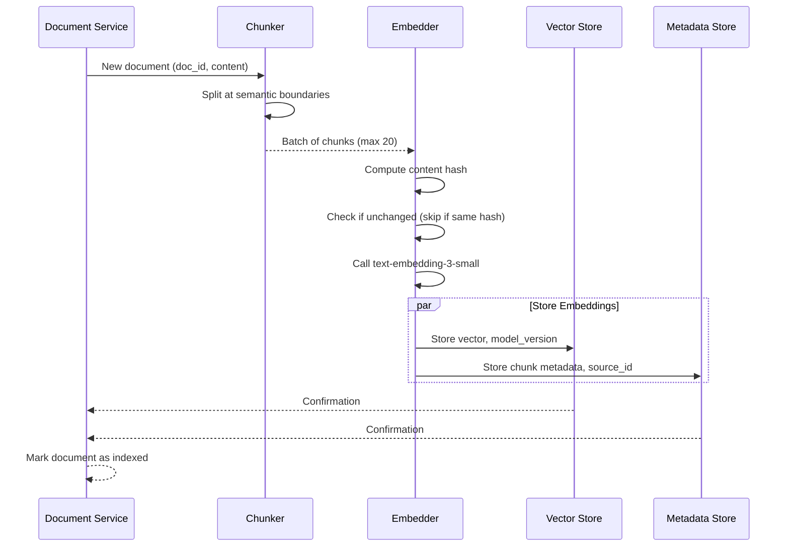

# Embeddings

> **Purpose:** Define the embedding strategy for Vaeloom's AI system
> **Status:** ✅ Upgraded to enterprise quality
> **Owner:** AI Team
> **Last Updated:** 2026-07-13

## Overview

The embeddings system is the foundation of Vaeloom's semantic search capabilities — converting documents, memory records, and conversations into dense vector representations that enable similarity-based retrieval. Every piece of content ingested by Vaeloom flows through a consistent embedding pipeline: chunk at semantic boundaries, embed via text-embedding-3-small, and store with model version metadata for safe upgrades.

This document covers the embedding model selection, chunking strategy, storage architecture (pgvector for MVP, Qdrant for Enterprise), model versioning, and re-embedding lifecycle. It is intended for AI engineers and infrastructure teams responsible for maintaining and scaling Vaeloom's vector search capabilities. Proper embedding hygiene — chunking at semantic boundaries, tracking model versions, and debouncing re-embedding — is critical to maintaining retrieval quality as the document corpus grows.

## Goals

- Embed all ingested content (documents, memory records, conversations) consistently using text-embedding-3-small at 1536 dimensions
- Achieve sub-100ms vector search latency for up to 10M embeddings via appropriate indexing strategies (IVFFlat → HNSW at scale)
- Support safe model upgrades by storing model_version with every embedding to prevent mixed-vector-space queries
- Process >1000 pages per minute through batched API calls with rate-limit awareness
- Ensure workspace-scoped isolation on all vector queries to prevent cross-tenant data leakage

---

## Embedding Pipeline

```mermaid
graph LR
    classDef source fill:#e3f2fd,stroke:#1565c0,color:#000,stroke-width:1.5px
    classDef process fill:#e8f5e9,stroke:#2e7d32,color:#000,stroke-width:1.5px
    classDef store fill:#fff3e0,stroke:#e65100,color:#000,stroke-width:1.5px
    classDef query fill:#f3e5f5,stroke:#6a1b9a,color:#000,stroke-width:1.5px

    subgraph Sources["📄 Content Sources"]
        D[Documents] --- M[Memory Records] --- C[Conversations]
    end

    subgraph Pipeline["⚙️ Embedding Pipeline"]
        CH["Chunk text<br/>max 8191 tokens"] --> EM["Embed via API<br/>text-embedding-3-small\n1536 dimensions"]
        EM --> VV["Store vector + metadata<br/>+ model_version"]
    end

    subgraph Storage["💾 Vector Storage"]
        PG["( pgvector<br/>MVP: PostgreSQL )"]
        QD["( Qdrant<br/>Enterprise: Dedicated )"]
    end

    subgraph Query["🔍 Query Flow"]
        Q["User query"] --> QE["Embed query<br/>same model"]
        QE --> VS["Vector similarity<br/>search"]
        VS --> RES["Return top-k<br/>results"]
    end

    D & M & C --> CH
    VV --> PG
    VV --> QD
    RES --> QD
    RES --> PG

    class D,M,C source
    class CH,EM,VV process
    class PG,QD store
    class Q,QE,VS,RES query
```



> **Diagram:** Content sources (documents, memories, conversations) flow through the embedding pipeline — chunked, embedded via `text-embedding-3-small`, and stored with `model_version`. Queries are embedded with the same model and searched via vector similarity. MVP uses pgvector; Enterprise upgrades to dedicated Qdrant.

---

## Embedding Model

| Property | Value |
|----------|-------|
| Model | text-embedding-3-small (OpenAI) |
| Dimensions | 1536 |
| Max tokens | 8191 |
| Cost | $0.00002/1K tokens |

## What Gets Embedded

| Content Type | When | Update Frequency |
|-------------|------|-----------------|
| Documents | On upload/change | Once per meaningful change |
| Memory records | On creation/update | Once per entity change |
| Conversation turns | On completion | Once per turn |

## Embedding Storage

| Environment | Store | Notes |
|-------------|-------|-------|
| MVP | pgvector (PostgreSQL extension) | Co-located with relational data |
| Enterprise | Qdrant | Dedicated vector DB for scale |

## Versioning

Every embedding stores `model_version` to handle model upgrades:

```json
{
  "vector": [0.1, 0.2, ...],
  "model_version": "text-embedding-3-small-001",
  "source_type": "document",
  "source_id": "doc_abc123"
}
```

Model upgrade process:

1. Deploy new embedding model alongside old
2. Gradually re-embed documents on access
3. Switch default model once re-embedding is complete
4. Never mix vector spaces in a single query

## Common Mistakes

| Mistake | Why It's a Problem |
|---------|-------------------|
| Mixing embedding models without version tracking | Different models produce incompatible vector spaces — querying with a different model than documents were embedded with returns meaningless similarity results |
| Embedding entire documents without chunking | Long documents exceed the 8191-token limit and dilute semantic signal — chunk to paragraph or section level before embedding |
| No periodic re-embedding for stale content | Documents that change after initial embedding are not re-indexed unless a re-embedding trigger exists — old embeddings return stale search results |
| Embedding every file type uniformly | Binary files, images without OCR, and code snippets produce poor embeddings that pollute the vector store — filter or pre-process each type appropriately |

## Best Practices

| Practice | Rationale |
|----------|-----------|
| Store `model_version` with every embedding | Enables safe model upgrades — new embeddings coexist with old until full re-index, preventing mixed vector space queries |
| Chunk documents at semantic boundaries (paragraphs, sections) | Semantic chunks produce better search results than fixed-size token windows; preserve section context in chunk metadata |
| Re-embed only on meaningful content changes | Debounce re-embedding to avoid churn from minor edits — use a hash of content to detect real changes vs metadata updates |
| Batch embedding API calls to stay within rate limits | Embedding APIs have per-minute token limits; batch documents and queue large backfills to avoid throttling and data loss |

## Security

| Concern | Mitigation |
|---------|------------|
| Sensitive content exposed via embedding reconstruction | Embeddings can theoretically be reversed to approximate original content; avoid embedding documents containing passwords, tokens, or PII |
| Embedding API data leakage | Embedding model providers may log or cache API inputs — use self-hosted or private embedding endpoints for sensitive document corpora |
| Vector-store injection via crafted documents | Maliciously crafted documents designed to produce adversarial embeddings could skew search results; sanitize input documents before embedding |

## Performance

| Concern | Guideline |
|---------|-----------|
| Embedding throughput at scale | text-embedding-3-small processes ~1,000 pages per minute at standard API limits; pre-batch documents and parallelize across multiple API keys for large initial ingestion |
| Vector search latency vs index size | pgvector exact search slows linearly with dataset size — set an `lists` threshold for IVFFlat indexing above 10,000 vectors to maintain sub-100ms query times |
| Storage cost of redundant embeddings | Deduplicate embeddings for identical content across versions — a document with 10 versions should only keep the latest embedding plus the model_version pointer |

## Scope

This document defines the embedding strategy for Vaeloom's AI platform — covering the embedding model, chunking strategy, storage architecture, versioning, and re-embedding lifecycle. It applies to all content types embedded by Vaeloom (documents, memory records, conversations) across MVP (pgvector) and Enterprise (Qdrant) deployments. Out of scope: retrieval query logic (see [Agentic-RAG.md](./Agentic-RAG.md)) and graph embeddings (see [Knowledge-Graph.md](./Knowledge-Graph.md)).

---

## Functional Requirements

| ID | Requirement | Priority | Notes |
|----|-------------|----------|-------|
| EM-FR-01 | All text content must be chunked before embedding | P0 | Chunk at semantic boundaries (paragraphs, sections) |
| EM-FR-02 | Every embedding must store model_version for upgrade safety | P0 | Prevents mixed vector space queries |
| EM-FR-03 | Documents must be re-embedded on meaningful content changes | P0 | Debounced to avoid churn from minor edits |
| EM-FR-04 | Embedding API calls must be batched to respect rate limits | P1 | Queue large backfills to avoid throttling |
| EM-FR-05 | Vector store must support workspace-scoped queries | P0 | Scope enforced at query level |
| EM-FR-06 | Embedding model upgrade must support gradual migration | P1 | Old and new embeddings coexist during transition |

---

## Non-Functional Requirements

| ID | Requirement | Target | Measurement |
|----|-------------|--------|-------------|
| EM-NFR-01 | Embedding throughput | >1000 pages/min | Token throughput per minute |
| EM-NFR-02 | Vector search latency (pgvector) | <100ms | p99 query latency at <10K vectors |
| EM-NFR-03 | Vector search latency (Qdrant) | <30ms | p99 query latency at >1M vectors |
| EM-NFR-04 | Embedding storage cost | <$0.01/1K vectors/month | Monthly cost per vector stored |
| EM-NFR-05 | Re-embedding trigger lag | <5min from content change | Time from save to new embedding available |

---

## Components

| Component | Responsibility | Technology | Scale Strategy |
|-----------|---------------|------------|----------------|
| Chunker | Split documents at semantic boundaries (paragraphs, sections) | Python NLTK + custom boundary detection | Parallel document processing workers |
| Embedder | Call embedding API with batched chunks | OpenAI text-embedding-3-small | Multiple API keys for parallel throughput |
| Vector Store (MVP) | Store and search embeddings | pgvector (PostgreSQL extension) | IVFFlat indexing above 10K vectors |
| Vector Store (Enterprise) | Dedicated vector search at scale | Qdrant | Auto-sharding by workspace_id |
| Re-embedding Scheduler | Detect stale content and re-embed | Background cron job | Priority queue: active documents first |

---

## Workflows

### 1. Document Embedding Workflow

1. Document uploaded or changed → trigger embedding
2. Chunker splits document at semantic paragraph/section boundaries
3. Each chunk validated: not empty, under 8191 tokens
4. Chunks batched (max 20 per API call)
5. Embedder sends batch to text-embedding-3-small
6. Each embedding stored with {vector, model_version, source_type, source_id, chunk_index}
7. Index updated (IVFFlat for pgvector, auto for Qdrant)

### 2. Model Upgrade Workflow

1. New embedding model deployed alongside old model
2. New documents embedded with new model; old documents keep old embeddings
3. Access-based re-embedding: when an old document is retrieved, re-embed with new model
4. Once all active documents migrated, switch default model
5. Never mix vector spaces in a single query — query with same model as target embeddings

---

## Sequence Diagrams



> **Diagram:** Document embedding flow showing chunking, dedup by content hash, batch embedding API call, and parallel storage to vector + metadata stores.

---

## Data Flow

```text
Document Upload → Content Hash (skip if unchanged)
    → Semantic Chunking → paragraph/section boundaries
    → Batch API Call → text-embedding-3-small (max 20 chunks)
    → Store: {vector, model_version, source_type, source_id, chunk_index}
    → Update Vector Index → IVFFlat / Auto-shard
    → Mark Document as Indexed
```

**Data flow description:** Content flows through hash-based dedup to avoid redundant re-embedding, then through semantic chunking, batched API embedding, and dual storage to vector index + metadata store.

---

## APIs

| Endpoint | Method | Purpose | Auth |
|----------|--------|---------|------|
| `/api/v1/embeddings/upsert` | POST | Embed and store new content | Service token |
| `/api/v1/embeddings/delete` | DELETE | Remove embeddings by source_id | Service token |
| `/api/v1/embeddings/search` | POST | Search embeddings by query vector | Agent token |
| `/api/v1/embeddings/status/{source_id}` | GET | Check embedding status for a document | Service token |

---

## Database

| Table | Purpose | Key Columns | Indexes |
|-------|---------|-------------|---------|
| `embeddings` | Store embedding vectors and metadata | `id`, `vector` (vector(1536)), `model_version`, `source_type`, `source_id`, `chunk_index`, `workspace_id` | `(workspace_id, source_type)` BRIN, `(model_version)` |
| `embedding_queue` | Queue documents awaiting embedding | `id`, `source_id`, `priority`, `status`, `retry_count` | `(status, priority)` |
| `embedding_audit` | Track all embedding operations | `id`, `source_id`, `action`, `model_version`, `chunks_count`, `duration_ms` | `(source_id, created_at)` |

---

## Scalability

| Dimension | Current Limit | 10x Strategy | 100x Strategy |
|-----------|--------------|--------------|---------------|
| Embedding throughput | 1000 pages/min (standard API limits) | Multiple API keys + parallelization | Dedicated embedding GPU cluster |
| Vector store size | 10M vectors (pgvector IVFFlat) | Migrate to Qdrant with auto-sharding | Distributed Qdrant, multi-region |
| Chunk storage | 50M chunks (PostgreSQL) | Partition by workspace_id | Separate chunk store (S3 + metadata) |
| API rate limits | 3K RPM (standard tier) | Higher tier + request queuing | Self-hosted embedding model |

---

## Error Handling

| Scenario | Detection | Mitigation | Recovery |
|----------|-----------|------------|----------|
| Embedding API rate limit hit | 429 response from API | Queue remaining chunks with backoff | Retry after Retry-After header |
| Content exceeds 8191 tokens | Chunk validation fails | Split chunk further at sentence boundary | Re-queue sub-chunks |
| Vector store unavailable | Connection timeout | Queue embeddings, retry with backoff | Alert on-call, failover to replica |
| Embedding model change detected | model_version mismatch on read | Re-embed on access, keep old version for existing queries | Gradual migration over 72h |

---

## Monitoring

| Metric | Alert Threshold | Severity | Dashboard |
|--------|----------------|----------|-----------|
| Embedding queue depth | > 1000 pending | Warning | Embedding Pipeline |
| Embedding latency per chunk | p95 > 500ms | Warning | Embedding Pipeline |
| API rate limit hits | > 10/hour | Info | Embedding Errors |
| Re-embedding lag | > 30min behind | Warning | Embedding Freshness |
| Vector store query latency | p99 > 200ms | Critical | Vector Store Health |

---

## Deployment

| Environment | Method | Trigger | Verification |
|-------------|--------|---------|-------------|
| Development | Local Docker Compose | Code push | Unit + integration tests |
| Staging | Helm chart to staging k8s | PR merge | Embedding pipeline smoke test |
| Production | Progressive rollout | Manual approval | Golden dataset similarity scores match baseline |

---

## Configuration

| Variable | Purpose | Default | Required |
|----------|---------|---------|----------|
| `EMBEDDING_MODEL` | Model name for embedding | text-embedding-3-small | Yes |
| `EMBEDDING_BATCH_SIZE` | Max chunks per API call | 20 | No |
| `EMBEDDING_MAX_TOKENS` | Max tokens per chunk | 8191 | Yes |
| `EMBEDDING_QUEUE_BATCH_SIZE` | Queue drain batch size | 100 | No |
| `REEMBED_THRESHOLD_DAYS` | Days before content is re-embedded | 90 | No |
| `VECTOR_STORE_TYPE` | pgvector or qdrant | pgvector | Yes |

---

## Examples

### Example 1: Embedding a Document

```python
from app.embedding import embed_document

# Document with 3 sections
doc = {
    "id": "doc_abc123",
    "content": "Section 1: ML basics...\n\nSection 2: Neural networks...\n\nSection 3: Training...",
    "workspace_id": "ws_456"
}

result = await embed_document(doc)
# Result: 3 embeddings created
# Chunk 1: {"vector": [0.1, ...], "model_version": "text-embedding-3-small-001", "source_id": "doc_abc123", "chunk_index": 0}
# Chunk 2: {"vector": [0.2, ...], ...}
# Chunk 3: {"vector": [0.3, ...], ...}
```

---

## Risks

| Risk | Likelihood | Impact | Mitigation |
|------|------------|--------|------------|
| Embedding model deprecated by provider | Low | High | Maintain model upgrade procedure; test new model on golden dataset before switch |
| Vector store outgrows pgvector limits | Medium | High | Monitor vector count; plan Qdrant migration when approaching 10M vectors |
| Content hash collision causing skipped re-embedding | Low | Medium | Use SHA-256 + content length for hash; periodic full re-index as safety net |
| API outage blocking document ingestion | Low | Medium | Queue-offline mode; re-process when API available |

---

## Limitations

| Limitation | Impact | Workaround | Future Resolution |
|------------|--------|------------|-------------------|
| text-embedding-3-small limited to 8191 tokens | Long documents require many chunks | Chunk at section boundaries; metadata keeps section context | Use text-embedding-3-large with higher limit (Phase 2) |
| pgvector exact search slows at scale | Query latency degrades beyond 10K vectors | Use IVFFlat indexing; set lists threshold | Migrate to Qdrant at scale |
| No cross-modal embeddings (text + code) | Code files embedded as text lose structure | Add language detection; structure-aware chunking | Code-specific embedding model (Phase 3) |
| No real-time embedding updates | Changes take minutes to reflect in search | Acceptable for most use cases; priority queue for urgent docs | Stream processing pipeline (Phase 4) |

---

## Future Improvements

| Improvement | Priority | Complexity | Timeline |
|-------------|----------|------------|----------|
| Upgrade to text-embedding-3-large for better accuracy | Medium | Low | Phase 2 (Q4 2026) |
| Qdrant migration for enterprise vector search | High | High | Phase 2 (Q4 2026) |
| Code-specific embedding with language-aware chunking | Medium | Medium | Phase 3 (Q1 2027) |
| Real-time streaming embedding pipeline | Low | High | Phase 4 (Q2 2027) |
| Cross-modal retrieval (text + code + image) | Low | High | Phase 5 (Q3 2027) |

## Related Documents

- [RAG.md](./RAG.md)
- [Vector Store](../Database/Database-Design.md)
- [`/Docs/Vaeloom-Complete-Documentation.md#64-embeddings-and-the-vector-database`](../../Docs/Vaeloom-Complete-Documentation.md#64-embeddings-and-the-vector-database)
