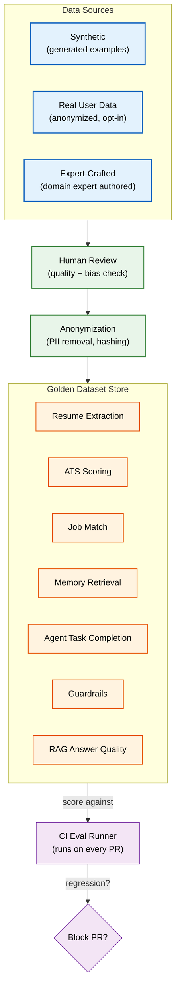

# Evaluation Datasets

> **Purpose:** Define the evaluation datasets used to benchmark Vaeloom's AI quality — structure, categories, sourcing, and CI integration
> **Status:** 🆕 New
> **Owner:** AI Team
> **Version:** 1.0
> **Last Updated:** 2026-07-16
> **Dependencies:** [`Evaluation.md`](./Evaluation.md), [`Prompt-Testing.md`](../Testing/Prompt-Testing.md), [`AI-Testing.md`](../Testing/AI-Testing.md), [`Prompt-Library.md`](./Prompt-Library.md)
> **Implementation Status:** 📋 Spec Only

## Overview

Vaeloom's AI quality is only as good as the datasets used to evaluate it. Evaluation (eval) datasets are curated sets of inputs with known-correct outputs — "golden" examples — that the eval runner uses to score agent performance. This document defines the structure of eval datasets, the categories we maintain, how data is sourced, how the eval runner integrates with CI, and the human review process for keeping golden sets current.

## Goals

- Define the golden dataset structure
- Specify eval dataset categories and size targets
- Document sourcing strategy (synthetic + anonymized real)
- Establish CI integration for eval gating
- Define the human review process

## Scope

### In Scope

- Golden dataset structure and schema
- Dataset categories with targets
- Sourcing and anonymization
- Eval runner CI integration
- Human-in-the-loop review

### Out of Scope

- Eval runner implementation (see [`Evaluation.md`](./Evaluation.md))
- Prompt testing methodology (see [`../Testing/Prompt-Testing.md`](../Testing/Prompt-Testing.md))

## Architecture



> **Diagram:** Eval dataset pipeline. Data is sourced (synthetic, anonymized real, expert), reviewed by humans, anonymized, and stored as golden datasets. CI runs the eval runner against these datasets on every PR.

## Golden Dataset Structure

```json
{
  "dataset_id": "resume_extraction_v3",
  "version": "3.2.0",
  "category": "resume_extraction",
  "last_updated": "2026-07-14",
  "examples": [
    {
      "id": "ex_001",
      "input": {
        "document_text": "Led migration of monolith to microservices, reducing deployment time by 70%...",
        "user_context": {"role": "Backend Engineer", "years_experience": 3}
      },
      "expected_output": {
        "achievements": [
          {
            "bullet": "Reduced deployment time by 70% by leading migration from monolith to microservices architecture",
            "format": "XYZ",
            "source_span": [0, 78],
            "skills": ["microservices", "deployment automation"]
          }
        ]
      },
      "evaluation_criteria": {
        "metric": "exact_match_with_fuzzy",
        "threshold": 0.85,
        "scoring_rubric": "achievement_recall_weighted"
      },
      "metadata": {
        "source": "expert_crafted",
        "difficulty": "medium",
        "tags": ["achievement_extraction", "xyz_format"]
      }
    }
  ]
}
```

## Dataset Categories

| Category | Description | Size Target | Scoring Metric |
|----------|-------------|-------------|----------------|
| **Resume Extraction** | Extract achievements from documents into XYZ format | 200 examples | Recall + precision vs golden |
| **ATS Scoring** | Score resume vs job description | 150 examples | Correlation with human raters |
| **Job Match Relevance** | Score job-user fit | 200 examples | NDCG@10 vs human rankings |
| **Memory Retrieval** | RAG recall + precision | 300 examples | Recall@k, precision@k |
| **Agent Task Completion** | End-to-end agent task success | 100 examples | Task success rate + quality score |
| **Guardrails** | Injection detection, PII blocking | 150 examples | Block rate, false-positive rate |
| **RAG Answer Quality** | Answer accuracy from retrieved context | 200 examples | Faithfulness, relevance, completeness |
| **Routing Accuracy** | Orchestrator correct agent selection | 100 examples | Accuracy |

## Sourcing Strategy

| Source | Method | Volume | Notes |
|--------|--------|--------|-------|
| **Synthetic** | LLM-generated examples, reviewed by humans | 60% | Scales easily; needs bias check |
| **Anonymized Real** | Opt-in user data, PII stripped | 30% | Most realistic; requires consent |
| **Expert-Crafted** | Domain experts author examples | 10% | Highest quality; expensive |

### Anonymization Rules

```text
Before any real user data enters a golden dataset:
  1. PII detection: names, emails, phone numbers, addresses, IDs → replaced with [PERSON], [EMAIL], etc.
  2. Hashing: any remaining identifiers hashed with salt.
  3. Consent check: only data from users who opted into "help improve Vaeloom."
  4. Manual review: human confirms no residual PII.
  5. Legal review: compliance with GDPR/privacy policy.
```

## CI Integration

```yaml
# .github/workflows/ai-eval.yml (conceptual)
name: AI Evaluation
on: [pull_request]

jobs:
  eval:
    steps:
      - name: Run eval suite
        run: |
          vaeloom eval run --suite all --threshold 0.85
      - name: Check for regressions
        run: |
          vaeloom eval compare --baseline main --current HEAD
          # Fails PR if any category regresses > 2%
```

| Rule | Detail |
|------|--------|
| Eval runs on every PR touching prompts, agents, or AI service | Catches regressions early |
| Baseline = main branch | PR must not regress against main |
| Regression threshold | >2% drop in any category blocks the PR |
| Full suite runs nightly | Catches subtle regressions from model updates |

## Human Review Process

```text
Golden dataset update cycle (monthly):
  1. AI Team proposes new examples (synthetic or anonymized).
  2. Domain expert reviews each example for correctness.
  3. Bias review: check for demographic, geographic, linguistic bias.
  4. Quality bar: expected_output must be unambiguous.
  5. Approve → add to dataset; version bump.
  6. Reject → discard with reason logged.
```

## Monitoring

| Metric | Alert Threshold | Severity | Dashboard |
|--------|-----------------|----------|-----------|
| `eval_regression_pct{category}` | >2% | P2 (blocks PR) | AI Eval |
| `eval_suite_duration` | >10 min | P3 | CI |
| `golden_dataset_staleness_days` | >90 | P3 | AI Eval |
| `eval_coverage_pct` (agents with golden sets) | <100% | P3 | AI Eval |

## Best Practices

| # | Practice | Rationale |
|---|----------|-----------|
| 1 | Version every golden dataset | Enables comparing eval results across prompt versions |
| 2 | Mix synthetic and real data | Synthetic scales; real catches edge cases |
| 3 | Gate PRs on eval regression | Prevents quality decay from sneaking into production |
| 4 | Review golden datasets monthly for staleness | Real-world distribution shifts; stale datasets give false confidence |

## Risks

| Risk | Likelihood | Impact | Mitigation |
|------|-----------|--------|------------|
| Golden dataset bias skews eval scores | Medium | High | Bias review in monthly cycle; demographic audits |
| Synthetic data too easy → inflated scores | Medium | Medium | Include hard examples; expert-crafted subset |
| Model provider changes break eval silently | Medium | High | Nightly full-suite run; alert on score drops |

## Future Improvements

| Improvement | Priority | Complexity | Timeline |
|-------------|----------|------------|----------|
| Automated golden-set generation from production (with consent) | High | High | Q2 2027 |
| Per-user eval personalization | Low | High | Q3 2027 |
| Adversarial example generation | Medium | High | Q2 2027 |

## Related Documents

- [`Evaluation.md`](./Evaluation.md) — eval framework
- [`../Testing/Prompt-Testing.md`](../Testing/Prompt-Testing.md) — prompt testing
- [`../Testing/AI-Testing.md`](../Testing/AI-Testing.md) — AI testing strategy
- [`Prompt-Library.md`](./Prompt-Library.md) — prompts under test
- [`Model-Benchmarking.md`](./Model-Benchmarking.md) — model comparison
