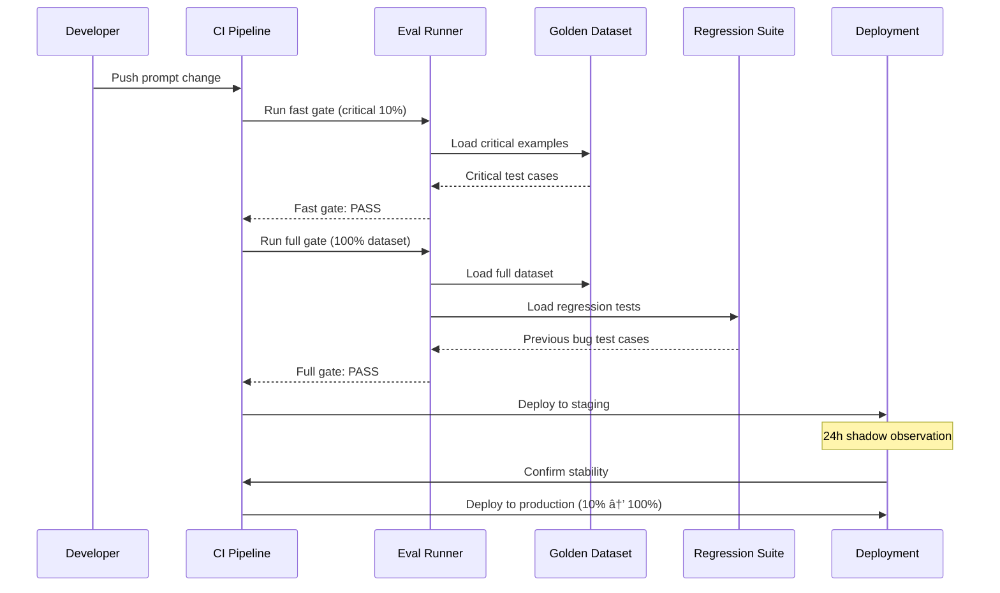

# Evaluation

> **Purpose:** Define the AI evaluation framework for Vaeloom
> **Status:** ✅ Upgraded to enterprise quality
> **Owner:** AI Team
> **Last Updated:** 2026-07-13
> **Canonical source:** [`/Docs/Engineering/Implementation/10-evaluation-framework.md`](../../Docs/Engineering/Implementation/10-evaluation-framework.md)

## Overview

The AI evaluation framework is Vaeloom's quality gate for every agent prompt change — ensuring that prompt updates improve or maintain accuracy before reaching production. Each agent has a golden dataset of labeled examples, edge case tests, and regression tests that must pass before deployment proceeds through CI gates at PR → staging → production. Without rigorous evaluation, prompt changes risk silent regressions that degrade user experience.

This document defines the evaluation pipeline, per-agent accuracy targets, golden dataset management, CI gate configuration, and monitor-phase regression detection. It serves AI engineers who author prompts, platform engineers who maintain the CI pipeline, and QA engineers who audit evaluation results. The framework is designed to grow monotonically — every production edge case adds a test case that protects against future regressions.

## Goals

- Achieve >95% extraction accuracy across all agents as measured against curated golden datasets
- Block any prompt change that degrades accuracy by more than 2% through automated CI gates at PR, staging, and production
- Maintain a growing regression test suite where every bug fix adds a permanent test case
- Keep full eval suite runtime under 30 minutes through parallel execution and tiered gate design
- Enable quarterly dataset refresh from production samples to prevent golden dataset drift

---

## Evaluation Pipeline

```mermaid
graph TD
    classDef test fill:#e3f2fd,stroke:#1565c0,color:#000,stroke-width:1.5px
    classDef gate fill:#e8f5e9,stroke:#2e7d32,color:#000,stroke-width:1.5px
    classDef deploy fill:#fff3e0,stroke:#e65100,color:#000,stroke-width:1.5px
    classDef monitor fill:#f3e5f5,stroke:#6a1b9a,color:#000,stroke-width:1px

    subgraph Test["🧪 Test Phase"]
        direction TB
        T1["Golden Dataset<br/>10-500 examples per agent"]
        T2["Edge Cases<br/>Empty, ambiguous, adversarial"]
        T3["Regression Tests<br/>Previously-fixed issues"]
        T4["Run evals<br/><code>python -m eval.run_all</code>"]
    end

    subgraph Gate["🚦 CI Gate Phase"]
        direction TB
        G1["PR Gate<br/>Unit + Integration tests"]
        G2["Staging Gate<br/>All evals must pass"]
        G3["Production Gate<br/>All evals + regression check"]
    end

    subgraph Deploy["🚀 Deploy Phase"]
        direction TB
        D1["Deploy to staging<br/>with eval report"]
        D2["Shadow deploy to prod<br/>compare vs baseline"]
        D3["Full production rollout<br/>monitor accuracy"]
    end

    subgraph Monitor["📊 Monitor Phase"]
        direction TB
        M1["Track accuracy<br/>release over release"]
        M2["Flag regressions<br/>auto-revert if drop > 2%"]
        M3["Update golden dataset<br/>with new edge cases"]
    end

    T1 & T2 & T3 --> T4
    T4 --> G1
    G1 -->|Pass| G2
    G1 -->|Fail| T4
    G2 -->|Pass| G3
    G2 -->|Fail| T4
    G3 -->|Pass| D1
    G3 -->|Fail| T4
    D1 --> D2 --> D3
    D3 --> M1 --> M2
    M2 -->|Revert| T4
    M2 -->|Stable| M3
    M3 -.->|Update dataset| T1 & T2 & T3

    class T1,T2,T3,T4 test
    class G1,G2,G3 gate
    class D1,D2,D3 deploy
    class M1,M2,M3 monitor

```



> **Diagram:** The evaluation pipeline flows through four phases. **Test** runs golden datasets, edge cases, and regressions. **CI Gates** block at PR → Staging → Production, with failures looping back to testing. **Deploy** rolls out progressively through staging shadow to full production. **Monitor** tracks accuracy over time and auto-reverts if metrics drop more than 2%. The golden dataset is continuously updated with new edge cases discovered in production.

---

## Evaluation Framework

Every agent has associated evaluation tests that must pass before deployment.

## Evals by Agent

| Agent | Metric | Target | Golden Dataset Size |
|-------|--------|--------|-------------------|
| Memory Agent | Extraction accuracy | > 95% | 100 documents |
| Memory Agent | Merge precision | > 99% | 50 entity pairs |
| Organization Agent | Name proposal accuracy | > 90% | 200 files |
| Organization Agent | Category suggestion accuracy | > 85% | 200 files |
| Resume Agent | Content accuracy | > 95% | 50 profiles |
| ATS Agent | Score correlation | > 0.9 | 30 JDs |
| Job Search Agent | Ranking relevance | > 80% | 100 job pairs |
| Gmail Agent | Classification accuracy | > 95% | 500 emails |

## Common Mistakes

| Mistake | Why It's a Problem |
|---------|-------------------|
| Creating golden datasets that only cover happy paths | A golden dataset with only well-formed, unambiguous inputs trains no resistance to edge cases — the model passes eval but fails in production on the first unexpected input |
| Using the same eval dataset for prompt iteration without expanding it | Iterating a prompt against the same 50 examples makes the prompt overly specialized to those examples — every round of iteration should add new test cases discovered from production edge cases |
| No regression test suite for previously-fixed bugs | A bug that was fixed in v2 of a prompt can silently reappear in v4 if there's no regression test that catches it — every bug fix must include a corresponding regression test |
| Automatically passing the CI gate when eval scores are borderline | A prompt scoring 90.5% against a 90% threshold should be reviewed, not auto-approved — borderline passes hide gradual quality degradation over multiple releases |

## Best Practices

| Practice | Rationale |
|----------|-----------|
| Build golden datasets with 30% edge cases, 10% adversarial inputs | A robust eval suite includes ambiguous inputs, empty inputs, contradictory data, and intentionally adversarial prompts — not just ideal document examples |
| Expand the eval dataset with every production edge case discovered | When an agent produces a wrong answer in production, add that input-output pair to the eval dataset — the dataset should grow monotonically over time |
| Maintain a regression test suite that must pass before any prompt deploy | Each bug fix or production incident adds a regression test case — a prompt version that fails a regression test cannot be deployed, no matter its score on the golden dataset |
| Require manual review for any eval score within 2% of the threshold | Scores in the 88-92% range for a 90% threshold need human judgment — the reviewer decides whether the score reflects genuine quality or dataset bias |

## Security

| Concern | Mitigation |
|---------|------------|
| Eval data leaking user information | Golden datasets created from real user data must be anonymized — remove PII, workspace IDs, and identifying details before adding to the eval suite |
| Adversarial test cases revealing system vulnerabilities | Eval datasets containing adversarial prompts that successfully bypass guardrails are sensitive — access to these datasets should be restricted to the engineering and security teams |
| Eval score drift masking model degradation | A prompt that passes eval today but shows declining scores over time may indicate model drift or data distribution changes — monitor eval score trends, not just pass/fail status |

## Performance

| Concern | Guideline |
|---------|-----------|
| Eval suite runtime | Running 500+ golden dataset evaluations against an LLM API can take 10+ minutes — optimize eval run time by parallelizing independent tests and caching identical prompt evaluations |
| CI gate eval timeout | Eval suites that run as CI gates must complete within the CI pipeline's timeout (typically 30 minutes) — split the full eval suite into a fast CI gate (critical paths only) and a comprehensive nightly run |
| Eval dataset size management | Golden datasets that grow to 1000+ examples slow down evaluation — periodically prune low-value test cases (those that have never failed across 10+ prompt versions) to keep eval runtime manageable |

## Scope

This document defines the AI evaluation framework for Vaeloom — covering golden datasets, CI gates, deployment verification, and monitor-phase regression detection. It applies to all agents (MVP: 8 agents, Enterprise: 28 agents) and all prompt versions deployed to any environment. Out of scope: prompt structure standards (see [Prompt-Standards.md](./Prompt-Standards.md)), prompt engineering lifecycle (see [Prompt-Engineering.md](./Prompt-Engineering.md)).

---

## Components

| Component | Responsibility | Technology | Scale Strategy |
|-----------|---------------|------------|----------------|
| Golden Dataset Manager | Curate and version labeled test examples | JSONL files committed to repo | Partition by agent; 500+ examples per agent at scale |
| Eval Runner | Execute prompts against golden datasets | Python (`python -m eval.run_all`) | Parallel agent evaluation across runners |
| Regression Test Suite | Store and run previously-fixed bug tests | Automated per-agent test cases | Grows monotonically with each bug fix |
| CI Gate Validator | Block PR/staging/production based on eval scores | CI pipeline (GitHub Actions) | Tiered gates: fast CI (critical) + nightly (full) |
| Score Tracker | Track accuracy trends across releases | Time-series database (Prometheus) | Release-over-release comparison dashboard |

---

## Workflows

### 1. Eval Execution Workflow

1. Developer iterates on prompt in local environment
2. Run golden dataset: `python -m eval.run_all --agent <agent_name>`
3. Review per-example scores: accuracy, schema compliance, latency
4. If metrics meet thresholds: commit prompt + eval results
5. If metrics below threshold: revise prompt, re-run evals

### 2. CI Gate Workflow

1. PR created → fast gate runs critical-path evals (10% of dataset)
2. PR merged to staging → staging gate runs all evals (100% of dataset)
3. Deployment to production → production gate runs full evals + regression check
4. Any gate failure: block deployment, notify team, link to eval report

### 3. Regression Detection Workflow

1. Production prompt version tagged with eval result snapshot
2. New prompt version compared against previous snapshot
3. If accuracy drops >2%: auto-revert to previous version
4. Regression test added for the failing scenario

---

## Sequence Diagrams



> **Diagram:** The eval CI pipeline showing fast gate (critical 10%) → full gate (100% + regression) → staging deploy → production rollout. Any failure at any gate blocks deployment.

---

## Data Flow

```text
Prompt Change → Fast Gate (10% critical dataset)
    → Full Gate (100% dataset + regression suite)
    → Staging Shadow Deploy (24h)
    → Production Deploy (10% → 50% → 100%)
    → Monitor Phase (release-over-release accuracy)
    → Regression Detection (auto-revert if drop > 2%)
```

**Data flow description:** Each prompt change flows through escalating validation gates. The monitor phase continuously compares accuracy metrics, auto-reverting if regression exceeds 2%.

---

## APIs

| Endpoint | Method | Purpose | Auth |
|----------|--------|---------|------|
| `/api/v1/eval/run` | POST | Trigger eval run for specific agent | CI token |
| `/api/v1/eval/results/{run_id}` | GET | Retrieve eval results for a run | Service token |
| `/api/v1/eval/dataset/{agent}` | GET | Download golden dataset for review | Developer token |
| `/api/v1/eval/regression/{agent}` | GET | Get regression history for agent | Service token |

---

## Database

| Table | Purpose | Key Columns | Indexes |
|-------|---------|-------------|---------|
| `eval_runs` | Record each eval execution | `id`, `agent_name`, `prompt_version`, `accuracy`, `dataset_size`, `created_at` | `(agent_name, created_at)` |
| `eval_results` | Per-example scores from each run | `run_id`, `example_id`, `passed`, `score`, `latency_ms` | `(run_id)` |
| `regression_tests` | Previously-fixed bugs as test cases | `id`, `agent_name`, `description`, `input`, `expected_output`, `fixed_in_version` | `(agent_name)` |

---

## Scalability

| Dimension | Current Limit | 10x Strategy | 100x Strategy |
|-----------|--------------|--------------|---------------|
| Dataset size per agent | 500 examples | 5000 with stratified sampling | 50K with automated generation |
| Eval runtime (full suite) | 30 min | Parallel agent eval across runners | Distributed eval cluster |
| CI gate eval time | 10 min (fast) + 20 min (full) | Incremental eval (only changed prompts) | Parallel CI runners per agent |
| Regression suite size | 100 tests | 1000 tests with dedup | Automated regression generation |

---

## Error Handling

| Scenario | Detection | Mitigation | Recovery |
|----------|-----------|------------|----------|
| Eval runner timeout | CI pipeline timeout at 30 min | Fast gate completes within 5 min; full suite splits into parallel shards | Re-run failed shard only |
| Golden dataset corrupted | Schema validation fails on load | Load from git LFS with checksum verification | Restore from previous commit |
| API rate limit during eval | 429 response from LLM provider | Built-in retry with exponential backoff | Re-queue failed examples |
| Score drift (gradual decline) | Accuracy trending down over 3+ releases | Auto-revert if drop >2%; notify team | Investigate prompt vs model drift |

---

## Monitoring

| Metric | Alert Threshold | Severity | Dashboard |
|--------|----------------|----------|-----------|
| Accuracy per agent | < 90% | Critical | Eval Dashboard |
| Regression detection rate | > 0 regressions/run (any) | Warning | Regression Tracker |
| Eval suite runtime | > 30 min | Warning | CI Pipeline |
| Golden dataset size change | > 10% change in dataset size | Info | Dataset Manager |
| Fast gate pass rate | < 95% of PRs | Info | CI Health |

---

## Deployment

| Environment | Method | Trigger | Verification |
|-------------|--------|---------|-------------|
| Development | Local eval runner | Developer command | Manual score review |
| Staging | CI pipeline | PR merge | Full gold dataset + regression |
| Production (canary) | Progressive deploy | Manual approval | Shadow compare vs baseline |
| Production (full) | Full rollout | 24h canary pass | All evals + regression pass |

---

## Configuration

| Variable | Purpose | Default | Required |
|----------|---------|---------|----------|
| `EVAL_FAST_GATE_FRACTION` | Fraction of dataset for fast gate | 0.10 | No |
| `EVAL_ACCURACY_THRESHOLD` | Minimum accuracy to pass gate | 0.90 | Yes |
| `EVAL_REGRESSION_THRESHOLD` | Max accuracy drop before revert | 0.02 | Yes |
| `EVAL_MAX_RUNTIME_MINUTES` | Eval suite max runtime | 30 | Yes |
| `EVAL_AUTO_REVERT_ENABLED` | Enable auto-revert on regression | true | No |

---

## Examples

### Example 1: Running Agent Evals

```bash
# Run fast gate for specific agent
python -m eval.run_all --agent memory_agent --mode fast

# Run full eval suite with report
python -m eval.run_all --agent memory_agent --mode full --report eval_report.json

# Compare against baseline
python -m eval.compare --baseline v1.2.0 --candidate v1.3.0
```

---

## Best Practices (Refreshed)

| Practice | Rationale | Enforcement |
|----------|-----------|-------------|
| Build golden datasets with 30% edge cases, 10% adversarial | Robust eval includes ambiguous and adversarial inputs, not just happy paths | Automated check in eval runner |
| Expand eval dataset with every production edge case | Each production incident adds a test case — dataset grows monotonically | PR template includes eval dataset update checkbox |
| Require manual review for scores within 2% of threshold | Borderline passes hide gradual quality degradation | Eval report flags borderline passes for human review |
| Pin model versions for reproducible eval | Model provider changes can shift scores — pin prevents false regression | Model version pinned in eval config |

---

## Risks

| Risk | Likelihood | Impact | Mitigation |
|------|------------|--------|------------|
| Golden dataset becomes stale (doesn't reflect real queries) | Medium | High | Quarterly dataset refresh with production sample; monitor coverage |
| Eval scores drift due to model provider changes | Medium | High | Pin model versions for eval; run regression on model upgrade |
| Regression test bloat slows CI | High | Medium | Prune tests that haven't failed in 10+ runs annually |
| Manual review threshold (2% band) introduces bias | Low | Medium | Reviewers randomized; criteria documented in review checklist |

---

## Limitations

| Limitation | Impact | Workaround | Future Resolution |
|------------|--------|------------|-------------------|
| Eval dataset requires manual curation | Scales linearly with agent count | Community-contributed edge cases | Automated golden dataset generation from production logs (Phase 2) |
| No adversarial robustness testing | Prompt may fail against crafted inputs | Manual injection testing | Automated adversarial eval suite (Phase 3) |
| Eval runtime increases with dataset size | Slows CI pipeline | Fast gate (10%) for PRs | Incremental eval (Phase 2) |
| No cross-agent integration eval | Agent interactions untested | Manual integration testing | Multi-agent eval scenarios (Phase 4) |

---

## Future Improvements

| Improvement | Priority | Complexity | Timeline |
|-------------|----------|------------|----------|
| Automated golden dataset generation from production logs | High | High | Phase 2 (Q4 2026) |
| Incremental eval — only test changed prompts | High | Medium | Phase 2 (Q4 2026) |
| Adversarial eval suite for prompt injection testing | Medium | High | Phase 3 (Q1 2027) |
| Multi-agent integration eval scenarios | Low | High | Phase 4 (Q2 2027) |
| Continuous eval in production (shadow scoring) | Medium | Medium | Phase 3 (Q1 2027) |

## Related Documents

- [Prompt Standards.md](./Prompt-Standards.md)
- [Prompt Engineering.md](./Prompt-Engineering.md)
- [Agentic RAG.md](./Agentic-RAG.md)
