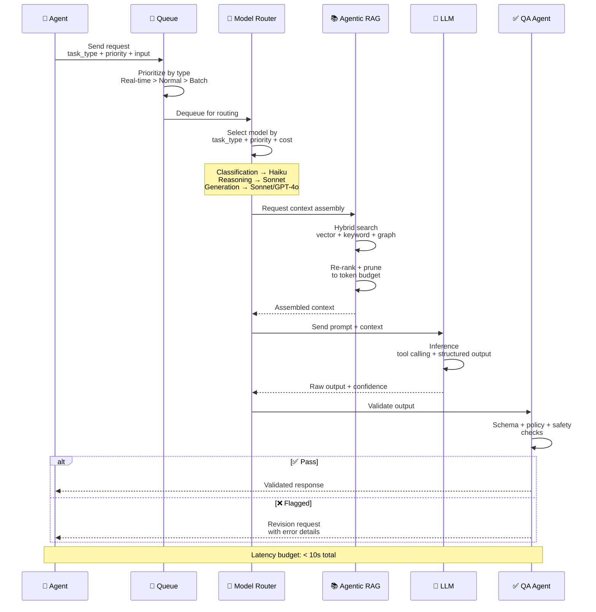
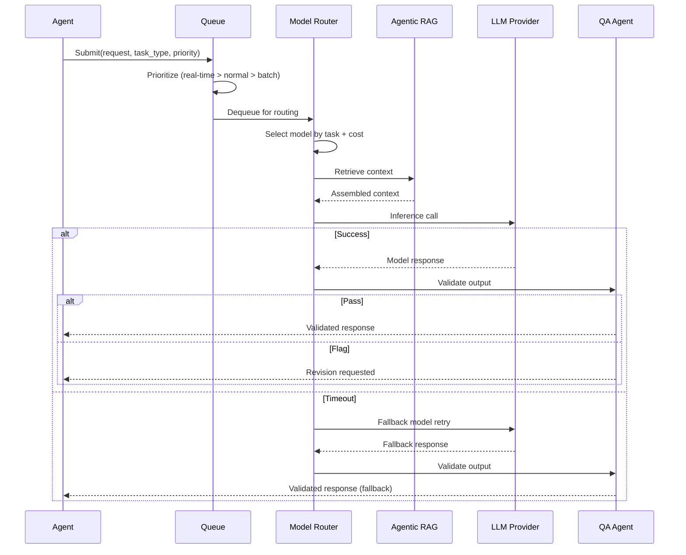

# Inference Pipeline

> **Purpose:** Define the AI inference pipeline for Meridian
> **Status:** ✅ Upgraded to enterprise quality
> **Owner:** AI Team
> **Last Updated:** 2026-07-13

## Overview

The inference pipeline is the end-to-end execution path for every AI agent request in Meridian — from the moment an agent submits a request through queue prioritization, model routing, context assembly, LLM inference, output validation, and final response delivery. The pipeline processes requests through three priority tiers (real-time, normal, batch) and operates within a strict 10-second total latency budget. Every stage has a hard timeout with automatic fallback to the next stage.

This document defines the seven pipeline stages, latency budgets per stage, degraded mode operation, and the request lifecycle from submission to validated response. It is intended for platform engineers operating the inference service, AI engineers optimizing pipeline performance, and SRE teams monitoring pipeline health. The pipeline is designed for graceful degradation — if any stage fails, the system falls back to alternative models or returns partial results rather than failing entirely.

## Goals

- Process all agent inference requests through a 7-stage pipeline within a 10-second total latency budget
- Prioritize requests across three tiers (real-time > normal > batch) to protect interactive user experiences
- Maintain 99.9% pipeline availability through automatic fallback chains and multi-provider model routing
- Keep per-stage latency within budget: Queue < 100ms, Context Assembly < 2s, Inference < 5s, Validation < 1s
- Enable degraded mode operation where the pipeline continues with reduced capability when primary models are unavailable

---

## Pipeline Stages



> **Diagram:** The inference pipeline flows through 7 stages. **Queue** prioritizes by type. **Model Router** selects the optimal model per task. **Agentic RAG** retrieves and prunes context. **LLM** performs inference. **QA Agent** validates before delivery. Total latency budget: under 10 seconds.

## Detailed Flow

### 1. Request

Agent sends request with task type, priority, and input data.

### 2. Queue

Requests are queued by priority:

- Real-time: Chat, user-facing agent actions
- Normal: Document processing, memory extraction
- Batch: Periodic agent passes, consolidation

### 3. Model Selection

Model Router selects the appropriate model based on:

- Task type (classification → Haiku, reasoning → Sonnet)
- Priority (real-time gets faster model)
- Cost budget (per-agent monthly allocation)

### 4. Context Assembly

Agentic RAG retrieves relevant context:

- Vector search for semantic relevance
- Keyword search for exact matches
- Graph traversal for relationship context
- Results re-ranked and pruned to context budget

### 5. Inference

Model processes the prompt with assembled context:

- Tool calling for external actions
- Structured output generation
- Confidence scoring

### 6. Output Validation

QA Agent validates output before delivery:

- Schema conformance
- Policy compliance
- Content safety

### 7. Response

Validated output returned to agent or user.

## Latency Budgets

| Stage | Budget | Cumulative |
|-------|--------|------------|
| Queue | < 100ms | < 100ms |
| Context Assembly | < 2s | < 2.1s |
| Inference | < 5s | < 7.1s |
| Validation | < 1s | < 8.1s |
| Total | < 10s | < 10s |

## Common Mistakes

| Mistake | Why It's a Problem |
|---------|-------------------|
| No timeout on the inference stage | A model that hangs or produces an excessively long response blocks the entire pipeline — every stage must have a hard timeout with a fallback path |
| Overfilling the context budget with retrieved documents | Retrieving 50 documents when only 5 are relevant wastes tokens, increases latency, and dilutes signal — the model's attention scatters across irrelevant content |
| Treating all requests with the same queue priority | A user waiting for a chat response should not wait behind a batch document ingestion job — priority queues prevent interactive requests from being queued behind batch work |
| No output validation for structured responses | A model that returns malformed JSON or an invalid schema forces the agent to retry or fail — validate the output format before passing it to the caller |

## Best Practices

| Practice | Rationale |
|----------|-----------|
| Set hard timeouts per pipeline stage with automatic fallback | Queue 100ms, context assembly 2s, inference 5s, validation 1s — if a stage times out, escalate to the next stage or return a graceful error |
| Prune retrieved context to the top 5-10 most relevant items | Hybrid search returns many results; prune aggressively to the items with the highest combined relevance + freshness + importance scores before sending to the model |
| Use priority queues with interactive > normal > batch tiers | Real-time user requests preempt scheduled agent passes and background ingestion — prevents a bulk job from degrading the interactive experience |
| Validate structured outputs against the expected JSON schema before returning | If the model returns invalid JSON or missing required fields, retry with a stricter prompt rather than propagating malformed data downstream |

## Security

| Concern | Mitigation |
|---------|------------|
| Context assembly including unauthorized documents | The retrieval layer must respect permission scopes — a context assembly query should never return documents the requesting agent does not have permission to read |
| Model prompt injection via retrieved context | If a retrieved document contains prompt injection content, it can influence the model's behavior — sanitize retrieved text for known injection patterns before inserting into the prompt |
| Queue priority manipulation | The queue priority field should be set by the caller's identity and task type, not by the request payload — a user should not be able to manually set their request to "high" priority |

## Performance

| Concern | Guideline |
|---------|-----------|
| Context assembly as the primary latency bottleneck | Hybrid search across vector + keyword + graph stores can take 1-2s — optimize by running the three searches in parallel and combining results rather than sequentially |
| Inference stage dominating the total latency budget | At 5s, inference is 50%+ of the total <10s budget; cache identical queries, use shorter context for simple tasks, and consider streaming partial results for chat interactions |
| Queue backpressure under high load | When all worker threads are busy, incoming requests pile up — implement a circuit breaker that returns a "Service busy, retry after N seconds" response rather than queuing indefinitely |

## Scope

This document defines the AI inference pipeline for Meridian — covering queue prioritization, model routing, context assembly, inference execution, output validation, and latency budgets. Applies to all agent inference requests across MVP and Enterprise deployments. Out of scope: model selection criteria (see [Model-Routing.md](./Model-Routing.md)), guardrail details (see [Guardrails.md](./Guardrails.md)), context retrieval specifics (see [Agentic-RAG.md](./Agentic-RAG.md)).

---

## Components

| Component | Responsibility | Technology | Scale Strategy |
|-----------|---------------|------------|----------------|
| Request Queue | Prioritize and buffer inference requests | Redis + BullMQ | Priority tiers: interactive > normal > batch |
| Model Router | Select optimal model per task type + cost + latency | Python/Node.js service | Stateless; horizontal scaling |
| Agentic RAG Client | Retrieve and assemble context | Python async client | Parallel search across stores |
| LLM Gateway | Execute inference call with timeout + retry | HTTP client with circuit breaker | Connection pooling per provider |
| QA Client | Validate output before delivery | Claude Haiku API call | Dedicated rate limit pool |

---

## Workflows

### 1. Standard Inference Workflow

1. Agent sends request with (`task_type`, `priority`, `input`)
2. Queue prioritizes: real-time > normal > batch
3. Model Router selects model by task type + cost budget
4. Agentic RAG assembles context from memory stores
5. LLM Gateway sends prompt + context to selected model
6. QA Client validates output (schema, policy, safety)
7. Validated response returned to agent

### 2. Degraded Mode Workflow

1. Primary model unavailable or times out
2. Model Router checks fallback chain
3. Falls back to next model in chain (e.g., Sonnet → GPT-4o)
4. If all models fail: queue for retry with exponential backoff
5. Notify agent to enter degraded mode (suggest-only, no autonomous actions)

---

## Data Flow

```text
Agent Request → Queue (Prioritize: interactive > normal > batch)
    → Model Router (Select model by task type + cost)
    → Agentic RAG (Context assembly: vector + keyword + graph)
    → LLM Gateway (Inference with timeout + auto-retry)
    → QA Client (Validate: schema + policy + safety)
    → Validated Response → Agent
```

**Data flow description:** Requests flow through priority queue, model selection, context assembly, inference, and output validation. The total latency budget is 10 seconds across all stages.

---

## APIs

| Endpoint | Method | Purpose | Auth |
|----------|--------|---------|------|
| `/api/v1/inference/complete` | POST | Submit inference request (full pipeline) | Agent token |
| `/api/v1/inference/stream` | POST | Submit streaming inference request | Agent token |
| `/api/v1/inference/status/{request_id}` | GET | Check request status | Service token |
| `/api/v1/inference/queue/depth` | GET | Get current queue depth per priority | Monitoring token |

---

## Database

| Table | Purpose | Key Columns | Indexes |
|-------|---------|-------------|---------|
| `inference_requests` | Record all inference requests | `id`, `agent_name`, `model`, `status`, `latency_ms`, `created_at` | `(status, created_at)`, `(agent_name)` |
| `inference_failures` | Track failures for alerting | `id`, `request_id`, `failure_type`, `model`, `error_message` | `(failure_type, created_at)` |
| `inference_cache` | Cache similar query results | `query_hash`, `workspace_id`, `response_json`, `ttl_expires` | `(query_hash, workspace_id)` |

---

## Scalability

| Dimension | Current Limit | 10x Strategy | 100x Strategy |
|-----------|--------------|--------------|---------------|
| Inference throughput | 100 req/s per service instance | Horizontal scaling + connection pooling | Regional inference clusters with local model caching |
| Queue depth capacity | 10K in Redis single instance | Redis Cluster; priority tiers get dedicated queues | Distributed queue with back-pressure |
| LLM API rate limits | 500 RPM per API key | Multiple keys with round-robin | Self-hosted models for common tasks |

---

## Error Handling

| Scenario | Detection | Mitigation | Recovery |
|----------|-----------|------------|----------|
| Model timeout | Stage timeout exceeded | Route to fallback model in chain | Log failure, try next fallback |
| Context assembly fails | No results from any store | Return empty context with warning | Agent decides: proceed without context or ask user |
| Queue backpressure | Queue depth > threshold | Return "service busy" with retry-after header | Auto-scale workers when queue > 50% capacity |
| LLM returns invalid JSON | Schema validation fails | Retry once with stricter prompt; if still fails, return error | Log schema failure for prompt improvement |

---

## Monitoring

| Metric | Alert Threshold | Severity | Dashboard |
|--------|----------------|----------|-----------|
| Total inference latency | p95 > 10s | Critical | Inference Pipeline |
| Per-stage latency (context) | p95 > 2s | Warning | Inference Stages |
| Per-stage latency (inference) | p95 > 5s | Critical | Inference Stages |
| Model failure rate | > 5% of requests | Critical | Model Health |
| Queue depth (interactive) | > 100 pending | Warning | Queue Status |
| Cache hit rate | < 10% | Info | Inference Cache |

---

## Deployment

| Environment | Method | Trigger | Verification |
|-------------|--------|---------|-------------|
| Development | Docker Compose | Code push | Unit + integration tests |
| Staging | Helm chart to k8s | PR merge | Pipeline smoke test with latency budget check |
| Production | Progressive rollout | Manual approval | Shadow mode compare vs baseline latency |

---

## Configuration

| Variable | Purpose | Default | Required |
|----------|---------|---------|----------|
| `INFERENCE_TIMEOUT_MS` | Total pipeline timeout | 10000 | Yes |
| `INFERENCE_MAX_RETRIES` | Max fallback retries | 2 | Yes |
| `QUEUE_PRIORITY_TIERS` | Comma-separated priority list | interactive,normal,batch | Yes |
| `CONTEXT_ASSEMBLY_TIMEOUT_MS` | Context assembly timeout | 2000 | Yes |
| `QA_ENABLED` | Enable QA validation | true | No |

---

## Examples

### Example 1: Inference Request

```python
# Submit inference request
response = await inference_client.complete(
    agent_name="memory_agent",
    task_type="extraction",
    priority="normal",
    input={"document": "..."}
)
# Response: { "action": "extract", "entities": [...], "confidence": 0.95 }
```

---

## Sequence Diagrams



> **Diagram:** Full inference pipeline flow — queue prioritization, model routing, context assembly, LLM inference with fallback, and QA validation before delivery to the requesting agent.

---

## Risks

| Risk | Likelihood | Impact | Mitigation |
|------|------------|--------|------------|
| LLM provider outage | Low | Critical | Multi-provider fallback chain; cached responses for common queries |
| Queue backpressure under load spike | Medium | Medium | Auto-scaling workers; priority queue protects interactive requests |
| Context assembly timeout blocking pipeline | Medium | High | Parallel store queries with per-store timeout; continue with partial results |
| Cost overrun from runaway agent | Low | High | Per-agent daily budget; cost spike alerts |

---

## Limitations

| Limitation | Impact | Workaround | Future Resolution |
|------------|--------|------------|-------------------|
| 10s total latency budget insufficient for complex tasks | Multi-step reasoning + large context exceeds budget | Batch tasks get 30s budget; interactive capped at 10s | Adaptive timeout based on task complexity (Phase 2) |
| No streaming for long responses | User waits for complete response | Chat agents use streaming endpoint | Full streaming support for all agent types (Phase 2) |
| Single-provider dependency for primary models | Provider outage affects all agents | Fallback to alternate provider | Multi-provider active-active routing (Phase 3) |

---

## Future Improvements

| Improvement | Priority | Complexity | Timeline |
|-------------|----------|------------|----------|
| Adaptive timeout per task complexity | High | Medium | Phase 2 (Q4 2026) |
| Full streaming support for all agent types | High | Medium | Phase 2 (Q4 2026) |
| Multi-provider active-active model routing | Medium | High | Phase 3 (Q1 2027) |
| Request deduplication for identical concurrent queries | Low | Medium | Phase 3 (Q1 2027) |

## Related Documents

- [LLM Architecture.md](./LLM-Architecture.md)
- [Model Routing.md](./Model-Routing.md)
- [Guardrails.md](./Guardrails.md)
