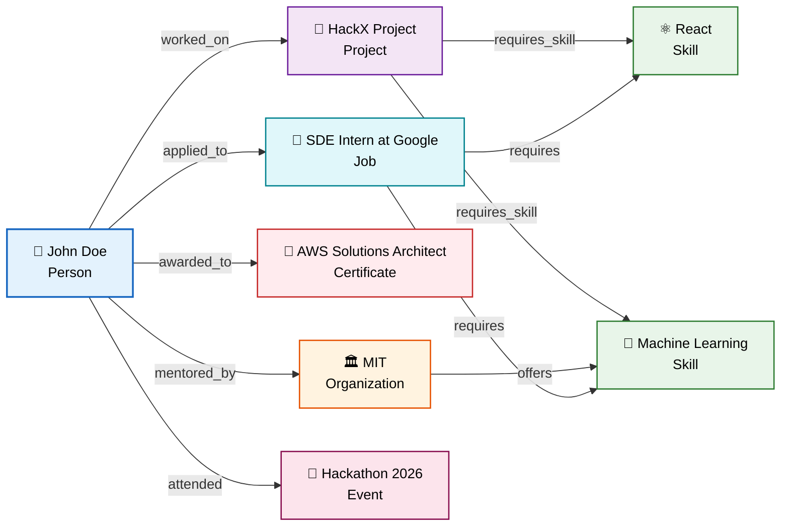
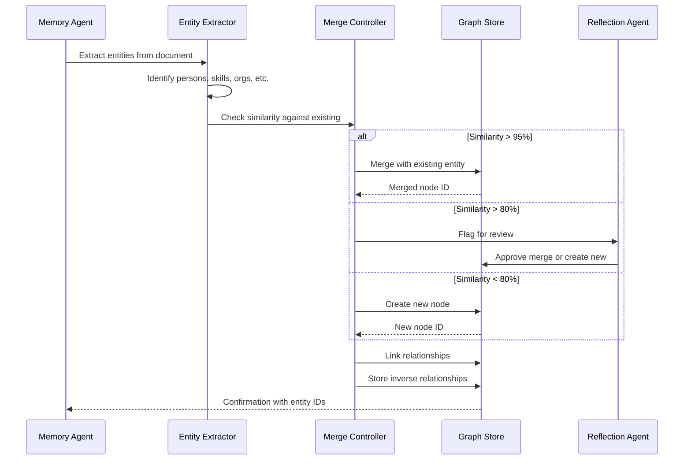

# Knowledge Graph

> **Purpose:** Define the knowledge graph architecture for Vaeloom
> **Status:** ✅ Upgraded to enterprise quality
> **Owner:** AI Team
> **Last Updated:** 2026-07-13
> **Canonical source:** [`/docs/04-memory-knowledge-graph.md`](../../docs/04-memory-knowledge-graph.md)

## Overview

The knowledge graph is Vaeloom's structured representation of entities and the relationships between them — connecting people, skills, organizations, projects, certificates, and events into a traversable network that enables relationship-aware retrieval. Unlike flat vector search that finds semantically similar content, the knowledge graph answers relationship questions: "What skills does this person have?", "Which projects required React?", "Who worked with whom on what?"

This document defines the entity types, relationship types, merge strategy, graph traversal patterns, and storage architecture (Apache AGE for MVP, Neo4j for Enterprise). It is intended for AI engineers building entity extraction pipelines, backend engineers implementing graph queries, and data engineers planning the migration to dedicated graph infrastructure. The merge strategy — auto-merge above 95% similarity, flag for review above 80%, create new below 80% — balances automation with safety.

## Goals

- Support eight entity types (Person, Skill, Project, Organization, Certificate, Event, Job, Course) with typed relationships
- Achieve >95% precision in entity merge decisions through similarity-based auto-merge with confidence thresholds
- Maintain sub-2-second graph traversal latency for queries up to 3-4 hops depth
- Store inverse relationships bidirectionally for efficient graph traversal in both directions
- Enforce strict workspace_id isolation on all graph operations to prevent cross-tenant entity linking

---

## Entity & Relationship Graph



> **Diagram:** Example knowledge graph showing entities and their relationships. **John Doe** is the central person, connected to skills (React, ML), projects (HackX), organizations (MIT), certificates (AWS), jobs (Google), and events (Hackathon). Entity types are color-coded for visual scanning.

---

## Entity Types

| Entity | Description | Example |
|--------|-------------|---------|
| `Person` | User or contact | "John Doe" |
| `Skill` | Competency | "React", "Machine Learning" |
| `Project` | Work product | "HackX Project" |
| `Organization` | Institution or company | "MIT", "Google" |
| `Certificate` | Credential | "AWS Solutions Architect" |
| `Event` | Dated occurrence | "Hackathon 2026" |
| `Job` | Role or position | "SDE Intern at Google" |
| `Course` | Educational unit | "CS 229 Machine Learning" |

## Relationship Types

| Relationship | From | To | Example |
|-------------|------|----|---------|
| `worked_on` | Person | Project | John → HackX |
| `awarded_to` | Certificate | Person | AWS Cert → John |
| `requires_skill` | Project | Skill | HackX → React |
| `applied_to` | Person | Job | John → Google Intern |
| `mentored_by` | Person | Person | John → Prof. Smith |

## Merge Strategy

When the Memory Agent encounters a new entity:

1. Check similarity against existing entities (embedding + string + graph context)
2. If similarity > 95%: auto-merge
3. If similarity > 80%: flag for reflection agent review
4. If similarity < 80%: create new, unmerged node

## Common Mistakes

| Mistake | Why It's a Problem |
|---------|-------------------|
| Creating duplicate entities for the same real-world thing | Five nodes for "React," "React.js," and "ReactJS" fragment the graph — relationships attached to one alias don't surface for the others |
| Over-merging distinct entities with similar names | Merging two different projects with similar names corrupts both records — a missed merge is fixable; a wrong merge requires manual graph surgery |
| Allowing unbounded graph growth without consolidation | Every file and email added creates new nodes; without periodic compression, query performance degrades and the graph becomes noise |
| Storing only relationships in one direction | A `worked_on` relationship without an inverse (`involves`) makes graph traversal queries one-directional and limits the questions the graph can answer |

## Best Practices

| Practice | Rationale |
|----------|-----------|
| Always store inverse relationships with every edge | If Entity A `worked_on` Entity B, also store that B `involves` A — enables bidirectional graph traversal without runtime reverse-lookup |
| Use similarity thresholds with confidence bands for merges | Auto-merge above 95%, flag for review above 80%, create new below 80% — this balances automation with safety |
| Run graph consolidation on a periodic schedule (weekly) | Dense subgraphs (same entity with minor name variations) should be merged periodically rather than on every write — reduces fragmentation over time |
| Tag every node with `workspace_id` from creation | Tenant-scoped queries are the most common access pattern — without workspace tagging, cross-tenant data leakage becomes a structural risk |

## Security

| Concern | Mitigation |
|---------|------------|
| Relationship inference revealing private information | Graph edges between entities can reveal sensitive connections (e.g., "applied_to Job → rejected") — ensure graph traversal queries respect the same permission scope as document-level access |
| Entity merging accidentally linking unrelated users | Merge logic must never cross `workspace_id` boundaries — entities from different workspaces share no `workspace_id` and should never be merge candidates |
| Graph export containing inferred relationships | Exporting the full knowledge graph could reveal relationship patterns the user did not explicitly create; provide a filtered export option that omits inferred edges |

## Performance

| Concern | Guideline |
|---------|-----------|
| Graph traversal depth limiting | Limit graph traversal to 3-4 hops maximum — beyond that, the search space grows exponentially (a node with 10 connections at each depth produces 10,000 nodes at depth 4) |
| AGE graph query optimization for MVP | Apache AGE queries over PostgreSQL can be slow for complex Cypher patterns; index entity IDs and relationship types that are most commonly traversed |
| Periodic index rebuild on the graph store | As the graph grows, query plans for common traversal patterns become suboptimal — rebuild indexes monthly or when node count increases by 25%+ |

## Scope

This document defines the knowledge graph architecture for Vaeloom — covering entity types, relationship types, merge strategies, graph traversal patterns, and storage architecture. Applies to all user workspaces across MVP (AGE on PostgreSQL) and Enterprise (Neo4j) deployments. Out of scope: embedding generation (see [Embeddings.md](./Embeddings.md)), memory lifecycle (see [Memory.md](./Memory.md)), retrieval strategy selection (see [Agentic-RAG.md](./Agentic-RAG.md)).

---

## Components

| Component | Responsibility | Technology | Scale Strategy |
|-----------|---------------|------------|----------------|
| Entity Extractor | Identify entities from documents and memory records | Memory Agent → structured extraction | Parallel extraction per document |
| Relationship Linker | Create typed edges between entities | Memory Agent → graph write | Batch relationship writes |
| Graph Store (MVP) | Store and query entity nodes + relationships | Apache AGE (PostgreSQL extension) | Index entity IDs and relationship types |
| Graph Store (Enterprise) | Dedicated graph database at scale | Neo4j | Graph partitioning by entity cluster |
| Graph Traversal Engine | Execute Cypher/pgSQL queries for relationship queries | Python query builder | Limit traversal depth to 3-4 hops |
| Merge Controller | Similarity-based entity deduplication | Python similarity matcher | Auto-merge >95%, flag >80%, create <80% |

---

## Workflows

### 1. Entity Extraction & Linking Workflow

1. Memory Agent extracts entities from document (person, skill, organization, etc.)
2. Each entity checked against existing graph for similarity
3. If similarity >95%: auto-merge with existing entity
4. If similarity >80%: flag for reflection agent review
5. If similarity <80%: create new unmerged node
6. Relationships linked between extracted entities and existing graph
7. Inverse relationships stored for bidirectional traversal

### 2. Graph Traversal Workflow

1. Agent query arrives at Graph Traversal Engine with entity + relationship type
2. Engine builds Cypher query scoped to workspace_id
3. Traversal depth limited to max_hops (default: 3)
4. Results returned with path metadata and scores
5. Results ranked by centrality and relationship strength

---

## Sequence Diagrams



> **Diagram:** Entity extraction flow showing similarity-based merge decisions. Entities are compared against existing graph, then either merged (>95%), flagged for review (>80%), or created new (<80%). Relationships and inverses are stored atomically.

---

## Data Flow

```text
Document → Entity Extractor → Extract entity types + attributes
    → Merge Controller → Check similarity against existing graph
    → Auto-merge (>95%) / Flag for review (>80%) / Create new (<80%)
    → Graph Store → Write nodes + relationships + inverse edges
    → Index update → Entity ID index + Relationship type index
```

**Data flow description:** Entity extraction feeds into merge-or-create decision logic. Nodes and edges are written with both forward and inverse relationships for bidirectional traversal.

---

## APIs

| Endpoint | Method | Purpose | Auth |
|----------|--------|---------|------|
| `/api/v1/graph/entity` | POST | Create or merge an entity | Agent token (write) |
| `/api/v1/graph/relationship` | POST | Create a relationship between entities | Agent token (write) |
| `/api/v1/graph/traverse` | POST | Traverse graph from starting entity | Agent token (read) |
| `/api/v1/graph/search` | GET | Search entities by name/type | Agent token (read) |
| `/api/v1/graph/similarity` | GET | Check entity similarity for merge decision | Service token |

---

## Database

| Table/Store | Purpose | Key Columns | Indexes |
|-------------|---------|-------------|---------|
| `entities` (PostgreSQL/AGE) | Entity nodes with metadata | `id`, `name`, `entity_type`, `workspace_id`, `properties_jsonb`, `embedding_id` | `(workspace_id, entity_type)`, `(name)` GIN trigram |
| `relationships` (PostgreSQL/AGE) | Typed edges between entities | `id`, `source_id`, `target_id`, `relationship_type`, `properties_jsonb`, `workspace_id` | `(source_id, relationship_type)`, `(target_id)` |
| `merge_review_queue` | Entities flagged for review | `id`, `source_entity_id`, `target_entity_id`, `similarity_score`, `status` | `(status)` |

---

## Scalability

| Dimension | Current Limit | 10x Strategy | 100x Strategy |
|-----------|--------------|--------------|---------------|
| Entity count | 1M (AGE on PostgreSQL) | Migrate to Neo4j with 100M+ node capacity | Distributed Neo4j cluster with federation |
| Traversal depth | 3-4 hops max | Indexed adjacency for fast depth traversal | Graph partitioning with cross-partition queries |
| Merge throughput | 100 entities/min | Batch merge processing with similarity pre-computation | Streaming entity extraction with incremental merge |
| Relationship writes | 500 edges/min | Parallel writers with conflict resolution | Event-sourced graph writes with CQRS |

---

## Error Handling

| Scenario | Detection | Mitigation | Recovery |
|----------|-----------|------------|----------|
| Entity merge conflict | Two entities created and then linked to same real-world thing | Flag both for reflection agent review; keep both active | Reflection agent merges or keeps separate |
| Graph traversal too deep | Query takes >5s or exceeds max_hops | Return error with max allowed depth; suggest alternative query | Log for performance optimization |
| AGE graph store slow query | Query execution >500ms | Fall back to PostgreSQL direct query for simple entity lookups | Retry complex traversal with timeout |
| Cross-workspace entity leak | Entity created without workspace_id | Workspace_id required on every write; validation in API layer | Log and quarantine un-scoped entities |

---

## Monitoring

| Metric | Alert Threshold | Severity | Dashboard |
|--------|----------------|----------|-----------|
| Entity creation rate | > 1000/min (sustained) | Info | Graph Ingestion |
| Merge conflict rate | > 5% of writes | Warning | Merge Quality |
| Graph traversal latency | p95 > 2s | Critical | Graph Performance |
| Merge queue depth | > 100 pending reviews | Warning | Merge Review |
| Entity count per workspace | > 100K | Info | Workspace Growth |

---

## Deployment

| Environment | Method | Trigger | Verification |
|-------------|--------|---------|-------------|
| Development | Docker Compose (AGE) | Code push | Entity CRUD tests |
| Staging | Helm chart + AGE | PR merge | Graph traversal smoke tests |
| Production (MVP) | Managed PostgreSQL + AGE | Manual approval | Entity extraction + merge pipeline passes |
| Production (Enterprise) | Neo4j cluster | Migration trigger | Full data migration verified |

---

## Configuration

| Variable | Purpose | Default | Required |
|----------|---------|---------|----------|
| `GRAPH_MAX_TRAVERSAL_DEPTH` | Max hops for graph traversal | 3 | Yes |
| `GRAPH_MERGE_AUTO_THRESHOLD` | Similarity for auto-merge | 0.95 | Yes |
| `GRAPH_MERGE_REVIEW_THRESHOLD` | Similarity for review flag | 0.80 | Yes |
| `GRAPH_STORE_TYPE` | age or neo4j | age | Yes |
| `GRAPH_QUERY_TIMEOUT_MS` | Query timeout | 5000 | Yes |

---

## Examples

### Example 1: Entity Merge Decision

```python
# Check similarity between new and existing entity
result = merge_controller.check_similarity(
    new_entity={"name": "React.js", "type": "skill"},
    existing_entity={"name": "React", "type": "skill"}
)
# similarity = 0.97 → Auto-merge (above 95% threshold)
# Result: merged with existing "React" node

result2 = merge_controller.check_similarity(
    new_entity={"name": "Reactive Programming", "type": "skill"},
    existing_entity={"name": "React", "type": "skill"}
)
# similarity = 0.45 → Create new entity (below 80% threshold)
```

---

## Risks

| Risk | Likelihood | Impact | Mitigation |
|------|------------|--------|------------|
| Entity merge creates wrong connections | Low | High | Auto-merge only above 95% threshold; all merges logged for audit |
| Graph traversal crosses workspace boundary | Low | Critical | Workspace_id enforced on every query; penetration tested quarterly |
| Graph grows unbounded causing query degradation | Medium | Medium | Periodic archival (>90d stale entities); consolidation jobs |
| Relationship inference reveals private connections | Medium | High | Permission-scoped traversal; export filter for inferred edges |

---

## Limitations

| Limitation | Impact | Workaround | Future Resolution |
|------------|--------|------------|-------------------|
| AGE traversal depth limited to 3-4 hops | Complex relationship chains not discoverable | Multi-query chaining for deep relationships | Neo4j with native graph traversal (Enterprise) |
| Merge similarity is embedding + string + context hybrid | Occasional false positives/negatives | Human review for borderline cases | ML-based merge classifier (Phase 2) |
| No graph visualization in MVP | Users can't explore their knowledge graph | Export to JSON for external tools | Built-in graph explorer (Phase 3) |
| Inverse relationships stored redundantly | 2x storage for relationship edges | Acceptable for query performance | Efficient edge representation (Phase 4) |

---

## Future Improvements

| Improvement | Priority | Complexity | Timeline |
|-------------|----------|------------|----------|
| ML-based merge classifier for better entity dedup | High | High | Phase 2 (Q4 2026) |
| Built-in graph visualization explorer for users | Medium | High | Phase 3 (Q1 2027) |
| Neo4j migration for enterprise graph scale | High | High | Phase 2 (Q4 2026) |
| Event-sourced graph writes with CQRS | Low | High | Phase 4 (Q2 2027) |
| Automated relationship inference from document content | Medium | Medium | Phase 3 (Q1 2027) |

## Related Documents

- [Memory.md](./Memory.md)
- [Embeddings.md](./Embeddings.md)
- [`/docs/04-memory-knowledge-graph.md`](../../docs/04-memory-knowledge-graph.md)
