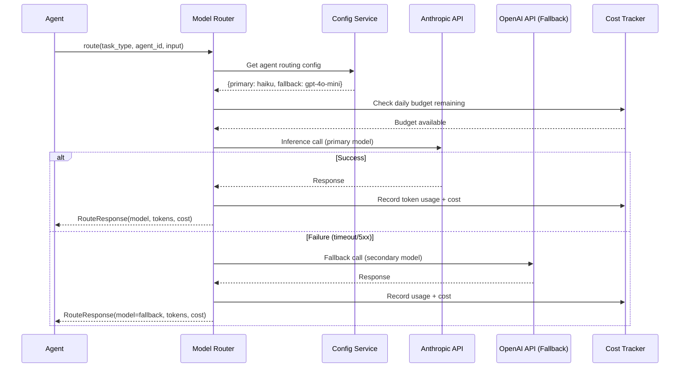

# LLM Architecture

> **Purpose:** Define the LLM architecture and model strategy for Vaeloom
> **Status:** ✅ Upgraded to enterprise quality
> **Canonical source:** [`/Docs/Vaeloom-Complete-Documentation.md#44-ai-layer`](../../Docs/Vaeloom-Complete-Documentation.md#44-ai-layer)

## Overview

The LLM architecture is the model orchestration layer that sits between Vaeloom's agents and the underlying AI model providers (Anthropic, OpenAI). Rather than hardcoding a single model, the Model Router dynamically assigns each agent request to the optimal model based on task type (classification → Haiku, reasoning → Sonnet, generation → Sonnet/GPT-4o, embedding → text-embedding-3-small), priority, cost budget, and latency requirements. This multi-model approach optimizes the cost-quality tradeoff while maintaining availability through automatic fallback chains.

This document defines the model strategy, routing architecture, model assignment per agent, cost management, and caching strategy. It is intended for AI engineers configuring model routing, platform engineers managing API provider integration, and finance teams tracking AI infrastructure costs. The architecture is designed for zero-downtime model swaps — routing rules live in a centralized config file, not in agent code, enabling model changes without agent code modifications.

---

## Model Strategy

Vaeloom uses **multi-model orchestration** — different agents route to the model best suited to their task — rather than a single hardcoded model.

## Routing Architecture

```mermaid
graph TD
    classDef agent fill:#e3f2fd,stroke:#1565c0,color:#000,stroke-width:1.5px
    classDef fast fill:#e8f5e9,stroke:#2e7d32,color:#000,stroke-width:1.5px
    classDef capable fill:#fff3e0,stroke:#e65100,color:#000,stroke-width:1.5px
    classDef fallback fill:#ffebee,stroke:#c62828,color:#000,stroke-width:1.5px
    classDef router fill:#f3e5f5,stroke:#6a1b9a,color:#000,stroke-width:2px

    subgraph AgentsIn["🤖 Agents"]
        GA["Gmail Agent<br/>Classification"]
        MA["Memory Agent<br/>Entity Extraction"]
        RA["Resume Agent<br/>Generation"]
        JSA["Job Search Agent<br/>Ranking"]
        CHAT["Chat<br/>User-facing"]
        ORG["Organization Agent<br/>Categorization"]
    end

    subgraph Router["🔀 Model Router"]
        direction TB
        R1["Receive request<br/>+ task_type + priority"]
        R2["Task classification:<br/>Classification / Reasoning / Gen"]
        R3["Select primary model<br/>based on config"]
        R4["Check fallback<br/>on failure / timeout"]
        R5["Monitor & log<br/>latency + cost"]
    end

    subgraph Models["🧠 Model Pool"]
        HAIKU["Claude Haiku<br/>Fast & cheap<br/>$0.00025/K in"]
        SONNET["Claude Sonnet<br/>Balanced reasoning<br/>$0.003/K in"]
        GPT4O["GPT-4o<br/>Fallback capable<br/>$0.005/K in"]
        EMBED["text-embedding-3-small<br/>Dedicated embeddings"]
    end

    GA & ORG --> R1
    MA & RA & JSA & CHAT --> R1
    R1 --> R2 --> R3 --> R4 --> R5
    R3 -->|Classification| HAIKU
    R3 -->|Reasoning| SONNET
    R3 -->|Generation| SONNET
    R3 -->|Embedding| EMBED
    R4 -.->|Fallback| GPT4O

    class GA,MA,RA,JSA,CHAT,ORG agent
    class HAIKU fast
    class SONNET capable
    class GPT4O fallback
    class EMBED fast
    class R1,R2,R3,R4,R5 router

```



> **Diagram:** Agents send requests to the **Model Router**, which classifies the task type and selects the optimal model. Classification routes to **Haiku** (fast/cheap). Reasoning and generation routes to **Sonnet** (balanced). **GPT-4o** serves as a fallback. All decisions are monitored for latency and cost.

## Model Assignment

| Agent/Task | Primary Model | Fallback Model | Rationale |
|------------|---------------|----------------|-----------|
| Gmail Agent (classification) | Claude Haiku | GPT-4o-mini | Fast, cheap classification |
| Memory Agent (extraction) | Claude Sonnet | GPT-4o | Strong structured extraction |
| Resume Agent (generation) | Claude Sonnet | GPT-4o | High-quality document generation |
| Job Search Agent (ranking) | Claude Sonnet | GPT-4o | Complex reasoning for fit scoring |
| Chat (user-facing) | Claude Sonnet | GPT-4o | General assistant capabilities |
| Embeddings | text-embedding-3-small | - | Dedicated embedding model |

## Model Router

The Model Router is a centralized service that:

1. Accepts agent requests with task type and priority
2. Selects the appropriate model based on configuration
3. Falls back to secondary model on failure
4. Monitors latency and cost per model
5. Caches responses for identical queries where safe

## Cost Management

| Model | Cost per 1K tokens (input) | Cost per 1K tokens (output) | Use Case |
|-------|---------------------------|----------------------------|----------|
| Haiku | $0.00025 | $0.00125 | High-volume classification |
| Sonnet | $0.003 | $0.015 | Core agent reasoning |
| GPT-4o | $0.005 | $0.015 | Fallback, complex tasks |

## Common Mistakes

| Mistake | Why It's a Problem |
|---------|-------------------|
| Using the most capable model for every task | Routing classification tasks (which Haiku handles perfectly) through Sonnet wastes 10x cost and adds latency for zero quality gain |
| No fallback model configured | When the primary model is unavailable (API outage, rate limit), agents fail silently or hang — a fallback model prevents complete service interruption |
| Hardcoding model names in agent code | When a model is deprecated or a better model is released, every agent's prompt file must be updated individually — use a centralized routing config |
| Ignoring cost accumulation across agents | Without per-agent cost tracking, a runaway agent consuming expensive model tokens can silently exhaust the monthly AI budget |

## Best Practices

| Practice | Rationale |
|----------|-----------|
| Match model capability to task complexity | Classification/pattern → Haiku (fast/cheap), extraction/reasoning → Sonnet (balanced), complex generation → GPT-4o fallback — right tool for right job |
| Always configure a fallback model per agent | API outages happen — each agent should have a fallback model (typically one tier more capable/costly) with automatic failover and logging |
| Centralize model routing in a config file | A single JSON/YAML config mapping agent_name → {primary, fallback, cost_budget} enables model updates without touching agent code |
| Track per-agent cost and latency in production | Log every model call with agent_id, model, tokens, and latency — enables cost attribution and identifies agents that should be downgraded to a cheaper model |

## Security

| Concern | Mitigation |
|---------|------------|
| Model provider API key exposure | AI service credentials in client-side code or public repos expose the account to abuse — store API keys in a secrets manager, never in code or environment variables accessible from the frontend |
| Prompt data sent to third-party model providers | Agent prompts containing user data are transmitted to external LLM providers — verify provider data-handling policies and consider data residency requirements |
| Model output hallucination in high-stakes actions | LLM-generated output for resume content, application answers, or deadline extraction may contain plausible-sounding but incorrect information — the QA Agent must verify factual claims against memory |

## Performance

| Concern | Guideline |
|---------|-----------|
| Model cold-start latency | The first model call after a period of inactivity may be slower due to provider cold-start; keep a warm connection pool active for real-time agents (Chat, Scheduler) |
| Context window management | Long prompts with extensive RAG context consume tokens and increase latency — prune context to the most relevant items (top 5-10) rather than filling the entire context window |
| Response caching for deterministic queries | Identical classification queries (e.g., email priority assessment) with identical context can be cached with a short TTL — avoid re-invoking the model for the same input |

## Goals

- Optimize cost-quality tradeoff by routing each agent task to the most appropriate model
- Achieve sub-2-second end-to-end inference latency for classification tasks and sub-5-second for generation tasks
- Maintain service availability through automatic model fallback chain
- Track and control per-agent LLM costs with granular attribution
- Enable model swaps and routing changes without modifying agent code

## Scope

**In Scope:**
- Multi-model orchestration across Claude Haiku, Claude Sonnet, and GPT-4o
- Centralized Model Router with task classification, model selection, and fallback logic
- Per-agent cost and latency monitoring and attribution
- Response caching for deterministic or idempotent queries
- Embedding generation via text-embedding-3-small for vector storage
- Configuration-driven model assignments via centralized config file

**Out of Scope:**
- Fine-tuning or custom model training
- Self-hosted open-source model deployment
- Multi-modal model support (image, audio generation)
- Model provider negotiation or dynamic pricing optimization
- On-device model inference

## Functional Requirements

| ID | Requirement | Priority |
|----|-------------|----------|
| FR-001 | Model Router shall classify each request by task type (classification, reasoning, generation, embedding) | Critical |
| FR-002 | Model Router shall select the primary model based on agent routing configuration | Critical |
| FR-003 | System shall fall back to a secondary model automatically on primary model failure | Critical |
| FR-004 | System shall log every model call with agent_id, model, tokens, latency, and cost | High |
| FR-005 | System shall cache responses for identical deterministic queries with configurable TTL | High |
| FR-006 | System shall enforce per-agent monthly cost budgets with alerting | High |
| FR-007 | System shall support dynamic model routing config without service restart | Medium |
| FR-008 | System shall track and report token usage per model per agent | Medium |

## Non-Functional Requirements

| ID | Requirement | Target | Measurement |
|----|-------------|--------|-------------|
| NFR-001 | Classification task inference shall complete within 2 seconds | p95 < 2s | Per-request inference duration |
| NFR-002 | Reasoning and generation tasks shall complete within 5 seconds | p95 < 5s | Per-request inference duration |
| NFR-003 | Model Router decision latency shall not exceed 50ms | p95 < 50ms | Router decision time |
| NFR-004 | Model fallback shall activate within 3 seconds of primary failure | < 3s | Time from failure to fallback start |
| NFR-005 | Monthly AI cost shall remain within allocated budget per agent | Within 10% of budget | Monthly cost report |
| NFR-006 | Cache hit ratio for deterministic queries shall exceed 60% | > 60% | Cache hit/miss ratio |

## Components

| Component | Responsibility | Technology | Scale Strategy |
|-----------|---------------|------------|----------------|
| Model Router | Task classification, model selection, fallback orchestration | FastAPI + Python | Horizontal with consistent hashing |
| Inference Client | HTTP client to model provider APIs | httpx + Anthropic SDK | Connection pooling per model |
| Response Cache | Cache for deterministic queries | Redis | Redis Cluster for larger cache size |
| Cost Monitor | Per-agent cost tracking and budgeting | Custom Python + Redis counters | Shard by agent_id across Redis cluster |
| Configuration Manager | Dynamic routing config loading | YAML config + file watcher | Stateless, config reloads on change |
| Embedding Service | Text embedding generation | OpenAI Embeddings API | Batch processing for throughput |

## Data Flow

1. **Agent Request** — Agent sends inference request to Model Router with task_type, agent_id, priority, and input payload including context and user query
2. **Cache Lookup** — Router computes cache key from agent_id + input hash; if found in Redis and within TTL, returns cached response immediately without model invocation
3. **Model Selection** — Router classifies task type and selects primary model from config; records selected model, expected cost, and timeout in span context
4. **Inference Execution** — Router sends request to model provider via SDK with retry logic (3 attempts with exponential backoff); streams response for generation tasks where supported
5. **Monitoring and Cost Recording** — Router records tokens consumed, latency, cost, and model used to Redis counters; if primary model fails, retries with fallback model and logs the failure

## Scalability

| Dimension | Current Limit | 10x Strategy | 100x Strategy |
|-----------|---------------|--------------|---------------|
| Concurrent inference requests | 50 concurrent | 500 concurrent with connection pool expansion | 5000 concurrent with request queuing and batching |
| Model Router throughput | 100 req/s | 1000 req/s with horizontal scaling | 10000 req/s with edge inference caching |
| Cache capacity | 10000 entries (Redis 1GB) | 100000 entries (Redis 10GB) | 1M entries with Redis Cluster |
| Cost tracking granularity | 1 second counters | 1 second counters, multi-region | Real-time streaming cost analytics |
| Embedding throughput | 1000 docs/hour | 10000 docs/hour with batching | 100000 docs/hour with parallel batch jobs |

## Error Handling

| Error Scenario | Detection | Mitigation | Recovery |
|----------------|-----------|------------|----------|
| Model provider API timeout | httpx timeout exception | Retry with fallback model, log failure | Circuit breaker after 5 consecutive failures in 1 minute |
| Rate limit exceeded by provider | HTTP 429 from API | Exponential backoff up to 60 seconds, then fallback model | Resume primary model after backoff window |
| Invalid response from model | JSON parse failure, missing expected fields | Retry request once with lower temperature | Log invalid response for manual inspection |
| Cache service unavailable | Redis connection error | Skip cache, log warning | Reconnect with retry, degrade gracefully |
| Configuration parse error | YAML parse exception | Continue with last valid config, alert | Operator fixes config and reloads |

## Monitoring

| Metric | Alert Threshold | Severity | Dashboard |
|--------|----------------|----------|-----------|
| p95 inference latency | > 5s for classification, > 10s for generation | Critical | LLM Latency Dashboard |
| Model error rate | > 5% of requests in 5 minutes | Critical | Model Error Dashboard |
| Per-agent daily cost | > 80% of daily budget | Warning | Cost Attribution Dashboard |
| Fallback activation rate | > 10% of requests using fallback | Warning | Model Fallback Dashboard |
| Cache hit ratio | < 40% over 1 hour | Info | Cache Performance Dashboard |
| Token consumption rate | > 100% of projected monthly | Warning | Token Usage Dashboard |

## Configuration

| Variable | Purpose | Default | Required |
|----------|---------|---------|----------|
| ANTHROPIC_API_KEY | Claude API authentication | — | Yes |
| OPENAI_API_KEY | GPT API authentication | — | Yes |
| PRIMARY_MODEL | Default model for reasoning tasks | claude-sonnet-4-20250514 | No |
| FALLBACK_MODEL | Fallback model for reasoning tasks | gpt-4o | No |
| CACHE_TTL | Response cache TTL in seconds | 300 | No |
| MAX_TOKENS | Maximum output tokens per request | 4096 | No |
| REQUEST_TIMEOUT | Model API request timeout in seconds | 30 | No |
| COST_BUDGET_DAILY | Maximum daily spend per agent in USD | 10.00 | No |
| EMBEDDING_MODEL | Model for text embeddings | text-embedding-3-small | No |

## Risks

| Risk | Likelihood | Impact | Mitigation |
|------|------------|--------|------------|
| Model provider API outage affecting all requests | Low | Critical | Multiple fallback models, circuit breaker, degraded mode |
| Cost explosion from runaway agent loop | Medium | High | Per-agent daily cost budgets, automatic kill switch |
| Model deprecation breaking routing config | Medium | High | Config-driven model list, CI validation of model availability |
| Cache poisoning via deterministic query collisions | Low | Medium | Include agent_id and workspace_id in cache key |
| Prompt injection via user input to classification tasks | Medium | High | Input sanitization, output validation, QA gate |

## Examples

### Example 1: Model Routing Configuration

```json
{
  "agents": {
    "gmail_agent": {
      "task_type": "classification",
      "primary": "claude-haiku",
      "fallback": "gpt-4o-mini",
      "cost_budget_daily": 0.50,
      "timeout_ms": 5000
    },
    "memory_agent": {
      "task_type": "extraction",
      "primary": "claude-sonnet",
      "fallback": "gpt-4o",
      "cost_budget_daily": 2.00,
      "timeout_ms": 15000
    }
  }
}
```

### Example 2: Cost Calculation

```python
# Calculate cost for a classification request
model = "claude-haiku"
input_tokens = 500
output_tokens = 150
cost = (input_tokens / 1000 * 0.00025) + (output_tokens / 1000 * 0.00125)
# cost = $0.000125 + $0.0001875 = $0.0003125 per request
# At 10,000 requests/day: $3.13/day for classification
```

---

## Sequence Diagrams



> **Diagram:** Model routing flow — agent request triggers config lookup, budget check, primary model call, and automatic fallback to the secondary model on failure. All token usage and cost is recorded for per-agent attribution.

---

## Limitations

| Limitation | Impact | Workaround | Future Resolution |
|------------|--------|------------|-------------------|
| No fine-tuned models available | Cannot optimize for domain-specific patterns | Prompt engineering and few-shot examples | Evaluate fine-tuning need with usage data |
| Single-region model API calls | Higher latency for non-US regions | Edge caching for classification tasks | Multi-region model API key deployment |
| No streaming for cached responses | Cache hits still return full response | Short TTL to reduce staleness | Stream from cache with chunked transfer |
| No model A/B testing framework | Cannot evaluate new models safely | Manual staging comparisons | Built-in A/B testing with traffic splitting |

## Future Improvements

| Improvement | Priority | Complexity | Timeline |
|-------------|----------|------------|----------|
| Fine-tuned classification model for domain-specific tasks | High | High | Q4 2026 |
| Model A/B testing framework with traffic splitting | High | Medium | Q3 2026 |
| Edge inference cache for low-latency classification | Medium | Medium | Q2 2026 |
| Multi-region model API deployment | Medium | Medium | Q3 2026 |
| Automated model cost optimization via usage analysis | Low | High | Q1 2027 |

## Related Documents

- [Model Routing.md](./Model-Routing.md)
- [Inference Pipeline.md](./Inference-Pipeline.md)
- [`/Docs/Vaeloom-Complete-Documentation.md#44-ai-layer`](../../Docs/Vaeloom-Complete-Documentation.md#44-ai-layer)
