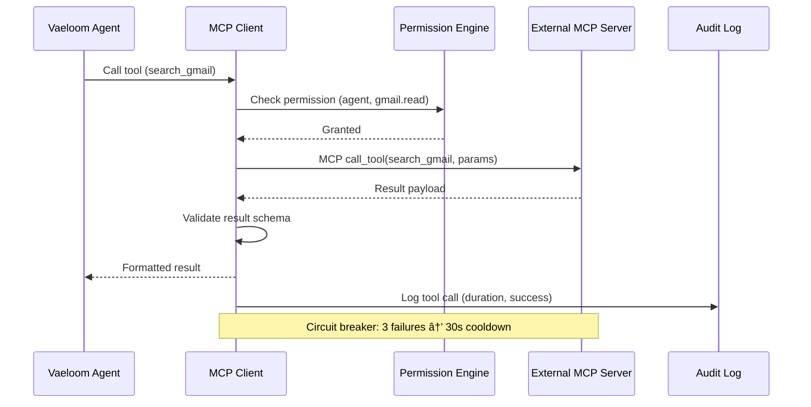

# Model Context Protocol (MCP)

> **Purpose:** Define MCP integration architecture for Vaeloom
> **Status:** ✅ Upgraded to enterprise quality
> **Owner:** AI Team
> **Last Updated:** 2026-07-13
> **Canonical source:** [`/Docs/06-Vaeloom-Enterprise-Paper.md#53-mcp-architecture`](../../Docs/06-Vaeloom-Enterprise-Paper.md#53-mcp-architecture)

## Overview

The Model Context Protocol (MCP) integration positions Vaeloom in a dual role within the AI ecosystem: as a consumer that connects to external MCP servers (GitHub, Gmail, Slack) through a standardized client layer, and as a provider that exposes Vaeloom's own tools and memory as MCP endpoints for external IDEs and assistants. This architecture ensures that every tool call — whether internal or external — follows the same MCP-shaped format (name, description, inputSchema, outputSchema, requiredScope) and passes through the same Permission Engine.

This document defines the MCP client layer, server endpoints, permission bridging, tool registry, and health monitoring for Vaeloom's MCP integration. It serves AI engineers integrating third-party tools, platform engineers exposing Vaeloom's capabilities to external consumers, and security engineers auditing the permission model. All internal tools are MCP-shaped from day one, ensuring future-proof interoperability when native MCP transport stabilizes.

## Goals

- Enable Vaeloom agents to call any MCP-compatible external tool through a standardized client layer without custom integration
- Expose Vaeloom's memory graph and agent tools as MCP server endpoints for external IDE and assistant consumption
- Apply the same Permission Engine checks to both internal and external MCP tool calls for uniform security
- Support circuit breaker patterns and health monitoring for all external MCP server connections
- Shape every internal tool as MCP from day one to eliminate future migration cost when MCP transport standardizes

---

## MCP Architecture

```mermaid
graph TD
    classDef consumer fill:#e3f2fd,stroke:#1565c0,color:#000,stroke-width:1.5px
    classDef provider fill:#e8f5e9,stroke:#2e7d32,color:#000,stroke-width:1.5px
    classDef external fill:#fff3e0,stroke:#e65100,color:#000,stroke-width:1px,stroke-dasharray: 5 3
    classDef internal fill:#f3e5f5,stroke:#6a1b9a,color:#000,stroke-width:1.5px

    subgraph Consumer["🔌 Vaeloom as Consumer"]
        direction TB
        AGENTS["Vaeloom Agents"] --> MCP_CLIENT["MCP Client Layer<br/>Standardized tool calls"]
        MCP_CLIENT --> EXT_MCP1["External MCP Server A<br/>(e.g. GitHub MCP)"]
        MCP_CLIENT --> EXT_MCP2["External MCP Server B<br/>(e.g. Gmail MCP)"]
        MCP_CLIENT --> EXT_MCP3["External MCP Server C<br/>(e.g. Slack MCP)"]
    end

    subgraph Provider["🔓 Vaeloom as Provider"]
        direction TB
        EXT_CLIENT["External IDE / Assistant"] --> MCP_SERVER["Vaeloom MCP Server<br/>mcp.list_tools<br/>mcp.call_tool<br/>mcp.get_memory"]
        MCP_SERVER --> PERM["Permission Engine<br/>Check scope & auth"]
        PERM --> MEM["Memory Graph<br/>Scoped queries"]
        PERM --> TOOLS["Agent Tools<br/>Permission-checked"]
    end

    subgraph Internal["📦 Internal Tool Shape"]
        direction TB
        ALL["All internal tools<br/>follow MCP shape:"]
        SCHEMA["name + description<br/>inputSchema + outputSchema<br/>requiredScope"]
    end

    AGENTS -.-> ALL
    ALL --> SCHEMA
    EXT_MCP1 -.->|MCP protocol| MCP_CLIENT

    class AGENTS,MCP_CLIENT consumer
    class EXT_CLIENT,MCP_SERVER,PERM,MEM,TOOLS provider
    class EXT_MCP1,EXT_MCP2,EXT_MCP3 external
    class ALL,SCHEMA internal

```



> **Diagram:** Vaeloom plays a **dual role** with MCP. As a **consumer** (🔌), agents call external MCP servers through a standardized client layer — adding any MCP-compatible tool without custom integration. As a **provider** (🔓), Vaeloom exposes its own MCP server (`list_tools`, `call_tool`, `get_memory`) so external environments can query the memory graph under the same permission model. All internal tools are MCP-shaped from day one.

### Consumer: Vaeloom uses external MCP servers

Any MCP-compatible tool can be added as a connector without custom integration work.

### Provider: Vaeloom exposes its own MCP server

Vaeloom's memory and agents can be called from other environments (IDE, another assistant) under the same permission model.

## Internal Tool Shape

All internal tools follow MCP's shape from day one:

```typescript
interface ToolDefinition {
  name: string;
  description: string;
  inputSchema: JSONSchema;
  outputSchema: JSONSchema;
  requiredScope: string;
}
```

## MCP Server Endpoints (Provider)

| Endpoint | Purpose |
|----------|---------|
| `mcp.list_tools` | List available agent tools |
| `mcp.call_tool` | Execute a tool (permission-checked) |
| `mcp.get_memory` | Query memory graph (scoped) |
| `mcp.search_memories` | Semantic search across memory |

## Benefits of MCP-Shaped Tools

| Benefit | Explanation |
|---------|-------------|
| Future-proof | Transport change, not rewrite, when real MCP arrives |
| Interoperability | Composable with any MCP-compatible system |
| Consistency | One tool format for internal and external tools |
| Security | Permission model applies uniformly |

## Common Mistakes

| Mistake | Why It's a Problem |
|---------|-------------------|
| Calling external MCP servers without permission checks | An external MCP server could be compromised or return malicious data — every tool call must pass through the Permission Engine regardless of transport |
| Building connectors as custom integrations instead of MCP tools | A custom Gmail connector that doesn't follow MCP's name/inputSchema/outputSchema/requiredScope format will need to be rewritten when MCP transport is enabled |
| Exposing the full internal tool list to external MCP consumers | External IDEs querying `mcp.list_tools` should only see tools permitted for external use — internal tools like `merge_entities` should be filtered out |
| Assuming MCP servers are always available | An external MCP server going down should not crash the agent — implement timeouts, retries, and graceful degradation when a tool is unavailable |

## Best Practices

| Practice | Rationale |
|----------|-----------|
| Shape every internal tool as MCP from day one | Name, inputSchema, outputSchema, requiredScope — this format works for internal calls now and is ready for MCP transport later without rewriting |
| Scope external MCP server access by agent permissions | Not every agent should have access to every MCP server — map MCP tool access to the same agent-level permission model used for internal tools |
| Version MCP server endpoints to allow gradual migration | An MCP server at `/v1/list_tools` and `/v2/list_tools` can coexist during upgrades — clients migrate when ready without breaking running agents |
| Monitor external MCP server health and latency | An external MCP server that becomes slow or unreliable can bottleneck agent execution — add health checks and circuit breakers for third-party MCP dependencies |

## Security

| Concern | Mitigation |
|---------|------------|
| Malicious MCP server returning crafted responses | A compromised external MCP server could return data designed to extract user information — validate and sanitize all data returned from external MCP tools before processing |
| MCP transport channel security | MCP communications between Vaeloom and external servers must use TLS encryption; unencrypted MCP connections expose tool calls and data to network interception |
| Permission escalation via MCP tool chaining | An agent should not be able to call an MCP tool that the agent's own permissions would not allow internally — the Permission Engine's check applies equally to MCP and internal tool calls |

## Performance

| Concern | Guideline |
|---------|-----------|
| External MCP server latency variability | Network latency to external MCP servers can be 10-100x slower than internal tool calls — set appropriate timeouts per MCP server based on observed p95 latency |
| MCP connection pooling | Opening a new connection for every MCP tool call adds TLS handshake overhead — reuse persistent HTTP/2 connections to MCP servers for lower latency |
| Caching frequent MCP tool results | Read-only MCP tools (e.g., `list_repos`, `search_gmail`) with identical parameters can be cached for short periods — reduces external call volume and latency |

## Scope

This document defines the Model Context Protocol (MCP) integration architecture for Vaeloom — covering Vaeloom's dual role as both MCP consumer (connecting to external MCP servers) and MCP provider (exposing Vaeloom's internal tools as MCP endpoints). Applies to all agent tool calls and external integrations across MVP and Enterprise. Out of scope: internal tool definition format (see [Tool-Calling.md](./Tool-Calling.md)), permission model specifics (see [Guardrails.md](./Guardrails.md)).

---

## Components

| Component | Responsibility | Technology | Scale Strategy |
|-----------|---------------|------------|----------------|
| MCP Client Layer | Connect agents to external MCP servers | MCP SDK (Python/TypeScript) | Connection pooling per server; circuit breaker |
| MCP Server Layer | Expose Vaeloom tools as MCP endpoints | Fastify/Express HTTP server | Stateless; horizontal scaling |
| Permission Engine Bridge | Map external MCP calls to internal permission model | Middleware layer | Cached permission sets with TTL |
| Tool Registry | Register and version all MCP-shaped tools | JSON/YAML config file | Loaded at startup; hot-reload capable |
| Health Monitor | Track external MCP server availability | Periodic health checks | Circuit breaker per server; auto-failover |

---

## Workflows

### 1. External MCP Tool Call (Consumer)

1. Agent requests tool execution (e.g., `search_gmail`)
2. MCP Client Layer resolves external MCP server endpoint
3. Permission Engine checks agent's scope for this tool
4. If granted: MCP Client sends request to external server
5. Response validated for schema compliance
6. Result returned to agent; call logged to audit

### 2. Vaeloom MCP Provider Request

1. External client calls `mcp.list_tools` on Vaeloom MCP Server
2. Server returns filtered tool list (external-safe tools only)
3. Client calls `mcp.call_tool` with tool name + params
4. Permission Engine validates caller's scope
5. Tool executed if permitted; result returned
6. Call logged to audit with caller identity

---

## Sequence Diagrams



> **Diagram:** External MCP tool call flow — permission check → MCP call → schema validation → result delivery. The circuit breaker protects against failing external servers.

---

## Data Flow

```text
Agent → MCP Client Layer → Permission Check
    → External MCP Server → Response Validation
    → Result → Agent
    → Audit Log Entry
    
External Client → MCP Server → Permission Check
    → Tool Execution → Response → Client
    → Audit Log Entry
```

**Data flow description:** Both consumer and provider flows pass through the Permission Engine. All calls are logged for audit regardless of direction.

---

## APIs

| Endpoint | Method | Purpose | Auth |
|----------|--------|---------|------|
| `/mcp/v1/list_tools` | GET | List available external-facing tools | Client API key |
| `/mcp/v1/call_tool` | POST | Execute a tool (permission-checked) | Client API key |
| `/mcp/v1/get_memory` | POST | Query memory graph (scoped) | Client API key |
| `/mcp/v1/search_memories` | POST | Semantic search across memory | Client API key |
| `/api/v1/mcp/servers` | GET | List connected external MCP servers | Admin token |

---

## Database

| Table | Purpose | Key Columns | Indexes |
|-------|---------|-------------|---------|
| `mcp_servers` | Registered external MCP servers | `id`, `name`, `endpoint_url`, `auth_type`, `health_status`, `circuit_breaker_state` | `(name)` UNIQUE |
| `mcp_calls` | Log every MCP call (in/out) | `id`, `direction`, `tool_name`, `caller_identity`, `duration_ms`, `success`, `error_message` | `(direction, created_at)`, `(tool_name)` |
| `mcp_permissions` | MCP tool → agent scope mapping | `tool_name`, `required_scope`, `allowed_agents` | `(tool_name)` UNIQUE |

---

## Scalability

| Dimension | Current Limit | 10x Strategy | 100x Strategy |
|-----------|--------------|--------------|---------------|
| External MCP connections | 5 concurrent servers | 50 servers with connection pooling | Gateway with dynamic server discovery |
| MCP call throughput | 100 req/s | 1000 req/s with horizontal server scaling | Regional MCP gateway with caching |
| Internal tool exposure | 10 tools | 100 tools with auto-registration | Dynamic tool discovery from agent manifests |

---

## Error Handling

| Scenario | Detection | Mitigation | Recovery |
|----------|-----------|------------|----------|
| External MCP server unavailable | Connection timeout / 503 | Circuit breaker opens (3 failures → 30s cooldown) | Agent falls back to alternate tool or cached result |
| MCP server returns invalid response | Schema validation fails | Drop response; log error with server identity | Retry once (if idempotent) or return error to agent |
| Permission denied on MCP call | Permission Engine returns deny | Log denial; do NOT retry | Agent handles gracefully; report to user |
| MCP server returns malicious data | Injection detection on response | Sanitize response; flag server for review | Disconnect server; alert security team |

---

## Monitoring

| Metric | Alert Threshold | Severity | Dashboard |
|--------|----------------|----------|-----------|
| External MCP server health | Any server down > 2 min | Critical | MCP Health |
| MCP call latency | p95 > 5s | Warning | MCP Performance |
| Circuit breaker open count | > 3 servers in open state | Critical | MCP Circuit Breakers |
| Permission denial rate | > 10% of MCP calls | Warning | MCP Permissions |
| MCP call volume by server | Any single server > 1000 req/min | Info | MCP Volume |

---

## Deployment

| Environment | Method | Trigger | Verification |
|-------------|--------|---------|-------------|
| Development | Docker Compose | Code push | MCP call unit tests |
| Staging | Helm chart | PR merge | MCP integration tests |
| Production | Progressive rollout | Manual approval | Shadow-mode MCP call verification |

---

## Configuration

| Variable | Purpose | Default | Required |
|----------|---------|---------|----------|
| `MCP_SERVER_TIMEOUT_MS` | External MCP call timeout | 10000 | Yes |
| `MCP_CIRCUIT_BREAKER_THRESHOLD` | Failures before circuit opens | 3 | Yes |
| `MCP_CIRCUIT_BREAKER_COOLDOWN_S` | Cooldown duration | 30 | Yes |
| `MCP_EXTERNAL_TOOLS_ONLY` | Filter internal tools from listing | true | No |
| `MCP_CONNECTION_POOL_SIZE` | Max connections per server | 10 | No |

---

## Examples

### Example 1: Calling External MCP Server

```typescript
// Agent calls external GitHub MCP server
const result = await mcpClient.callTool({
  serverName: "github",
  toolName: "list_repos",
  params: { username: "johndoe" },
  agentId: "agent_123"
});

// Result: permission-checked, validated, logged
// { repos: [{ name: "project-x", stars: 42 }] }
```

---

## Risks

| Risk | Likelihood | Impact | Mitigation |
|------|------------|--------|------------|
| MCP server compromised and returns malicious data | Low | Critical | Validate and sanitize all external responses; circuit breaker on anomalies |
| MCP server outage blocks agent execution | Medium | Medium | Circuit breaker + fallback; agent degrades gracefully |
| Permission escalation via MCP tool chaining | Low | High | Permission Engine evaluates composite actions; no tool may bypass scope |
| MCP transport security failure | Low | Critical | TLS 1.3 required for all MCP connections; mTLS for sensitive servers |

---

## Limitations

| Limitation | Impact | Workaround | Future Resolution |
|------------|--------|------------|-------------------|
| No MCP transport standardization yet | Custom transport between internal services | All tools MCP-shaped from day one | Native MCP transport when specification stabilizes |
| External MCP discovery is manual | Servers must be registered in config | Auto-detection via mcp.json manifests | Service mesh with dynamic MCP discovery (Phase 3) |
| Permission mapping is per-tool, not per-parameter | Coarse granularity for some tools | Split into multiple tools for fine-grained control | Parameter-level permission scoping (Phase 4) |

---

## Future Improvements

| Improvement | Priority | Complexity | Timeline |
|-------------|----------|------------|----------|
| Native MCP transport layer (spec stabilization) | High | Medium | Phase 2 (Q4 2026) |
| Dynamic MCP server discovery via service mesh | Medium | High | Phase 3 (Q1 2027) |
| Parameter-level permission scoping | Medium | High | Phase 4 (Q2 2027) |
| MCP tool marketplace with community-contributed tools | Low | High | Phase 5 (Q3 2027) |

## Related Documents

- [Tool Calling.md](./Tool-Calling.md)
- [AI Agents.md](./AI-Agents.md)
- [`/Docs/06-Vaeloom-Enterprise-Paper.md#53-mcp-architecture`](../../Docs/06-Vaeloom-Enterprise-Paper.md#53-mcp-architecture)
