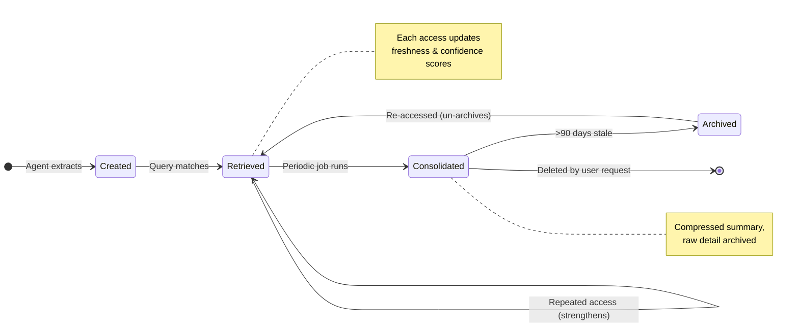
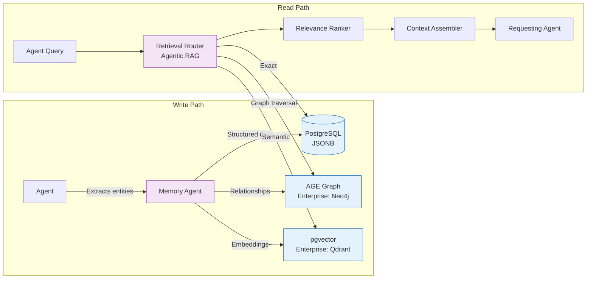
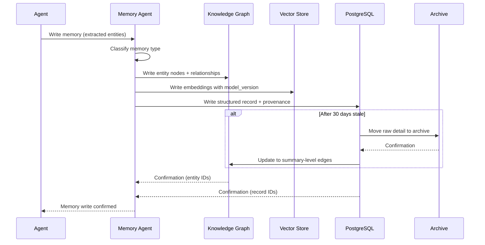

# Memory System

> **Purpose:** Define the memory system architecture for Vaeloom's AI
> **Status:** ✅ Upgraded to enterprise quality
> **Owner:** AI Team
> **Last Updated:** 2026-07-13
> **Canonical source:** [`/Docs/04-memory-knowledge-graph.md`](../../Docs/04-memory-knowledge-graph.md), [`/Docs/Vaeloom-Complete-Documentation.md#6-memory-system-in-depth`](../../Docs/Vaeloom-Complete-Documentation.md#6-memory-system-in-depth)

## Overview

Vaeloom's memory system is the product's core differentiator — a continuously evolving, structured knowledge base built automatically from everything the user touches. Unlike a chatbot that resets context every session, Vaeloom's memory compounds over time, making every agent smarter the longer it's used.

```mermaid
graph TB
    subgraph Sources["📥 Data Sources"]
        Docs[Documents & Files]
        Email[Gmail Messages]
        Code[GitHub Repos]
        Capture[Manual Entry]
    end

    subgraph MemoryTypes["🗃️ Memory Types"]
        Profile["Profile<br/>Education · Skills · Certs"]
        Document["Document<br/>Summaries · Entities · Embeddings"]
        Career["Career<br/>Applications · Outcomes · Offers"]
        Episodic["Episodic<br/>Events · Timeline · Milestones"]
        Preference["Preference<br/>Patterns · Choices · Tastes"]
        Working["Working<br/>Session Context · Chat History"]
    end

    subgraph Storage["💾 Storage Layers"]
        KG["Knowledge Graph<br/>(AGE → Neo4j)"]
        Vector["Vector Store<br/>(pgvector → Qdrant)"]
        SQL["Structured Records<br/>(PostgreSQL + JSONB)"]
    end

    subgraph Agents["🤖 Agent Consumers"]
        Resume[Resume Agent]
        Job[Job Search Agent]
        Gmail[Gmail Agent]
        Scheduler[Scheduler Agent]
    end

    Sources -->|Ingested by| MemoryTypes
    MemoryTypes -->|Written to| Storage
    Storage -->|Read by| Agents
    Agents -.->|Updates via| MemoryTypes

    style Profile fill:#e1f5fe,stroke:#0288d1
    style Document fill:#e8f5e9,stroke:#388e3c
    style Career fill:#fff3e0,stroke:#f57c00
    style Episodic fill:#f3e5f5,stroke:#7b1fa2
    style Preference fill:#fce4ec,stroke:#c62828
    style Working fill:#e0f2f1,stroke:#00796b
    style KG fill:#fff8e1,stroke:#f9a825
    style Vector fill:#fff8e1,stroke:#f9a825
    style SQL fill:#fff8e1,stroke:#f9a825
```



## Goals

- Build a continuously compounding memory that grows smarter with every user interaction across all connected data sources
- Maintain six distinct memory types (Profile, Document, Career, Episodic, Preference, Working) with appropriate lifecycle and persistence rules for each
- Achieve sub-2-second memory retrieval latency through Agentic RAG with parallelized vector, keyword, and graph store queries
- Ensure zero cross-tenant data contamination by enforcing workspace_id isolation at the database level on every read and write operation
- Provide full source provenance on every memory record so all extracted facts are auditable, verifiable, and correctable

---

## Memory Types (MVP)

| Type | What It Holds | Example | Persistence |
|------|--------------|---------|-------------|
| Profile | Stable facts: education, skills, certifications | "B.Tech CSE, graduating 2027" | Permanent |
| Document | Per-file summary, entities, embedding | Summary of research paper PDF | Permanent |
| Career | Applications, outcomes | "Applied to X Corp SDE intern, rejected" | Permanent |
| Episodic | Timestamped events | "Won runner-up at HackX, March 2026" | Permanent |
| Preference | Inferred patterns | "Prefers backend roles over frontend" | Evolving |
| Working | Session context | Current conversation thread | Session-scoped |

## Memory Lifecycle

Every piece of memory flows through a defined lifecycle from creation to eventual consolidation:



### Lifecycle Stage Details

| Stage | Duration | Action | Storage State |
|-------|----------|--------|---------------|
| **Created** | Instant | Entity extraction, embedding generation, relationship linking | Written to all stores |
| **Retrieved** | Days–months | Accessed by agents, freshness score updated on each hit | Active in all stores |
| **Consolidated** | After 30 days stale | Summarized with related memories, raw detail compressed | Summary in KG, detail in archive |
| **Archived** | After 90 days stale | Removed from hot stores, kept in cold archive | Archive bucket only |

## Storage Architecture



| Store | MVP Technology | Enterprise Upgrade | Purpose |
|-------|---------------|-------------------|---------|
| Knowledge Graph | AGE (PostgreSQL extension) | Neo4j | Entity nodes + typed relationships |
| Vector Store | pgvector (PostgreSQL extension) | Qdrant | Semantic embeddings for similarity search |
| Structured Records | PostgreSQL JSONB | PostgreSQL | Memory metadata, timestamps, provenance |

## Common Mistakes

| Mistake | Why It's a Problem |
|---------|-------------------|
| Treating all memory types with the same persistence and access pattern | Working memory should expire in hours, preferences evolve over weeks, career memories persist forever — uniform lifecycle management causes bloat in short-term stores and data loss in long-term ones |
| No deduplication before writing to the knowledge graph | Five identical entity extraction calls create five duplicate nodes — the Memory Agent must merge before write, not leave duplicates for a later consolidation pass |
| Silent overwrite of existing memory with new conflicting data | An email contradicting a previously extracted fact should not silently replace it — both versions should coexist with the older one marked superseded and the conflict surfaced to the user |
| Storing memory without source provenance | A memory record without a pointer back to its source document cannot be verified, corrected, or audited — provenance is what makes memory trustworthy |

## Best Practices

| Practice | Rationale |
|----------|-----------|
| Define distinct lifecycle rules per memory type | Working memory expires at session end; Preference memory consolidates after 30 days of no changes; Career memory is permanent — each type gets the retention strategy it needs |
| Always run merge/dedup logic before writing new entities | Check similarity against existing entities before creating new ones — auto-merge above 95% similarity, flag for review above 80%, create new below 80% |
| Store both the old and new version when contradictory data arrives | When new evidence contradicts existing memory, keep both versions — mark the older one as superseded with a pointer to the newer version rather than deleting it |
| Attach source pointers to every memory record | Every extracted fact includes a link to its source document (document_id, paragraph location, extraction timestamp) — enables audit, correction, and confidence scoring |

## Security

| Concern | Mitigation |
|---------|------------|
| Cross-workspace memory contamination during merge | Merge logic must never compare or merge entities across `workspace_id` boundaries — different users' memories are strictly isolated at the database level |
| Memory record containing sensitive PII exposed via retrieval | A memory record extracted from a private document could contain sensitive information — retrieval should scope results to the requesting agent's permission level, not return all matching records |
| Memory deletion without user confirmation | Bulk deletion of memory records triggered by a single action could erase data the user intended to keep — every memory deletion should be reversible or require explicit confirmation |

## Performance

| Concern | Guideline |
|---------|-----------|
| Graph write throughput under heavy ingestion | When a user imports 100+ documents at once, each triggering entity extraction and graph writes, the graph store can become a bottleneck — batch memory writes and process them on a background queue |
| Consolidation job resource usage | Running full graph consolidation (compressing, merging, archiving) during peak hours can degrade interactive query performance — schedule consolidation during low-usage windows (e.g., 3 AM) |
| Retrieval latency as memory store grows | The knowledge graph and vector store grow unbounded over time — without periodic archival of low-importance / high-age memories, retrieval latency increases measurably after 6+ months of continuous use |

## Scope

This document defines the memory system architecture for Vaeloom's AI — covering the six memory types, lifecycle stages, storage layers (knowledge graph, vector store, structured records), and agent consumption patterns. Applies to all user workspaces across MVP and Enterprise deployments. Out of scope: graph entity/relationship specifics (see [Knowledge-Graph.md](./Knowledge-Graph.md)), retrieval strategy (see [Agentic-RAG.md](./Agentic-RAG.md)), embedding generation (see [Embeddings.md](./Embeddings.md)).

---

## Components

| Component | Responsibility | Technology | Scale Strategy |
|-----------|---------------|------------|----------------|
| Memory Agent | Extract entities, generate embeddings, link relationships | Claude Sonnet + structured extraction | Parallel extraction per document |
| Profile Memory | Store stable user facts (education, skills, certs) | PostgreSQL JSONB | Cached for fast agent access |
| Document Memory | Store per-file summaries, entities, embeddings | pgvector + AGE | Partitioned by workspace_id |
| Career Memory | Track applications, outcomes, offers | PostgreSQL JSONB | Indexed by user_id + status |
| Episodic Memory | Store timestamped events and milestones | PostgreSQL JSONB + time index | Archive after 90 days stale |
| Preference Memory | Store inferred patterns and choices | PostgreSQL JSONB | Re-evaluated on new signals |
| Working Memory | Store session context and chat history | Redis with TTL | Session-scoped; auto-expire |

---

## Workflows

### 1. Memory Write Workflow

1. Agent extracts entities from source document/email/event
2. Entities classified into memory type (profile, document, career, etc.)
3. Embedding generated for semantic search
4. Relationships linked in knowledge graph
5. Structured record stored in PostgreSQL JSONB
6. Inverse relationships created for bidirectional queries
7. Source provenance pointer attached to every record

### 2. Memory Consolidation Workflow

1. Daily cron job identifies stale memory records (>30 days no access)
2. Related records grouped and compressed into summary
3. Raw detail moved to archive storage
4. Knowledge graph updated: old entity edges replaced with summary-level edges
5. Archived records remain retrievable but excluded from hot queries

### 3. Memory Retrieval Workflow (via Agentic RAG)

1. Agent query → Retrieval Router classifies intent
2. Router selects strategy: vector (semantic), keyword (exact), graph (relationships)
3. Stores queried in parallel with workspace_id scope
4. Results merged, deduplicated, scored, pruned to token budget
5. Context delivered to requesting agent with source provenance

---

## Sequence Diagrams



> **Diagram:** Memory write flow showing parallel writes to knowledge graph, vector store, and PostgreSQL. After 30 days of staleness, consolidation compresses records and moves raw detail to archive.

---

## Data Flow

```text
Source (Document/Email/Event) → Agent → Entity Extraction
    → Memory Type Classification (Profile/Document/Career/Episodic/Preference/Working)
    → Parallel Write:
        1. Knowledge Graph → Entity nodes + relationships + inverses
        2. Vector Store → Embeddings + model_version
        3. PostgreSQL → Structured record + source provenance
    → Confirmation → Agent
    → [After 30d stale] → Consolidation → Archive raw detail
```

---

## APIs

| Endpoint | Method | Purpose | Auth |
|----------|--------|---------|------|
| `/api/v1/memory/write` | POST | Write memory record (entity + embedding + record) | Agent token (write) |
| `/api/v1/memory/read` | POST | Read memory by query (via Agentic RAG) | Agent token (read) |
| `/api/v1/memory/delete` | DELETE | Delete memory by entity_id | Agent token + user confirmation |
| `/api/v1/memory/consolidate` | POST | Trigger consolidation run | Admin token |
| `/api/v1/memory/export` | GET | Export all user memory (portable format) | User token |

---

## Database

| Table/Store | Purpose | Key Columns | Indexes |
|-------------|---------|-------------|---------|
| `memory_records` | Structured memory records (all types) | `id`, `workspace_id`, `memory_type`, `entity_id`, `data_jsonb`, `provenance`, `created_at`, `last_accessed_at` | `(workspace_id, memory_type)`, `(entity_id)`, `(last_accessed_at)` |
| `memory_archive` | Consolidated/archived records | `id`, `original_id`, `summary_jsonb`, `archived_at` | `(original_id)` |
| `memory_working` | Session-scoped working memory | `session_id`, `data_jsonb`, `ttl_expires` | `(session_id)`; TTL auto-expire |

---

## Scalability

| Dimension | Current Limit | 10x Strategy | 100x Strategy |
|-----------|--------------|--------------|---------------|
| Memory records per workspace | 100K | 1M with partitioning by memory_type + workspace_id | 10M with archive tier + hot/cold splitting |
| Embedding storage | 10M vectors (pgvector) | Qdrant migration with auto-sharding | Distributed Qdrant cluster |
| Graph node count | 1M entities (AGE) | Neo4j migration | Enterprise Neo4j cluster |
| Archive storage | 1TB S3 | S3 lifecycle policies + Glacier deep archive | Multi-region archive with replication |

---

## Error Handling

| Scenario | Detection | Mitigation | Recovery |
|----------|-----------|------------|----------|
| Memory write fails on one store (e.g., KG write succeeds, vector write fails) | Partial write detected by orchestrator | Roll back successful writes; retry from last successful | Queue for retry; alert if retry count exceeds 3 |
| Consolidation encounters corrupted record | Validation on read fails | Skip corrupted record; flag for manual review | Log corruption details; quarantine record |
| Memory retrieval returns stale (>90d) data | last_accessed_at check | Prefer archived summary; flag as stale in response | Update retrieval to include archive query |
| Memory type classification error | Confidence below threshold | Store as Document memory (general type) | Flag for memory agent retraining |

---

## Monitoring

| Metric | Alert Threshold | Severity | Dashboard |
|--------|----------------|----------|-----------|
| Memory write success rate | < 99% | Critical | Memory Pipeline |
| Memory write latency (p95) | > 2s | Warning | Memory Pipeline |
| Memory retrieval latency (p95) | > 3s | Critical | Memory Retrieval |
| Consolidation job duration | > 60 min | Warning | Consolidation |
| Archive growth rate | > 1TB/month | Info | Storage Growth |
| Working memory usage (Redis) | > 80% of allocated | Warning | Working Memory |

---

## Deployment

| Environment | Method | Trigger | Verification |
|-------------|--------|---------|-------------|
| Development | Docker Compose (all stores) | Code push | Memory CRUD integration tests |
| Staging | Helm chart (AGE + pgvector + PG) | PR merge | Memory pipeline smoke test |
| Production | Progressive rollout | Manual approval | Write/read validation against golden data |

---

## Configuration

| Variable | Purpose | Default | Required |
|----------|---------|---------|----------|
| `MEMORY_CONSOLIDATION_AGE_DAYS` | Days before memory consolidates | 30 | Yes |
| `MEMORY_ARCHIVE_AGE_DAYS` | Days before memory archives | 90 | Yes |
| `MEMORY_WORKING_TTL_SECONDS` | Working memory TTL | 3600 | Yes |
| `MEMORY_RETRIEVAL_MAX_TOKENS` | Max context tokens per retrieval | 8000 | Yes |
| `MEMORY_DEFAULT_LIMIT` | Default top-k results per store | 20 | Yes |

---

## Examples

### Example 1: Writing a Memory Record

```python
# Memory Agent writes extracted entities
memory_write = await memory_agent.write(
    workspace_id="ws_123",
    source_document="resume.pdf",
    entities=[
        {"type": "skill", "name": "Python", "confidence": 0.98},
        {"type": "person", "name": "John Doe", "properties": {"education": "B.Tech CSE"}},
        {"type": "project", "name": "HackX 2026", "properties": {"outcome": "runner-up"}}
    ]
)
# Records written to: KG (nodes + edges), Vector Store (embeddings), PostgreSQL (structured)
```

---

## Risks

| Risk | Likelihood | Impact | Mitigation |
|------|------------|--------|------------|
| Cross-tenant memory contamination during merge | Low | Critical | Workspace_id enforced on all queries; merge never crosses workspace boundaries |
| Memory record containing PII exposed via retrieval | Medium | High | Permission-scoped retrieval; results filtered by agent's access level |
| Consolidation job deletes data user wanted to keep | Low | Medium | Archive before hard delete; 30-day recovery window; reversible deletion |
| Working memory overflow causing chat context loss | Medium | Low | Redis maxmemory policy (allkeys-lru); alert at 80% capacity |

---

## Limitations

| Limitation | Impact | Workaround | Future Resolution |
|------------|--------|------------|-------------------|
| Working memory limited to single session | No cross-session context for chat | Include consolidated episodic memory in context | Persistent chat history (Phase 2) |
| Consolidation runs daily only | 30-day stale memories wait up to 24h for consolidation | Manual consolidation trigger available | Real-time consolidation on access patterns (Phase 3) |
| No memory conflict resolution UI | Contradictory data silently handled | Preference memory marks older as superseded | Conflict resolution UI for user review (Phase 3) |
| AGE graph query performance degrades at scale | >1M entities slow complex traversals | Index hot paths; limit traversal depth to 3 hops | Neo4j migration for enterprise (Phase 2) |

---

## Future Improvements

| Improvement | Priority | Complexity | Timeline |
|-------------|----------|------------|----------|
| Persistent chat history (cross-session working memory) | High | Medium | Phase 2 (Q4 2026) |
| Neo4j migration for enterprise graph scale | High | High | Phase 2 (Q4 2026) |
| Memory conflict resolution UI for user review | Medium | High | Phase 3 (Q1 2027) |
| Real-time memory consolidation based on access patterns | Low | High | Phase 4 (Q2 2027) |
| Memory graph explorer for user visualization | Medium | Medium | Phase 3 (Q1 2027) |

## Related Documents

- [Knowledge Graph.md](./Knowledge-Graph.md)
- [RAG.md](./RAG.md)
- [Agentic RAG.md](./Agentic-RAG.md)
- [`/Docs/04-memory-knowledge-graph.md`](../../Docs/04-memory-knowledge-graph.md)
