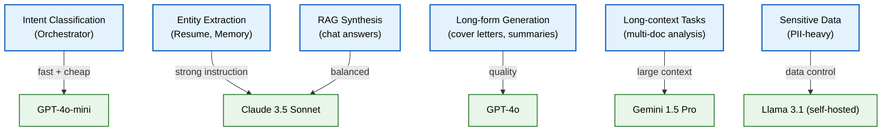

# Model Benchmarking

> **Purpose:** Define the framework for selecting, benchmarking, and comparing LLM models for Vaeloom's tasks — quality, latency, cost, and reliability dimensions
> **Status:** 🆕 New
> **Owner:** AI Team
> **Version:** 1.0
> **Last Updated:** 2026-07-16
> **Dependencies:** [`Model-Routing.md`](./Model-Routing.md), [`LLM-Architecture.md`](./LLM-Architecture.md), [`Eval-Datasets.md`](./Eval-Datasets.md), [`AI-Cost-Strategy.md`](./AI-Cost-Strategy.md)
> **Implementation Status:** 📋 Spec Only

## Overview

Vaeloom uses multiple LLM providers (OpenAI, Anthropic, Google, plus self-hosted open models) and routes requests to the best model for each task. "Best" is a function of quality (does it produce correct output?), latency (how fast?), cost (how much per token?), and reliability (is it up?). This document defines the benchmarking framework that evaluates models across these dimensions and feeds the model router's selection logic.

## Goals

- Define benchmark dimensions and metrics
- Specify the benchmark suite (tasks and datasets)
- Document candidate models and their characteristics
- Establish benchmark automation and regression detection
- Define model selection criteria per task type

## Scope

### In Scope

- Benchmark dimensions (quality, latency, cost, reliability)
- Benchmark suite and automation
- Candidate model comparison
- Model selection criteria per task
- Self-hosted model requirements

### Out of Scope

- Model router implementation (see [`Model-Routing.md`](./Model-Routing.md))
- Cost strategy details (see [`AI-Cost-Strategy.md`](./AI-Cost-Strategy.md))

## Benchmark Dimensions

| Dimension | Metric | Measurement | Weight |
|-----------|--------|-------------|--------|
| **Quality** | Task-specific score (accuracy, F1, correlation) | Golden dataset eval | 40% |
| **Latency** | Time to first token (TTFT), tokens/sec | API timing | 20% |
| **Cost** | $ per 1M input tokens, $ per 1M output tokens | Provider pricing | 25% |
| **Reliability** | Uptime %, error rate, rate-limit frequency | Production monitoring | 15% |

## Benchmark Suite

| Task | Dataset | Quality Metric | Why it matters |
|------|---------|----------------|----------------|
| **Summarization** | 100 docs → golden summaries | ROUGE-L + human rating | Core ingestion capability |
| **Entity Extraction** | Resume extraction golden set | F1 score | Memory building |
| **Classification** | Intent classification (routing) | Accuracy | Orchestrator routing |
| **RAG Answer Quality** | 200 Q&A pairs | Faithfulness + relevance | Chat accuracy |
| **Instruction Following** | 50 structured-output tasks | Format compliance rate | Agent reliability |
| **Safety/Refusal** | 100 adversarial prompts | Correct refusal rate | Guardrails |

## Candidate Models

| Model | Context | Strengths | Weaknesses | Cost (in/out per 1M) |
|-------|---------|-----------|------------|---------------------|
| **GPT-4o** | 128K | Strong reasoning, broad knowledge | Higher cost | $2.50 / $10.00 |
| **Claude 3.5 Sonnet** | 200K | Excellent instruction following, long context | Slower TTFT | $3.00 / $15.00 |
| **Gemini 1.5 Pro** | 1M | Massive context, multimodal | Inconsistent formatting | $1.25 / $5.00 |
| **GPT-4o-mini** | 128K | Fast, cheap, good enough for simple tasks | Weaker reasoning | $0.15 / $0.60 |
| **Llama 3.1 70B (self-hosted)** | 128K | No per-token cost; full data control | GPU cost; lower quality | ~$0.50 / $0.50 (GPU amortized) |
| **Mistral Large** | 128K | Good European language support | Smaller ecosystem | $2.00 / $6.00 |

## Model Selection Criteria per Task



> **Diagram:** Model selection by task type. The router selects the model that optimizes the quality-cost-latency tradeoff for each task category.

## Benchmark Automation

```text
Benchmark pipeline (runs weekly + on model updates):
  1. For each candidate model × each benchmark task:
     a. Run model against golden dataset.
     b. Record quality score, latency, token count, cost.
  2. Store results in benchmark database (timestamped).
  3. Compare against previous benchmark:
     - Regression alert if quality drops > 3%.
     - Cost change alert if pricing updates.
  4. Update model router weights based on latest results.
  5. Publish benchmark report to AI Team dashboard.
```

## Self-Hosted Model Requirements

| Requirement | Specification |
|-------------|--------------|
| GPU | 2× A100 80GB (for 70B models) or 4× A10G |
| Serving framework | vLLM or TGI (Text Generation Inference) |
| Quantization | AWQ or GPTQ for memory efficiency |
| Max concurrency | 10 simultaneous requests per GPU |
| Fallback | If self-hosted model is overloaded, fall back to API model |

## Monitoring

| Metric | Alert Threshold | Severity | Dashboard |
|--------|-----------------|----------|-----------|
| `model_quality_regression_pct` | >3% vs last benchmark | P2 | AI Bench |
| `model_latency_p99{model}` | >2× baseline | P2 | AI Bench |
| `model_error_rate{model}` | >5% | P2 | AI Bench |
| `self_hosted_gpu_utilization` | >90% sustained | P3 | Infra |

## Best Practices

| # | Practice | Rationale |
|---|----------|-----------|
| 1 | Benchmark on the same golden datasets used for eval | Consistent comparison; no moving goalposts |
| 2 | Re-benchmark when providers release new models | Model quality changes over time |
| 3 | Always have a fallback model in the router | Provider outages shouldn't take Vaeloom down |
| 4 | Pin model versions in production | "latest" can silently change behavior |

## Risks

| Risk | Likelihood | Impact | Mitigation |
|------|-----------|--------|------------|
| Provider deprecates a pinned model | Medium | High | Monitor provider announcements; 90-day migration window |
| Self-hosted model quality lags API models | High | Medium | Use self-hosted only for sensitive tasks; API for the rest |
| Benchmark overfits to golden dataset | Medium | Medium | Refresh golden sets; include adversarial examples |

## Future Improvements

| Improvement | Priority | Complexity | Timeline |
|-------------|----------|------------|----------|
| Automated model selection (ML-based router) | Medium | High | Q2 2027 |
| Multi-model ensemble for high-stakes tasks | Low | High | Q3 2027 |
| Fine-tuned models for Vaeloom-specific tasks | Medium | High | Q2 2027 |

## Related Documents

- [`Model-Routing.md`](./Model-Routing.md) — model router implementation
- [`LLM-Architecture.md`](./LLM-Architecture.md) — LLM architecture
- [`Eval-Datasets.md`](./Eval-Datasets.md) — golden datasets
- [`AI-Cost-Strategy.md`](./AI-Cost-Strategy.md) — cost optimization
- [`AI-Versioning.md`](./AI-Versioning.md) — model version pinning
