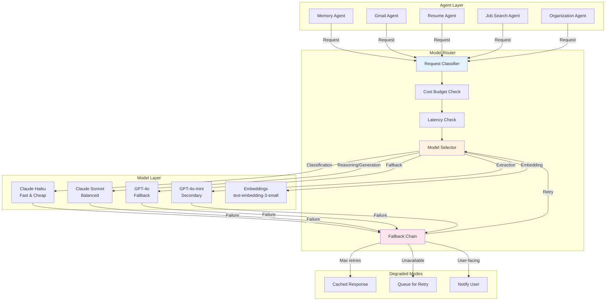
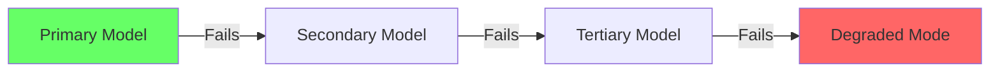
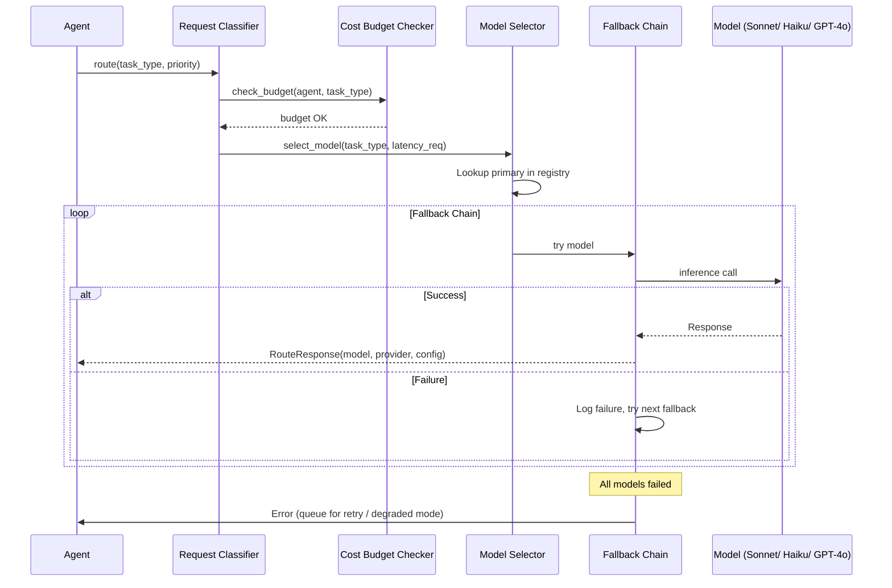

# Model Routing

> **Purpose:** Define the model routing architecture for Meridian's AI system — how agent requests are assigned to the optimal model
> **Status:** ✅ Upgraded to enterprise quality
> **Owner:** AI Team
> **Last Updated:** 2026-07-12
> **Canonical source:** [`/Docs/Engineering/Implementation/09-ai-gateway-model-routing.md`](../../Docs/Engineering/Implementation/09-ai-gateway-model-routing.md)

---

## Overview

The Model Router is the central service that routes agent requests to the optimal model based on task type, cost budget, latency requirements, and availability. It is the decision layer between Meridian's agents and the underlying AI models — ensuring each request gets the right model at the right cost.

This document covers the routing architecture, model registry, fallback chains, cost management, and implementation patterns.

## Goals

- Route every agent inference request to the most cost-effective model that meets task accuracy and latency requirements
- Achieve 99.9% routing availability through automated fallback chains across multiple model providers
- Maintain sub-50ms router decision latency so routing adds negligible overhead to total inference time
- Track and cap per-agent daily model costs to prevent budget overruns from runaway agent loops
- Enable model swaps and routing rule changes without agent code modifications via centralized model registry

---

## Routing Architecture



## Routing Criteria

| Criterion | Values | Example |
|-----------|--------|---------|
| Task type | Classification, extraction, generation, reasoning | Gmail classification → Haiku |
| Priority | Low, normal, high | User-facing chat → high |
| Cost budget | Per-agent monthly allocation | Memory Agent → mid-range |
| Latency requirement | Real-time (< 3s), near-real-time (< 10s), batch (> 30s) | Chat → real-time |

## Model Registry

The Model Registry is the single source of truth for available models. It is loaded at startup and can be updated at runtime without restart.

```json
{
  "models": {
    "claude-haiku": {
      "provider": "anthropic",
      "capabilities": ["classification", "extraction"],
      "cost_per_1k_input": 0.00025,
      "cost_per_1k_output": 0.00125,
      "status": "active"
    },
    "claude-sonnet": {
      "provider": "anthropic",
      "capabilities": ["reasoning", "generation", "coding"],
      "cost_per_1k_input": 0.003,
      "cost_per_1k_output": 0.015,
      "status": "active"
    },
    "gpt-4o": {
      "provider": "openai",
      "capabilities": ["reasoning", "generation"],
      "cost_per_1k_input": 0.005,
      "cost_per_1k_output": 0.015,
      "status": "active"
    },
    "gpt-4o-mini": {
      "provider": "openai",
      "capabilities": ["classification", "extraction"],
      "cost_per_1k_input": 0.00015,
      "cost_per_1k_output": 0.0006,
      "status": "active"
    },
    "text-embedding-3-small": {
      "provider": "openai",
      "capabilities": ["embedding"],
      "cost_per_1k_tokens": 0.00002,
      "status": "active"
    }
  },
  "routing_rules": {
    "classification": {
      "primary": "claude-haiku",
      "fallback": ["gpt-4o-mini", "claude-sonnet"],
      "timeout_ms": 5000
    },
    "reasoning": {
      "primary": "claude-sonnet",
      "fallback": ["gpt-4o"],
      "timeout_ms": 30000
    },
    "embedding": {
      "primary": "text-embedding-3-small",
      "fallback": [],
      "timeout_ms": 10000
    }
  }
}
```

## Fallback Chain



When all models fail:

1. **Log the failure** with full context (agent, task type, model attempted, error)
2. **Queue the request** for retry with exponential backoff (30s, 2min, 5min)
3. **Notify the user** if user-facing ("AI features temporarily degraded")
4. **Switch agent to degraded mode** — disable autonomous actions, manual-only operations

## Router Implementation

```typescript
// apps/ai-service/orchestrator/model-router.ts
interface RouteRequest {
  agentName: string;
  taskType: 'classification' | 'extraction' | 'reasoning' | 'generation' | 'embedding';
  priority: 'low' | 'normal' | 'high';
  maxCostPerCall: number;
  timeoutMs: number;
}

interface RouteResponse {
  model: string;
  provider: string;
  endpoint: string;
  config: {
    maxTokens: number;
    temperature: number;
  };
}

export class ModelRouter {
  private registry: ModelRegistry;
  private costTracker: CostTracker;
  private metrics: RouterMetrics;

  async route(request: RouteRequest): Promise<RouteResponse> {
    // 1. Classify the task type
    const taskConfig = this.registry.getTaskConfig(request.taskType);
    
    // 2. Check cost budget
    const budgetRemaining = await this.costTracker.getBudgetRemaining(
      request.agentName
    );
    if (request.maxCostPerCall > budgetRemaining) {
      // Try cheaper model or queue
      const cheaper = this.registry.getCheaperModel(taskConfig);
      if (cheaper) {
        return this.selectModel(cheaper);
      }
      throw new BudgetExceededError(request.agentName, budgetRemaining);
    }
    
    // 3. Try models in fallback order
    for (const modelId of taskConfig.fallbackChain) {
      try {
        const model = this.registry.getModel(modelId);
        const response = await this.callModel(model, request, taskConfig);
        
        // Track cost
        await this.costTracker.trackUsage(request.agentName, model, response);
        
        return response;
      } catch (error) {
        // Log and continue to next fallback
        this.metrics.recordFallback(request.agentName, modelId, error);
        continue;
      }
    }
    
    // 4. All models failed — trigger degraded mode
    throw new AllModelsFailedError(request.agentName);
  }

  private async callModel(
    model: ModelConfig,
    request: RouteRequest,
    config: TaskConfig
  ): Promise<RouteResponse> {
    const startTime = Date.now();
    
    const response = await this.aiGateway.complete({
      model: model.id,
      provider: model.provider,
      messages: request.messages,
      maxTokens: config.maxTokens,
      temperature: config.temperature,
      timeout: request.timeoutMs,
    });
    
    this.metrics.recordLatency(model.id, Date.now() - startTime);
    
    return response;
  }
}
```

## Cost Management

| Strategy | Savings | Implementation |
|----------|---------|---------------|
| Tiered routing | 30-50% | Classify before routing — use cheap models for simple tasks |
| Response caching | 20-30% | Cache identical queries per workspace (TTL: 5 min) |
| Context pruning | 10-20% | Trim irrelevant memories before sending to model |
| Batch embedding | 5-10% | Batch small embedding requests into larger payloads |

### Cost Comparison

| Model | Input/1K tokens | Output/1K tokens | Use When |
|-------|----------------|-----------------|----------|
| Haiku | $0.00025 | $0.00125 | Classification, extraction, high volume |
| GPT-4o-mini | $0.00015 | $0.0006 | Cheapest alternative for classification |
| Sonnet | $0.003 | $0.015 | Core agent reasoning, document generation |
| GPT-4o | $0.005 | $0.015 | Fallback for complex reasoning tasks |
| Embedding (3-small) | $0.00002/1K | — | All embedding operations |

## Best Practices

| Practice | Rationale |
|----------|-----------|
| Always have a fallback chain | Single model dependency = single point of failure |
| Track cost per agent per day | Identify cost anomalies before they reach billing |
| Cache identical requests | Same query 5 minutes apart should not cost twice |
| Set per-agent cost limits | One runaway agent shouldn't consume the whole budget |
| Log every routing decision | Debugging and optimization data for cost analysis |

## Common Mistakes

| Mistake | Consequence | Fix |
|---------|-------------|-----|
| Hardcoding model names | Upgrade requires code change | Use model registry with runtime updates |
| No fallback for production models | Complete AI outage when model is down | Always configure at least one fallback |
| Ignoring cost per request | Surprise bills at end of month | Track cost per request, set daily budget |
| Same timeout for all models | Fast models wait for slow timeout | Per-model timeout based on expected latency |

## Performance Considerations

| Concern | Mitigation |
|---------|------------|
| Router adds latency (< 5ms) | Router is a lightweight classifier, not a model call |
| Model cold starts | Keep warm connections to all active models |
| Rate limiting by provider | Distribute load across providers if one is throttling |
| Concurrent request queuing | Buffer and batch requests to the same model |

## Security Considerations

| Concern | Mitigation |
|---------|------------|
| Model prompt injection | Router passes sanitized inputs, not raw user text |
| Cost attack via request flooding | Per-user rate limits on expensive model calls |
| Model registry tampering | Registry loaded from signed config, verified on boot |
| Provider API key leakage | Keys stored in Secrets Manager, never logged |

## Scope

This document defines the model routing architecture for Meridian — covering the Model Router service, model registry, fallback chains, cost management, and routing criteria. It governs how all agent inference requests are assigned to the optimal model across providers (Anthropic, OpenAI). Out of scope: inference pipeline execution (see [Inference-Pipeline.md](./Inference-Pipeline.md)), agent-specific routing rules (see individual agent docs), embedding model selection (see [Embeddings.md](./Embeddings.md)).

---

## Components

| Component | Responsibility | Technology | Scale Strategy |
|-----------|---------------|------------|----------------|
| Request Classifier | Determine task type from agent request | Rule-based + confidence threshold | Stateless; horizontal scaling |
| Cost Budget Checker | Verify agent has sufficient budget for model | Redis counter + daily allocation | Cached budget with async write-back |
| Latency Checker | Select model that meets latency SLO | Pre-configured per-task latency maps | Static config with per-provider tuning |
| Model Registry | Single source of truth for available models | JSON/YAML config file | Loaded at startup; hot-reload capable |
| Fallback Chain | Try models in order when primary fails | Ordered list per task type | Circuit breaker for failed models |
| Cost Tracker | Track and alert on per-agent model costs | Time-series counters with daily reset | Sharded by agent_id range |

---

## Workflows

### 1. Model Selection Workflow

1. Agent sends request with task_type + priority
2. Request Classifier maps task_type to required capabilities
3. Cost Budget Checker verifies agent has daily budget remaining
4. Latency Checker selects model meeting latency requirements
5. Model Selector picks primary model from registry
6. Primary model called; if fails → fallback chain attempted
7. Cost tracked for the call; budget decremented

### 2. Fallback Chain Workflow

1. Primary model fails (timeout / 5xx / invalid response)
2. Log failure with full context; record fallback event
3. Try secondary model in fallback list
4. If secondary fails: try tertiary
5. If all models fail: queue for retry (exponential backoff: 30s, 2min, 5min)
6. If all retries fail: switch agent to degraded mode (suggest-only, no autonomous)

---

## Sequence Diagrams



> **Diagram:** Model routing flow — request classified, budget checked, primary model selected. On failure, the fallback chain iterates through alternatives. If all fail, the request is queued for retry or the agent enters degraded mode.

---

## Data Flow

```text
Agent Request → Request Classifier (task_type + priority)
    → Cost Budget Checker (daily budget remaining?)
    → Latency Checker (meets SLO?)
    → Model Selector (primary from registry)
    → Fallback Chain (primary → secondary → tertiary → degraded)
    → Cost Tracker (decrement budget, record cost)
    → Response → Agent
```

---

## APIs

| Endpoint | Method | Purpose | Auth |
|----------|--------|---------|------|
| `/api/v1/router/route` | POST | Route agent request to optimal model | Agent token or service token |
| `/api/v1/router/models` | GET | List available models with capabilities | Service token |
| `/api/v1/router/budget/{agent}` | GET | Get remaining budget for agent | Agent token |
| `/api/v1/router/config` | PUT | Update routing rules at runtime | Admin token |
| `/api/v1/router/health` | GET | Health check for router service | Monitoring token |

---

## Database

| Table | Purpose | Key Columns | Indexes |
|-------|---------|-------------|---------|
| `model_registry` | Available models and capabilities | `model_id`, `provider`, `capabilities`, `cost_per_1k_input`, `cost_per_1k_output`, `status` | `(status)`, `(provider)` |
| `routing_rules` | Per-task-type routing configuration | `task_type`, `primary_model`, `fallback_chain`, `timeout_ms`, `max_tokens`, `temperature` | `(task_type)` UNIQUE |
| `cost_budget` | Daily cost allocation per agent | `agent_name`, `daily_budget`, `spent_today`, `budget_reset_date` | `(agent_name)` UNIQUE |
| `router_audit` | Log every routing decision | `id`, `agent_name`, `task_type`, `model_selected`, `cost`, `latency_ms`, `success` | `(agent_name, created_at)` |

---

## Scalability

| Dimension | Current Limit | 10x Strategy | 100x Strategy |
|-----------|--------------|--------------|---------------|
| Routing requests per second | 500 RPS per instance | Horizontal scaling (stateless); Redis-backed cost counters | Regional router instances with synchronized budgets |
| Model registry entries | 5 models | 20 models with versioned capabilities | 100+ models with AI-powered recommendation |
| Cost tracking | 8 agents (MVP) | 28 agents with per-agent budgets | 1000+ agents with budget pools and group allocation |

---

## Error Handling

| Scenario | Detection | Mitigation | Recovery |
|----------|-----------|------------|----------|
| Model returns invalid response | Schema validation fails | Retry once with stricter prompt; if fails, try fallback model | Log schema failure for prompt improvement |
| Cost budget exhausted | Budget check returns insufficient funds | Route to cheaper model; if no cheaper, queue request | Reset budget daily; alert on sustained high cost |
| Model registry not loaded | Service startup check fails | Use hardcoded default config; log warning | Retry loading registry; fail open with defaults |
| All models fail | Fallback chain exhausted | Queue for retry with exponential backoff; degrade agent to suggest-mode | Alert on-call; retry queue processed in 5 min |

---

## Monitoring

| Metric | Alert Threshold | Severity | Dashboard |
|--------|----------------|----------|-----------|
| Routing success rate | < 95% | Critical | Router Health |
| Routing latency (p99) | > 50ms | Warning | Router Performance |
| Fallback chain usage | > 10% of requests | Warning | Router Quality |
| Cost per agent per day | > 80% of daily budget | Warning | Cost Tracking |
| Model failure rate | > 5% per model | Critical | Model Health |
| Budget exhausted events | Any agent hits 100% | Warning | Cost Tracking |

---

## Deployment

| Environment | Method | Trigger | Verification |
|-------------|--------|---------|-------------|
| Development | Docker Compose | Code push | Unit + routing tests |
| Staging | Helm chart | PR merge | Fallback chain integration tests |
| Production | Progressive rollout | Manual approval | Route shadow requests compare model selections |

---

## Configuration

| Variable | Purpose | Default | Required |
|----------|---------|---------|----------|
| `ROUTER_DEFAULT_FALLBACK_CHAIN` | Default fallback models | sonnet,gpt-4o,gpt-4o-mini | Yes |
| `ROUTER_COST_BUDGET_DAILY` | Default daily budget (USD) | 5.00 | Yes |
| `ROUTER_CACHE_TTL_MS` | Router decision cache TTL | 60000 | No |
| `ROUTER_DEGRADED_MODE` | Enable degraded mode when all models fail | true | No |
| `ROUTER_REGISTRY_PATH` | Path to model registry config | ./config/models.json | Yes |

---

## Examples

### Example 1: Routing a Classification Request

```python
# Memory Agent needs email classification
request = RouteRequest(
    agent_name="gmail_agent",
    task_type="classification",
    priority="normal",
    maxCostPerCall=0.001
)

response = await router.route(request)
# Result: {
#   "model": "claude-haiku",
#   "provider": "anthropic",
#   "config": {"maxTokens": 500, "temperature": 0.0}
# }
```

---

## Risks

| Risk | Likelihood | Impact | Mitigation |
|------|------------|--------|------------|
| Provider API outage | Low | Critical | Multi-provider fallback chain; cache frequent queries |
| Cost overrun from routing to expensive model | Medium | High | Per-agent daily budget with hard cap; cost spike alerts |
| Model registry tampering | Low | Critical | Registry loaded from signed config; verified on boot |
| Routing latency adds to total inference time | Low | Low | Router is lightweight (<5ms); cached decisions for repeated queries |

---

## Limitations

| Limitation | Impact | Workaround | Future Resolution |
|------------|--------|------------|-------------------|
| Static routing rules per task type | Cannot adapt to real-time model performance | Manual fallback chain tuning | Dynamic routing based on real-time model metrics (Phase 2) |
| Budget is per-agent, not shared across agents | Budget fragmentation for multi-agent workflows | Set pooled budget via agent grouping | Group-based budget allocation (Phase 3) |
| No A/B testing support for routing decisions | Cannot compare model quality in production | Manual shadow comparisons | Built-in A/B router with automated winner selection (Phase 3) |

---

## Future Improvements

| Improvement | Priority | Complexity | Timeline |
|-------------|----------|------------|----------|
| Dynamic routing based on real-time model performance | High | High | Phase 2 (Q4 2026) |
| Group-based budget allocation for multi-agent workflows | Medium | Medium | Phase 3 (Q1 2027) |
| Built-in A/B testing for routing decisions | Medium | High | Phase 3 (Q1 2027) |
| AI-powered model recommendation from registry | Low | High | Phase 4 (Q2 2027) |

## Related Documents

- [LLM Architecture.md](./LLM-Architecture.md)
- [Inference Pipeline.md](./Inference-Pipeline.md)
- [Cost Optimization.md](../Operations/Cost-Optimization.md)
- [`/Docs/Engineering/Implementation/09-ai-gateway-model-routing.md`](../../Docs/Engineering/Implementation/09-ai-gateway-model-routing.md)
