# Prompt Engineering

> **Purpose:** Define prompt engineering standards for Vaeloom's AI agents
> **Status:** ✅ Upgraded to enterprise quality
> **Owner:** AI Team
> **Last Updated:** 2026-07-13

## Overview

Prompt engineering is the craft of defining agent behavior through structured system prompts — and at Vaeloom, it follows a rigorous lifecycle from drafting through production deployment. Every prompt must include eight required sections (Role, Context, Tools, Memory, Constraints, Examples, Edge Cases, Output Format), pass peer review, run through golden dataset evaluation, shadow-deploy in staging, and roll out progressively in production with automatic rollback on regression detection. This discipline ensures consistent, debuggable, and safe agent behavior across all 28 agents.

This document defines the prompt lifecycle, design principles, structure template, versioning conventions, and testing standards. It is intended for all prompt authors — AI engineers, product engineers, and technical writers — who create or modify agent prompts. The lifecycle diagram shows the five-phase pipeline from drafting through production monitoring, with every failure path looping back to revision.

## Goals

- Ensure every agent prompt includes all 8 required sections (Role, Context, Tools, Memory, Constraints, Examples, Edge Cases, Output Format) before deployment
- Maintain peer review as a mandatory gate for every prompt change before it reaches production
- Achieve >90% accuracy on golden dataset evaluations before allowing any prompt into staging
- Support versioned prompt files with changelogs that enable rollback to any previous version
- Detect and auto-revert production prompt regressions within 24 hours when accuracy drops more than 2%

---

## Prompt Lifecycle

```mermaid
graph TD
    %% ─── Class Definitions ───
    classDef draft fill:#e3f2fd,stroke:#1565c0,color:#000,stroke-width:1.5px
    classDef test fill:#e8f5e9,stroke:#2e7d32,color:#000,stroke-width:1.5px
    classDef eval fill:#fff3e0,stroke:#e65100,color:#000,stroke-width:1.5px
    classDef stage fill:#f3e5f5,stroke:#6a1b9a,color:#000,stroke-width:1.5px
    classDef prod fill:#ffebee,stroke:#c62828,color:#000,stroke-width:2px

    %% ─── Phase 1: Draft ───
    subgraph Draft["✏️ 1. Draft Phase"]
        direction TB
        D1["Write initial prompt<br/>with all 8 required sections"] --> D2["Self-review against<br/>quality checklist"]
        D2 --> D3["Peer review by<br/>AI team member"]
        D3 --> D4{"Review approved?"}
        D4 -->|Yes| D5["Assign version tag<br/>v1.0.0, add changelog"]
        D4 -->|No| D6["Address feedback<br/>iterate draft"]
        D6 --> D2
    end

    %% ─── Phase 2: Test ───
    subgraph Test["🧪 2. Test Phase"]
        direction TB
        D5 --> T1["Run golden dataset<br/>10-20 expected examples"]
        T1 --> T2["Run edge cases<br/>empty, ambiguous, adversarial"]
        T2 --> T3["Measure metrics:<br/>accuracy, schema compliance,\nlatency, token usage"]
    end

    %% ─── Phase 3: Evaluate ───
    subgraph Eval["📊 3. Evaluate Phase"]
        direction TB
        T3 --> E1["Compare against<br/>baseline thresholds"]
        E1 --> E2{"All metrics pass?<br/>accuracy > 90%<br/>schema compliance = 100%"}
        E2 -->|Yes| E3["✅ Prompt ready<br/>for staging"]
        E2 -->|No| E4["❌ Metrics below threshold<br/>identify failing edge cases"]
        E4 --> E5["Revise prompt<br/>fix identified gaps"]
        E5 --> D2
    end

    %% ─── Phase 4: Stage ───
    subgraph Stage["🔬 4. Staging Phase"]
        direction TB
        E3 --> S1["Deploy to staging<br/>environment"]
        S1 --> S2["Shadow mode:<br/>run on real traffic,<br/>compare to production prompt"]
        S2 --> S3["Monitor metrics:<br/>latency, accuracy drift,\nuser feedback score"]
        S3 --> S4{"Shadow metrics<br/>match production?"}
        S4 -->|Yes| S5["✅ Ready for<br/>production rollout"]
        S4 -->|No| S6["Investigate divergence<br/>roll back to draft"]
        S6 --> D2
    end

    %% ─── Phase 5: Production ───
    subgraph Production["🚀 5. Production Phase"]
        direction TB
        S5 --> P1["Deploy to production<br/>gradual rollout (10% → 50% → 100%)"]
        P1 --> P2["Monitor 24h:<br/>error rate, latency,<br/>user satisfaction"]
        P2 --> P3{"Performance<br/>acceptable?"}
        P3 -->|Yes| P4["✅ Prompt live<br/>update version records<br/>notify team"]
        P3 -->|No| P5["Roll back to<br/>previous version"]
        P5 --> P6["Log incident,<br/>create regression test,<br/>restart lifecycle"]
        P6 --> D2
    end

    %% ─── Apply styles ───
    class D1,D2,D3,D4,D5,D6 draft
    class T1,T2,T3 test
    class E1,E2,E3,E4,E5 eval
    class S1,S2,S3,S4,S5,S6 stage
    class P1,P2,P3,P4,P5,P6 prod
```



> **Diagram:** The prompt optimization lifecycle follows five phases. **Draft** (✏️) writes and peer-reviews the prompt. **Test** (🧪) runs golden datasets + edge cases + measures metrics. **Evaluate** (📊) gates on accuracy and schema compliance — failures loop back to revision. **Staging** (🔬) shadow-deploys against real traffic. **Production** (🚀) rolls out gradually with 24h monitoring and automatic rollback on degradation.

---

## Prompt Design Principles

| Principle | Description |
|-----------|-------------|
| Structured extraction over generation | Precision matters more than fluency for memory agents |
| Strict output schemas | JSON schemas enforced at the model level |
| Versioned prompts | Every prompt has a version number and changelog |
| Testable prompts | Prompts have associated test cases in the eval framework |
| Context boundaries | Prompts define clear scope the agent cannot exceed |

## Prompt Structure Template

Every prompt MUST include all 8 required sections defined in [`Prompt-Standards.md`](./Prompt-Standards.md):

```markdown
## ROLE
You are the [Agent Name] for Vaeloom. Your mission is [mission statement].

## CONTEXT
[Relevant background information]

## TOOLS
You have access to the following tools:
- [tool_name]: [description, input schema]

## MEMORY
You can read: [memory types]
You can write: [memory types]

## CONSTRAINTS
- [constraint 1]
- [constraint 2]

## EXAMPLES

### Example 1: [Scenario description]
- Input: [sample input]
- Expected output: [sample output with reasoning]

### Example 2: [Scenario description]
- Input: [sample input]
- Expected output: [sample output with reasoning]

## EDGE CASES

| Edge Case | Handling Strategy |
|-----------|-------------------|
| Empty input | Return error with `status: "invalid_input"` |
| Ambiguous entity | Request clarification, do not guess |
| Missing required field | Fill with `null` and flag in confidence |
| Rate-limited tool | Retry with exponential backoff |

## OUTPUT FORMAT
Always respond with valid JSON matching this schema:
{
  "action": "...",
  "reasoning": "...",
  "confidence": 0.0-1.0
}
```

> **Compliance:** All prompts must pass the quality checklist in [`Prompt-Standards.md#quality-checklist`](./Prompt-Standards.md#quality-checklist) before deployment.

## Prompt Versioning

```text
prompts/
├── memory_agent/
│   ├── v1_extract_entities.md
│   ├── v2_extract_entities.md
│   └── v1_merge_entities.md
├── organization_agent/
│   ├── v1_propose_name.md
│   └── v1_detect_duplicates.md
└── ...
```

## Testing Prompts

Every prompt has associated eval tests:

- Golden dataset of expected inputs/outputs
- Edge cases (empty input, ambiguous input, adversarial input)
- Regression tests for previously-fixed issues

## Common Mistakes

| Mistake | Why It's a Problem |
|---------|-------------------|
| Writing prompts without the required 8-section structure | Prompts missing Role, Context, Tools, Memory, Constraints, Examples, Edge Cases, or Output Format sections produce inconsistent agent behavior that's hard to debug |
| Including ambiguous or contradictory examples | Examples that describe edge cases not covered by the prompt's constraints confuse the model — every example should directly illustrate a specific constraint or output pattern |
| Versioning prompts without a changelog | Without a changelog, the team can't tell what changed between v1 and v3 of an agent's prompt, making regression debugging nearly impossible |
| Skipping edge case definitions for known failure modes | Edge cases like empty input, ambiguous entities, or rate-limited tools will occur in production — unprompted handling of these cases produces inconsistent and often incorrect behavior |

## Best Practices

| Practice | Rationale |
|----------|-----------|
| Require all 8 required sections (Role, Context, Tools, Memory, Constraints, Examples, Edge Cases, Output Format) in every prompt | Completeness ensures consistent agent behavior across authors and makes prompts reviewable and testable against a known checklist |
| Write examples that directly illustrate constraints | Each example should show a specific constraint in action — if the constraint is "never guess dates," an example showing ambiguous-date handling is more valuable than a happy-path example |
| Maintain a versioned changelog per prompt file | Each prompt version records the date, author, change summary, and link to the eval results — enables rollback and regression analysis |
| Define edge cases for all known failure modes before deploying | Empty inputs, ambiguous entities, tool failures, rate limits, and contradictory data — each edge case needs a specific handling strategy defined in the prompt |

## Security

| Concern | Mitigation |
|---------|------------|
| Prompt injection via user-provided text | User messages and document content that contain adversarial instructions can hijack agent behavior — strip or escape control characters and enforce prompt boundaries at the system level |
| Prompt leakage through verbose error messages | Error messages that echo the agent's system prompt or tool configuration could expose internal instructions — sanitize error output before returning to the user |
| Prompt version history containing sensitive context | Old versions of prompts stored in the prompt library may contain API keys, workspace references, or other sensitive data — review prompt version diffs before archiving to prevent credential leakage |

## Performance

| Concern | Guideline |
|---------|-----------|
| Prompt length vs inference cost | Every additional token in the system prompt increases cost and latency for every call — keep the prompt concise; move detailed instructions (examples, edge case tables) to a retrievable reference document |
| Example count impact on context window | Including 10+ examples in the prompt consumes 2-4K tokens — keep examples to 2-3 representative cases and test edge cases through the eval framework rather than inline examples |
| Prompt caching benefits for repeated agent invocations | LLM providers cache prompts that are identical across requests — ensure the system prompt is deterministic (no random ordering of examples or tools) to maximize cache hits |

## Scope

This document defines the prompt engineering lifecycle, design principles, structure template, versioning, and testing standards for all Vaeloom AI agent prompts. Applies to all prompt authors across all 28 agents (MVP: 8 agents). Out of scope: prompt quality checklist specifics (see [Prompt-Standards.md](./Prompt-Standards.md)), evaluation framework (see [Evaluation.md](./Evaluation.md)).

---

## Components

| Component | Responsibility | Technology | Scale Strategy |
|-----------|---------------|------------|----------------|
| Prompt Library | Version-controlled prompt storage | Git repository (prompts/ directory) | Partition by agent; version per prompt |
| Prompt Template Engine | Generate prompts from 8-section template | Python/TypeScript template renderer | Stateless; returns compiled prompt string |
| Golden Dataset | Labeled examples for each prompt | JSONL files in prompts/ per agent | 500+ examples per agent at scale |
| Eval Runner | Test prompts against dataset | Python CLI (`python -m eval.run_all`) | Parallel agent evaluation |
| CI Gate Validator | Block PRs on eval failure | CI pipeline action | Tiered gates per environment |

---

## Workflows

### 1. Prompt Creation Workflow

1. Author identifies agent action requiring a new prompt
2. Writes all 8 required sections (Role, Context, Tools, Memory, Constraints, Examples, Edge Cases, Output Format)
3. Self-reviews against quality checklist
4. Peer review by another AI team member
5. Assigns version tag (v1.0.0) with changelog entry
6. Runs golden dataset evals — passes?
7. Commits to prompt library

### 2. Prompt Update Workflow

1. Production edge case or regression identified
2. Author revises prompt (adds example, updates constraint, fixes edge case)
3. Version incremented (v1 → v2; major if schema change)
4. Runs golden dataset + edge case + regression evals
5. Peer review of changes
6. Shadow deploy to staging (24h observation)
7. Gradual production rollout (10% → 50% → 100%)

---

## Sequence Diagrams

```mermaid
sequenceDiagram
    participant AU as Author
    participant PR as Peer Reviewer
    participant EV as Eval Runner
    participant CI as CI Pipeline
    participant PROD as Production

    AU->>AU: Write/revise prompt (8 sections)
    AU->>PR: Request peer review
    PR-->>AU: Feedback / approval
    
    AU->>EV: Run golden dataset + edge cases
    EV-->>AU: Pass/Fail
    
    alt Pass
        AU->>CI: Commit with version + changelog
        CI->>EV: Full gate (100% dataset + regression)
        
        alt CI Pass
            CI->>PROD: Shadow deploy (24h)
            PROD-->>CI: Metrics OK
            CI->>PROD: Gradual rollout (10% → 100%)
        else CI Fail
            CI-->>AU: Blocked; revise and resubmit
        end
    else Fail
        AU->>AU: Revise based on eval results
    end
```

> **Diagram:** Prompt lifecycle — author writes → peer review → eval pass → commit to CI → full gate → staging shadow → production rollout. Failures at any stage loop back to revision.

---

## Data Flow

```text
Author → Write 8-section prompt → Self-review → Peer review
    → Eval (golden dataset + edge cases + regressions)
    → Pass? → Commit + version bump + changelog
    → CI Gate (full eval: 100% dataset)
    → Staging Shadow (24h observation)
    → Production Rollout (10% → 50% → 100%)
    → Monitor (accuracy, latency, user feedback)
```

---

## APIs

| Endpoint | Method | Purpose | Auth |
|----------|--------|---------|------|
| `/api/v1/prompts/render` | POST | Render a prompt from template | Service token |
| `/api/v1/prompts/validate` | POST | Validate prompt against 8-section schema | Developer token |
| `/api/v1/prompts/versions/{agent}` | GET | List prompt versions for an agent | Developer token |
| `/api/v1/prompts/diff` | POST | Compare two prompt versions | Developer token |

---

## Database

| Table | Purpose | Key Columns | Indexes |
|-------|---------|-------------|---------|
| `prompt_versions` | Track all prompt versions | `id`, `agent_name`, `version`, `file_path`, `changelog`, `author`, `created_at` | `(agent_name, version)` UNIQUE |
| `prompt_eval_results` | Eval scores per prompt version | `version_id`, `accuracy`, `schema_compliance`, `latency_ms`, `dataset_size` | `(version_id)` |
| `prompt_changelog` | Detailed change log for each version | `id`, `version_id`, `change_description`, `rationale`, `reviewer` | `(version_id)` |

---

## Scalability

| Dimension | Current Limit | 10x Strategy | 100x Strategy |
|-----------|--------------|--------------|---------------|
| Prompt versions per agent | 20 versions | 200 with automated archival of old versions | 2000 with version lifecycle management |
| Peers per review request | 1 reviewer | 2 reviewers (randomized rotation) | 3+ with automated reviewer assignment |
| Eval dataset per agent | 500 examples | 5000 with stratified sampling | Automated golden dataset generation |

---

## Error Handling

| Scenario | Detection | Mitigation | Recovery |
|----------|-----------|------------|----------|
| Eval fails on golden dataset | Score below threshold | Block commit; author must revise | Author iterates on prompt; re-runs evals |
| Peer review identifies missing section | Review checklist check | Return to author with specific feedback | Author adds missing section; re-submits |
| Production prompt degrades accuracy | Monitor detects >2% drop | Auto-revert to previous version | Incident created; author revises prompt |
| Prompt version conflict (two authors) | Git merge conflict | Resolve via changelog review; pick higher version | Retain both changes in merged version |

---

## Monitoring

| Metric | Alert Threshold | Severity | Dashboard |
|--------|----------------|----------|-----------|
| Prompt accuracy per agent | < 90% | Critical | Prompt Quality |
| Prompt eval pass rate | < 95% of new versions | Warning | CI Pipeline |
| Prompt version churn | > 10 versions/month per agent | Info | Version Activity |
| Peer review response time | > 24h | Warning | Review Queue |
| Production rollback events | Any auto-revert | Critical | Incident Log |

---

## Deployment

| Environment | Method | Trigger | Verification |
|-------------|--------|---------|-------------|
| Development | Local file copy | Author command | Manual eval run |
| Staging | Git push to staging branch | PR merge | CI gate (full eval) |
| Production (shadow) | Shadow deploy via feature flag | Manual approval | 24h metrics comparison |
| Production (full) | Gradual rollout | 24h shadow pass | Accuracy + latency within SLO |

---

## Configuration

| Variable | Purpose | Default | Required |
|----------|---------|---------|----------|
| `PROMPT_MAX_TOKENS` | Max prompt length | 2000 | Yes |
| `PROMPT_MIN_EXAMPLES` | Minimum examples in golden dataset | 10 | Yes |
| `PROMPT_REQUIRED_SECTIONS` | Required sections list | role,context,tools,memory,constraints,examples,edge_cases,output_format | Yes |
| `PROMPT_PEER_REVIEW_ENABLED` | Require peer review | true | No |

---

## Examples

### Example 1: Version Bump

```bash
# Non-breaking change (added examples)
git add prompts/memory_agent/v2_extract_entities.md
git commit -m "memory_agent: v2 extract entities - add 3 edge case examples
Changelog: Added examples for ambiguous dates, empty input, rate-limited tool"

# Breaking change (output schema changed)
git add prompts/memory_agent/v3_extract_entities.md
git commit -m "memory_agent: v3 extract entities - BREAKING - new output schema
Changelog: Added required 'confidence' field to all output objects"
```

---

## Risks

| Risk | Likelihood | Impact | Mitigation |
|------|------------|--------|------------|
| Prompt accuracy regresses after deployment | Medium | High | Shadow deploy catches regression before full rollout; auto-revert on >2% drop |
| Peer review bottleneck slows iteration | Medium | Medium | Randomized reviewer assignment; 2-reviewer system for workload distribution |
| Prompt library grows unmanageably | Low | Medium | Annual archival of versions unused for 12+ months |
| Unversioned hotfix deployed directly to production | Low | High | CI gate blocks unversioned prompts; all changes must go through CI |

---

## Limitations

| Limitation | Impact | Workaround | Future Resolution |
|------------|--------|------------|-------------------|
| No automated prompt optimization | Best prompt found through manual iteration | Golden dataset + eval feedback loop | Automated prompt tuning with DSPy (Phase 3) |
| Single golden dataset per agent (no per-task datasets) | One dataset must cover all actions | Separate prompts per action with focused datasets | Per-action golden datasets (Phase 2) |
| No multi-agent prompt consistency checks | Prompt patterns may diverge across agents | Quarterly prompt review sync | Automated prompt style linter (Phase 3) |
| Peer review is manual and can be skipped | Quality gate can be bypassed | CI enforces review flag in commit message | Automated prompt quality scoring (Phase 4) |

---

## Future Improvements

| Improvement | Priority | Complexity | Timeline |
|-------------|----------|------------|----------|
| Per-action golden datasets for better eval granularity | High | Medium | Phase 2 (Q4 2026) |
| Automated prompt tuning with DSPy | Medium | High | Phase 3 (Q1 2027) |
| Automated prompt style linter for consistency | Medium | Medium | Phase 3 (Q1 2027) |
| Automated prompt quality scoring (AI-assisted review) | Low | High | Phase 4 (Q2 2027) |

## Related Documents

- [Prompt Standards.md](./Prompt-Standards.md)
- [Evaluation.md](./Evaluation.md)
- [`/Docs/Engineering/Implementation/09-ai-gateway-model-routing.md`](../../Docs/Engineering/Implementation/09-ai-gateway-model-routing.md)
