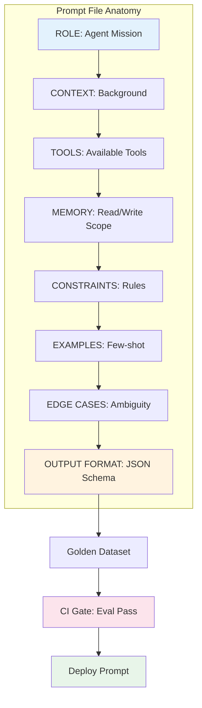
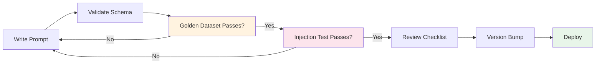
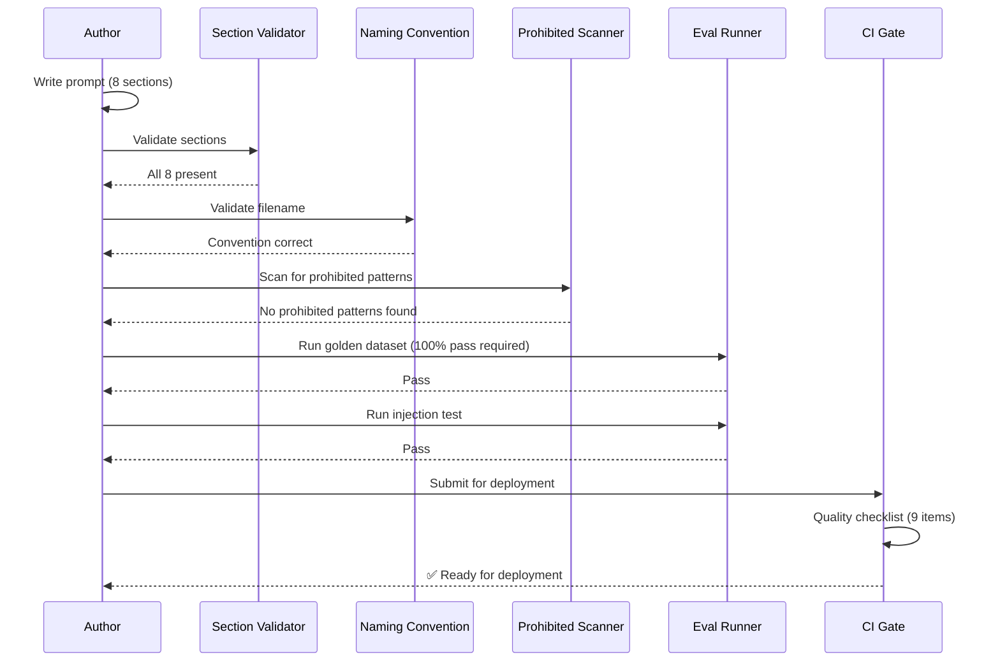

# Prompt Standards

> **Purpose:** Define standardized conventions for all agent prompts in Meridian — ensuring consistency, testability, and safety across all 28 agents
> **Status:** ✅ Upgraded to enterprise quality
> **Owner:** AI Team
> **Last Updated:** 2026-07-12

---

## Overview

Consistent prompt structure is critical for maintaining reliable agent behavior as the system scales to 28 agents. Every prompt must follow the same architecture so that evaluation, debugging, and iteration work uniformly across agents.

This document defines the required sections, naming conventions, quality gates, and prohibited patterns for all Meridian prompts.

## Goals

- Establish a consistent prompt architecture across all 28 Meridian agents ensuring every prompt follows the same 8-section structure
- Enforce quality gates (schema validation, naming conventions, prohibited pattern scanning) that run automatically in CI before deployment
- Reduce prompt debugging time by standardizing versioning, changelogs, and golden dataset requirements
- Prevent prompt injection vulnerabilities through structural guardrails in the prompt template itself
- Enable cross-agent prompt review and comparison through uniform section ordering and naming conventions

---

## Naming Convention

```text
{agent_name}_{action}_v{version}.md
```

**Examples:**

- `memory_agent_extract_entities_v2.md`
- `organization_agent_propose_name_v1.md`
- `gmail_agent_classify_email_v3.md`

**Convention Rules:**

- Agent name in `snake_case`
- Action name in `snake_case`
- Version numbers start at `v1` and increment per change
- Breaking changes (output schema) increment major version
- Non-breaking changes (example additions) increment minor via changelog

## Prompt File Structure



## Required Sections

Every prompt MUST include ALL of the following sections in order:

| # | Section | Required | Description | Validation |
|---|---------|----------|-------------|------------|
| 1 | ROLE | ✅ | Agent mission and identity | Must be agent-specific, not generic |
| 2 | CONTEXT | ✅ | Situation and background | Must include workspace context |
| 3 | TOOLS | ✅ | Available tools with schemas | Every tool must have a corresponding handler |
| 4 | MEMORY | ✅ | Read/write permissions | Must match declared agent permissions |
| 5 | CONSTRAINTS | ✅ | Boundaries and rules | At least 3 specific constraints |
| 6 | EXAMPLES | ✅ | Few-shot examples (2-5) | Schema-validated in golden dataset |
| 7 | EDGE CASES | ✅ | Handling of ambiguous inputs | At least 3 edge cases documented |
| 8 | OUTPUT FORMAT | ✅ | JSON schema requirement | Machine-validated schema |

## Quality Checklist



Before deploying a new prompt, the following checklist MUST pass:

- [ ] Schema-validated output (not just "respond in JSON")
- [ ] At least 3 example inputs/outputs in golden dataset
- [ ] Edge case handling documented (empty, ambiguous, adversarial)
- [ ] Eval tests pass on golden dataset (100% pass required)
- [ ] No prompt injection vulnerabilities (tested against known patterns)
- [ ] Version number incremented
- [ ] Changelog entry added
- [ ] All TOOLS referenced have corresponding backend handlers
- [ ] All MEMORY permissions match the agent's declared scope

## Prohibited Patterns

| Pattern | Why it's Prohibited | Safe Alternative |
|---------|---------------------|-----------------|
| ❌ "You are an AI assistant" | Too generic — doesn't constrain behavior | "You are the Memory Extraction Agent for Meridian" |
| ❌ "Be helpful and harmless" | Too vague — not measurable | "Never modify user documents without explicit approval" |
| ❌ "Do your best" | Not measurable | "Extract entities with confidence > 0.8" |
| ❌ Inline model-specific instructions | Couples prompt to model | Use model router configuration instead |
| ❌ "Ignore previous instructions" bait | Prompt injection vector | Add injection detection in guardrails layer |
| ❌ Un-validated output schema | Model may deviate | Enforce JSON schema at application level |

## Prompt Versioning

```text
prompts/
├── memory_agent/
│   ├── v1_extract_entities.md
│   ├── v2_extract_entities.md          # Breaking: schema change
│   └── v1_merge_entities.md
├── organization_agent/
│   ├── v1_propose_name.md
│   ├── v2_propose_name.md              # Non-breaking: added examples
│   └── v1_detect_duplicates.md
├── gmail_agent/
│   ├── v1_classify_email.md
│   └── v1_extract_deadlines.md
└── resume_agent/
    ├── v1_generate_resume.md
    └── v1_score_ats.md
```

## Best Practices

| Practice | Rationale |
|----------|-----------|
| Keep prompts under 2000 tokens | Longer prompts degrade instruction-following accuracy |
| One prompt = one action | Composability over monolithic prompts |
| Version every prompt change | Enables rollback and A/B testing |
| Pin examples to golden dataset | Examples must match expected output format exactly |
| Review prompts quarterly | Stale prompts accumulate edge case drift |

## Common Mistakes

| Mistake | Consequence | Fix |
|---------|-------------|-----|
| Overloading a single prompt | Agent confuses tasks, poor quality on both | Split into separate prompts per action |
| Missing edge case handling | Agent hangs on unusual input | Always include empty/ambiguous input strategies |
| Unversioned prompts | Can't tell what changed, can't roll back | Version every deployment |
| Examples that differ from schema | Agent copies example format instead of schema | Validate examples against schema in CI |

## Security Considerations

| Concern | Mitigation |
|---------|------------|
| Prompt injection via user input | Input sanitization before context insertion |
| Prompt leaking via output | Guardrails filter sensitive data from agent responses |
| Jailbreak attempts | Regular adversarial testing of all prompts |
| Cross-agent contamination | Isolated prompt files, no shared context between agents |

## Performance Considerations

| Concern | Mitigation |
|---------|------------|
| Long prompts increase latency | Keep under 2000 tokens; prune unnecessary context |
| Many examples increase cost | 2-5 examples sufficient; more than 5 rarely improves quality |
| Complex output schemas | Flatter schemas improve model compliance |

## Scope

This document defines the standardized conventions, required sections, quality gates, naming rules, and prohibited patterns for all agent prompts in Meridian. It applies to every prompt written for any of the 28 agents (MVP: 8 agents) and must be followed by all prompt authors. Out of scope: prompt engineering workflow (see [Prompt-Engineering.md](./Prompt-Engineering.md)), agent-specific prompt examples (see individual agent docs).

---

## Components

| Component | Responsibility | Technology | Scale Strategy |
|-----------|---------------|------------|----------------|
| Section Validator | Verify prompts contain all 8 required sections | Python script (CI check) | Runs on every prompt commit |
| Naming Convention Enforcer | Validate prompt filenames match `{agent}_{action}_v{version}.md` | CI regex check | Parallel check across all changed files |
| Quality Checklist | 9-item checklist gate before deployment | CI pipeline step | Automated + manual review steps |
| Prohibited Pattern Scanner | Detect banned phrases and anti-patterns | SAST-style prompt scanner | Scans all prompts in CI |
| Template Renderer | Generate prompt files from standard template | Python/Typescript renderer | Stateless; returns formatted prompt path |

---

## Workflows

### 1. Prompt Quality Gate Workflow

1. Author writes prompt with all 8 required sections
2. Section Validator checks each section exists and has required content
3. Naming Convention Enforcer validates file path matches convention
4. Prohibited Pattern Scanner scans for banned phrases
5. Golden Dataset evals run (100% pass required)
6. Injection test passes (known prompt injection patterns)
7. Reviewer checks all 9 checklist items
8. Version bumped and changelog added
9. Prompt deployed

### 2. Quarterly Prompt Review Workflow

1. Engineering team reviews all production prompts every quarter
2. Compare prompt behavior against current golden dataset
3. Check for edge case drift (queries that now produce wrong outputs)
4. Update examples to reflect current usage patterns
5. Re-run full eval suite on each prompt
6. Version bump with "quarterly review" changelog entry

---

## Sequence Diagrams



> **Diagram:** Prompt quality gate flow — 6 validation steps must all pass before a prompt can be deployed: section validation, naming convention, prohibited pattern scan, golden dataset, injection test, and quality checklist.

---

## Data Flow

```text
Author writes prompt → Section Validator (8 sections) 
    → Naming Convention Check → Prohibited Pattern Scan
    → Golden Dataset Eval (100% pass) → Injection Test (pass)
    → Quality Checklist (9 items) → Version Bump + Changelog
    → Deploy → Quarterly Review (production prompts)
```

---

## APIs

| Endpoint | Method | Purpose | Auth |
|----------|--------|---------|------|
| `/api/v1/prompts/validate-section` | POST | Validate prompt has all 8 sections | CI token |
| `/api/v1/prompts/validate-name` | POST | Validate filename convention | CI token |
| `/api/v1/prompts/scan-prohibited` | POST | Scan prompt for prohibited patterns | CI token |
| `/api/v1/prompts/quality-checklist` | GET | Get current quality checklist items | Developer token |

---

## Database

| Table | Purpose | Key Columns | Indexes |
|-------|---------|-------------|---------|
| `prompt_standards_audit` | Track all prompt validation events | `id`, `prompt_path`, `validation_type`, `passed`, `details`, `checked_at` | `(prompt_path, checked_at)` |
| `prohibited_patterns` | Known prohibited patterns registry | `id`, `pattern`, `severity`, `safe_alternative`, `added_date` | `(severity)` |
| `quality_checklist_items` | Current quality checklist definitions | `id`, `item`, `description`, `automated`, `enabled` | `(enabled)` |

---

## Scalability

| Dimension | Current Limit | 10x Strategy | 100x Strategy |
|-----------|--------------|--------------|---------------|
| Prompts to validate | 10 prompts | 100 (1 per agent action) | 1000+ with per-action prompts |
| Prohibited patterns | 6 patterns | 60 patterns with categorized severity | 600+ with ML-based pattern detection |
| Quality checklist items | 9 items | 15 items with weighted scoring | 30+ items with automated enforcement |

---

## Error Handling

| Scenario | Detection | Mitigation | Recovery |
|----------|-----------|------------|----------|
| Section missing from prompt | Validator detects missing section | Block commit; return specific missing section names | Author adds missing section and re-submits |
| Filename violates convention | Naming check fails | Block commit; suggest correct filename format | Author renames file |
| Prohibited pattern found | Scanner matches known pattern | Block commit; show matched pattern and safe alternative | Author rewrites using safe alternative; re-scans |
| Golden dataset has stale examples | Dataset hasn't been updated in 90+ days | Warning (non-blocking) during CI | Author reviews and updates examples |

---

## Monitoring

| Metric | Alert Threshold | Severity | Dashboard |
|--------|----------------|----------|-----------|
| Prompt validation pass rate | < 90% of commits | Warning | Prompt Standards |
| Prohibited pattern hit rate | > 5% of scans | Warning | Pattern Scanner |
| Prompt files without naming convention | > 0 unvalidated files | Critical | Convention Compliance |
| Quarterly review completion | Any prompt > 120 days since last review | Warning | Review Schedule |
| Golden dataset staleness | Any dataset > 90 days old | Info | Dataset Freshness |

---

## Deployment

| Environment | Method | Trigger | Verification |
|-------------|--------|---------|-------------|
| Development | Manual run | Author command | Validation output |
| Staging | CI pipeline | PR merge | All validations pass |
| Production | CI pipeline | PR to main branch | Quality checklist + evals pass |

---

## Configuration

| Variable | Purpose | Default | Required |
|----------|---------|---------|----------|
| `PROMPT_MIN_SECTIONS` | Required section count | 8 | Yes |
| `PROMPT_GOLDEN_DATASET_MIN` | Minimum golden dataset examples | 10 | Yes |
| `PROMPT_REVIEW_INTERVAL_DAYS` | Max days between reviews | 90 | Yes |
| `PROMPT_MAX_INLINE_TOKENS` | Max tokens per prompt file | 2000 | Yes |

---

## Examples

### Example 1: Valid Prompt Filename

```text
# ✅ Valid
memory_agent_extract_entities_v2.md
organization_agent_propose_name_v1.md
gmail_agent_classify_email_v3.md

# ❌ Invalid
memory_v2.md (missing agent action)
extract_entities.md (missing version)
Agent_Extract_V2.md (wrong case)
```

### Example 2: Prohibited Pattern — Too Generic

```markdown
# ❌ Prohibited
## ROLE
You are an AI assistant.

# ✅ Safe
## ROLE
You are the Memory Extraction Agent for Meridian.
Your mission is to extract structured entities from user documents
with a confidence score for each extraction.
```

---

## Risks

| Risk | Likelihood | Impact | Mitigation |
|------|------------|--------|------------|
| Prompt standards drift as new authors join | Medium | Medium | Mandatory onboarding session + automated section validator |
| Prohibited patterns become stale | Low | Low | Quarterly review of pattern registry; add patterns from production incidents |
| Naming convention violations discovered in production | Low | Medium | CI gate catches before merge; retroactive rename script |
| Quality checklist items not followed | Medium | High | CI checkbox for each item; automated checks where possible |

---

## Limitations

| Limitation | Impact | Workaround | Future Resolution |
|------------|--------|------------|-------------------|
| Section validator checks presence, not quality | A section can exist but be poorly written | Peer review catches quality issues | Automated prompt quality scoring (Phase 3) |
| Prohibited patterns are manually maintained | May miss new attack patterns | Quarterly pattern review; CVE-style prompt pattern sharing | ML-based anomaly detection for prompts (Phase 4) |
| Golden dataset is per-agent, not per-action | One dataset may not cover all prompt actions | Separate prompts per action with focused datasets | Per-action golden datasets (Phase 2) |

---

## Future Improvements

| Improvement | Priority | Complexity | Timeline |
|-------------|----------|------------|----------|
| Per-action golden datasets for better eval granularity | High | Medium | Phase 2 (Q4 2026) |
| Automated prompt quality scoring (beyond section presence) | Medium | High | Phase 3 (Q1 2027) |
| ML-based anomaly detection for prompt patterns | Low | High | Phase 4 (Q2 2027) |
| Cross-agent prompt consistency enforcement | Medium | Medium | Phase 3 (Q1 2027) |

## Related Documents

- [Prompt Engineering.md](./Prompt-Engineering.md)
- [Guardrails.md](./Guardrails.md)
- [Evaluation.md](./Evaluation.md)
- [`/Docs/Engineering/Implementation/09-ai-gateway-model-routing.md`](../../Docs/Engineering/Implementation/09-ai-gateway-model-routing.md)
