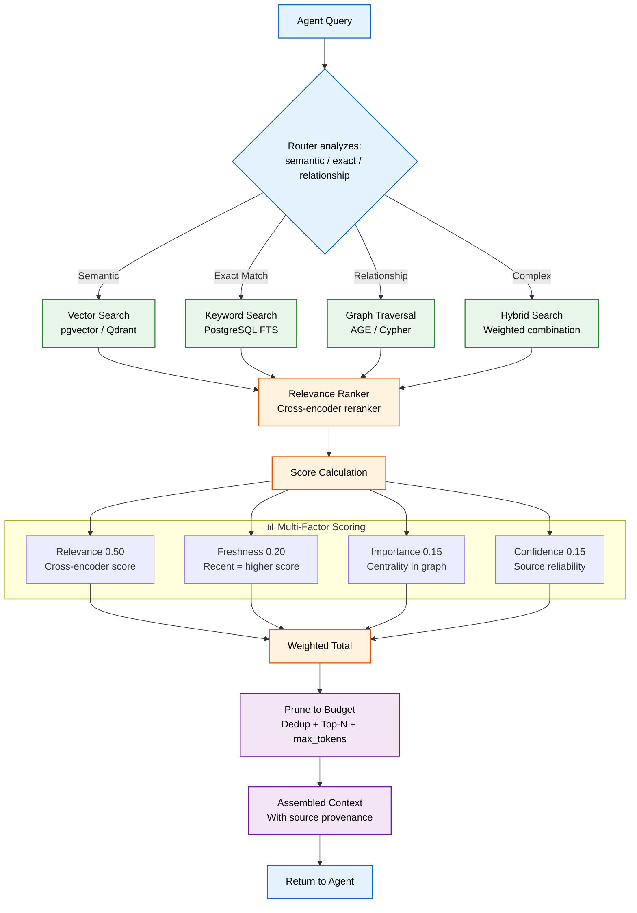
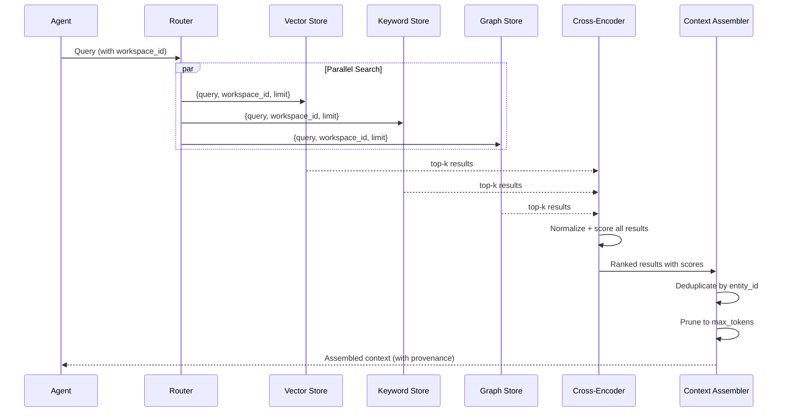

# RAG (Retrieval-Augmented Generation)

> **Purpose:** Define the RAG architecture for Meridian
> **Status:** ✅ Upgraded to enterprise quality
> **Owner:** AI Team
> **Last Updated:** 2026-07-13
> **Status:** ✅ Upgraded to enterprise quality
> **Owner:** AI Team
> **Last Updated:** 2026-07-13
> **Canonical source:** [`/Docs/Meridian-Complete-Documentation.md#65-agentic-rag`](../../Docs/Meridian-Complete-Documentation.md#65-agentic-rag)

## Overview

Retrieval-Augmented Generation (RAG) is the mechanism by which Meridian agents access relevant context from memory stores before generating a response. Rather than relying on model knowledge alone, every agent retrieves up-to-date information from the user's knowledge graph, vector store, and structured records — ensuring responses are grounded in the user's actual data. Meridian's RAG pipeline is agentic: the requesting agent selects the optimal retrieval strategy (vector, keyword, graph, or hybrid) per query rather than running a fixed pipeline.

This document defines the RAG architecture, retrieval methods (vector, keyword, graph, hybrid), multi-factor ranking (Relevance × 0.50 + Freshness × 0.20 + Importance × 0.15 + Confidence × 0.15), context assembly, and permission-scoped retrieval. It complements the deeper Agentic-RAG document by providing the foundational RAG concepts. This is the starting point for engineers new to Meridian's retrieval system.

## Goals

- Enable agents to retrieve relevant context from all three memory stores (vector, keyword, graph) in a single query
- Achieve sub-3-second end-to-end retrieval latency through parallel store execution and efficient ranking
- Maintain >90% Precision@5 relevance through cross-encoder re-ranking and multi-factor scoring
- Enforce workspace_id permission scoping at the retrieval layer to prevent cross-tenant data leakage
- Provide assembled context with full source provenance within a configurable token budget (default 8000 tokens)

---

## Retrieval Strategy

Meridian uses **Agentic RAG** — the calling agent selects the retrieval strategy per query, rather than a single fixed pipeline.

## Retrieval Pipeline



> **Diagram:** Agentic RAG pipeline — the **Router** classifies each query to select the optimal search strategy (vector, keyword, graph, or hybrid). Results are scored by four weighted factors, pruned to the token budget with deduplication, and assembled with source provenance for the requesting agent.

## Retrieval Methods

| Method | Best For | Example Query |
|--------|----------|---------------|
| Vector search | Semantic similarity | "Find things related to machine learning" |
| Keyword search | Exact terms | "Course code CS229" |
| Graph traversal | Relationship queries | "Everything connected to Skill: React" |
| Hybrid | Most real queries | Weighted combination of above |

## Retrieval Pipeline

```text
Query from Agent
    ↓
Hybrid Search (vector + keyword + graph)
    ↓
Re-rank by Relevance + Freshness + Importance + Confidence
    ↓
Prune to context budget (most relevant, non-redundant set)
    ↓
Assembled Context with source provenance
    ↓
Return to Agent
```

## Ranking Scores

| Score | What It Measures | Effect |
|-------|-----------------|--------|
| Relevance | How well memory matches query | Primary ranking signal |
| Freshness | How recently confirmed true | Stale memories down-weighted |
| Importance | Centrality to person's identity | Boosts core facts over trivia |
| Confidence | Source reliability count | Low-confidence flagged, not hidden |

## Common Mistakes

| Mistake | Why It's a Problem |
|---------|-------------------|
| Using a single retrieval strategy for all query types | Vector search fails for exact-term queries (course codes, tool names); keyword search misses conceptually related content; graph traversal misses semantic neighbors — no single strategy fits all |
| No re-ranking after hybrid search | Vector and keyword results each have their own scoring — without a cross-encoder re-ranker that normalizes scores across strategies, the final result order is arbitrary |
| Retrieving more context than the model can process | If the combined retrieved context exceeds the model's context window, the excess is silently truncated — important information at the end of the retrieved set is lost |
| Not filtering retrieved results by permission scope | A retrieval query should never return documents the requesting agent does not have permission to read — permission filtering must happen at the retrieval layer, not after |

## Best Practices

| Practice | Rationale |
|----------|-----------|
| Let the calling agent choose the retrieval strategy per query | Agentic RAG means the agent analyzes the query and selects vector, keyword, graph, or hybrid search — one size fits none for retrieval |
| Always run a cross-encoder re-ranker after hybrid search | Cross-encoder scores are more accurate than embedding cosine similarity for ranking relevance — re-rank the top 20 results to find the 5 best |
| Prune retrieved results to fit the model's context budget | After re-ranking, select the top-N results whose total token count stays within the model's context window minus the prompt and output tokens |
| Apply permission filtering at the retrieval query level | Add workspace_id and permission scope filters to every database query at the retrieval layer — never retrieve results and then filter afterward (wasteful and potentially leaky) |

## Security

| Concern | Mitigation |
|---------|------------|
| Cross-workspace data leakage via shared vector stores | Vector stores must be scoped per workspace — a query from workspace A should never return results from workspace B, even if the vector similarity matches |
| Content from deleted documents remaining in retrieval | When a document is deleted by the user, its embeddings and extracted entities must also be removed — stale retrieval results from deleted documents violate the user's expectation of privacy |
| Re-ranking exposing document snippets to unauthorized agents | The re-rancher cross-encoder processes document text snippet by snippet — ensure the re-rancher only sees documents the requesting agent has permission to read |

## Performance

| Concern | Guideline |
|---------|-----------|
| Hybrid search latency vs sequential execution | Running vector, keyword, and graph searches sequentially adds 3x latency — parallelize the three searches and merge results in memory to stay within the 2s context assembly budget |
| Cross-encoder throughput limitations | Cross-encoder re-rankers are slower than embedding similarity (typically 20-50ms per pair) — only re-rank the top 20-30 results, not the entire result set |
| Token budget management for context assembly | Track token usage during context assembly — if the pruned context still exceeds the budget, use a summarization pass rather than silently truncating the tail of the retrieved set |

## Scope

This document defines the Retrieval-Augmented Generation (RAG) architecture for Meridian — covering retrieval methods, ranking scores, pipeline stages, and permission-scoped retrieval. It applies to all agents that retrieve context from memory stores. Out of scope: agentic strategy selection (see [Agentic-RAG.md](./Agentic-RAG.md)), embedding model details (see [Embeddings.md](./Embeddings.md)), knowledge graph specifics (see [Knowledge-Graph.md](./Knowledge-Graph.md)).

---

## Components

| Component | Responsibility | Technology | Scale Strategy |
|-----------|---------------|------------|----------------|
| Vector Search | Semantic similarity search | pgvector (MVP) → Qdrant (Enterprise) | IVFFlat indexing; auto-sharding |
| Keyword Search | Exact-term full-text search | PostgreSQL FTS (GIN indexes) | Read replicas; GIN index optimization |
| Graph Traversal | Entity relationship queries | AGE (MVP) → Neo4j (Enterprise) | Depth-limited traversal (3-4 hops) |
| Cross-Encoder Re-ranker | Score normalization across strategies | SentenceTransformers | GPU-accelerated; re-rank top 30 only |
| Context Assembler | Dedup, prioritize, prune to budget | Python | Stateless; scales horizontally |
| Token Budget Tracker | Enforce max_tokens per agent request | In-memory accumulator | Configurable per agent type |

---

## Workflows

### 1. Full RAG Retrieval Workflow

1. Agent sends query to RAG pipeline
2. Router analyzes: semantic / exact / relationship signals
3. Parallel search across vector + keyword + graph stores
4. Cross-encoder re-ranker normalizes and scores all results
5. Results sorted by weighted score (Relevance × 0.50 + Freshness × 0.20 + Importance × 0.15 + Confidence × 0.15)
6. Deduplicate by entity_id (keep highest score)
7. Prune to token budget (stop when max_tokens reached)
8. Assemble context string with source provenance
9. Return assembled context to agent

### 2. Permission-Scoped Retrieval Workflow

1. Agent requests context with workspace_id
2. All store queries include workspace_id filter
3. Cross-encoder re-ranker only processes documents within agent's permission scope
4. Assembled context excludes any results outside agent's scope
5. Logging records workspace_id for audit trail

---

## Sequence Diagrams



> **Diagram:** The RAG pipeline handles full hybrid retrieval — parallel search across three stores, cross-encoder normalization, deduplication, and token-budget pruning before delivery to the agent.

---

## Data Flow

```text
Agent Query → Router (analyze: semantic/exact/relationship)
    → Parallel Search: Vector Store + Keyword Store + Graph Store
    → Cross-Encoder Re-ranker (normalize scores)
    → Sort by weighted score (R+F+I+C)
    → Deduplicate → Prune to token budget
    → Assemble context with source provenance
    → Return to Agent
```

---

## APIs

| Endpoint | Method | Purpose | Auth |
|----------|--------|---------|------|
| `/api/v1/rag/retrieve` | POST | Full RAG retrieval pipeline | Agent token |
| `/api/v1/rag/retrieve/vector` | POST | Vector-only search | Agent token |
| `/api/v1/rag/retrieve/keyword` | POST | Keyword-only search | Agent token |
| `/api/v1/rag/retrieve/graph` | POST | Graph-only traversal | Agent token |
| `/api/v1/rag/config` | GET | Get RAG pipeline config per agent | Service token |

---

## Database

| Table/Store | Purpose | Key Columns | Indexes |
|-------------|---------|-------------|---------|
| `vector_embeddings` | Embeddings for semantic search | `id`, `vector` (vector(1536)), `workspace_id`, `source_type`, `source_id` | `(workspace_id)` BRIN, IVFFlat on vector |
| `fts_documents` | Full-text search index | `id`, `workspace_id`, `content`, `tsvector_content` | GIN on `tsvector_content` |
| `graph_edges` | Entity relationship graph | `id`, `source_id`, `target_id`, `relationship_type`, `workspace_id` | `(source_id)`, `(target_id)` |

---

## Scalability

| Dimension | Current Limit | 10x Strategy | 100x Strategy |
|-----------|--------------|--------------|---------------|
| Vector search | 10K vectors (exact) | 10M vectors (IVFFlat) | 1B+ vectors (Qdrant cluster) |
| FTS throughput | 100 queries/sec | 1000 queries/sec (read replicas) | 10K queries/sec (sharded PG) |
| Graph traversal | 1M edges | 100M edges (Neo4j) | 1B+ edges (Neo4j cluster) |
| Re-ranker throughput | 30 pairs/query | 100 pairs/query (GPU) | 500 pairs/query (dedicated GPU cluster) |

---

## Error Handling

| Scenario | Detection | Mitigation | Recovery |
|----------|-----------|------------|----------|
| One store fails | Per-store timeout | Continue with results from other stores | Log failure; retry failed store on next query |
| Cross-encoder unavailable | Connection error | Skip re-ranking; use raw embedding similarity | Queue re-ranking async; alert on-call |
| All stores return empty | Zero results from all queries | Return empty context with flag | Router retries with broader strategy |
| Token budget exceeded after assembly | Context > max_tokens | Truncate lowest-score results | Log pruning count; adjust default limit |

---

## Monitoring

| Metric | Alert Threshold | Severity | Dashboard |
|--------|----------------|----------|-----------|
| RAG retrieval latency (p95) | > 3s | Critical | RAG Performance |
| Empty result rate | > 5% | Warning | RAG Quality |
| Cross-encoder latency | > 500ms per query | Warning | Re-ranker Performance |
| Token budget utilization | > 90% of budget | Info | Context Budget |
| Store availability | Any store down | Critical | Store Health |

---

## Deployment

| Environment | Method | Trigger | Verification |
|-------------|--------|---------|-------------|
| Development | Docker Compose | Code push | Integration tests |
| Staging | Helm chart | PR merge | Pipeline smoke test |
| Production | Progressive rollout | Manual approval | Shadow mode vs baseline |

---

## Configuration

| Variable | Purpose | Default | Required |
|----------|---------|---------|----------|
| `RAG_PARALLEL_SEARCH_ENABLED` | Enable parallel store queries | true | No |
| `RAG_RE_RANK_TOP_K` | Number of results to re-rank | 30 | Yes |
| `RAG_DEFAULT_LIMIT` | Default top-k per store | 20 | Yes |
| `RAG_MAX_TOKENS` | Max context tokens per query | 8000 | Yes |
| `RAG_CROSS_ENCODER_MODEL` | Cross-encoder model name | cross-encoder/ms-marco-MiniLM-L-6-v2 | Yes |

---

## Examples

### Example 1: Basic RAG Retrieval

```python
response = await rag_pipeline.retrieve(
    query="What machine learning skills does the user have?",
    workspace_id="ws_123",
    agent_name="resume_agent"
)

# Result:
# Assembled context:
# [Source: resume.pdf | Score: 0.92] Python, TensorFlow, PyTorch (3 years)
# [Source: linkedin_profile | Score: 0.85] Completed Stanford CS229 ML course
# Total tokens: 1240 / 8000
```

---

## Risks

| Risk | Likelihood | Impact | Mitigation |
|------|------------|--------|------------|
| Cross-tenant data leakage via shared stores | Low | Critical | Workspace_id enforced on every query at database level |
| Stale content returned after document deletion | Medium | High | Cascade delete embeddings on document deletion |
| Re-ranker bias toward certain content types | Low | Medium | Periodic calibration; sample audit of re-ranker decisions |
| Token budget too low for complex queries | Medium | Medium | Per-agent type budgets; priority agents get larger budget |

---

## Limitations

| Limitation | Impact | Workaround | Future Resolution |
|------------|--------|------------|-------------------|
| Cross-encoder re-ranker limited to top 30 | Low-ranking relevant results may be missed | Increase top-k to 50 with caching | Two-stage ranking (Phase 2) |
| No multi-modal retrieval (text + images) | Visual content not retrievable | Text descriptions of images | Multi-modal embeddings (Phase 4) |
| FTS is English-only | Non-English queries perform poorly | Basic stemmer for common languages | Multi-language FTS (Phase 3) |
| No result dedup across stores pre-merge | Duplicates from different stores waste ranker time | Dedup at store level before sending to re-ranker | Multi-store dedup in query planner (Phase 2) |

---

## Future Improvements

| Improvement | Priority | Complexity | Timeline |
|-------------|----------|------------|----------|
| Two-stage ranking (bi-encoder pre-filter + cross-encoder re-rank) | High | Medium | Phase 2 (Q4 2026) |
| Multi-store dedup in query planner | Medium | Medium | Phase 2 (Q4 2026) |
| Multi-language full-text search | Low | High | Phase 3 (Q1 2027) |
| Multi-modal retrieval (text + images) | Low | High | Phase 4 (Q2 2027) |

## Related Documents

- [Agentic RAG.md](./Agentic-RAG.md)
- [Embeddings.md](./Embeddings.md)
- [`/Docs/Meridian-Complete-Documentation.md#65-agentic-rag`](../../Docs/Meridian-Complete-Documentation.md#65-agentic-rag)
