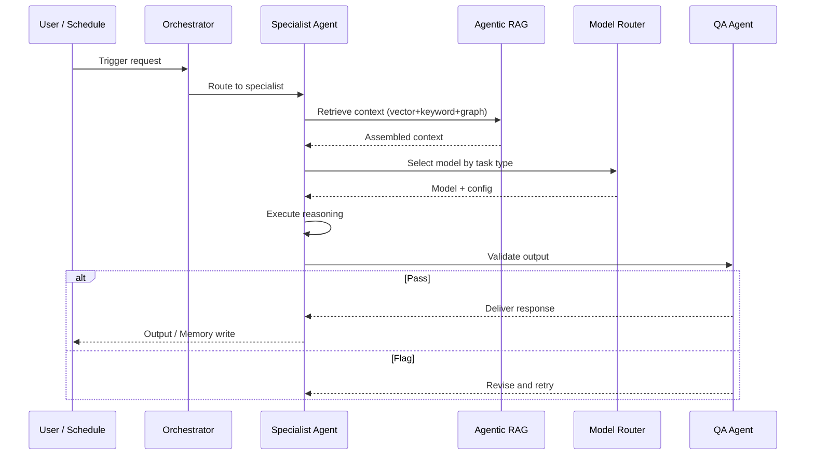

# AI System

> **Purpose:** Agent system, memory architecture, retrieval, and AI gateway documentation
> **Status:** ✅ Upgraded to enterprise quality
> **Owner:** AI Team
> **Last Updated:** 2026-07-13

## Overview

The AI system is the intelligence layer of the Vaeloom platform — a coordinated ecosystem of specialized AI agents, a continuously compounding memory system, agentic retrieval pipelines, and a model routing gateway. It transforms raw user data (documents, emails, code repositories) into structured, queryable knowledge that powers automated workflows across career management, document organization, job search, and communication. The system currently orchestrates 8 specialist agents (MVP) scaling to 28 agents (Enterprise).

This document serves as the index and entry point for all AI system documentation. It provides a high-level overview of the agent architecture, memory system, retrieval pipeline, and model routing — linking to detailed technical documents for each component. Use this README as your starting point to understand how Vaeloom's AI components fit together and where to find detailed documentation for each subsystem.

## Goals

- Provide a single navigation entry point for all 24 AI system documentation files in the AI/ directory
- Maintain an up-to-date index of agent rosters, memory system architecture, retri eval pipeline, and model routing guides
- Keep agent count and system status in sync with actual deployment (8 agents MVP, 28 agents Enterprise)
- Link to conceptual docs as primary references and implementation docs as supplementary sources
- Enable new team members to understand the AI system architecture from a single page

---

## What's here

| Document | Location | Status |
|----------|----------|--------|
| Agent Workflows (end-to-end) | [`/Docs/03-agent-workflow.md`](../../Docs/03-agent-workflow.md) | ✅ Excellent |
| Agent Roster (v1 — 8 agents) | [`/Docs/01-Vaeloom-MVP-Spec.md#5-agent-roster-v1`](../../Docs/01-Vaeloom-MVP-Spec.md#5-agent-roster-v1) | ✅ Excellent |
| Agent Roster (full — 28 agents) | [`/Docs/Vaeloom-Complete-Documentation.md#52-full-roster`](../../Docs/Vaeloom-Complete-Documentation.md#52-full-roster) | ✅ Excellent |
| Memory & Knowledge Graph | [`/Docs/04-memory-knowledge-graph.md`](../../Docs/04-memory-knowledge-graph.md) | ✅ Excellent |
| Memory System (in depth) | [`/Docs/Vaeloom-Complete-Documentation.md#6-memory-system-in-depth`](../../Docs/Vaeloom-Complete-Documentation.md#6-memory-system-in-depth) | ✅ Excellent |
| Agentic RAG & Retrieval | [`/Docs/Vaeloom-Complete-Documentation.md#65-agentic-rag`](../../Docs/Vaeloom-Complete-Documentation.md#65-agentic-rag) | ✅ Good |
| AI Gateway & Model Routing | [`/Docs/Engineering/Implementation/09-ai-gateway-model-routing.md`](../../Docs/Engineering/Implementation/09-ai-gateway-model-routing.md) | ✅ Good |
| Evaluation Framework | [`/Docs/Engineering/Implementation/10-evaluation-framework.md`](../../Docs/Engineering/Implementation/10-evaluation-framework.md) | ✅ Good |
| Model Benchmarking | [`./Model-Benchmarking.md`](./Model-Benchmarking.md) | 🆕 New |
| AI Versioning | [`./AI-Versioning.md`](./AI-Versioning.md) | 🆕 New |
| Prompt Library | [`./Prompt-Library.md`](./Prompt-Library.md) | 🆕 New |
| Eval Datasets | [`./Eval-Datasets.md`](./Eval-Datasets.md) | 🆕 New |
| AI Cost Strategy | [`./AI-Cost-Strategy.md`](./AI-Cost-Strategy.md) | 🆕 New |
| Agent Prompt Specs | [`./Agent-Prompt-Specs.md`](./Agent-Prompt-Specs.md) | 🆕 New |

## Agent architecture overview

```mermaid
graph LR
    U["👤 User / Schedule"] --> O["🧠 Orchestrator"]
    O --> SA["🤖 Specialist Agent"]
    SA --> RAG["Agentic RAG Retrieval<br/>Vector + Keyword + Graph"]
    RAG --> RE["Reasoning<br/>(Model Call)"]
    RE --> QA["✅ QA Agent Validation"]
    QA -->|Pass| OUT["📤 Output → User / Memory Write"]
    QA -->|Flag| SA

    classDef user fill:#e3f2fd,stroke:#1565c0
    classDef agent fill:#e8f5e9,stroke:#2e7d32
    classDef process fill:#fff3e0,stroke:#e65100
    classDef gate fill:#f3e5f5,stroke:#7b1fa2

    class U user
    class O,SA agent
    class RAG,RE process
    class QA gate
    class OUT process
```



### Agent flow breakdown

1. **User or Schedule** triggers a request
2. **Orchestrator** routes to the right specialist agent
3. **Agentic RAG** retrieves context (vector + keyword + graph)
4. **Reasoning** happens via model call
5. **QA Agent** validates output — passes or flags for retry
6. **Output** delivered to user or written to memory

## Memory system overview

```mermaid
graph TD
    MT["6 Memory Types<br/>Profile · Document · Career<br/>Episodic · Preference · Working"]
    MT --> KG["Knowledge Graph<br/>Entities + Relationships"]
    MT --> VS["Vector Store<br/>Embeddings + Semantic Search"]
    KG --> RAG["Agentic RAG<br/>Agent chooses strategy per query"]
    VS --> RAG
    RAG --> RR["Re-ranked by<br/>Relevance + Freshness + Importance + Confidence"]

    classDef mem fill:#e3f2fd,stroke:#1565c0
    classDef store fill:#e8f5e9,stroke:#2e7d32
    classDef rag fill:#fff3e0,stroke:#e65100
    classDef rank fill:#f3e5f5,stroke:#7b1fa2

    class MT mem
    class KG,VS store
    class RAG rag
    class RR rank
```



## Common Mistakes

| Mistake | Why It's a Problem |
|---------|-------------------|
| Referencing agent docs without verifying they match the live system | Docs that describe a 8-agent roster while the live system runs 12+ agents create confusion — keep the index's agent count and reference links in sync with the actual system |
| Adding new AI docs without updating this index | This README serves as the entry point for AI system navigation — a new document on Prompt Testing that isn't listed here might as well not exist for most readers |
| Linking to implementation docs as canonical references | Implementation files (`Engineering/Implementation/*.md`) change faster than conceptual docs — link to the conceptual doc first, reference implementation as supplementary |
| Treating this index as write-once | As agents are added, models are upgraded, and the RAG pipeline evolves, this index must be updated to reflect the current state of the AI system |

## Best Practices

| Practice | Rationale |
|----------|-----------|
| Verify every link in this index points to an existing file on every update | Broken links in the primary navigation erode trust — run a link checker or manually verify each reference when adding a new entry |
| Keep the agent count and roster in sync with the actual deployment | If the system runs 28 agents (enterprise) or 8 agents (MVP), the index's overview text and diagrams should reflect the correct count |
| Link to conceptual docs as primary references, implementation as secondary | Conceptual docs (`/Docs/Vaeloom-Complete-Documentation.md`) are more stable than implementation files — readers should start with the "what" before the "how" |
| Add a new entry every time a significant AI doc is created | The index should always list every document in the AI/ directory — a doc not listed here may be overlooked by new team members |

## Security

| Concern | Mitigation |
|---------|------------|
| This index leaking system architecture topology | The AI system overview diagram reveals agent structure, data flow, and component relationships — this is not sensitive but should not be shared outside the team without review |
| Outdated security links referencing old guardrail versions | If the guardrail model or safety policies change, the index must update its references — stale security references could mislead developers about the current safety posture |
| Index exposing internal implementation paths | File paths in the index (e.g., `Engineering/Implementation/*.md`) are internal; these links should not appear in user-facing documentation |

## Performance

| Concern | Guideline |
|---------|-----------|
| Index page load time with many Mermaid diagrams | This page has multiple Mermaid diagrams that can delay rendering — consider lazy-loading diagrams or using static diagram images for the main navigation pages |
| Link resolution speed for cross-repo references | Cross-directory relative links (e.g., `../../Engineering/...`) resolve at render time — if the doc set grows, consider a docs build step that resolves links at build time |
| Diagram caching for repeated navigation | Mermaid diagrams are re-rendered on every page load — cache the rendered SVG output so returning to this index shows instant content |

## Scope

This document serves as the index and entry point for all AI system documentation in Vaeloom — covering agent architecture, memory system, retrieval pipeline, model routing, and evaluation framework. It links to all detailed technical documents in the `AI/` directory and related system docs. Out of scope: implementation details for any specific component (see linked docs for depth).

---

## Components

| Component | Responsibility | Location | Documentation |
|-----------|---------------|----------|---------------|
| Orchestrator | Route user/schedule requests to specialist agents | `apps/orchestrator/` | [Agent Workflows](../../Docs/03-agent-workflow.md) |
| Specialist Agents | Execute domain-specific tasks | `apps/agents/` | [Agent Roster](../../Docs/01-Vaeloom-MVP-Spec.md#5-agent-roster-v1) |
| Agentic RAG | Context retrieval with strategy selection | `apps/retrieval/` | [Agentic RAG.md](./Agentic-RAG.md) |
| Memory System | Knowledge graph + vector store + structured records | `apps/memory/` | [Memory.md](./Memory.md) |
| Model Router | Optimal model selection per task type | `apps/orchestrator/` | [Model-Routing.md](./Model-Routing.md) |
| QA Agent | Output validation before delivery | `apps/guardrails/` | [Guardrails.md](./Guardrails.md) |

---

## Workflows

### 1. End-to-End Agent Workflow

1. User or scheduled trigger initiates request
2. Orchestrator routes to the appropriate specialist agent
3. Agentic RAG retrieves relevant context (vector + keyword + graph)
4. Model Router selects optimal model for the task
5. Reasoning engine executes (simple classification or complex CoT)
6. QA Agent validates output (schema, policy, safety)
7. Output delivered to user or written to memory

### 2. System Update Workflow

1. New model released → update model registry in Model Router
2. New agent added → add to agent roster and orchestrator routing
3. New memory type defined → add to memory system schema
4. All changes → update this README with new links and status

---

## Sequence Diagrams



> **Diagram:** End-to-end agent flow — Orchestrator routes to specialist agent, which retrieves context via Agentic RAG, uses Model Router for model selection, executes reasoning, and passes through QA Agent validation before delivery.

---

## Data Flow

```text
User/Schedule → Orchestrator → Specialist Agent
    → Agentic RAG (context: vector + keyword + graph)
    → Model Router (model selection by task type)
    → Reasoning Execution (simple/complex)
    → QA Validation (schema + policy + safety)
    → Output → User / Memory Write
    → All actions logged to Audit Log
```

---

## APIs

| Endpoint | Method | Purpose | Auth |
|----------|--------|---------|------|
| `/api/v1/orchestrate` | POST | Send request to orchestrator for agent execution | User token |
| `/api/v1/agents/list` | GET | List available agents for user | User token |
| `/api/v1/memory/export` | GET | Export all user memory | User token |
| `/api/v1/system/health` | GET | System health check | Monitoring token |

---

## Database

| Table | Purpose | Key Columns |
|-------|---------|-------------|
| `agent_registry` | Registered agents and their capabilities | `agent_name`, `model_preference`, `memory_types`, `autonomy_level` |
| `orchestrator_routing` | Routing rules for orchestrator | `trigger_type`, `agent_name`, `priority`, `timeout_ms` |
| `system_config` | Global system configuration | `key`, `value`, `updated_at` |

---

## Error Handling

| Scenario | Detection | Mitigation | Recovery |
|----------|-----------|------------|----------|
| Specialist agent unavailable | Orchestrator request timeout | Return error to user with alternative suggestions | Retry with different agent; alert on-call |
| Context retrieval fails | No results from any store | Agent proceeds with empty context; flags low confidence | RAG pipeline retried automatically |
| Model Router cannot find suitable model | No model matching task type | Fall back to default model; log routing failure | Update routing rules; alert AI team |
| QA validation fails repeatedly | Output flagged > 2 times | Return graceful error to user; log incident | Revise agent prompt; add regression test |

---

## Monitoring

| Metric | Alert Threshold | Severity | Dashboard |
|--------|----------------|----------|-----------|
| Agent execution latency (p95) | > 10s | Critical | Agent Performance |
| Orchestrator routing success rate | < 99% | Critical | Orchestrator Health |
| QA validation pass rate | < 90% | Warning | QA Quality |
| Memory write success rate | < 99% | Critical | Memory Pipeline |
| Model Router cost per day | > $10/day | Warning | Cost Tracking |

---

## Deployment

| Environment | Method | Trigger | Verification |
|-------------|--------|---------|-------------|
| Development | Docker Compose | Code push | Unit + integration tests |
| Staging | Helm chart | PR merge | End-to-end agent test |
| Production | Progressive rollout | Manual approval | Shadow mode with baseline comparison |

---

## Configuration

| Variable | Purpose | Default | Required |
|----------|---------|---------|----------|
| `AI_SYSTEM_MAX_AGENTS` | Max concurrent agents | 8 | Yes |
| `AI_SYSTEM_DEFAULT_REGION` | Default processing region | us-east-1 | Yes |
| `AI_SYSTEM_ENABLE_AGENTIC_RAG` | Enable RAG pipeline | true | No |
| `AI_SYSTEM_ENABLE_QA_VALIDATION` | Enable QA Agent | true | No |

---

## Risks

| Risk | Likelihood | Impact | Mitigation |
|------|------------|--------|------------|
| AI system docs out of sync with deployed system | Medium | Medium | Add doc update to release checklist |
| Agent roster grows without updating this index | Medium | High | Automate index generation from agent registry |
| Cross-repo links break after restructuring | Low | Medium | Link checker in CI; test all links on build |

---

## Limitations

| Limitation | Impact | Workaround | Future Resolution |
|------------|--------|------------|-------------------|
| Manual index maintenance | Updates require human action | Add index update to deployment checklist | Auto-generated index from codebase (Phase 2) |
| No diagram versioning | Diagrams may show outdated architecture | Caption includes date of last review | Versioned diagram assets (Phase 3) |
| No search across AI docs | Must browse manually | Index file lists all docs | Doc search engine (Phase 4) |

---

## Examples

```bash
# AI service management
Vaeloom ai models list
Vaeloom ai model deploy --name Vaeloom-llm-v2 --instance-type gpu-large

# Inference
Vaeloom ai infer --model Vaeloom-llm-v2 --prompt "Summarize this document"
```

```python
# Use the Vaeloom AI SDK
from Vaeloom.ai import InferenceClient

client = InferenceClient(model="Vaeloom-llm-v2")
response = client.generate(
    system="You are a helpful assistant.",
    messages=[{"role": "user", "content": "Summarize this document."}],
    max_tokens=500,
)
print(response.text)
```

```bash
# AI operations
Vaeloom ai monitor --model Vaeloom-llm-v2
Vaeloom ai logs --model Vaeloom-llm-v2 --level error --since 1h
```

## Future Improvements

| Improvement | Priority | Complexity | Timeline |
|-------------|----------|------------|----------|
| Auto-generated index from agent registry | High | Medium | Phase 2 (Q4 2026) |
| Versioned diagram assets | Low | Low | Phase 3 (Q1 2027) |
| Doc search engine across AI documentation | Medium | High | Phase 4 (Q2 2027) |

## Related Documents

- [Agentic RAG.md](./Agentic-RAG.md)
- [Memory.md](./Memory.md)
- [Model-Routing.md](./Model-Routing.md)
- [Guardrails.md](./Guardrails.md)
- [Evaluation.md](./Evaluation.md)

- [`Architecture/`](../Architecture/) — System architecture these agents run on
- [`Engineering/`](../Engineering/) — Implementation of agent services
- [`Security/`](../Security/) — QA Agent, permission model for agents
