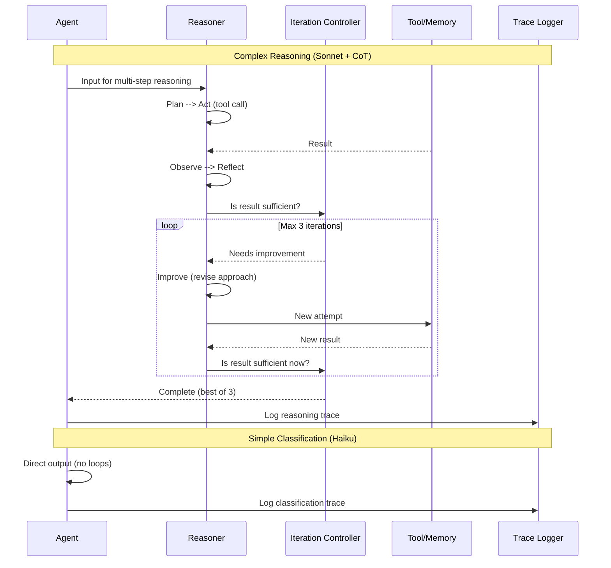

# Reasoning

> **Purpose:** Define the AI reasoning architecture for Vaeloom's agents
> **Status:** ✅ Upgraded to enterprise quality
> **Owner:** AI Team
> **Last Updated:** 2026-07-13

## Overview

Reasoning is how Vaeloom's agents think — the process by which they turn input and retrieved context into decisions, classifications, and generated content. Every agent follows a consistent Plan → Act → Observe → Reflect → Improve loop, but the reasoning depth varies by task: simple classification tasks use direct output with Claude Haiku (fast and cheap), while complex reasoning tasks (scoring, gap analysis, conflict resolution) use chain-of-thought with Claude Sonnet (capable, auditable). The iteration controller caps the Reflect → Improve cycle at 3 iterations to balance quality and latency.

This document defines the reasoning architecture, agent-specific reasoning approaches, the agentic loop state machine, model selection by reasoning depth, and the iteration controller. It serves AI engineers designing agent behavior, backend engineers implementing the reasoning service, and QA engineers auditing reasoning traces. The two-path model — simple direct output vs. complex chain-of-thought — optimizes for cost and latency without sacrificing quality where it matters.

## Goals

- Support two-tier reasoning (simple direct output for classification, complex CoT for reasoning tasks) matched to task complexity
- Cap the Reflect → Improve iteration loop at 3 cycles to prevent runaway agent execution
- Log every reasoning trace with full chain-of-thought for complex tasks to enable post-hoc audit and debugging
- Achieve sub-3-second latency for simple classification tasks and sub-8-second latency for complex reasoning
- Match model selection to reasoning depth (Haiku for simple, Sonnet for complex) to optimize cost-quality tradeoff

---

## Reasoning Strategy

Different agents use different reasoning approaches depending on their task:

| Agent | Reasoning Approach | Model |
|-------|-------------------|-------|
| Memory Agent | Structured extraction (JSON-in, JSON-out) | Claude Sonnet |
| Organization Agent | Classification + pattern matching | Claude Haiku |
| Resume Agent | Template-based generation with gap detection | Claude Sonnet |
| ATS Agent | Scoring with specific criteria | Claude Haiku |
| Job Search Agent | Multi-criteria ranking | Claude Sonnet |
| Gmail Agent | Classification with confidence threshold | Claude Haiku |
| Scheduler Agent | Constraint satisfaction | Claude Haiku |
| QA Agent | Validation against rules | Claude Sonnet |

## Agentic Loop



```mermaid
stateDiagram-v2
    direction LR

    state Idle : 💤 Waiting for input
    state Plan : 📋 Determine approach
    state Act : âš¡ Execute planned action
    state Observe : 👀 Evaluate result
    state Reflect : 🤔 Is result correct?
    state Improve : 🔧 Adjust & retry
    state Complete : ✅ Task complete
    state Error : ❌ Max iterations / fatal

    [*] --> Idle : Agent ready
    Idle --> Plan : Input received
    Plan --> Act : Strategy determined
    Act --> Observe : Action executed

    Observe --> Reflect : Result captured

    Reflect --> Complete : ✅ Correct & sufficient
    Reflect --> Improve : ⚠️ Needs adjustment
    Reflect --> Act : 🔄 Retry exactly

    Improve --> Plan : New approach needed
    Improve --> Act : Same approach, different params

    Plan --> Error : Strategy unknown
    Observe --> Error : Fatal error
    Act --> Error : Tool failure / timeout

    Complete --> Idle : Ready for next task
    Error --> Idle : Logged, returning to idle

    note right of Reflect
        Complex reasoning (CoT):
        Sonnet model
        Logged for audit
    end note

    note right of Act
        Simple classification:
        Haiku model
        Direct output, no CoT
    end note

    note right of Complete : Result returned to Orchestrator

```

> **Diagram:** Every agent follows the same reasoning loop — **Plan → Act → Observe → Reflect → Improve**. The Reflect state determines whether to complete, improve (with a new plan), retry (same approach), or error. Simple classification tasks skip CoT and use direct output with the Haiku model. Complex reasoning uses the Sonnet model with chain-of-thought and full audit logging.

---

## Reasoning Strategy

Different agents use different reasoning approaches depending on their task:

| Agent | Reasoning Approach | Model |
|-------|-------------------|-------|
| Memory Agent | Structured extraction (JSON-in, JSON-out) | Claude Sonnet |
| Organization Agent | Classification + pattern matching | Claude Haiku |
| Resume Agent | Template-based generation with gap detection | Claude Sonnet |
| ATS Agent | Scoring with specific criteria | Claude Haiku |
| Job Search Agent | Multi-criteria ranking | Claude Sonnet |
| Gmail Agent | Classification with confidence threshold | Claude Haiku |
| Scheduler Agent | Constraint satisfaction | Claude Haiku |
| QA Agent | Validation against rules | Claude Sonnet |

## Agentic Loop

Every agent follows the same reasoning loop:

```text
Plan → Act → Observe → Reflect → Improve
```

## Common Mistakes

| Mistake | Why It's a Problem |
|---------|-------------------|
| Using chain-of-thought reasoning for simple classification tasks | CoT adds 2-3x token cost and latency for tasks where a direct answer is equally accurate — classification, pattern matching, and simple extraction don't benefit from step-by-step reasoning |
| Not logging the reasoning trace for audit | Agent decisions that involve multi-step reasoning are impossible to debug or audit if only the final output is recorded — the reasoning chain must be logged for post-hoc review |
| Allowing infinite retry loops in the Reflect → Improve cycle | An agent that keeps finding ways to improve its output may loop indefinitely — cap the number of iterations in the Reflect → Improve cycle (max 3) and output the best result |
| Treating all agent tasks with the same reasoning depth | A task like "classify this email" needs a fast, shallow reasoning pass; "score this resume against a job description" needs deep reasoning — match reasoning depth to task complexity |

## Best Practices

| Practice | Rationale |
|----------|-----------|
| Use direct output (no chain-of-thought) for simple classification tasks | Classification/pattern → Haiku model with direct JSON output — saves 2-3x cost vs CoT without sacrificing accuracy for simple tasks |
| Log the complete reasoning chain for any task that undergoes the Plan → Act → Observe → Reflect → Improve loop | Full reasoning traces enable debugging when the agent produces incorrect outputs — without the trace, a wrong answer is a black box |
| Cap the Reflect → Improve cycle at max 3 iterations | Three passes are typically sufficient for iterative improvement — beyond that, diminishing returns and increasing latency suggest the agent should fall back to asking for user clarification |
| Match model selection to reasoning depth required | Simple reasoning (classification, matching) → Haiku (fast, cheap); complex reasoning (scoring, conflict resolution, gap analysis) → Sonnet (capable, moderate cost) |

## Security

| Concern | Mitigation |
|---------|------------|
| Reasoning trace exposing internal system prompts | If the reasoning chain is logged and later accessible via the audit log, it could reveal the agent's system prompt — ensure reasoning traces are stored separately from user-facing audit logs |
| CoT hallucination in high-stakes reasoning steps | Chain-of-thought can produce plausible-sounding intermediate reasoning steps that are factually incorrect — the final output must be validated against memory, not just assumed correct because the reasoning path was logical |
| Incomplete reasoning in the Reflect step masking errors | An agent that reflects "looks correct" without actually verifying the critical step may skip necessary corrections — the Reflect step should have explicit verification criteria, not open-ended self-assessment |

## Performance

| Concern | Guideline |
|---------|-----------|
| CoT token cost overhead | Chain-of-thought reasoning consumes 2-3x more output tokens than direct generation — for high-volume tasks (email classification, document categorization), use direct output with Haiku instead of CoT with Sonnet |
| Iterative improvement latency | Each Plan → Act → Observe → Reflect → Improve cycle adds 2-5s of model inference time — budget this into agent latency targets and set appropriate user expectations for complex reasoning tasks |
| Reasoning trace storage cost | Logging full reasoning traces for every agent action adds storage overhead — set a retention policy (30 days for reasoning traces vs permanent for action records) and compress older traces |

## Scope

This document defines the AI reasoning architecture for Vaeloom's agents — covering the Plan → Act → Observe → Reflect → Improve loop, reasoning approaches per agent type, model selection by reasoning depth, and iterative improvement limits. Applies to all 28 agents (MVP: 8 agents) across all execution modes. Out of scope: model routing (see [Model-Routing.md](./Model-Routing.md)), prompt engineering (see [Prompt-Engineering.md](./Prompt-Engineering.md)), guardrail validation (see [Guardrails.md](./Guardrails.md)).

---

## Components

| Component | Responsibility | Technology | Scale Strategy |
|-----------|---------------|------------|----------------|
| Reasoner (Complex) | Execute Plan→Act→Observe→Reflect→Improve loop | Claude Sonnet with chain-of-thought | Dedicated for reasoning-heavy agents |
| Reasoner (Simple) | Direct output classification/matching | Claude Haiku (no CoT) | Shared pool for high-volume, low-complexity tasks |
| Iteration Controller | Cap the Reflect→Improve cycle at max 3 iterations | Python orchestrator | Per-agent configurable max iterations |
| Reasoning Trace Logger | Capture full reasoning chain for audit | Async event bus | 30-day retention; compressed after 7 days |
| Model Router Adapter | Select model based on reasoning depth required | Router client library | Stateless; routes per task type |

---

## Workflows

### 1. Complex Reasoning Workflow (Sonnet + CoT)

1. Agent receives input requiring multi-step reasoning
2. Plan: Determine approach (scoring, gap analysis, conflict resolution)
3. Act: Execute first reasoning step via tool call or model query
4. Observe: Capture result of action
5. Reflect: Evaluate correctness; is result sufficient?
6. If correct → Complete: Return result
7. If needs improvement → Improve: Revise approach or params
8. Loop Reflect→Improve up to max 3 iterations
9. Log complete reasoning trace for audit

### 2. Simple Classification Workflow (Haiku, direct output)

1. Agent receives input requiring classification or matching
2. Model returns direct JSON output (no step-by-step reasoning)
3. No Observe→Reflect→Improve loop needed
4. Output validated by QA Agent
5. Trace logged: short (classification decision only)

---

## Sequence Diagrams



> **Diagram:** Two reasoning paths — complex tasks (Sonnet + CoT) go through Plan→Act→Observe→Reflect→Improve with max 3 iterations. Simple classification (Haiku) returns direct output without looping. Both paths log traces.

---

## Data Flow

```text
Agent Input → Reasoning Depth Classification
    → [Simple: Classification/Matching] → Haiku → Direct JSON Output → QA Validation
    → [Complex: Scoring/Conflict/Gap] → Sonnet → Plan→Act→Observe→Reflect→Improve
    → Complete (best result, max 3 iterations)
    → Reasoning Trace → Audit Log (30-day retention)
    → Final Output → QA Validation → Agent Response
```

---

## APIs

| Endpoint | Method | Purpose | Auth |
|----------|--------|---------|------|
| `/api/v1/reasoning/execute` | POST | Execute reasoning with specified depth | Agent token |
| `/api/v1/reasoning/classify-depth` | POST | Classify reasoning depth needed for input | Service token |
| `/api/v1/reasoning/trace/{request_id}` | GET | Get reasoning trace for audit | Admin token |
| `/api/v1/reasoning/config/{agent}` | GET | Get reasoning config per agent | Service token |

---

## Database

| Table | Purpose | Key Columns | Indexes |
|-------|---------|-------------|---------|
| `reasoning_traces` | Full reasoning chain logs | `id`, `agent_name`, `task_type`, `iterations`, `trace_json`, `model`, `created_at` | `(agent_name, created_at)`, `(task_type)` |
| `reasoning_config` | Per-agent reasoning configuration | `agent_name`, `reasoning_depth`, `max_iterations`, `model_preference`, `cot_enabled` | `(agent_name)` UNIQUE |
| `reasoning_metrics` | Aggregated reasoning performance | `agent_name`, `task_type`, `avg_iterations`, `avg_latency_ms`, `avg_tokens_consumed` | `(agent_name, task_type)` |

---

## Scalability

| Dimension | Current Limit | 10x Strategy | 100x Strategy |
|-----------|--------------|--------------|---------------|
| Complex reasoning calls | 10 req/s (Sonnet) | 100 req/s (Sonnet pool) | 1000 req/s (dedicated reasoning workers) |
| Simple classification calls | 100 req/s (Haiku) | 1000 req/s (Haiku pool) | 10K req/s (shared classification service) |
| Trace storage | 10K traces/day | 100K traces/day (compressed after 7d) | 1M traces/day (sampling + compression) |

---

## Error Handling

| Scenario | Detection | Mitigation | Recovery |
|----------|-----------|------------|----------|
| Iteration exceeds max (3) | Iteration Controller enforces cap | Return best result from completed iterations | Log; cap value is configurable per agent |
| CoT hallucination in intermediate step | Observer detects contradiction with known facts | Reflect step includes verification criteria | Flag for QA Agent; include in reasoning trace |
| Model unavailable for reasoning depth | Model Router returns error | Fall back to simpler model; reduce reasoning depth | Retry with original model (up to 3 attempts) |
| Trace log write exceeds storage | Storage monitoring alert | Enable trace sampling (1:100 for high-volume agents) | Archive old traces; increase retention config |

---

## Monitoring

| Metric | Alert Threshold | Severity | Dashboard |
|--------|----------------|----------|-----------|
| Iteration count per task | Avg > 2.5 | Warning | Reasoning Efficiency |
| Complex reasoning latency (p95) | > 8s | Critical | Reasoning Performance |
| Simple classification accuracy | < 95% | Critical | Classification Quality |
| Trace storage growth | > 1GB/day | Warning | Trace Storage |
| Fallback to simpler model rate | > 10% of requests | Warning | Model Routing |

---

## Deployment

| Environment | Method | Trigger | Verification |
|-------------|--------|---------|-------------|
| Development | Docker Compose | Code push | Reasoning unit tests |
| Staging | Helm chart | PR merge | Golden dataset reasoning evals |
| Production | Progressive rollout | Manual approval | Shadow compare iteration counts vs baseline |

---

## Configuration

| Variable | Purpose | Default | Required |
|----------|---------|---------|----------|
| `REASONING_MAX_ITERATIONS` | Max Reflect→Improve cycles | 3 | Yes |
| `REASONING_SIMPLE_MODEL` | Model for simple classification | claude-haiku | Yes |
| `REASONING_COMPLEX_MODEL` | Model for complex reasoning | claude-sonnet | Yes |
| `REASONING_TRACE_RETENTION_DAYS` | Trace log retention | 30 | Yes |
| `REASONING_SIMPLE_TASK_TYPES` | Task types that use simple mode | classification,matching,extraction | Yes |

---

## Examples

### Example 1: Complex Reasoning (Resume Scoring)

```python
# Resume Agent scores resume against job description
result = await reasoner.execute_complex(
    input_data={
        "resume": "3 years ML experience, Python, TensorFlow",
        "job_description": "Senior ML Engineer - requires 5+ yrs, PyTorch",
        "task_type": "scoring"
    }
)
# Iteration 1: Score = 0.65 (gap in years + PyTorch skill)
# Iteration 2: Identified transferable skills → Score = 0.72
# Iteration 3: Final score = 0.75 with gap analysis
# Result: { "score": 0.75, "gaps": ["years_experience", "pytorch"], "strengths": ["ml_background"] }
```

---

## Risks

| Risk | Likelihood | Impact | Mitigation |
|------|------------|--------|------------|
| CoT hallucination creates plausible-sounding but wrong output | Medium | High | Validate final output against memory; do not trust reasoning path alone |
| Agent loops in Reflect→Improve indefinitely | Low | Medium | Hard cap at max_iterations (3); return best result |
| Reasoning trace exposes system prompts | Low | High | Traces stored separately from user-facing logs; 30-day retention limit |
| Simple classification used for complex task | Low | Medium | Reasoning depth classifier must correctly route; fall back to complex on confidence < 0.7 |

---

## Limitations

| Limitation | Impact | Workaround | Future Resolution |
|------------|--------|------------|-------------------|
| Max 3 iterations limits improvement on complex tasks | Some tasks need more refinement | Accept best-of-3 result | Adaptive iteration limit based on task complexity (Phase 2) |
| CoT adds 2-3x token cost | Higher cost per complex reasoning call | Use simple mode where appropriate | Optimized CoT with token-efficient prompting (Phase 3) |
| No parallel reasoning paths | All iterations are sequential | N/A | Multi-path reasoning with best-result selection (Phase 4) |
| Reasoning trace is text-only | Hard to analyze patterns programmatically | Manual review of sampled traces | Structured reasoning trace format (Phase 3) |

---

## Future Improvements

| Improvement | Priority | Complexity | Timeline |
|-------------|----------|------------|----------|
| Adaptive iteration limit based on task complexity | High | Medium | Phase 2 (Q4 2026) |
| Structured reasoning trace format for analysis | Medium | Medium | Phase 3 (Q1 2027) |
| Optimized CoT with token-efficient prompting | Medium | Medium | Phase 3 (Q1 2027) |
| Multi-path parallel reasoning with best-result selection | Low | High | Phase 4 (Q2 2027) |

## Related Documents

- [Model Routing.md](./Model-Routing.md)
- [Prompt Engineering.md](./Prompt-Engineering.md)
- [Evaluation.md](./Evaluation.md)
- [Agentic RAG.md](./Agentic-RAG.md)
