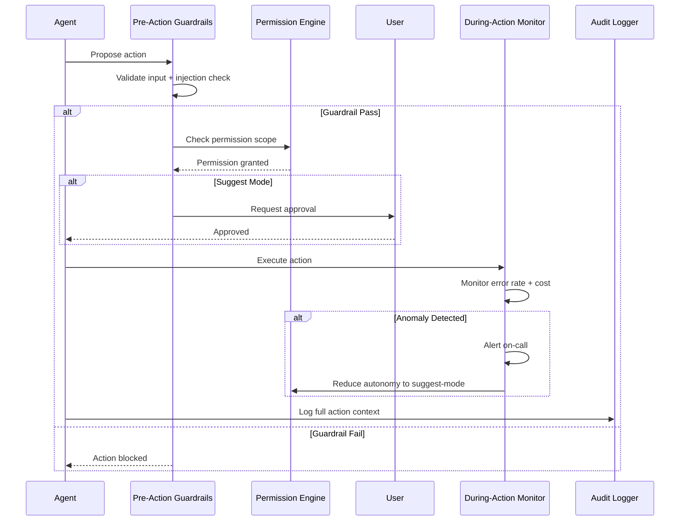

# AI Safety

> **Purpose:** Define AI safety mechanisms for Vaeloom
> **Status:** ✅ Upgraded to enterprise quality
> **Owner:** AI Team
> **Last Updated:** 2026-07-13

## Overview

AI safety is the foundational constraint layer for Vaeloom's agent system — ensuring that autonomous AI agents operate within strict boundaries that protect user data, prevent unauthorized actions, and maintain human oversight. Safety is implemented as a five-layer architecture: pre-action guardrails (input validation, injection detection, permission checks), during-action monitoring (error rates, approval tracking, anomaly detection), post-action audit (append-only logs, undo capability), scheduled safety reviews (weekly to quarterly), and a set of permanently prohibited actions that no agent can ever perform.

This document defines the safety principles, layered architecture, prohibited capabilities, safety review cadence, and escalation workflows for all Vaeloom agents. It is intended for AI engineers, security engineers, product managers, and compliance teams who need to understand and audit Vaeloom's AI safety posture. The system defaults to suggest-mode for every agent — autonomy must be earned through demonstrated accuracy and user trust.

## Goals

- Default every agent to suggest-mode requiring user approval before any consequential action
- Enforce five permanently prohibited capabilities: no file deletion, no unreviewed email, no permission modification, no spending, no cross-user access
- Maintain an append-only audit log of every agent action with full provenance for post-hoc review
- Detect and automatically reduce agent autonomy on anomaly detection scores exceeding threshold
- Run safety reviews at three tiers — weekly (engineering), monthly (engineering + product), quarterly (engineering + security)

---

## Safety Architecture

```mermaid
graph TD
    classDef pre fill:#e3f2fd,stroke:#1565c0,color:#000,stroke-width:1.5px
    classDef during fill:#e8f5e9,stroke:#2e7d32,color:#000,stroke-width:1.5px
    classDef post fill:#fff3e0,stroke:#e65100,color:#000,stroke-width:1.5px
    classDef review fill:#f3e5f5,stroke:#6a1b9a,color:#000,stroke-width:1px
    classDef prohibit fill:#ffebee,stroke:#c62828,color:#000,stroke-width:2px

    subgraph Pre["🛡️ Pre-Action: Guardrails"]
        direction TB
        P1["Input Validation<br/>Schema check on all inputs"]
        P2["Injection Detection<br/>Sanitize boundaries"]
        P3["Permission Engine<br/>Check every tool call"]
        P4["Rate Limiting<br/>Per-agent & per-user"]
    end

    subgraph During["📊 During Action: Monitoring"]
        direction TB
        D1["Error Rate Monitoring<br/>Real-time alerting"]
        D2["Approval Tracking<br/>Suggest vs auto ratio"]
        D3["Anomaly Detection<br/>Behavioral outliers"]
        D4["Cost Monitoring<br/>Spike detection"]
    end

    subgraph Post["📋 Post-Action: Audit"]
        direction TB
        O1["Append-Only Audit Log<br/>Every action recorded"]
        O2["Undo / Revert<br/>User can reverse actions"]
        O3["Post-Hoc Review<br/>Pattern analysis"]
    end

    subgraph Reviews["🔍 Safety Reviews"]
        direction TB
        R1["🟢 Weekly<br/>Approval rates, errors<br/>Engineering team"]
        R2["🟡 Monthly<br/>Incident review<br/>Engineering + Product"]
        R3["🔴 Quarterly<br/>Full safety audit<br/>Engineering + Security"]
    end

    subgraph Prohibited["🚫 Prohibited Actions"]
        direction TB
        H1["❌ Delete files<br/>Archive only"]
        H2["❌ Send email w/o review<br/>Approval required"]
        H3["❌ Modify permissions<br/>Never allowed"]
        H4["❌ Spend money<br/>Strict limits + approval"]
        H5["❌ Access other users<br/>Privacy violation"]
    end

    P1 & P2 & P3 & P4 --> D1 & D2 & D3 & D4
    D1 & D2 & D3 & D4 --> O1 & O2 & O3
    O1 & O2 & O3 --> R1 & R2 & R3
    R1 & R2 & R3 -.->|inform| H1 & H2 & H3 & H4 & H5
    H1 & H2 & H3 & H4 & H5 -.->|constrain| P1 & P2 & P3 & P4

    class P1,P2,P3,P4 pre
    class D1,D2,D3,D4 during
    class O1,O2,O3 post
    class R1,R2,R3 review
    class H1,H2,H3,H4,H5 prohibit

```



> **Diagram:** Safety operates across five layers. **Pre-Action** guardrails validate inputs, detect injection, check permissions, and rate-limit. **During Action** monitors error rates, approvals, anomalies, and costs in real-time. **Post-Action** audit logs every action in an append-only log, enables undo, and runs pattern analysis. **Safety Reviews** escalate from weekly (engineering) to quarterly (full audit with security team). **Prohibited Actions** constrain the entire system — agents can never delete files, send unreviewed email, modify permissions, spend money, or access other users' data.

---

## Safety Principles

| Principle | Implementation |
|-----------|---------------|
| Suggest-mode by default | No agent acts without approval until trust is earned |
| Reversibility | All autonomous actions are reversible |
| Auditability | Every action is logged with provenance |
| Transparency | Every suggestion shows its reasoning |
| Conservatism | When uncertain, agents ask — never guess |

## Safety Mechanisms

### Pre-Action: Guardrails

- Input validation on all agent inputs
- Prompt injection detection
- Permission Engine check on every tool call
- Rate limiting per agent

### During Action: Monitoring

- Real-time error rate monitoring
- Approval rate tracking
- Anomaly detection on agent behavior
- Cost anomaly detection

### Post-Action: Audit

- Append-only audit log
- User can undo/revert actions
- Post-hoc review for suspicious patterns
- Weekly safety review

## Prohibited Agent Capabilities

## Common Mistakes

| Mistake | Why It's a Problem |
|---------|-------------------|
| Granting autonomy before the agent has proven accuracy | Autonomy should be earned per-agent based on approval rate history — granting full autonomy to a new untested agent risks consequential errors before trust is established |
| Silently handling low-confidence outputs | Agents that guess rather than asking when uncertain create plausible-sounding but wrong results that erode user trust faster than an honest "I don't know" |
| No review process for autonomy threshold changes | Autonomy levels should require human review to increase — an agent that modified its own autonomy level could bypass the safety model entirely |
| Assuming suggest-mode alone is sufficient safety | Suggest-mode prevents execution without approval but doesn't prevent the agent from generating harmful or misleading proposals — the QA Agent must still validate before showing to the user |

## Best Practices

| Practice | Rationale |
|----------|-----------|
| Default every new agent to suggest-mode, grant autonomy per-agent based on track record | An agent with a 95% approval rate after 100 proposals may earn autonomy for specific actions — each agent and action type starts from zero trust |
| Require agents to ask the user when output confidence is below 80% | Guessing creates hard-to-detect errors that compound over time — a clear "I'm not sure" with a specific question is always safer than a confident wrong answer |
| Log every autonomy event for audit trail | Tracking autonomy grants, revocations, and the agent behavior that triggered them enables post-hoc safety reviews and pattern analysis |
| Implement a kill-switch per agent that a user can trigger at any time | Even an agent that has earned full autonomy should be instantly switchable back to suggest-mode by the user — the user always retains override authority |

## Security

| Concern | Mitigation |
|---------|------------|
| Agent self-modification of safety rules | No agent should be able to modify its own permission scopes, autonomy level, or safety policies — these are immutable from the agent's perspective and only changeable through the Permission Engine |
| Cross-agent contamination of safety state | One agent being compromised should not reduce safety for other agents — each agent's permission scope and autonomy level are independently enforced and audited |
| Audit log tampering | The agent action audit log must be append-only and immutable — a compromised agent should not be able to delete or modify its past action records to hide malicious behavior |

## Performance

| Concern | Guideline |
|---------|-----------|
| QA Agent validation latency | The QA Agent sits inline between every action-capable agent and delivery — validate that its checks complete within 1s to avoid becoming a bottleneck in the agent execution pipeline |
| Audit log write throughput | Every agent action, permission check, and QA decision writes to the audit log — ensure the write path is asynchronous (event-bus-based) to avoid blocking agent execution on log writes |
| Safety review frequency vs cost | Weekly safety reviews are appropriate for MVP; as the agent count grows to 28+ agents, automated safety dashboards can reduce manual review overhead while maintaining coverage |

## Scope

This document defines the AI safety mechanisms for Vaeloom — covering safety principles, pre/during/post-action controls, prohibited capabilities, and safety review schedules. Applies to all agents across all environments (development, staging, production). Out of scope: guardrail implementation details (see [Guardrails.md](./Guardrails.md)), QA Agent architecture (see [Guardrails.md](./Guardrails.md#qa-agent-architecture)), permission model (see [IAM.md](../Security/IAM.md)).

---

## Components

| Component | Responsibility | Technology | Scale Strategy |
|-----------|---------------|------------|----------------|
| Pre-Action Guardrails | Input validation, injection detection, rate limiting | Pydantic + Redis + custom scanner | Distributed rate limiting; stateless checking |
| Permission Engine | Check every tool call against agent's scope | Go/Node.js middleware | Cached permission sets with 5s TTL |
| During-Action Monitor | Real-time error rate, approval rate, anomaly detection | Prometheus + custom metrics | Per-agent metric aggregation |
| Post-Action Audit Logger | Append-only log of all agent actions | Append-only DB table + S3 | Partitioned by month; async write |
| Safety Review Dashboard | Weekly/monthly/quarterly review summaries | Grafana + automated reports | Scheduled report generation |

---

## Workflows

### 1. Agent Safety Check Workflow

1. Agent produces action proposal
2. Pre-Action Guardrails validate input format and check for injection
3. Permission Engine verifies action is within agent's scope
4. If agent in suggest-mode: user must approve before execution
5. During execution: monitor error rates and cost in real-time
6. After execution: append-only audit log records full action context
7. Post-hoc review (weekly) analyzes patterns

### 2. Safety Escalation Workflow

1. Guardrail detects anomalous behavior (e.g., rapid permission changes)
2. Signal sent to monitoring system
3. If anomaly score > threshold: page engineering team
4. Agent autonomy automatically reduced to suggest-mode
5. Incident review determines root cause
6. If confirmed issue: add regression test, update safety rules

---

## Sequence Diagrams



> **Diagram:** Agent safety flow — pre-action guardrails verify input and permissions, suggest-mode requires user approval, during-action monitors for anomalies, and all actions are logged to the append-only audit log.

---

## Data Flow

```text
Agent Proposal → Pre-Action Guardrails (input + injection + rate limit)
    → Permission Engine (scope check)
    → Suggest Mode? → User Approval Required
    → Execute → During-Action Monitor (error + cost + anomaly)
    → Post-Action Audit Log (append-only)
    → Safety Review (weekly → monthly → quarterly)
```

---

## APIs

| Endpoint | Method | Purpose | Auth |
|----------|--------|---------|------|
| `/api/v1/safety/check` | POST | Pre-flight safety check before execution | Agent token |
| `/api/v1/safety/report` | POST | Submit anomaly report from monitoring | Monitoring token |
| `/api/v1/safety/reviews` | GET | Get safety review schedule and status | Admin token |
| `/api/v1/safety/kill-switch/{agent}` | POST | Instantly switch agent to suggest-mode | Admin token |
| `/api/v1/safety/audit-export` | GET | Export audit log for compliance | Admin token |

---

## Database

| Table | Purpose | Key Columns | Indexes |
|-------|---------|-------------|---------|
| `safety_events` | All safety-related events (pass/fail/anomaly) | `id`, `event_type`, `agent_name`, `severity`, `details_json`, `created_at` | `(event_type, created_at)`, `(agent_name)` |
| `autonomy_changes` | Track autonomy level changes per agent | `id`, `agent_name`, `previous_autonomy`, `new_autonomy`, `reason`, `changed_by`, `changed_at` | `(agent_name)` |
| `safety_reviews` | Record of scheduled safety reviews | `id`, `review_type` (weekly/monthly/quarterly), `status`, `findings_json`, `reviewed_by`, `reviewed_at` | `(review_type, status)` |

---

## Scalability

| Dimension | Current Limit | 10x Strategy | 100x Strategy |
|-----------|--------------|--------------|---------------|
| Safety checks per second | 1000 RPS | 10K RPS (horizontal scaling) | 100K RPS (regional safety services) |
| Audit log writes | 100 writes/sec | 1000 writes/sec (async batch) | 10K writes/sec (partitioned + async) |
| Autonomy configurations | 8 agents | 28 agents (per-agent) | 1000+ agents (group-based) |

---

## Error Handling

| Scenario | Detection | Mitigation | Recovery |
|----------|-----------|------------|----------|
| Permission Engine unavailable | Timeout/connection error | Fail closed: deny all actions; log error | Auto-reconnect; restart service |
| Audit log write fails | Writes rejected by DB | Queue in memory buffer (max 1000 events) | Retry with backoff; if persistent, alert |
| Anomaly detection false alarm | Score above threshold but behavior is normal | Reduce autonomy to suggest-mode (safe default) | Review and adjust anomaly thresholds |
| Kill switch triggered in error | User fat-finger kill switch | Agent reverts to suggest-mode immediately | Admin re-enables autonomy via settings |

---

## Monitoring

| Metric | Alert Threshold | Severity | Dashboard |
|--------|----------------|----------|-----------|
| Guardrail pass rate | < 85% of requests | Warning | Safety Overview |
| Approval rate per agent | < 50% over 24h | Warning | Autonomy Dashboard |
| Anomaly score (per agent) | > 80 (out of 100) | Critical | Anomaly Detection |
| Audit log write failures | > 0 in 5 min | Critical | Audit Log Health |
| Safety review overdue | Any review > 7 days late | Warning | Review Schedule |

---

## Deployment

| Environment | Method | Trigger | Verification |
|-------------|--------|---------|-------------|
| Development | Docker Compose | Code push | Safety check unit tests |
| Staging | Helm chart | PR merge | Safety scenario integration tests |
| Production | Progressive rollout | Manual approval | Guardrail + autonomy tests pass |

---

## Configuration

| Variable | Purpose | Default | Required |
|----------|---------|---------|----------|
| `SAFETY_DEFAULT_MODE` | Default agent autonomy mode | suggest | Yes |
| `SAFETY_MAX_AUTONOMY_ATTEMPTS` | Max actions before review | 10 | Yes |
| `SAFETY_ANOMALY_THRESHOLD` | Anomaly score threshold | 80 | Yes |
| `SAFETY_AUDIT_WRITE_MODE` | sync or async | async | Yes |
| `SAFETY_KILL_SWITCH_ENABLED` | Enable instant autonomy reduction | true | No |

---

## Examples

### Example 1: Autonomous Action Approval

```python
# Agent proposes autonomous action
proposal = {
    "agent": "organization_agent",
    "action": "rename_file",
    "params": {"file_id": "f_123", "new_name": "Resume_2026.pdf"},
    "confidence": 0.95
}

# Safety check
result = safety.check(proposal)
assert result.guardrail_pass == True
assert result.permission_granted == True

# User approval (suggest mode)
if result.mode == "suggest":
    user_approved = await request_user_approval(proposal)
    if user_approved:
        await execute_action(proposal)
```

---

## Risks

| Risk | Likelihood | Impact | Mitigation |
|------|------------|--------|------------|
| Agent self-modifies safety rules | Low | Critical | Permission Engine is immutable by agents; audit logs detect attempts |
| Kill switch not effective for runaway agent | Low | High | Kill switch at Permission Engine level (not agent level); applied at next tool call |
| Anomaly detection misses sophisticated attack | Medium | High | Layered approach: guardrails + monitoring + post-hoc review |
| Safety review fatigue (too many alerts) | Medium | Medium | Tiered alerting: weekly (engineering) → quarterly (security) |

---

## Limitations

| Limitation | Impact | Workaround | Future Resolution |
|------------|--------|------------|-------------------|
| Suggest mode requires user interaction | Slows down experienced users | Per-agent autonomy earnable after track record | Adaptive autonomy based on approval history (Phase 2) |
| Anomaly detection is rule-based | Misses novel attack patterns | Manual review of threshold-triggered events | ML-based anomaly detection (Phase 3) |
| No post-hoc action reversal automation | User must manually revert actions | Suggest mode prevents most issues | One-click "undo action" (Phase 2) |
| Safety reviews are manually conducted | Scales with team size | Automated safety metrics dashboards | Automated safety report generation (Phase 3) |

---

## Future Improvements

| Improvement | Priority | Complexity | Timeline |
|-------------|----------|------------|----------|
| Adaptive autonomy based on approval history | High | Medium | Phase 2 (Q4 2026) |
| One-click "undo action" for post-hoc reversal | High | Medium | Phase 2 (Q4 2026) |
| ML-based anomaly detection for agent behavior | Medium | High | Phase 3 (Q1 2027) |
| Automated safety report generation | Low | Low | Phase 3 (Q1 2027) |

## Related Documents

- [Guardrails.md](./Guardrails.md)
- [AI Agents.md](./AI-Agents.md)
- [`/Docs/Engineering/Implementation/11-guardrails-safety.md`](../../Docs/Engineering/Implementation/11-guardrails-safety.md)
