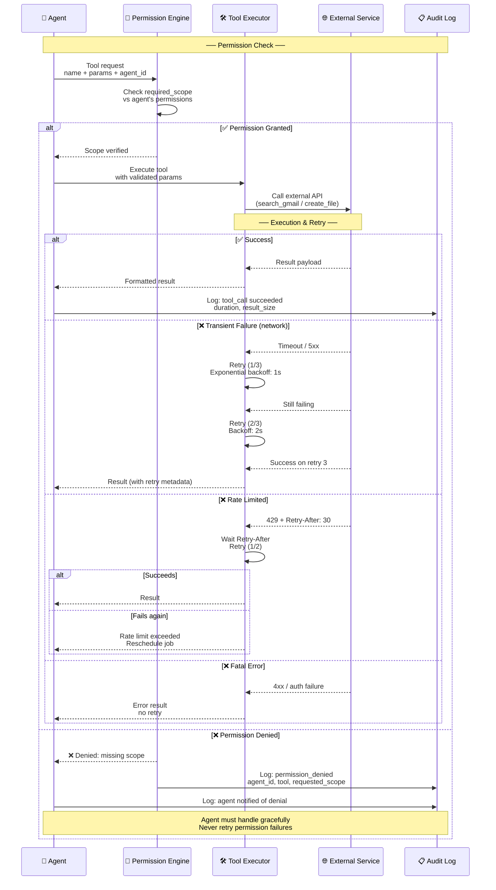
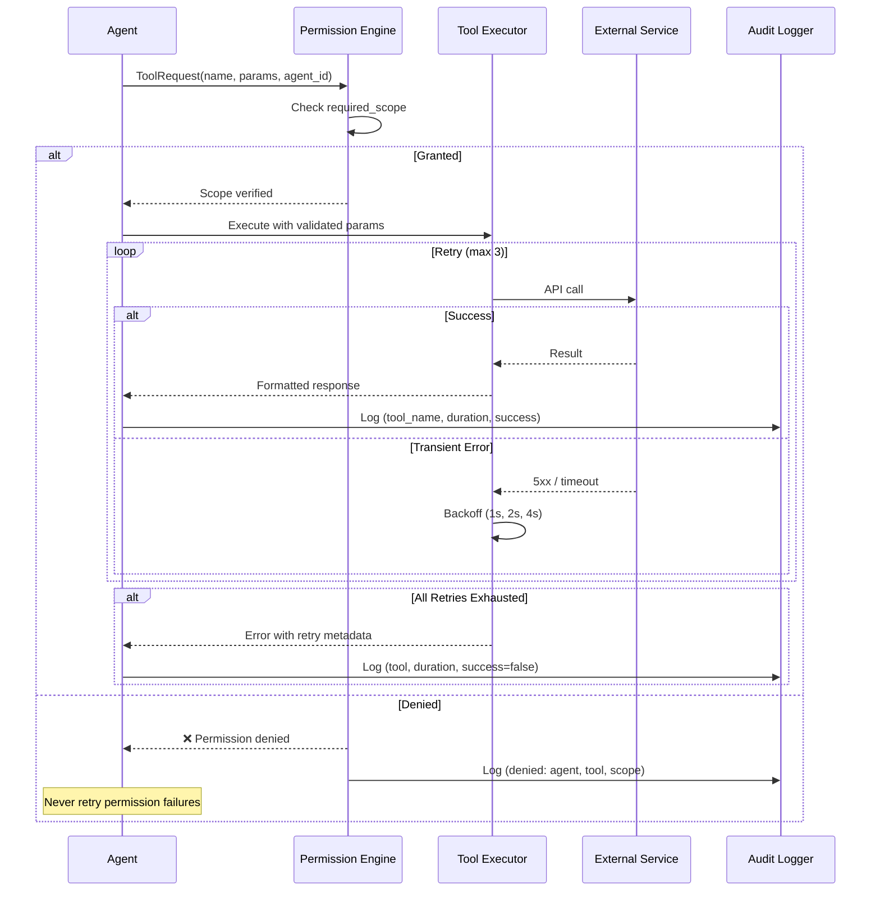

# Tool Calling

> **Purpose:** Define the tool-calling architecture for Meridian's AI agents
> **Status:** ✅ Upgraded to enterprise quality
> **Owner:** AI Team
> **Last Updated:** 2026-07-13

## Overview

Tool calling is how Meridian's agents interact with the external world — reading and writing memory, querying connected services (Gmail, GitHub), and executing actions on behalf of users. Every tool call must pass through the Permission Engine before execution, ensuring the agent has the required scope for the action. The Tool Executor handles the call with configurable retry logic: 3 attempts with exponential backoff for transient failures, 2 attempts respecting Retry-After for rate limits, and zero retries for permission or input errors.

This document defines the tool definition format (MCP-shaped), permission checking, execution flow with retry logic, tool categories (Memory Read/Write, Connector Read/Write, System), and audit logging. It serves AI engineers defining agent tool lists, platform engineers implementing the execution layer, and security engineers auditing tool usage. All tool calls are logged to an append-only audit log with metadata (tool name, duration, success/failure) — never payload content.

## Goals

- Ensure every tool call passes through Permission Engine runtime scope verification before execution
- Implement three-tier retry logic: 3 attempts exponential backoff for transient failures, 2 attempts for rate limits, zero retries for permission denials
- Maintain sub-5-second latency for connector read tools and sub-10-second latency for connector write tools
- Log all tool calls to an append-only audit trail with duration, success status, and agent identity (not payload content)
- Cache idempotent read-only tool results with configurable TTL to reduce external API calls and agent latency

---

## Tool Execution Flow



> **Diagram:** The tool execution flow starts with a **permission check** — the Permission Engine validates the agent's scope before any execution. If granted, the Tool Executor handles the call with **retry logic**: 3 retries with exponential backoff for transient failures, 2 retries respecting `Retry-After` for rate limits, and zero retries for permission or input errors. Every call is logged to the append-only audit log.

---

## Tool Definition Format

Every tool follows the MCP-shaped format:

```json
{
  "name": "search_documents",
  "description": "Search across user documents with semantic search",
  "input_schema": {
    "type": "object",
    "properties": {
      "query": { "type": "string" },
      "limit": { "type": "integer", "default": 10 }
    },
    "required": ["query"]
  },
  "output_schema": {
    "type": "array",
    "items": { "$ref": "Document" }
  },
  "required_scope": "memory.read"
}
```

## Tool Categories

| Category | Example Tools | Permission Level |
|----------|--------------|-----------------|
| Memory Read | `search_documents`, `get_entity`, `query_graph` | Read |
| Memory Write | `create_entity`, `merge_entities` | Write |
| Connector Read | `search_gmail`, `list_repos` | Read (connector-scoped) |
| Connector Write | `draft_email`, `create_file` | Act (approval-gated) |
| System | `notify_user`, `log_action` | Full (internal) |

## Tool Execution Flow

```text
Agent → Tool Request → Permission Engine Check → Tool Execution → Result → Agent
```

## Common Mistakes

| Mistake | Why It's a Problem |
|---------|-------------------|
| Retrying permission-denied tool calls | A permission failure will never succeed on retry — retrying wastes time and resources; the agent must handle the denial gracefully and inform the user |
| No timeout on external tool calls | An external service (Gmail API, GitHub API) that hangs indefinitely blocks the agent — every tool must have a configured timeout with a defined fallback behavior |
| Calling tools with unsanitized user input | User-provided values passed directly to tool parameters could cause injection or unexpected behavior — validate and sanitize all inputs before passing to tool executors |
| Logging tool call payloads containing sensitive data | Tool call parameters and results may contain user data, file contents, or PII — log metadata (tool name, duration, success/failure) but not payload content unless explicitly needed for audit |

## Best Practices

| Practice | Rationale |
|----------|-----------|
| Never retry a permission-denied tool call — log and escalate | Permission failures indicate a configuration or access issue, not a transient error — the agent should report the denial and stop, not retry indefinitely |
| Set explicit timeouts per tool category | Connector read tools (5s), connector write tools (10s), memory tools (2s), system tools (1s) — each category has different expected latency and timeout thresholds |
| Validate tool parameters against the tool's input schema before calling | Schema validation catches missing required fields, wrong types, and out-of-range values before the tool executes — prevents half-executed tool calls with partial data |
| Log tool call metadata, not payload content | Record agent_id, tool_name, duration_ms, success/failure, and error_message — skip logging the actual parameters and results unless the tool is specifically auditable (e.g., `draft_email`) |

## Security

| Concern | Mitigation |
|---------|------------|
| Tool calling without permission scope verification | Every tool call must pass through the Permission Engine, not just at startup — an agent whose permissions are revoked mid-session should be blocked on the next tool call |
| Agent calling a tool that modifies data in read-only mode | An agent running in read-only (suggest) mode should be blocked from calling write-scoped tools at the Permission Engine level — not just instructed not to in the prompt |
| Tool execution order manipulation | An agent could call multiple tools in a sequence that achieves a restricted result (e.g., read + write in separate calls to bypass a combined restriction) — the Permission Engine must evaluate composite actions |

## Performance

| Concern | Guideline |
|---------|-----------|
| Retry backoff strategy for transient failures | Use exponential backoff with jitter: 1s → 2s → 4s with ±500ms random jitter — prevents thundering herd when a service recovers and all agents retry simultaneously |
| Tool response caching for read-only operations | Read-only tools (search, list, get) with identical parameters should cache results for 5-60s depending on data freshness needs — reduces external API calls and agent latency |
| Rate-limit-aware scheduling for API calls | External APIs (Gmail, GitHub) have per-second rate limits — distribute tool calls across the rate limit window rather than batching them all at once, which triggers 429 responses and retries |

## Scope

This document defines the tool-calling architecture for Meridian's AI agents — covering the tool definition format, permission checking, execution flow with retry logic, tool categories, and audit logging. Applies to all tool calls made by all agents across all environments. Out of scope: MCP integration specifics (see [MCP.md](./MCP.md)), permission model details (see [Guardrails.md](./Guardrails.md)), QA Agent validation (see [Guardrails.md](./Guardrails.md#qa-agent-architecture)).

---

## Components

| Component | Responsibility | Technology | Scale Strategy |
|-----------|---------------|------------|----------------|
| Permission Engine | Check every tool call against agent scope | Go/Node.js middleware | Cached permission sets; async audit logging |
| Tool Executor | Execute validated tool calls with retry + timeout | Python/TypeScript async executor | Per-tool-type execution pools |
| Retry Controller | Handle transient failures with exponential backoff | Custom retry logic | Per-category retry configs |
| Rate Limit Manager | Enforce per-tool and per-agent rate limits | Redis sliding window | Distributed with Redis cluster |
| Audit Logger | Record all tool call metadata | Async event bus writer | Batch writes to append-only store |

---

## Workflows

### 1. Tool Execution Workflow (Happy Path)

1. Agent requests tool call with (name, params, agent_id)
2. Permission Engine checks required_scope vs agent's permissions
3. If granted: Tool Executor validates params against input_schema
4. Executor calls external service/memory store with timeout
5. Response validated against output_schema
6. Success response returned to agent
7. Audit log records: tool_name, duration_ms, success=true

### 2. Tool Execution Workflow (Retry Path)

1. External service returns 5xx or times out
2. Retry Controller: attempt 1 with 1s backoff
3. If fails: attempt 2 with 2s backoff
4. If fails: attempt 3 with 4s backoff (max 3 retries)
5. If all retries fail: return error to agent with retry metadata
6. Audit log records: tool_name, duration_ms, success=false, attempts=3

### 3. Permission Denied Workflow

1. Agent requests tool call
2. Permission Engine returns denied (missing scope)
3. Agent receives permission denied error
4. Agent handles gracefully: informs user, offers alternatives
5. Agent does NOT retry (permission failure is permanent)
6. Audit log records: tool_name, permission_denied, requested_scope

---

## Sequence Diagrams



> **Diagram:** Tool calling flow — permission check → execution with retry loop (3 attempts with exponential backoff) → audit logging. Permission failures are never retried.

---

## Data Flow

```text
Agent → Tool Request (name + params + agent_id)
    → Permission Engine (required_scope vs agent permissions)
    → [DENIED] → Audit Log (denied) → Agent (handle gracefully)
    → [GRANTED] → Tool Executor → Schema Validation
    → External Service → [Success] → Response → Agent
    → [Transient Error] → Retry (3x, backoff 1s/2s/4s)
    → [All Failed] → Error → Agent
    → Audit Log (tool_name, duration_ms, success)
```

---

## APIs

| Endpoint | Method | Purpose | Auth |
|----------|--------|---------|------|
| `/api/v1/tools/execute` | POST | Execute a tool call (permission-checked) | Agent token |
| `/api/v1/tools/validate-params` | POST | Validate params against tool schema (no execution) | Agent token |
| `/api/v1/tools/list` | GET | List available tools for agent | Agent token |
| `/api/v1/tools/metrics` | GET | Tool execution metrics | Monitoring token |
| `/api/v1/tools/cache/flush` | POST | Flush tool response cache | Admin token |

---

## Database

| Table | Purpose | Key Columns | Indexes |
|-------|---------|-------------|---------|
| `tool_registry` | Registered tool definitions | `name`, `description`, `input_schema`, `output_schema`, `required_scope`, `timeout_ms`, `retry_config` | `(name)` UNIQUE |
| `tool_calls` | Every tool execution record | `id`, `agent_id`, `tool_name`, `params_hash`, `duration_ms`, `success`, `error_message`, `created_at` | `(agent_id, created_at)`, `(tool_name)` |
| `tool_cache` | Idempotent tool response cache | `tool_name`, `params_hash`, `response_json`, `ttl_expires` | `(tool_name, params_hash)` |

---

## Scalability

| Dimension | Current Limit | 10x Strategy | 100x Strategy |
|-----------|--------------|--------------|---------------|
| Tool calls per second | 500 RPS per instance | 5000 RPS (horizontal scaling) | 50K RPS (regional executors) |
| Retry queue depth | 1000 pending | 10K pending (Redis queue) | 100K pending (distributed queue) |
| Tool registry entries | 20 tools | 200 tools | 2000+ with auto-registration |
| Permission cache size | 1000 entries | 10K entries (TTL-based) | 100K entries (sharded cache) |

---

## Error Handling

| Scenario | Detection | Mitigation | Recovery |
|----------|-----------|------------|----------|
| Permission denied | Permission Engine returns deny | Return error to agent; do NOT retry | Agent handles gracefully; log for audit |
| Transient API failure | 5xx / timeout | Retry (3x) with exponential backoff | Circuit breaker: 5 failures → 60s cooldown |
| Rate limit hit (429) | 429 response | Wait Retry-After header; retry once | If fails again: reschedule as batch job |
| Tool params fail schema validation | Validation error | Return error with specific invalid param | Agent revises params and retries |

---

## Monitoring

| Metric | Alert Threshold | Severity | Dashboard |
|--------|----------------|----------|-----------|
| Tool call success rate | < 95% | Critical | Tool Execution |
| Permission denial rate | > 10% of calls | Warning | Permission Denials |
| Tool call latency (p95) | > 5s (connector write) | Warning | Tool Latency |
| Retry rate | > 15% of calls | Warning | Retry Stats |
| Circuit breaker open count | > 3 tools | Critical | Circuit Breakers |

---

## Deployment

| Environment | Method | Trigger | Verification |
|-------------|--------|---------|-------------|
| Development | Docker Compose | Code push | Tool execution unit tests |
| Staging | Helm chart | PR merge | Permission + retry scenario tests |
| Production | Progressive rollout | Manual approval | Tool execution shadow mode |

---

## Configuration

| Variable | Purpose | Default | Required |
|----------|---------|---------|----------|
| `TOOL_RETRY_MAX_ATTEMPTS` | Max retry attempts per call | 3 | Yes |
| `TOOL_RETRY_BASE_DELAY_MS` | Initial backoff delay | 1000 | Yes |
| `TOOL_READ_TIMEOUT_MS` | Read tool timeout | 5000 | Yes |
| `TOOL_WRITE_TIMEOUT_MS` | Write tool timeout | 10000 | Yes |
| `TOOL_CIRCUIT_BREAKER_THRESHOLD` | Failures before circuit opens | 5 | Yes |
| `TOOL_CIRCUIT_BREAKER_COOLDOWN_S` | Circuit cooldown duration | 60 | Yes |

---

## Examples

### Example 1: Tool Definition

```json
{
  "name": "search_documents",
  "description": "Search across user documents with semantic search",
  "input_schema": {
    "type": "object",
    "properties": {
      "query": { "type": "string" },
      "limit": { "type": "integer", "default": 10 }
    },
    "required": ["query"]
  },
  "output_schema": {
    "type": "array",
    "items": { "$ref": "Document" }
  },
  "required_scope": "memory.read"
}
```

---

## Risks

| Risk | Likelihood | Impact | Mitigation |
|------|------------|--------|------------|
| Tool execution without permission check | Low | Critical | Permission Engine on every call; global middleware pattern |
| External API outage blocks agent workflow | Medium | Medium | Circuit breaker + cached fallback; agent degrades gracefully |
| Tool response contains sensitive data | Medium | High | Schema validation strips sensitive fields; audit logs metadata only |
| Agent loops on permission-denied tool | Low | Medium | Permission denials are fatal for that call; agent must not retry |

---

## Limitations

| Limitation | Impact | Workaround | Future Resolution |
|------------|--------|------------|-------------------|
| Retry logic handles transient failures only | Permanent errors still block execution | Agent must handle perm errors via fallback strategy | Intelligent error classification (transient vs permanent) (Phase 2) |
| No tool composition/delegation | Agents cannot chain tool calls atomically | Manual multi-step execution in agent code | Tool composition framework (Phase 3) |
| Rate limiting per-tool only, not per-parameter | Coarse granularity | Split tools for finer control | Parameter-level rate limits (Phase 4) |

---

## Future Improvements

| Improvement | Priority | Complexity | Timeline |
|-------------|----------|------------|----------|
| Intelligent error classification (transient vs permanent) | High | Medium | Phase 2 (Q4 2026) |
| Tool composition framework for atomic multi-step calls | Medium | High | Phase 3 (Q1 2027) |
| Parameter-level rate limits for granular control | Low | High | Phase 4 (Q2 2027) |
| Auto-generated tool documentation from definitions | Low | Low | Phase 2 (Q4 2026) |

## Related Documents

- [MCP.md](./MCP.md)
- [AI Agents.md](./AI-Agents.md)
- [`/Docs/Meridian-Complete-Documentation.md#5-ai-agents`](../../Docs/Meridian-Complete-Documentation.md#5-ai-agents)
