# Admin Documentation

> **Purpose:** Define the Vaeloom Admin Panel — capabilities, architecture, security, and operational workflows for platform administrators
> **Status:** 🆕 New
> **Owner:** Product Team
> **Last Updated:** 2026-07-13

---

## Overview

The Vaeloom Admin Panel is the central command center for platform administrators to manage users, workspaces, agents, billing, and system health. It provides a unified interface for day-to-day operations, compliance, and incident response across all tenants.

This document covers the full admin panel — including user management, workspace administration, agent permissions, audit log viewer, system health monitoring, usage/billing, support tools, and content moderation. It defines the architecture, component responsibilities, security posture, and operational workflows.

**Audience:** Platform administrators, support engineers, product managers, and engineering teams building/administering the admin panel.

The admin panel is critical because it is the single point of operational control for the entire Vaeloom platform. A well-designed admin panel reduces operational overhead, ensures compliance through audited actions, and provides early warning for system issues. A poorly designed one creates security risks, operational bottlenecks, and support escalations.

---

## Goals

- Define the admin panel architecture, component hierarchy, and data flow for engineering implementation
- Establish security standards for admin operations — MFA enforcement, IP allowlisting, audited actions, and separation of duties
- Provide operational runbooks for common admin tasks — user suspension, workspace data export, impersonation, incident response
- Document performance budgets and scalability limits for admin operations at platform scale
- Enable compliance through comprehensive audit logging, access reviews, and data retention policies

---

## Scope

### In Scope
- Admin panel frontend architecture and component tree
- User management: CRUD, search, filtering, role assignment, MFA enforcement
- Workspace administration: view/manage, storage quotas, member management, data export/deletion
- Agent permissions: per-user/workspace overrides, agent activity audit
- Audit log viewer: searchable, filterable, exportable
- System health dashboard: service status, incidents, resource utilization, error rates
- Usage & billing: reports, invoice management, plan changes, credits
- Support tools: impersonation (audited), session management, feature flag overrides
- Content moderation: flagged content review, user reports, automated moderation actions
- Security controls: admin MFA, IP allowlisting, session timeout, audit logging, separation of duties

### Out of Scope
- End-user workspace management UI (covered in Workspace documentation)
- Agent configuration UI (covered in Agent Workflow documentation)
- Infrastructure-level monitoring dashboards (covered in DevOps documentation)
- Tenant provisioning automation (covered in DevOps/Deployment documentation)
- Custom role creation (MVP limitation — see Limitations section)

---

## Architecture

```mermaid
graph TD
    classDef frontend fill:#e3f2fd,stroke:#1565c0,color:#000,stroke-width:2px
    classDef api fill:#e8f5e9,stroke:#2e7d32,color:#000,stroke-width:1.5px
    classDef service fill:#fff3e0,stroke:#e65100,color:#000,stroke-width:1.5px
    classDef data fill:#f3e5f5,stroke:#6a1b9a,color:#000,stroke-width:1px
    classDef infra fill:#ffebee,stroke:#c62828,color:#000,stroke-width:1px

    subgraph Frontend["🖥️ Admin Panel Frontend"]
        ADM["Admin Dashboard<br/>React + Tailwind"]
        AM["User Mgmt<br/>Module"]
        AW["Workspace Admin<br/>Module"]
        AP["Agent Permissions<br/>Module"]
        AL["Audit Log Viewer<br/>Module"]
        SH["System Health<br/>Module"]
        UB["Usage & Billing<br/>Module"]
        ST["Support Tools<br/>Module"]
        CM["Content Moderation<br/>Module"]
    end

    subgraph API["🌐 Admin API Layer"]
        AGW["Admin API Gateway<br/>Auth: Admin JWT + MFA<br/>Rate-limited · IP-filtered"]
        AUTH["Auth Middleware<br/>MFA verify · Role check<br/>Session validate · Audit"]
    end

    subgraph Services["⚙️ Admin Services"]
        US["User Service<br/>CRUD · Roles · MFA"]
        WS["Workspace Service<br/>Quota · Export · Members"]
        AS["Agent Service<br/>Permissions · Activity"]
        AUS["Audit Service<br/>Search · Filter · Export"]
        SHS["Health Service<br/>Status · Incidents · Metrics"]
        BS["Billing Service<br/>Reports · Invoices · Plans"]
        SS["Support Service<br/>Impersonation · Sessions"]
        CMS["Moderation Service<br/>Review · Actions · Reports"]
    end

    subgraph Data["💾 Data Layer"]
        PG[("PostgreSQL<br/>Users · Workspaces<br/>Agents · Audit")]
        TS[("TimescaleDB<br/>Metrics · Error Rates<br/>Resource Usage")]
        OS[("Object Store<br/>Audit Archives<br/>Export Bundles")]
        CA[("Cache<br/>Redis<br/>Session Cache<br/>Status Cache")]
    end

    subgraph Events["📡 Event Bus"]
        EB["Kafka/RabbitMQ<br/>Admin Events<br/>Audit Events<br/>Moderation Events"]
    end

    ADM --> AM & AW & AP & AL & SH & UB & ST & CM
    AM & AW & AP & AL & SH & UB & ST & CM --> AGW
    AGW --> AUTH
    AUTH --> US & WS & AS & AUS & SHS & BS & SS & CMS
    US & WS & AS & AUS --> PG
    SHS --> TS
    US & AUS & SS & CMS --> EB
    BS & CMS & AUS --> OS
    AGW & AUTH --> CA

    class ADM,AM,AW,AP,AL,SH,UB,ST,CM frontend
    class AGW,AUTH api
    class US,WS,AS,AUS,SHS,BS,SS,CMS service
    class PG,TS,OS,CA data
    class EB infra
```



> **Diagram:** Admin Panel architecture flows through 5 layers — **Frontend** (8 modules) → **Admin API Gateway** (JWT+MFA+IP filtering) → **Admin Services** (8 domain services) → **Data Layer** (PostgreSQL, TimescaleDB, Object Store, Redis Cache) → **Event Bus** for async audit and moderation events. Each service is scoped to a single domain and independently deployable.

---

## Components

| Component | Responsibility | Technology | Scale Strategy |
|-----------|---------------|------------|----------------|
| Admin Dashboard | Layout, navigation, role-based menu rendering | React + Tailwind + shadcn/ui | Lazy-loaded modules |
| User Management | CRUD users, role assignment, MFA enforcement | React Query + PostgreSQL | Pagination + search indexing |
| Workspace Admin | Workspace view/manage, quotas, export, deletion | React Query + PostgreSQL | Cursor-based pagination |
| Agent Permissions | Override agent permissions per user/workspace | React Hook Form + PostgreSQL | Materialized permission view |
| Audit Log Viewer | Searchable, filterable, exportable audit trail | React Table + Elasticsearch | Time-based partitioning |
| System Health | Service status, incidents, metrics, error rates | React + Chart.js + TimescaleDB | Metric aggregation windows |
| Usage & Billing | Reports, invoices, plan changes, credits | React + Stripe API + PostgreSQL | Monthly aggregation |
| Support Tools | Impersonation, session mgmt, feature flags | React + Redis + event bus | Session-level isolation |
| Content Moderation | Flagged content, user reports, automated actions | React + ML service + PostgreSQL | Queue-based review pipeline |

---

## User Management

The User Management module provides full CRUD operations for platform users.

### Capabilities

| Operation | Description | Audit Logged | Requires |
|-----------|-------------|--------------|----------|
| List users | Paginated list with search, filters (status, role, plan, date range) | — | Admin+ role |
| Search users | Full-text search by name, email, user ID | — | Admin+ role |
| Filter users | By status (active/suspended/deleted), role, workspace, plan tier, MFA status | — | Admin+ role |
| Create user | Create user with email, name, initial role, workspace assignment | ✅ | Admin+ role |
| View user details | Profile, roles, workspaces, agent permissions, session history, last login | — | Admin+ role |
| Update user | Change name, email, role, workspace assignment | ✅ | Admin+ role |
| Suspend user | Immediate suspension with optional reason, auto-notification to workspace owners | ✅ | Admin+ role |
| Delete user | Soft delete with configurable grace period (default 30 days), hard delete after grace | ✅ | Owner only |
| Assign role | Set role at workspace or tenant scope with optional expiry date | ✅ | Admin+ role |
| Enforce MFA | Require MFA for specific users or all users in a workspace | ✅ | Admin+ role |
| View login history | IP, device, timestamp, success/failure for last 90 days | — | Admin+ role |

### User List API

```
GET /api/v1/admin/users?page=1&per_page=50&search=john&status=active&role=member&mfa_status=enabled
```

**Response:**

```json
{
  "users": [
    {
      "id": "usr_abc123",
      "email": "john@example.com",
      "name": "John Doe",
      "status": "active",
      "role": "member",
      "mfa_enabled": true,
      "workspaces": ["ws_xyz"],
      "last_login": "2026-07-12T14:30:00Z",
      "created_at": "2026-01-15T09:00:00Z"
    }
  ],
  "total": 1423,
  "page": 1,
  "per_page": 50
}
```

---

## Workspace Admin

The Workspace Admin module provides oversight and management across all tenant workspaces.

| Capability | Description | Audit Logged | Requires |
|------------|-------------|--------------|----------|
| List workspaces | Paginated, searchable by name, ID, owner, plan tier | — | Admin+ role |
| View workspace details | Members, storage used, agent count, connector status, billing info | — | Admin+ role |
| Update workspace settings | Name, description, default agent config | ✅ | Admin+ role |
| Manage storage quotas | Set per-workspace storage limits, view usage breakdown | ✅ | Admin+ role |
| Manage members | Add/remove members, change member roles within workspace | ✅ | Admin+ role |
| Export workspace data | Full export (documents, agents, config) as ZIP to object store | ✅ | Admin+ role |
| Delete workspace | Soft delete → 30-day grace → permanent removal | ✅ | Owner only |
| Transfer ownership | Reassign workspace ownership to another admin user | ✅ | Owner only |

### Storage Quota Management

```json
{
  "workspace_id": "ws_xyz",
  "storage_quota_mb": 10240,
  "storage_used_mb": 4532,
  "breakdown": {
    "documents_mb": 3200,
    "agent_memory_mb": 1100,
    "exports_mb": 232
  },
  "quota_warning_at_pct": 80,
  "quota_enforced": true
}
```

---

## Agent Permissions

The Agent Permissions module allows administrators to override agent-level permissions at the per-user or per-workspace level, and to audit all agent activity across the platform.

| Capability | Description | Audit Logged | Requires |
|------------|-------------|--------------|----------|
| View agent permissions | See all agents and their current permission scope | — | Admin+ role |
| Override agent permission | Grant/restrict specific capabilities (memory read, connector access, tool use) | ✅ | Admin+ role |
| Set workspace-level defaults | Default agent permissions for all users in a workspace | ✅ | Admin+ role |
| Set user-level overrides | Override agent permissions for a specific user | ✅ | Admin+ role |
| Audit agent activity | View all actions taken by an agent with full I/O context | — | Admin+ role |
| Revoke agent access | Immediately disable a specific agent across all scopes | ✅ | Admin+ role |
| View permission conflicts | Highlight where user-level override contradicts workspace default | — | Admin+ role |

### Agent Permission Override Schema

```typescript
interface AgentPermissionOverride {
  id: string;
  agent_name: string;
  scope: 'workspace' | 'user';
  scope_id: string;
  permissions: {
    memory_read: boolean;
    memory_write: boolean;
    connector_access: boolean;
    tool_use: boolean;
    internet_access: boolean;
    file_system_access: boolean;
  };
  granted_by: string;
  granted_at: Date;
  expires_at?: Date;
  reason: string;
}
```

---

## Audit Log Viewer

The Audit Log Viewer provides a searchable, filterable interface for investigating all audited actions on the platform.

### Filtering & Search

| Dimension | Options |
|-----------|---------|
| User | Free-text search by user ID, email, name |
| Action type | user.create, user.suspend, workspace.delete, agent.override, permission.grant, ... |
| Resource type | user, workspace, agent, permission, billing, moderation, support |
| Resource ID | Exact match on resource UUID |
| Timestamp range | Custom date picker, presets (24h, 7d, 30d, 90d, custom) |
| Status | success, failure, pending |
| IP address | Exact match or CIDR range |

### Audit Log Entry

```json
{
  "id": "aud_001234",
  "timestamp": "2026-07-13T10:15:30Z",
  "actor": {
    "id": "usr_admin42",
    "email": "admin@example.com",
    "ip": "203.0.113.42",
    "session_id": "sess_abc",
    "mfa_used": true
  },
  "action": "user.suspend",
  "resource": {
    "type": "user",
    "id": "usr_target99"
  },
  "details": {
    "reason": "Violation of terms of service — spam",
    "notified_workspace_owners": true
  },
  "previous_state": { "status": "active" },
  "new_state": { "status": "suspended" },
  "status": "success"
}
```

### Export

```
POST /api/v1/admin/audit/export
{
  "filters": {
    "action_types": ["user.suspend", "user.delete"],
    "timestamp_from": "2026-06-01T00:00:00Z",
    "timestamp_to": "2026-07-01T00:00:00Z"
  },
  "format": "csv",
  "include_details": true
}
```

---

## System Health

The System Health dashboard provides real-time and historical visibility into the Vaeloom platform's operational status.

### Service Status Dashboard

| Service | Status | Uptime (30d) | p95 Latency | Last Incident |
|---------|--------|--------------|-------------|---------------|
| Admin API | 🟢 Healthy | 99.98% | 85ms | 2026-07-10 |
| User Service | 🟢 Healthy | 99.99% | 45ms | 2026-07-08 |
| Agent Service | 🟢 Healthy | 99.95% | 120ms | 2026-07-05 |
| Agent Runtime | 🟡 Degraded | 99.80% | 350ms | 2026-07-13* |
| LLM Gateway | 🟢 Healthy | 99.97% | 2100ms | 2026-07-09 |
| Audit Service | 🟢 Healthy | 99.99% | 30ms | 2026-06-28 |
| Billing Service | 🟢 Healthy | 100.00% | 60ms | — |
| Database (Primary) | 🟢 Healthy | 99.99% | 5ms | 2026-07-07 |

\* Active incident — see Incident #INC-2026-0713

### Key Metrics

| Metric | Current | 7d Avg | Alert Threshold |
|--------|---------|--------|-----------------|
| Error rate (all services) | 0.12% | 0.08% | >1% for 5 min |
| p99 API latency | 320ms | 280ms | >1000ms |
| Active sessions | 4,231 | 3,987 | — |
| Queued audit events | 142 | 89 | >10,000 |
| Queue consumer lag | 8s | 3s | >60s |
| Database connections | 143/250 | 138/250 | >200 |

---

## Usage & Billing

The Usage & Billing module provides financial and consumption oversight for all tenants.

| Capability | Description | Audit Logged | Requires |
|------------|-------------|--------------|----------|
| Usage reports | Per-workspace usage by agent actions, storage, API calls, LLM tokens | — | Admin+ role |
| Invoice management | View/download invoices, payment history, payment method details | ✅ | Admin+ role |
| Plan changes | Upgrade/downgrade workspace plans, override plan tier | ✅ | Owner only |
| Credit management | Add/remove credits, view credit usage history, set auto-reload | ✅ | Admin+ role |
| Billing analytics | MRR, churn rate, usage trends, top-billing workspaces | — | Owner only |
| Payment failures | View failed payments, retry, configure dunning settings | ✅ | Admin+ role |

### Usage Report Sample

```
GET /api/v1/admin/billing/usage?workspace_id=ws_xyz&period=2026-06

{
  "workspace": "ws_xyz",
  "period": "2026-06",
  "charges": {
    "subscription": 99.00,
    "agent_actions": 245.50,
    "storage": 12.00,
    "llm_tokens": 89.20,
    "total": 445.70
  },
  "usage": {
    "agent_actions": 21500,
    "storage_mb": 4532,
    "llm_input_tokens": 14500000,
    "llm_output_tokens": 3200000,
    "api_calls": 89000
  },
  "credits_applied": 50.00,
  "amount_due": 395.70
}
```

---

## Support Tools

Support tools provide customer support engineers with the capabilities needed to diagnose and resolve user issues.

| Tool | Description | Audit Logged | Restriction |
|------|-------------|--------------|-------------|
| User impersonation | Log in as a user to see exactly what they see | ✅ Full replay log | MFA required, max 30 min |
| Session management | View active sessions, force logout specific sessions | ✅ | Admin+ role |
| Feature flag overrides | Enable/disable features for a specific user or workspace | ✅ | Support+ role |
| API request replay | Replay a user's API request to diagnose issues | ✅ | Support+ role (opt-in user consent) |
| Config viewer | View user/workspace configuration without editing | — | Support+ role |
| Notifications | Send test email/in-app notifications to a user | ✅ | Support+ role |

### Impersonation Flow

1. **Initiation:** Support engineer initiates impersonation for a specific user
2. **Authorization:** MFA challenge, logged to audit with reason and duration
3. **Session:** Temporary session created with `impersonated: true` flag, visible banner in UI
4. **Scope:** Read-only by default; write operations require explicit confirmation
5. **Termination:** Automatic termination after max duration (30 min) or manual end
6. **Audit:** Full keylog of all actions taken during impersonation session

```
POST /api/v1/admin/support/impersonate
{
  "target_user_id": "usr_target99",
  "reason": "User reports inability to add connectors — investigating",
  "duration_minutes": 15,
  "mfa_token": "123456"
}
```

---

## Content Moderation

The Content Moderation module provides tools to review, action, and manage user-generated content flagged by automated systems or user reports.

| Capability | Description | Audit Logged | Requires |
|------------|-------------|--------------|----------|
| Flagged content queue | Queue of content flagged by automated moderation (profanity, PII, policy violations) | — | Moderator+ role |
| User report queue | Queue of content manually reported by other users | — | Moderator+ role |
| Content review | View content in context, including surrounding conversation and user history | — | Moderator+ role |
| Take action | Remove content, warn user, suspend user, escalate to admin | ✅ | Moderator+ role |
| Automated actions | AI-moderated auto-removal of high-confidence violations (e.g., explicit PII) | ✅ | Configurable threshold |
| Appeal processing | Review user appeals against moderation actions | ✅ | Moderator+ role |
| Moderation stats | Actions taken, response times, false positive rate, trend analysis | — | Admin+ role |

### Moderation Action

```json
{
  "id": "mod_006789",
  "content_id": "msg_abc123",
  "content_type": "agent_conversation",
  "flagged_by": "auto_moderation_v2",
  "flags": [
    { "type": "pii", "confidence": 0.97, "details": "email_address detected" },
    { "type": "policy", "confidence": 0.85, "details": "potential spam pattern" }
  ],
  "status": "pending_review",
  "reviewed_by": null,
  "action_taken": null,
  "created_at": "2026-07-13T09:15:00Z"
}
```

---

## Security

| Concern | Mitigation | Verification |
|---------|------------|--------------|
| Admin account takeover | MFA required for all admin accounts (TOTP or hardware key); no SMS fallback | Quarterly MFA compliance report |
| Brute force admin login | IP-based rate limiting (5 attempts/min), account lockout after 10 failures, alert on repeated attempts | Penetration test |
| Unauthorized access from non-corporate IPs | IP allowlisting for admin panel access; VPN required; geographic restrictions | Weekly IP allowlist audit |
| Session hijacking | Admin session timeout set to 15 min idle; session invalidation on role change; JWT rotation every 30 min | Automated session audit |
| Privilege escalation via impersonation | Impersonation is read-only by default, requires MFA, logged with full replay, max 30 min duration | Automated impersonation audit |
| Insider threat (malicious admin) | Separation of duties (suspend vs. delete require different roles); all admin actions audited; automated anomaly detection | Monthly access review |
| Data exposure via admin search tools | Admin search results masked for sensitive fields (email, IP); export requires justification reason; download links expire in 1 hour | Quarterly data exposure review |

### Admin Session Security

| Parameter | Value |
|-----------|-------|
| Session idle timeout | 15 minutes |
| Absolute session timeout | 8 hours |
| MFA requirement | All admin accounts |
| IP allowlisting | Required (corporate VPN CIDR ranges) |
| Concurrent session limit | 2 sessions per admin |
| Session invalidation on role change | Immediate |
| Inactivity notification | Warning at 12 min, auto-logout at 15 min |

---

## Performance

| Concern | Budget | Measurement | Optimization |
|---------|--------|-------------|--------------|
| Dashboard initial load | <2s (p95) | Lighthouse, RUM | Lazy-load modules, prefetch critical routes |
| User list (10K+ users) | <500ms (p95) | Server timing header | Cursor-based pagination, partial text search index |
| Audit log search (millions of rows) | <3s (p95) | Query timing, APM | Time-based partitioning, Elasticsearch secondary index |
| Audit log export (100K+ events) | <30s | Job completion tracking | Async export to object store with notification |
| Workspace health overview (all workspaces) | <2s (p95) | Server timing | Materialized aggregation view, refresh every 60s |
| Agent permission resolution | <100ms (p95) | Query timing | Cached permission view per user/workspace |
| Usage report generation | <5s (p95) | Query timing | Pre-aggregated monthly materialized view |
| Content moderation queue load | <1s (p95) | Server timing | Cursor-based pagination, status-based index |

---

## Scalability

| Dimension | Current Limit | 10x Strategy | 100x Strategy |
|-----------|--------------|--------------|---------------|
| Managed users | 100,000 | Pagination optimization, search indexing, read replicas | Sharded user service by tenant region |
| Managed workspaces | 10,000 | Cursor-based pagination, workspace list caching | Workspace service horizontal sharding |
| Audit log entries | 50M | Monthly partitioning, 90d hot / 1y warm / 7y cold tiers | Automated tier migration, archival to Glacier |
| Concurrent admin users | 50 | Session caching with Redis, read replica offload | Admin panel regional deployment |
| Bulk operations (e.g., suspend 1K users) | 500 per batch | Queue-based async processing with progress tracking | Chunked parallel processing with checkpoint recovery |
| Agent permission overrides | 500K | Materialized permission view, incremental refresh | Distributed permission cache with invalidation topics |
| Invoices processed monthly | 10,000 | Stripe API batching, invoice metadata caching | Invoice data warehouse for analytics |

---

## Error Handling

| Error Scenario | Detection | Mitigation | Recovery |
|----------------|-----------|------------|----------|
| User suspension fails mid-operation | Transaction rollback, error logged to audit | Show validation error, leave user state unchanged | Retry with corrected params |
| Workspace data export timeout (>30 min) | Job timeout detection, alert generated | Queue as background job, notify admin via email when ready | Scale export workers, optimize query |
| Audit search query timeout (>10s) | Query timeout, fallback to simplified query | Return error with suggestion to narrow filter, log slow query pattern | Optimize index, reduce search window |
| Impersonation session creation fails | MFA failure or target user not found | Clear error message with specific failure reason | Guide admin to correct action |
| Moderation auto-action false positive | False positive report, appeal filed | Escalate to human reviewer, block auto-action for similar content | Adjust ML confidence threshold |
| Billing invoice generation failure | Stripe webhook timeout, error logged | Queue retry with exponential backoff (max 3), alert billing team | Manual invoice trigger via admin panel |
| Bulk delete operation partial failure | Count mismatch between attempted and completed | Show detailed failure report per item, roll back completed items | Correct failed items individually |

---

## Best Practices

| # | Practice | Rationale |
|---|----------|-----------|
| 1 | Apply the principle of least privilege to all admin role assignments | An admin who only needs user management should not have billing access — reduces blast radius of a compromised account |
| 2 | Always use impersonation instead of sharing credentials | Impersonation is fully audited and time-limited; credential sharing creates untraceable access and security risk |
| 3 | Set expiry dates on all temporary role assignments | Contractors, interns, and temporary support staff should not retain admin access indefinitely — expiry ensures automatic revocation |
| 4 | Review admin audit logs daily for anomalous patterns | Early detection of suspicious admin activity (off-hours logins, mass operations, unusual IPs) limits breach impact |
| 5 | Use bulk operations in limited batches (max 500 per request) | Large bulk operations can time out or create partial failures — batches of 500 with clear success/failure reporting are manageable |
| 6 | Test impersonation flows in staging before using in production | Impersonation involves sensitive user data — test the flow and your MFA setup in staging to avoid surprises during a live support case |
| 7 | Enable IP allowlisting for all admin environments | Admin panel should only be accessible from trusted networks (corporate VPN, office IPs) — reduces attack surface for credential theft |
| 8 | Document the reason for every sensitive admin action | A suspension without a documented reason is untraceable in audit — always include a reason string in sensitive operations |
| 9 | Run monthly access reviews for all admin accounts | Stale admin accounts are a top security risk — automated review reminders ensure active pruning of unused privileged access |
| 10 | Use the audit log export feature for compliance reporting instead of direct DB queries | Export generates a consistent, timestamped, validated report — direct DB access bypasses audit controls and may produce inconsistent data |

---

## Common Mistakes

| Mistake | Consequence |
|---------|-------------|
| Assigning admin role to a user who only needs workspace-level access | That user now has tenant-wide access to billing, all workspaces, and user management — a compromised account becomes a platform-level breach |
| Running impersonation in production without testing the flow first | Impersonation session may fail silently, or the support engineer may accidentally perform a write operation (if not read-only) — always test in staging |
| Missing audit events for admin actions | If user.suspend doesn't log before/after state and reason, a compliance investigation of an improper suspension has no evidence trail — every state-changing action must be audited with full context |
| Bulk operations without reviewing the affected user/workspace list | A bulk suspension of "inactive users" without reviewing the list may accidentally suspend active users — always preview affected entities before confirming a bulk action |
| Disabling MFA for an admin account for "convenience" | The admin account without MFA is the weakest link — a leaked password with a non-MFA admin account is a single-factor bypass of the entire admin security model |
| Granting data export access without reviewing content sensitivity | An admin can export all documents from any workspace — without content sensitivity training and export justification, this becomes a data exfiltration vector |
| Using admin tools for non-admin tasks (e.g., a developer using the audit log viewer for debugging their own feature) | Admin tools are audited and operate with elevated privileges — using them for routine debugging creates audit noise and risks accidental state changes |

---

## Risks

| Risk | Likelihood | Impact | Mitigation |
|------|------------|--------|------------|
| Admin account compromise | Medium | Critical — full platform access | MFA enforcement, IP allowlisting, session timeout, anomalous activity alerts, quarterly access reviews |
| Privilege escalation from member to admin | Low | High — unauthorized admin access | Strict role assignment validation, audit of all role changes, automated detection of suspicious role grants |
| Data exposure via admin search tools | Medium | High — user data leaked | Search result masking for sensitive fields, export justification requirement, time-limited download URLs |
| Impersonation abuse | Low | Critical — full user data accessible | Read-only by default, MFA required, 30 min max duration, full keylog audit, automated anomaly detection on impersonation sessions |
| Insider threat (malicious admin) | Low | Critical — data exfiltration, platform damage | Separation of duties, all actions audited, anomaly detection, quarterly access reviews, data access justification requirements |
| Bulk operation mistakes | Medium | High — mass user suspension, data loss | Preview before confirm, batch size limits, confirmation prompts, rollback capability for certain operations |
| Audit log tampering | Low | High — compliance failure, undetected breach | Append-only immutable audit storage, cryptographic signing, restricted audit log access |

---

## Limitations

| Limitation | Impact | Workaround | Future Resolution |
|------------|--------|------------|-------------------|
| No custom role creation in MVP | Teams cannot define granular roles specific to their workflow | Use the 5 predefined roles (owner, admin, member, viewer, support) | Custom role builder (Q1 2027) |
| Limited bulk operations (max 500 per batch) | Cannot perform large-scale operations (e.g., suspend 10K inactive users) in a single request | Use batch processing with sequential requests and automated retry logic | Chunked bulk operations with progress tracking (Q4 2026) |
| No admin notification preferences | Admins receive all audit alerts regardless of relevance | Use email filtering rules to triage admin notifications | Configurable admin notification channels and thresholds (Q1 2027) |
| No scheduled admin reports | Compliance and usage reports require manual export | Set up cron jobs to call export APIs periodically | Scheduled report delivery with configurable cadence (Q2 2027) |
| No admin API rate limit customization | All admin API consumers share the same rate limit | Distribute admin actions across time windows | Per-admin rate limit configuration (Q3 2027) |
| Audit log exports limited to 100K events per request | Large compliance windows require multiple exports | Use pagination with time-window chunking | Streaming export for unlimited event volumes (Q4 2026) |

---

## Examples

```bash
# Admin CLI operations
Vaeloom admin user create --email admin@company.com --role super_admin
Vaeloom admin workspace list --status active
Vaeloom admin workspace delete ws_inactive_99 --force

# System administration
Vaeloom admin system status
Vaeloom admin system backup --output ./backups/
Vaeloom admin system restore --file ./backups/Vaeloom_2025-07-01.sql.gz
```

```bash
# Admin audit and reporting
Vaeloom admin audit-log --since 24h --format json
Vaeloom admin usage-report --workspace ws_abc123 --month 2025-06
Vaeloom admin security rotate-keys --service api-gateway
```

## Future Improvements

| Improvement | Priority | Complexity | Timeline |
|-------------|----------|------------|----------|
| Custom role builder — define granular roles with custom permission sets | High | High | Q1 2027 |
| Granular permission builder — toggle individual permissions per role/resource | High | Medium | Q1 2027 |
| Automated moderation AI — ML-powered content review with confidence scoring | Medium | High | Q2 2027 |
| Scheduled audit report delivery — automated compliance report generation and email delivery | Medium | Low | Q2 2027 |
| Chunked bulk operations with progress tracking and checkpoint recovery | Medium | Medium | Q4 2026 |
| Admin notification preferences — configurable alert channels, thresholds, and mute windows | Low | Low | Q1 2027 |
| Per-admin API rate limits — customize rate limits per admin account | Low | Low | Q3 2027 |
| Global search across all admin modules — cross-domain search (users, workspaces, agents, audit) | Low | High | Q2 2027 |

---

## Related Documents

- [`Security/IAM.md`](./Security/IAM.md) — Identity & Access Management strategy
- [`Backend/RBAC.md`](./Backend/RBAC.md) — Role-Based Access Control model
- [`Backend/ABAC.md`](./Backend/ABAC.md) — Attribute-Based Access Control (enterprise)
- [`Security/Audit-Logs.md`](./Security/Audit-Logs.md) — Audit logging system and schema
- [`Backend/Authentication.md`](./Backend/Authentication.md) — Authentication flows and JWT strategy
- [`Security/Security-Architecture.md`](./Security/Security-Architecture.md) — Overall security architecture
- [`Product/Roadmap.md`](./Product/Roadmap.md) — Product roadmap with admin feature milestones
- [`02-system-architecture.md`](./02-system-architecture.md) — Vaeloom system architecture overview
- [`06-Vaeloom-Enterprise-Paper.md`](./06-Vaeloom-Enterprise-Paper.md) — Enterprise feature catalog
