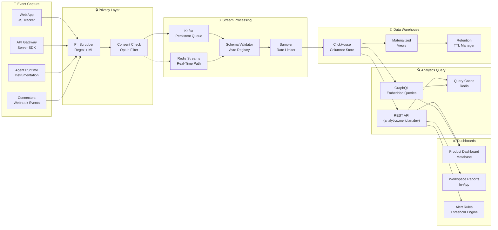

# Analytics

> **Purpose:** Define how Meridian captures, processes, stores, and exposes analytics data for product insights, business intelligence, and workspace usage monitoring
> **Status:** 🆕 New
> **Owner:** Product Team
> **Last Updated:** 2026-07-13

## Overview

Meridian's analytics system is an event-driven pipeline that ingests telemetry from all product surfaces — web app, API, agent workflows, and connector integrations. Events are captured at the client or server side, validated against a schema registry, streamed through a buffered processing layer, and stored in a columnar data warehouse optimized for analytical queries. A dedicated analytics API exposes aggregated views to dashboards and external consumers, while a privacy layer strips personally identifiable information (PII) before persistence.

The system supports both real-time (high-priority events via Redis streams) and batch (low-priority events via Kafka) ingress paths, with configurable sampling rates per event type to control volume. Downstream consumers include the internal product dashboard, workspace owner usage reports, and the AI gateway's feature-usage feedback loop.

## Goals

| # | Goal | Priority |
|---|------|----------|
| 1 | Provide **product teams** with self-service analytics on feature adoption, retention, and funnel conversion | 🔴 Critical |
| 2 | Enable **workspace owners** to view usage metrics for their agents, documents, and users | 🟡 High |
| 3 | Feed **feature-usage signals** back into the AI gateway for model routing decisions | 🟡 High |
| 4 | Maintain **strict privacy compliance** — never store raw PII or event data beyond configured retention | 🟢 Medium |
| 5 | Support **real-time dashboards** for operational metrics with sub-3-second end-to-end latency | 🟢 Medium |

## Scope

| In Scope | Out of Scope |
|----------|--------------|
| Client-side event capture (web app, agent UI) | External analytics vendor integration (GA4, Mixpanel as primary) |
| Server-side event capture (API, workers, agents) | Real-time user session recording / replay |
| Event schema validation and versioning | A/B test assignment engine |
| Stream processing with Kafka + Redis | Clickstream raw data export (future) |
| Columnar storage in ClickHouse | Multi-tenant data separation at query level (done by workspace_id) |
| Aggregation pipelines and materialized views | Customer-facing analytics portal (planned Q4) |
| REST and GraphQL analytics API | Attribution modeling or marketing analytics |
| Retention-based data lifecycle management | Third-party cookie tracking |
| PII scrubbing and consent enforcement | Custom event pipeline per workspace |

## Architecture



## Components

### Event Tracker

The event tracker is a lightweight JavaScript SDK (`@meridian/analytics`) deployed on the web app and an equivalent server-side SDK (`@meridian/analytics-node`) for backend services. Both enforce the same event schema, batch events locally, and flush to the ingress endpoint at configurable intervals (default 5 s or 100 events).

The tracker automatically attaches `user_id`, `workspace_id`, `session_id`, `url`, `user_agent`, and `timestamp` to every event. Custom properties are validated against the event type's registered schema before dispatch.

### Stream Processor (Kafka / Redis)

| Feature | Kafka Path | Redis Path |
|---------|-----------|------------|
| **Use case** | Batch, high-volume, durable | Real-time, high-priority |
| **Event types** | Page views, feature usage, errors, performance | Agent actions, billing events |
| **Retention** | 7 days on topic | 24 hours in stream |
| **Consumers** | ClickHouse ingestion workers | Real-time dashboard bridge |
| **Partition key** | `workspace_id` | `workspace_id` |
| **DLQ** | Separate Kafka topic | Redis list (dead-letter) |

### Data Warehouse (ClickHouse)

ClickHouse is the primary analytics store chosen for its columnar storage, real-time insert capability, and SQL-compatible aggregation engine. Raw events are stored in an `events` MergeTree table partitioned by `toYYYYMM(timestamp)` and ordered by `(workspace_id, toDate(timestamp), event_name)`. Materialized views pre-compute daily, weekly, and monthly rollups for common queries.

### Analytics API

A dedicated NestJS service (`apps/analytics-api`) exposes aggregated analytics data. All endpoints require a service-level API key or a user JWT with the `analytics:read` scope. Responses are cached in Redis with a TTL matched to the aggregation window (e.g., 5 min for real-time, 1 h for daily).

### Dashboard Frontend

Dashboards are built with a combination of Metabase (internal product analytics) and embedded React components (workspace usage reports). The in-app dashboard uses the GraphQL analytics endpoint to fetch metric definitions and time-series data, rendering charts via the Chart.js library configured in the design system.

## Event Taxonomy

### Naming Convention

All event names follow the `object.action.context` pattern using dot notation:

```
workspace.create.ui
agent.run.completed
document.export.started
connector.sync.failed
user.settings.changed
```

| Segment | Description | Examples |
|---------|-------------|----------|
| `object` | The primary entity | `workspace`, `agent`, `document`, `connector`, `user`, `message`, `session` |
| `action` | The action performed | `create`, `update`, `delete`, `run`, `export`, `sync`, `view`, `click`, `error` |
| `context` | Surface or trigger | `ui`, `api`, `agent`, `system`, `scheduled`, `webhook`, `shortcut` |

### Required Properties

Every event must include these top-level properties:

| Property | Type | Description |
|----------|------|-------------|
| `event` | `string` | Fully qualified event name (e.g., `agent.run.completed`) |
| `user_id` | `string` | UUID of the actor (omitted for system events) |
| `workspace_id` | `string` | UUID of the workspace |
| `session_id` | `string` | UUID tying events to a single session |
| `timestamp` | `datetime` | ISO 8601 UTC timestamp at event generation |
| `event_id` | `string` | UUIDv4 unique event identifier (dedup key) |

### Optional Properties

| Property | Type | Description |
|----------|------|-------------|
| `properties` | `object` | Arbitrary key-value map validated per event type |
| `version` | `string` | Application version (e.g., `1.23.0`) |
| `environment` | `string` | `production`, `staging`, `development` |
| `source_ip` | `string` | Scrubbed to /24 subnet before storage |
| `user_agent` | `string` | Raw user agent string (stored only for 24 h) |
| `referrer` | `string` | HTTP referrer (stored only for 24 h) |
| `feature_flags` | `string[]` | Active feature flags at time of event |

## Event Types

### Page Views

Triggered on route change in the web app. Sampled at 10 % for non-enterprise workspaces.

| Event | Description |
|-------|-------------|
| `page.view.ui` | Any page or route visited |
| `page.view.first` | First page viewed in a session |
| `page.exit.ui` | User navigation away or tab close |

### Feature Usage

Captured for every distinct interaction with a product feature.

| Event | Description |
|-------|-------------|
| `workspace.create.ui` | New workspace created from UI |
| `agent.create.ui` | Agent created via wizard or API |
| `agent.run.completed` | Agent finished a task (includes duration and token count) |
| `document.upload.ui` | File uploaded to a document |
| `connector.connect.ui` | Connector authorized by user |
| `connector.sync.completed` | Connector sync cycle finished |

### Agent Actions

Events emitted by the agent runtime during execution. These flow through the Redis real-time path.

| Event | Description |
|-------|-------------|
| `agent.step.started` | Agent began a reasoning step |
| `agent.step.completed` | Agent completed a reasoning step |
| `agent.tool.invoked` | Agent called a tool |
| `agent.tool.result` | Tool returned a result |
| `agent.message.generated` | Agent generated a user-facing message |
| `agent.run.failed` | Agent encountered an unrecoverable error |

### Errors

All errors captured at client and server side, excluding expected validation errors.

| Event | Description |
|-------|-------------|
| `error.client.ui` | Unhandled client-side exception |
| `error.api.request` | API returned 5xx status |
| `error.connector.auth` | Connector authentication failure |
| `error.agent.execution` | Agent execution error (timeout, rate limit, etc.) |
| `error.database.query` | Database query timeout or failure |
| `error.integration.webhook` | Webhook delivery failure |

### Performance

Browser and server performance metrics, sampled at 1 % for production workspaces.

| Event | Description |
|-------|-------------|
| `performance.page.load` | Page load, DOM content, and LCP timings |
| `performance.api.latency` | API endpoint response time (p50 / p95 / p99) |
| `performance.agent.latency` | Agent execution time per run |
| `performance.connector.sync` | Connector sync duration and record count |
| `performance.query.slow` | Slow database query (> 500 ms) |

### Business Events

Revenue and subscription-related events. Flowed through the Redis path for real-time billing dashboards.

| Event | Description |
|-------|-------------|
| `billing.subscription.created` | New subscription started |
| `billing.subscription.changed` | Plan change or upgrade |
| `billing.invoice.paid` | Invoice successfully processed |
| `billing.invoice.failed` | Payment failure |
| `billing.credit.used` | Credit or token consumption |
| `workspace.user.invited` | User invitation sent |
| `workspace.user.joined` | User accepted invitation |

## Data Model

### Raw Event Schema (ClickHouse)

```sql
CREATE TABLE analytics.events (
    event_id         UUID,
    event_name       String,
    properties       String,       -- JSON-encoded key-value map
    user_id          Nullable(UUID),
    workspace_id     UUID,
    session_id       UUID,
    timestamp        DateTime64(3, 'UTC'),
    environment      LowCardinality(String),
    version          String,
    source_ip        String,        -- /24 truncated
    user_agent       LowCardinality(String),
    referrer         String,
    feature_flags    Array(String),
    processed_at     DateTime64(3, 'UTC')
) ENGINE = MergeTree
PARTITION BY toYYYYMM(timestamp)
ORDER BY (workspace_id, toDate(timestamp), event_name)
TTL timestamp + INTERVAL 90 DAY DELETE
SETTINGS index_granularity = 8192;
```

### Materialized View (Daily Aggregation)

```sql
CREATE MATERIALIZED VIEW analytics.daily_events
ENGINE = AggregatingMergeTree
PARTITION BY toYYYYMM(day)
ORDER BY (workspace_id, day, event_name)
AS SELECT
    workspace_id,
    toDate(timestamp) AS day,
    event_name,
    count() AS total_events,
    uniq(user_id) AS unique_users,
    uniq(session_id) AS unique_sessions
FROM analytics.events
GROUP BY workspace_id, day, event_name;
```

## Privacy

### PII Scrubbing

All events pass through a PII scrubber before entering the stream layer. The scrubber applies:

| Technique | Target | Implementation |
|-----------|--------|----------------|
| Email detection | `properties.*` string values | Regex `\b[\w\.-]+@[\w\.-]+\.\w+\b` → `[REDACTED]` |
| Credit card Luhn check | `properties.*` string values | Luhn algorithm → `[REDACTED]` |
| IP truncation | `source_ip` | Preserve only /24 subnet prefix |
| Custom patterns | Configurable per workspace | Regex patterns defined in workspace settings |

### Consent Management

Events are tagged with a consent level at ingestion:

| Consent Level | Allowed Events |
|---------------|---------------|
| `essential` | Error events, performance, agent actions |
| `functional` | Feature usage, page views |
| `marketing` | Business events, referrer tracking |

Events from users who have not granted the corresponding consent level are dropped at the consent check filter. The user's consent preference is fetched from the `user_preferences` table and cached for 5 minutes.

### Data Retention

| Event Category | Retention | Action After Retention |
|----------------|-----------|----------------------|
| Page views | 30 days | Hard delete from ClickHouse |
| Feature usage | 90 days | Hard delete |
| Agent actions | 90 days | Hard delete |
| Error events | 180 days | Hard delete |
| Performance | 7 days | Hard delete |
| Business events | 365 days (as required by tax law) | Hard delete |
| Aggregated rollups | Indefinite (anonymized) | Kept |

### Anonymization

After the raw retention period expires, events that have been rolled up into materialized views are kept indefinitely in aggregated form. The aggregation process ensures that individual events cannot be reconstructed from the rolled-up data. Workspace-level aggregates never expose individual user metrics below a minimum threshold of 5 users.

### GDPR Compliance

- **Right to Access**: The analytics API provides a `GET /analytics/users/:id/events` endpoint that returns all events for a specific user within retention limits.
- **Right to Erasure**: A `DELETE /analytics/users/:id/events` endpoint soft-deletes all events for a user within 24 hours. The hard delete runs nightly.
- **Right to Data Portability**: User event data can be exported as CSV/JSON via the dashboard or API.
- **Data Processing Agreement**: All analytics data is processed within the same region as the workspace (US, EU, or APAC). Cross-region transfer uses approved SCC mechanisms.

## Security

### Event Data Access Control

| Role | Access Scope |
|------|-------------|
| Workspace Admin | All events in their workspace |
| Workspace Member | Aggregate metrics only (no individual user breakdown) |
| Product Team | Events across all workspaces (PII-scrubbed, aggregated) |
| System | Raw events for operational alerts (error, performance) |
| External API Consumer | Only what the API key scope allows |

### Aggregation Before Storage

Raw events are stored only in the ClickHouse cluster, which is isolated in a private VPC with no direct internet access. All access to event data goes through the analytics API, which enforces scoping and never returns raw properties to unauthorized roles.

### Audit Trail

Every read of raw event data (non-aggregated) is logged to an append-only `analytics_audit_log` table with:

| Field | Description |
|-------|-------------|
| `actor_id` | User or service that performed the read |
| `query_type` | Query pattern (e.g., `user_events`, `workspace_events`) |
| `filters` | Filters applied (workspace_id, user_id, time range) |
| `reason` | Justification captured at query time |
| `timestamp` | When the read occurred |

## Performance

### Event Batching

Events are batched at every layer to minimize network round-trips and database writes.

| Layer | Batch Strategy | Default Batch Size | Max Latency Added |
|-------|---------------|-------------------|-------------------|
| Client SDK | Time + count flush | 100 events / 5 s | 5 s |
| Server SDK | Time + count flush | 500 events / 2 s | 2 s |
| Kafka Producer | Async batch send | 1000 messages | 500 ms |
| ClickHouse Insert | Async buffer | 10000 rows / 1 s | 1 s |

### Sampling Strategies

| Event Category | Default Sample Rate | Configuration |
|----------------|-------------------|---------------|
| Page views | 10 % (non-enterprise), 100 % (enterprise) | Workspace settings |
| Feature usage | 100 % | Not configurable |
| Agent actions | 100 % | Not configurable |
| Errors | 100 % | Not configurable |
| Performance (client) | 1 % | Workspace settings |
| Performance (server) | 10 % | Global config |

### Aggregation Pipeline Optimization

The nightly aggregation pipeline runs materialized view rebuilds and rollup computations. Key optimizations:

- **Incremental materialization**: Only process partitions that have new data since last run.
- **Parallel partition processing**: Each partition is processed independently by separate ClickHouse threads.
- **Pre-aggregated hourly rollups**: Hourly tables feed into daily, which feed into weekly — avoiding full table scans.
- **TTL-based compaction**: Partitions past their retention TTL are dropped, not scanned.

## Scalability

### Sharding by workspace_id

The event stream is partitioned by `workspace_id` at every layer:

| Layer | Sharding Mechanism |
|-------|--------------------|
| Kafka | `workspace_id` as partition key (64 partitions default) |
| ClickHouse | `workspace_id` as first column in ORDER BY |
| Analytics API | `workspace_id` as required query parameter |
| Query cache | Namespaced by `workspace_id` |

### Time-Based Partitioning

ClickHouse tables are partitioned by month (`toYYYYMM(timestamp)`). Each partition can be independently compressed, backed up, or dropped. This allows efficient retention enforcement — dropping an entire partition is an O(1) metadata operation.

| Partition | Events | Storage | Query Performance |
|-----------|--------|---------|-------------------|
| Single day | ~5 M | ~2 GB | Full scan without partition pruning |
| Single month | ~150 M | ~60 GB | Partition-pruned for month-range queries |
| Full retention (90 d) | ~450 M | ~180 GB | Pruned by `ORDER BY` + partition elimination |

### Retention Policies

Retention is enforced at the database level using ClickHouse TTL expressions on the `events` table. The TTL runs as a background process that drops expired data at the partition level. No application-level delete logic is required.

```sql
-- Rollup retention policy
ALTER TABLE analytics.events
    MODIFY TTL timestamp + INTERVAL 90 DAY DELETE;

ALTER TABLE analytics.daily_events
    MODIFY TTL day + INTERVAL 2 YEAR DELETE;
```

## Error Handling

### Failed Event Retry

Events that fail schema validation or encounter a transient ClickHouse write error are retried with exponential backoff:

| Retry | Delay | Action |
|-------|-------|--------|
| 1 | 1 s | Re-insert to ClickHouse |
| 2 | 5 s | Re-insert |
| 3 | 30 s | Re-insert |
| 4 | 5 min | Route to DLQ |

### Dead Letter Queue

Events that exhaust the retry limit are published to a dedicated Kafka DLQ topic (`analytics-events-dlq`). A separate DLQ consumer runs every 6 hours, attempting to re-process DLQ entries. Entries older than 7 days are archived to S3 for forensic analysis.

### Schema Validation Errors

The schema validator rejects events that do not match the registered Avro schema for their event type. Rejected events:

1. Are logged with the full validation error.
2. Increment the `analytics_schema_errors` metric counter.
3. Are routed directly to the DLQ (no retry attempt).
4. Trigger an alert if the error rate exceeds 1 % of total events in a 5-minute window.

## Monitoring

### Event Pipeline Health

| Metric | Description | Alert Threshold |
|--------|-------------|-----------------|
| `analytics.events.ingested` | Events per second entering Kafka | Any sustained drop > 50 % |
| `analytics.events.processed` | Events per second written to ClickHouse | < 90 % of ingested rate for 5 min |
| `analytics.events.dlq_count` | Events in dead letter queue | > 1000 for > 1 hour |
| `analytics.events.schema_errors` | Schema validation failure rate | > 1 % of total events for 5 min |

### Ingestion Rate

Ingestion rate is monitored at each pipeline stage to detect bottlenecks:

| Stage | Metric | Typical Rate | Saturation Warning |
|-------|--------|-------------|-------------------|
| Client SDK | Events flushed per second | 500 / s | N/A (client-side) |
| Kafka Ingress | Messages per second per partition | 2000 / s | > 80 % of partition limit |
| ClickHouse Insert | Rows inserted per second | 10000 / s | Insert queue > 100 K |
| Analytics API | Queries per second | 50 / s | CPU > 80 % |

### Processing Lag

Consumer lag is the primary indicator of pipeline health. Lag is measured as the difference between the latest Kafka offset and the latest committed consumer offset.

| Priority | Target Lag | Alert |
|----------|------------|-------|
| Real-time (Redis path) | < 1 s | Lag > 3 s |
| High-priority (Kafka) | < 10 s | Lag > 60 s |
| Bulk (Kafka) | < 60 s | Lag > 5 min |

### Error Rate

Error rate is tracked as a percentage of total events:

```
error_rate = events_errored / events_total * 100
```

| Severity | Threshold | Action |
|----------|-----------|--------|
| Warning | > 1 % | Slack notification to #analytics-alerts |
| Critical | > 5 % | PagerDuty page to on-call engineer |
| Recovery | < 0.5 % | Auto-resolve alert |

## Analytics API

### REST Endpoints

All endpoints are served from `https://analytics.meridian.dev/v1` and require authentication.

| Method | Endpoint | Description |
|--------|----------|-------------|
| `POST` | `/events/batch` | Ingest a batch of events (internal use) |
| `GET` | `/analytics/events` | Query raw events (aggregated, PII-scrubbed) |
| `GET` | `/analytics/timeseries` | Aggregated time-series data |
| `GET` | `/analytics/funnel` | Funnel conversion between event sequences |
| `GET` | `/analytics/retention` | User retention cohorts |
| `GET` | `/analytics/top-events` | Most frequent events in a time range |
| `GET` | `/analytics/users/:id/events` | All events for a specific user (GDPR access) |
| `DELETE` | `/analytics/users/:id/events` | Erase all events for a user (GDPR erasure) |
| `GET` | `/analytics/metrics` | List available metric definitions |
| `GET` | `/dashboards` | List pre-built dashboards |

### Aggregation Functions

| Function | SQL | Description |
|----------|-----|-------------|
| `count` | `count()` | Total event count |
| `unique_users` | `uniq(user_id)` | Distinct users |
| `unique_sessions` | `uniq(session_id)` | Distinct sessions |
| `p50` | `quantile(0.5)(duration)` | Median value |
| `p95` | `quantile(0.95)(duration)` | 95th percentile |
| `p99` | `quantile(0.99)(duration)` | 99th percentile |
| `sum` | `sum(metric_value)` | Sum of a numeric property |
| `avg` | `avg(metric_value)` | Average of a numeric property |
| `rate` | `count() / duration` | Events per unit time |

### Time Ranges

| Parameter | Format | Example |
|-----------|--------|---------|
| `time_range` | Predefined string | `last_24h`, `last_7d`, `last_30d`, `last_90d` |
| `start_time` | ISO 8601 | `2026-07-01T00:00:00Z` |
| `end_time` | ISO 8601 | `2026-07-13T23:59:59Z` |
| `granularity` | Aggregation window | `hour`, `day`, `week`, `month` |

## Dashboards

### Pre-Built Dashboard Definitions

The following dashboards are shipped with the product:

| Dashboard | Audience | Refresh | Data Source |
|-----------|----------|---------|-------------|
| **Product Overview** | Product Team | 5 min | `analytics.timeseries` |
| **Workspace Health** | Workspace Admin | 1 min | `analytics.timeseries` |
| **Agent Performance** | Engineering | 1 min | `analytics.timeseries` + Redis path |
| **Error Dashboard** | Engineering / SRE | Real-time | `analytics.events` (error type filter) |
| **Billing & Usage** | Finance / Operations | 1 h | `analytics.timeseries` (business events) |
| **User Engagement** | Product Team | 1 h | `analytics.retention` + `analytics.funnel` |

### Custom Dashboard API

Users with the `dashboard:admin` scope can create, update, and delete custom dashboards via the analytics API. Each custom dashboard is defined as a JSON document:

```json
{
  "id": "uuid",
  "name": "Agent Cost by Workspace",
  "workspace_id": "uuid",
  "widgets": [
    {
      "id": "uuid",
      "type": "timeseries",
      "title": "Daily Agent Runs",
      "metric": "agent.run.completed",
      "aggregation": "count",
      "granularity": "day",
      "filters": { "environment": "production" },
      "position": { "x": 0, "y": 0, "w": 6, "h": 4 }
    }
  ]
}
```

### Metric Definitions

Each metric has a registered definition that controls how it appears in dashboards and what aggregation functions are allowed:

| Metric | Event Filter | Default Aggregation | Unit |
|--------|-------------|---------------------|------|
| `page_views` | `page.view.*` | `count` | Views |
| `active_users` | All events | `unique_users` | Users |
| `agent_runs` | `agent.run.completed` | `count` | Runs |
| `agent_duration` | `agent.run.completed` | `p50` | Seconds |
| `error_rate` | `error.*` | `rate` | % |
| `api_latency_p99` | `performance.api.latency` | `p99` | ms |
| `connector_syncs` | `connector.sync.completed` | `count` | Syncs |
| `billing_revenue` | `billing.invoice.paid` | `sum` | USD |

## Best Practices

### Event Naming Consistency

- Always use `object.action.context` — never abbreviate or use free-form names.
- Use past tense for actions — `created`, `completed`, `failed` — never `create`, `finish`, `error`.
- Keep names lowercase with dots as separators — never use camelCase, snake_case, or spaces.
- Register every event name in the schema registry before instrumenting it.
- Use the `context` segment consistently to distinguish UI from API from system-triggered events.

### Batching

- Always flush events in batches — never send one event per HTTP request.
- Set the batch size proportional to the expected event frequency — high-frequency events should buffer more aggressively.
- Configure the flush interval to match the acceptable latency for the event type (2 s for real-time, 10 s for bulk).
- Use the server-side SDK for backend events — never emit client events from server code (and vice versa).

### Sampling for High-Volume Events

- Enable sampling for any event type expected to exceed 100,000 events/day per workspace.
- Use workspace-tier-based sampling rates — enterprise workspaces get 100 % sampling, others get sampled.
- Never sample error events — every error must be captured.
- Sample at the stream processor level, not at the client — clients should always send all events.
- Document sampling rates in the event type registry so dashboard consumers can factor in the multiplier.

## Common Mistakes

### Over-Instrumentation

The most common mistake is tracking every button click and UI interaction without considering downstream value. Each event type should justify its storage cost, query complexity, and maintenance burden. Before adding a new event, ask: "What decision will this data power?" If there is no clear answer, skip it.

### Missing Consent Checks

Events from users who have not granted the appropriate consent level must be dropped before entering the stream. A common bug is instrumenting an event on the client SDK without verifying that the `user_preferences` consent check has passed. Always pair event instrumentation with a consent gate review.

### PII in Event Properties

Developers often unintentionally include PII in custom `properties` — for example, passing a user's email as a property for debugging. The PII scrubber catches common patterns, but it cannot catch workspace-specific identifiers or custom data formats. Always treat the `properties` object as a public, auditable field and never write raw user data into it.

| Mistake | Example | Correct Approach |
|---------|---------|-----------------|
| Email in properties | `{ "assignee": "alice@co.com" }` | Use `user_id` instead |
| Full IP logged | `{ "ip": "203.0.113.42" }` | Source IP is auto-truncated to /24 |
| Raw query in error | `{ "query": "SELECT * FROM users WHERE email = '...'" }` | Log query hash, not raw SQL |
| Session token | `{ "session": "eyJhbGci..." }` | Never include tokens in event data |

### Ignoring Schema Validation

Bypassing the schema validator by sending events as `application/json` with arbitrary fields leads to data quality issues downstream. Always define a schema for new event types in the Avro registry before deployment. The CI pipeline checks that all instrumented events have a corresponding schema entry.

## Risks

| Risk | Likelihood | Impact | Mitigation |
|------|-----------|--------|------------|
| **Data volume costs exceed budget** | High | Medium | Sampling, retention limits, storage cost monitoring per workspace |
| **Privacy compliance violation** | Low | Critical | PII scrubber, consent filter, GDPR endpoints, quarterly audit |
| **Event schema drift** | Medium | High | Schema registry with CI checks, versioned events, automated validation |
| **Ingestion pipeline bottleneck** | Medium | High | Auto-scaling Kafka consumers, ClickHouse cluster resize alerts |
| **Real-time latency degradation** | Low | Medium | Redis stream fallback for priority events, Grafana latency dashboards |
| **Query performance regression** | Medium | Medium | Materialized views, query cache, slow query logging and alerting |

## Limitations

| Limitation | Detail |
|------------|--------|
| **Real-time availability** | Real-time (sub-second) processing is reserved for high-priority event types (agent actions, billing, errors). All other events have 5–60 s latency. |
| **Sampling for non-critical events** | Page views and performance metrics are sampled at rates as low as 1 % for non-enterprise workspaces. Dashboard numbers for these metrics are estimates. |
| **Data retention** | Raw event data is stored for a maximum of 180 days (error events). No raw event retention beyond that — only aggregated rollups remain. |
| **Cross-workspace queries** | There is no cross-workspace analytics view. All queries must specify a single `workspace_id`. Multi-workspace comparisons are not supported. |
| **Funnel analysis depth** | Funnel analysis supports a maximum of 10 steps. Funnels spanning multiple event types beyond this limit require custom queries. |
| **Custom event properties** | Custom `properties` are limited to 50 keys per event, with each value capped at 1 KB. Total event size must not exceed 64 KB. |
| **Query concurrency** | The analytics API supports a maximum of 50 concurrent queries per workspace. Additional queries are queued. |

## Examples

```typescript
// Query workspace analytics
import { Analytics } from '@meridian/sdk';

const stats = await Analytics.query({
  workspaceId: 'ws_abc123',
  metric: 'document_count',
  granularity: 'day',
  range: { from: '2025-06-01', to: '2025-06-30' },
});
console.log(stats.dataPoints);
```

```python
# Generate an analytics report
from meridian.analytics import ReportBuilder

report = ReportBuilder("workspace_usage")
report.add_metric("active_users", aggregate="count", filter="last_30d")
report.add_metric("documents_processed", aggregate="sum")
report.add_dimension("department")
report.run(output_format="csv", path="./report.csv")
```

```bash
# Analytics via CLI
meridian analytics query --metric document_count --granularity day --from 2025-06-01 --to 2025-06-30
meridian analytics export --report workspace_usage --format csv > usage.csv
```

## Future Improvements

| Improvement | Target Quarter | Description |
|-------------|---------------|-------------|
| **Real-time analytics for all event types** | Q4 2026 | Upgrade ClickHouse to support sub-second queries over all event categories, not just priority events |
| **ML-based anomaly detection** | Q1 2027 | Train anomaly detection models on historical event patterns to alert on unusual usage or error spikes |
| **Customer-facing analytics portal** | Q2 2027 | Build a standalone analytics portal for workspace customers with embeddable dashboards and scheduled reports |
| **Event data export** | Q3 2027 | Allow workspace admins to export raw event data (PII-scrubbed) to their own data warehouse via webhooks or S3 |
| **A/B test integration** | Q4 2027 | Native support for tracking A/B test assignments in events and computing statistical significance in dashboards |
| **Predictive retention modeling** | Q1 2028 | Use historical event sequences to predict workspace churn and surface at-risk accounts |

## Related Documents

| Document | Description |
|----------|-------------|
| [Privacy](Security/Privacy.md) | Privacy principles, PII handling, data retention policies |
| [Security Architecture](Security/Security-Architecture.md) | IAM, encryption, access control for analytics data |
| [Monitoring](DevOps/Monitoring.md) | Infrastructure monitoring and alerting for analytics pipeline |
| [RBAC](Backend/RBAC.md) | Role-based access control for analytics API endpoints |
| [API Reference](Backend/API-Reference.md) | Complete API reference including analytics endpoints |
| [Backend Architecture](Backend/Backend-Architecture.md) | Backend service architecture, including analytics API service |
| [Implementation — Observability & Tracing](Engineering/Implementation/12-observability-tracing.md) | Distributed tracing across the analytics pipeline |
| [Success Metrics](Project/README.md) | Product success metrics derived from analytics data |
