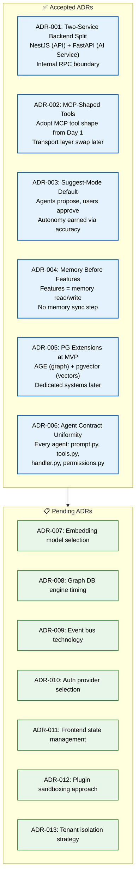

# Architecture Decision Records

> **Purpose:** Record architectural decisions made for the Meridian project, including context, options considered, and rationale.
> **Status:** Started — populated with known decisions from existing documentation
> **Owner:** Architecture Team
> **Last Updated:** 2026-07-13

---

## Overview

This document records all Architecture Decision Records (ADRs) for the Meridian project. ADRs capture the context, options considered, and rationale behind significant architectural decisions, ensuring that current and future team members understand why specific choices were made.

Six ADRs are currently accepted, covering the two-service backend split, MCP-shaped tool definitions, suggest-mode default, memory-first architecture, PostgreSQL with extensions at MVP, and agent contract uniformity. An additional seven ADRs are pending for decisions around embedding models, graph DB timing, event bus technology, auth provider selection, frontend state management, plugin sandboxing, and tenant isolation.

Each ADR follows a standardized template covering context, decision, options considered, consequences, and compliance enforcement. ADRs are reviewed quarterly to ensure they remain valid as the project evolves.

## ADR Architecture



> **Diagram:** Architecture Decision Records — **6 accepted ADRs** (two-service split, MCP-shaped tools, suggest-mode default, memory-first architecture, PG extensions at MVP, agent contract uniformity) and **7 pending ADRs** (embedding model, graph DB, event bus, auth, state management, sandboxing, tenant isolation).

---

## ADR Template

```markdown
# ADR-XXX: [Title]

**Status:** [Proposed | Accepted | Deprecated | Superseded]
**Date:** YYYY-MM-DD
**Deciders:** [Names]

## Context

[What is the issue motivating this decision?]

## Decision

[What was decided and why?]

## Options Considered

| Option | Pros | Cons |
|--------|------|------|
| Option A | ... | ... |
| Option B | ... | ... |

## Consequences

[What becomes easier or harder as a result?]

## Compliance

[How will this decision be enforced going forward?]
```

---

## ADR-001: Two-Service Backend Split

**Status:** Accepted  
**Date:** 2026-Q1  
**Source:** [`/Docs/Engineering/Implementation/00-master-build-order.md`](../../Docs/Engineering/Implementation/00-master-build-order.md)

### Context

The backend needs to serve both standard CRUD operations (auth, file storage, user management) and AI/agent operations (model routing, RAG, prompt management). These have different scaling characteristics, language ecosystem needs, and latency profiles.

### Decision

Split into two services:

- **`apps/api`** (NestJS, TypeScript) — owns auth, CRUD, permissions, event publishing
- **`apps/ai-service`** (FastAPI, Python) — owns agents, memory, retrieval, model routing

They communicate over an internal RPC boundary. No direct calls between agent code and the frontend.

### Consequences

- Easier: independent scaling, language-appropriate tooling, team specialization
- Harder: inter-service latency, schema synchronization, deployment coordination

---

## ADR-002: MCP-Shaped Tool Definitions from Day One

**Status:** Accepted  
**Date:** 2026-Q1  
**Source:** [`/Docs/01-Meridian-MVP-Spec.md#6-connector--plugin-architecture`](../../Docs/01-Meridian-MVP-Spec.md#6-connector--plugin-architecture)

### Context

All connectors and internal tools share a common shape. The decision was whether to build a custom tool format now and migrate to MCP later, or adopt MCP's shape from the start even before fully wiring up MCP transport.

### Decision

Adopt MCP's tool definition shape (name, input schema, output schema, required scope) from Day 1 — even before having an actual MCP server running. This makes the eventual move to real MCP a transport change, not a rewrite.

### Consequences

- Easier: future MCP adoption is a transport-layer swap, not a re-architecture
- Harder: slightly more abstraction in the short term for connections that may never need MCP

---

## ADR-003: Suggest-Mode by Default

**Status:** Accepted  
**Date:** 2026-Q1  
**Source:** [`/Docs/01-Meridian-MVP-Spec.md#3-product-philosophy`](../../Docs/01-Meridian-MVP-Spec.md#3-product-philosophy)

### Context

Agents that can rename files, move documents, draft emails, and submit applications pose a trust risk if they act autonomously and make mistakes.

### Decision

Every agent capable of taking a consequential action starts in "suggest-mode" — it proposes actions, and the user approves or rejects them. Full autonomy for specific action types is granted per-agent, per-user, only after the agent demonstrates sufficient accuracy (configurable threshold).

### Consequences

- Easier: trust is earned, not assumed; mistakes are caught before they happen
- Harder: slower initial interactions; requires investment in approval UX

---

## ADR-004: Memory Before Features Architecture

**Status:** Accepted  
**Date:** 2026-Q1  
**Source:** [`/Docs/Meridian-Complete-Documentation.md#6-memory-system-in-depth`](../../Docs/Meridian-Complete-Documentation.md#6-memory-system-in-depth)

### Context

The product philosophy states "memory is the product." This needs an architectural enforcement mechanism.

### Decision

Every feature is expressed as a read or write against memory. Every agent action that teaches the system something new writes to memory. If a proposed feature cannot be expressed as a read or write against the knowledge graph/vector store/structured memory, it should be questioned before being built.

### Consequences

- Easier: features automatically benefit from better memory; no separate "memory sync" step
- Harder: some features require more thought to express cleanly as memory operations

---

## ADR-005: PostgreSQL with Extensions at MVP, Dedicated Systems Later

**Status:** Accepted  
**Date:** 2026-Q1  
**Source:** [`/Docs/Meridian-Complete-Documentation.md#10-tech-stack`](../../Docs/Meridian-Complete-Documentation.md#10-tech-stack)

### Context

The architecture requires relational storage, graph storage, and vector storage. Operating three separate databases at MVP adds operational complexity before the product is validated.

### Decision

Use PostgreSQL with Apache AGE (graph extension) and pgvector (vector extension) at MVP. Graduate to dedicated Neo4j and Qdrant clusters only when query performance and embedding volume demand it.

### Consequences

- Easier: one database to operate at MVP; migration path to dedicated systems is additive
- Harder: AGE and pgvector have performance limits that will eventually require migration

---

## ADR-006: Agent Contract Uniformity

**Status:** Accepted  
**Date:** 2026-Q1  
**Source:** [`/Docs/Meridian-Complete-Documentation.md#51-shared-agent-contract`](../../Docs/Meridian-Complete-Documentation.md#51-shared-agent-contract)

### Context

With potentially 28+ agents, inconsistent agent architecture would make the system hard to audit, debug, and improve.

### Decision

Every agent follows an identical internal structure:

- `prompt.py` — versioned system prompt
- `tools.py` — declared tool list, MCP-shaped
- `handler.py` — core logic: retrieve context, reason, produce output
- `permissions.py` — declared read/write memory scopes, checked at runtime

This uniformity enables the Self-Improvement Agent to operate generically across all agents.

### Consequences

- Easier: cross-agent tooling (eval, monitoring, QA) works generically
- Harder: up-front structure cost for simple agents

---

## Future ADRs

Planned ADR topics (to be written as decisions are made):

| # | Topic | Status |
|---|-------|--------|
| 007 | Embedding model selection | Pending |
| 008 | Graph DB engine decision (AGE vs. Neo4j timing) | Pending |
| 009 | Event bus technology (Redis/BullMQ vs. Kafka trigger) | Pending |
| 010 | Auth provider selection | Pending |
| 011 | Frontend state management pattern | Pending |
| 012 | Plugin sandboxing approach | Pending |
| 013 | Tenant isolation strategy | Pending |

---

## Goals

- **Formalize decision governance** — provide a structured, auditable record of every significant architectural decision made for the Meridian platform, including context, options considered, and rationale
- **Prevent regression** — ensure that once a decision is made (service boundaries, database choices, auth model), it is documented and can be revisited with full context rather than re-litigated blindly
- **Reduce onboarding risk** — give new engineers a clear, chronological history of architectural decisions so they understand *why* the system is built the way it is, not just *what* was built
- **Establish review cadence** — embed quarterly ADR review into engineering workflow so decisions stay current and stale or superseded ADRs are flagged before they cause downstream issues

## Scope

### In Scope
- ADR format and template: context → options considered → decision → consequences
- Accepted ADRs 001–006 covering agent contract, data pipeline, Graph DB, GraphQL schema, search/reranking, and audit trail
- Pending ADRs 007–013 covering embedding model, graph DB engine timing, event bus, auth provider, frontend state, plugin sandboxing, and tenant isolation
- ADR lifecycle: proposal → review → accepted / superseded → quarterly re-evaluation
- Cross-references to system architecture and implementation master build order

### Out of Scope
- Implementation-level decisions that are easily reversible (port assignments, library patch versions, naming conventions)
- RFCs or lightweight decision records that do not warrant formal ADR treatment
- Per-service design documents (covered in Backend/, Frontend/, AI/ docs)
- Code-level API contracts and interface definitions (covered in SDK and Backend/API-Reference.md)

---

## Examples

### Propose a new ADR

```bash
meridian adr create \
  --title "ADR-014: Event Bus Technology Selection" \
  --status proposed \
  --template ./adr-template.md
```

### List all ADRs with their status

```bash
meridian adr list --status accepted --format table
```

### Approve a pending ADR

```bash
meridian adr approve --id ADR-007 --reviewer "Architecture Team"
```

## Future Improvements

| Improvement | Priority | Complexity | Timeline |
|-------------|----------|------------|----------|
| ADR decision tracking with status automation | High | Medium | Q1 2027 |
| ADR template CI enforcement on new decisions | Medium | Low | Q4 2026 |
| Stale ADR review reminder system | Medium | Low | Q4 2026 |

## Related Documents

- [System Architecture](../02-system-architecture.md) — The 8-layer system architecture these ADRs govern
- [Master Build Order](../Engineering/Implementation/00-master-build-order.md) — Implementation plan referencing ADR decisions
- [Complete Documentation](../Meridian-Complete-Documentation.md) — Comprehensive project documentation
- [Enterprise Architecture](../Enterprise/Enterprise-Architecture.md) — Enterprise-scale architecture decisions

## Common Mistakes

| Mistake | Why It's a Problem |
|---------|-------------------|
| Not recording why alternatives were rejected | An ADR that says "chose Option A" without explaining why Options B and C were rejected leaves future engineers unable to understand the reasoning — they may reopen settled decisions |
| Letting ADRs become stale after the decision is made | An ADR accepted in quarter 1 may no longer be valid in quarter 3 if requirements changed — ADRs need a periodic review (quarterly) to flag decisions that should be revisited |
| Writing ADRs at the wrong level of detail | Too high-level ("we'll use microservices") provides no actionable guidance; too low-level ("port 8080 for service X") buries important decisions in implementation trivia — aim for the "why this, not that" sweet spot |
| Treating ADRs as documentation rather than governance | An ADR that is written, approved, and never referenced again is a historical note, not a governance tool — ADRs should be reviewed during design discussions and referenced in code comments |

## Best Practices

| Practice | Rationale |
|----------|-----------|
| Record both the chosen option and the rejected alternatives with rationale | A decision without alternatives is a decree, not an ADR — documenting rejected options and their trade-offs is what makes the ADR useful for future decision-makers |
| Review all ADRs quarterly and flag outdated decisions for re-evaluation | Technology and requirements change — a quarterly ADR review ensures that decisions made 6+ months ago are still valid and flags those that need revisiting |
| Keep ADRs at the architectural decision level, not implementation level | An ADR should answer "why this service boundary?" not "what port does this service run on?" — the former is an architectural decision; the latter is an implementation detail |
| Link ADRs to code and vice versa | Code comments referencing the relevant ADR number (e.g., `// See ADR-004`) make the decision accessible where it matters — and the ADR remains a living reference, not a forgotten document |

## Security

| Concern | Mitigation |
|---------|------------|
| ADRs revealing security architecture publicly | ADRs that document security decisions (encryption algorithms, key rotation, auth patterns) should not be shared outside the engineering team — mark security-sensitive ADRs with a sensitivity tag |
| Superseded ADRs containing outdated security guidance | An old ADR recommending a deprecated encryption algorithm could be cited by a new team member unaware it was superseded — clearly mark superseded ADRs and link to the replacement |
| Pending ADRs delaying critical security decisions | Using "Pending" ADR status as a way to defer security decisions (e.g., "ADR-013: Tenant isolation strategy — Pending") creates risk — security ADRs should have a hard deadline |

## Performance

| Concern | Guideline |
|---------|-----------|
| ADR review overhead vs decision velocity | Requiring ADRs for every trivial decision slows teams down — use ADRs only for decisions that are costly to reverse (service boundaries, database choice, auth model) and use lightweight RFCs for reversible decisions |
| Quarterly review cost vs benefit | Reviewing 13 ADRs quarterly takes ~2 hours per review cycle — this is acceptable for architectural governance; if ADR count grows beyond 50, consider risk-based adr review (review only decisions flagged as needing attention) |
| Pending ADR tracking overhead | 7 pending ADRs that remain pending for months become stale overhead — assign a due date to each pending ADR and escalate when the due date passes without a decision |
