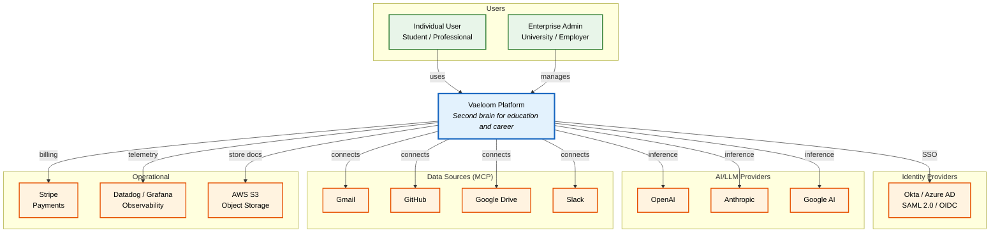
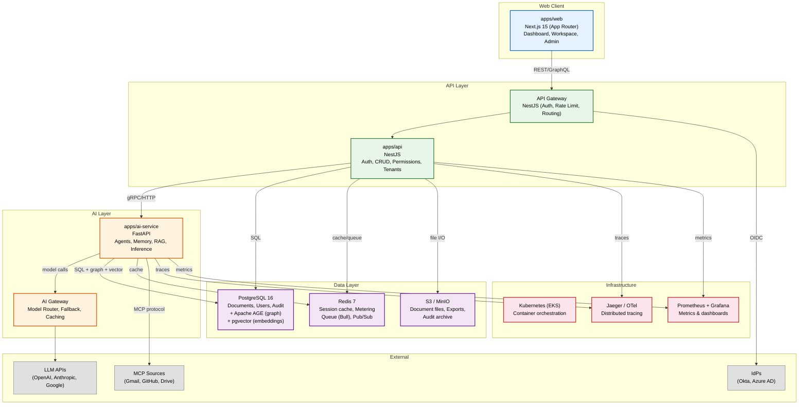
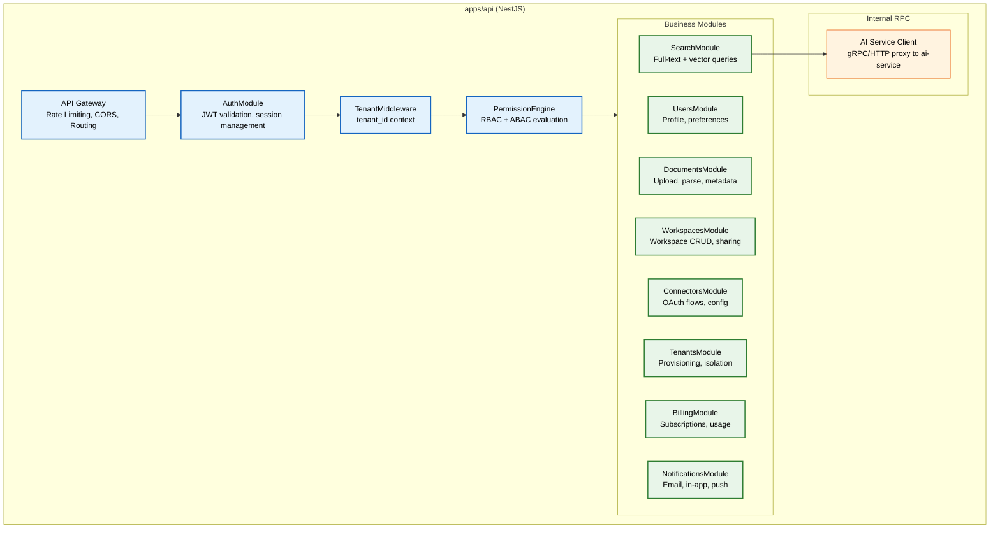
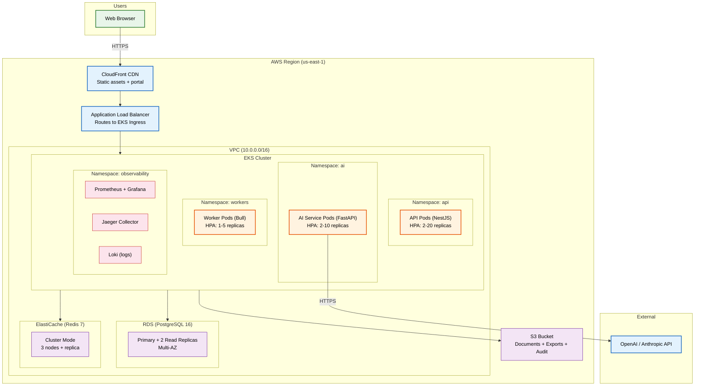

# C4 Architecture

> **Purpose:** Define Vaeloom's system architecture using the C4 model — Context, Container, Component, and Deployment views — providing a shared vocabulary for all engineering stakeholders
> **Status:** 🆕 New
> **Owner:** Architecture Team
> **Version:** 1.0
> **Last Updated:** 2026-07-16
> **Dependencies:** [`System-Design.md`](./System-Design.md), [`High-Level-Design.md`](./High-Level-Design.md), [`Service-Architecture.md`](./Service-Architecture.md), [`Microservices.md`](./Microservices.md), [`Infrastructure.md`](./Infrastructure.md)
> **Implementation Status:** 📋 Spec Only

## Overview

The C4 model is a layered architecture diagramming approach that provides four levels of zoom, each aimed at a different audience. **Level 1 (Context)** shows Vaeloom in its external environment — who uses it, what it connects to. **Level 2 (Container)** shows the major deployable units (applications, data stores, message queues). **Level 3 (Component)** zooms into the internals of each container. **Level 4 (Deployment)** shows how containers are deployed onto infrastructure.

This document is the single source of truth for Vaeloom's architecture at every zoom level. Every engineer, product manager, and ops person should be able to find the right diagram here to answer "where does X live?" and "what does Y talk to?"

## Goals

- Provide a Context diagram for non-technical stakeholders
- Provide Container diagrams for technical leads and architects
- Provide Component diagrams for engineers implementing within a container
- Provide a Deployment diagram for DevOps and SRE
- Establish a shared vocabulary for system architecture discussions

## Scope

### In Scope

- C4 Level 1: System Context
- C4 Level 2: Container (applications, data stores, queues)
- C4 Level 3: Component (internal modules of each container)
- C4 Level 4: Deployment (Kubernetes, AWS, observability)

### Out of Scope

- Detailed sequence diagrams — see [`../AI/Agentic-RAG.md`](../AI/Agentic-RAG.md) and individual feature docs
- Infrastructure-as-code specifics — see [`../DevOps/Terraform.md`](../DevOps/Terraform.md)
- Event architecture — see [`Event-Architecture.md`](./Event-Architecture.md) and [`Event-Flow.md`](./Event-Flow.md)

## Level 1: System Context

The Context diagram shows Vaeloom as a single system and its relationships to external actors and systems.

> **Diagram:** C4 Level 1 — System Context. Vaeloom is the central system. Users interact through web/mobile. External systems provide identity, AI inference, data sources, payments, and observability.

## Level 2: Container

The Container diagram shows the major deployable units within Vaeloom.

> **Diagram:** C4 Level 2 — Container. The web client talks to the API gateway, which routes to the NestJS API service. AI operations are delegated to the FastAPI AI service. Both services share PostgreSQL and Redis. The AI Gateway routes model calls to external LLM providers.

## Level 3: Component

### apps/api (NestJS)

> **Diagram:** Components within the NestJS API service. The gateway pipeline is Auth → Tenant → Permissions → Business Module. Cross-service calls to the AI service go through the RPC client.

### apps/ai-service (FastAPI)

```mermaid
graph TB
    classDef core fill:#e3f2fd,stroke:#1565c0,color:#000,stroke-width:2px
    classDef agent fill:#e8f5e9,stroke:#2e7d32,color:#000,stroke-width:2px
    classDef infra fill:#fff3e0,stroke:#e65100,color:#000,stroke-width:1px
    classDef guard fill:#f3e5f5,stroke:#6a1b9a,color:#000,stroke-width:1px

    subgraph AI["apps/ai-service (FastAPI)"]
        HARNESS["Agent Harness<br/>Shared agentic loop<br/>(Plan→Act→Observe→Reflect)"]:::core
        ORCH["Orchestrator<br/>Request routing, plan assembly"]:::agent
        GUARD["Guardrails<br/>Input validation, output QA"]:::guard

        subgraph Agents["Specialist Agents"]
            ORG_A["Organization Agent"]:::agent
            RES_A["Resume Agent"]:::agent
            ATS_A["ATS Agent"]:::agent
            JOB_A["Job Search Agent"]:::agent
            APP_A["Application Agent"]:::agent
            GMAIL_A["Gmail Agent"]:::agent
            SCHED_A["Scheduler Agent"]:::agent
        end

        subgraph Memory["Memory System"]
            GRAPH["Knowledge Graph<br/>Apache AGE"]:::core
            VECTOR["Vector Store<br/>pgvector"]:::core
            LT["Long-Term Memory<br/>Compressed summaries"]:::core
            ST["Short-Term Memory<br/>Conversation context"]:::core
        end

        subgraph Infrastructure["AI Infrastructure"]
            RAG["RAG Pipeline<br/>Hybrid retrieval + reranking"]:::infra
            GATEWAY["AI Gateway<br/>Model router + fallback"]:::infra
            INFER["Inference Pipeline<br/>Prompt building, token counting"]:::infra
            MCP["MCP Connectors<br/>Gmail, GitHub, Drive tools"]:::infra
            EVAL["Eval Framework<br/>Golden dataset testing"]:::infra
        end
    end

    ORCH --> HARNESS
    HARNESS --> Agents
    Agents --> Memory
    Agents --> RAG
    Agents --> MCP
    Agents --> GUARD
    RAG --> GATEWAY --> INFER
```

> **Diagram:** Components within the FastAPI AI service. The Orchestrator routes requests to specialist agents through the shared Agent Harness. Each agent accesses memory, RAG, MCP connectors, and guardrails.

## Level 4: Deployment

> **Diagram:** C4 Level 4 — Deployment. Vaeloom runs on EKS in a dedicated AWS VPC. RDS provides multi-AZ PostgreSQL; ElastiCache provides Redis. An ALB routes traffic to EKS. CloudFront serves static assets. External LLM providers are accessed over HTTPS.

## Components Summary

| Container | Technology | Components | Deployment |
|-----------|-----------|------------|------------|
| **apps/web** | Next.js 15 (App Router) | Dashboard, Workspace, Admin Portal, Auth pages | CDN (CloudFront) + Edge |
| **apps/api** | NestJS (TypeScript) | Auth, Users, Documents, Workspaces, Connectors, Tenants, Billing, Search, Notifications | EKS (HPA: 2-20 pods) |
| **apps/ai-service** | FastAPI (Python 3.11+) | Agent Harness, Orchestrator, 8+ Specialist Agents, Memory System, RAG Pipeline, AI Gateway, MCP Connectors, Guardrails, Eval Framework | EKS (HPA: 2-10 pods) |
| **PostgreSQL 16** | RDS Multi-AZ | Relational data + Apache AGE (graph) + pgvector (embeddings) | Primary + 2 read replicas |
| **Redis 7** | ElastiCache Cluster | Session cache, metering counters, Bull queue, Pub/Sub | 3-node cluster + replica |
| **S3** | AWS S3 | Document files, exports, audit archive | Versioned, lifecycle policy |
| **Kubernetes** | EKS | Container orchestration, ingress, HPA | Multi-AZ, 3+ availability zones |

## Security

| Concern | Mitigation | Verification |
|---------|-----------|--------------|
| Inter-service traffic not encrypted | mTLS between all Kubernetes services via service mesh | Network policy enforcement; traffic audit |
| Database accessible from internet | RDS in private subnets; no public IP | Security group rules; VPC flow logs |
| LLM API key leakage | Keys in Secrets Manager; injected at runtime; never in code | CI secret scanning; runtime audit |
| Pod escape | gVisor runtime on AI pods (untrusted code); non-root containers | Penetration testing; CIS benchmarks |

## Performance

| Concern | Budget | Measurement | Optimization |
|---------|--------|-------------|--------------|
| API request latency (p99) | <500ms | Distributed tracing | Connection pooling; read replicas; caching |
| AI inference latency (p99) | <5s (depends on model) | Model gateway timing | Model routing (fast model for easy tasks); prompt caching |
| Page load time | <2s | RUM (Real User Monitoring) | CDN; code splitting; lazy loading |

## Scalability

| Dimension | Current Limit | 10x Strategy | 100x Strategy |
|-----------|---------------|--------------|---------------|
| API pods | 20 (HPA max) | Increase HPA max; add node pool | Sharding by tenant_id; regional clusters |
| AI service pods | 10 | GPU node pool autoscaling | Model-specific serving clusters |
| Database connections | 500 (PgBouncer) | Connection pooling; read replicas | Writer-leader separation; sharding |
| Redis memory | 10 GB | Cluster mode upgrade | Sharded keyspace |

## Future Improvements

| Improvement | Priority | Complexity | Timeline |
|-------------|----------|------------|----------|
| Regional deployment (EU, APAC) for data residency | High | High | Q2 2027 |
| Service mesh (Istio) for mTLS and traffic management | Medium | High | Q1 2027 |
| Edge caching for AI inference results | Medium | Medium | Q2 2027 |

## Related Documents

- [`System-Design.md`](./System-Design.md) — detailed system design
- [`High-Level-Design.md`](./High-Level-Design.md) — HLD view
- [`Service-Architecture.md`](./Service-Architecture.md) — service-level architecture
- [`Infrastructure.md`](./Infrastructure.md) — infrastructure details
- [`../DevOps/Kubernetes.md`](../DevOps/Kubernetes.md) — Kubernetes configuration
- [`../DevOps/Terraform.md`](../DevOps/Terraform.md) — IaC definitions
