# Caching Architecture

> **Purpose:** Define the caching strategy for Vaeloom
> **Status:** ✅ Upgraded to enterprise quality
> **Owner:** DevOps Team
> **Last Updated:** 2026-07-13

## Cache Architecture

```mermaid
graph TD
    classDef client fill:#e3f2fd,stroke:#1565c0,color:#000,stroke-width:1.5px
    classDef edge fill:#e8f5e9,stroke:#2e7d32,color:#000,stroke-width:1.5px
    classDef app fill:#fff3e0,stroke:#e65100,color:#000,stroke-width:1.5px
    classDef db fill:#f3e5f5,stroke:#6a1b9a,color:#000,stroke-width:1.5px
    classDef miss fill:#ffebee,stroke:#c62828,color:#000,stroke-width:1px

    subgraph Client["🌐 Browser Layer"]
        B1["HTTP Cache<br/>Static assets (JS, CSS, images)"]
    end

    subgraph Edge["🛡️ Edge / CDN Layer"]
        C1["Cloudflare / Fastly<br/>Static pages, images<br/>Per-asset TTL"]
    end

    subgraph App["âš¡ Application Layer (Redis)"]
        direction TB
        R1["Dashboard Data<br/>~10KB/user<br/>Event-invalidated"]
        R2["Resume Renders<br/>~50KB/variant<br/>Pre-warmed on deploy"]
        R3["Agent Responses<br/>~5KB/query<br/>TTL: 5 min"]
        R4["Search Results<br/>~2KB/query<br/>TTL: 1 min"]
    end

    subgraph Database["💾 Database Layer"]
        PG["( PostgreSQL<br/>Shared buffers<br/>LRU eviction )"]
    end

    subgraph Invalidation["📨 Event-Based Invalidation"]
        direction TB
        E1["document.ingested →<br/>Document list, workspace"]
        E2["memory.updated →<br/>Dashboard, resume, graph"]
        E3["application.submitted →<br/>App list, stats"]
        E4["schedule.conflict →<br/>Schedule view, deadlines"]
    end

    B1 -->|Cache MISS| C1
    C1 -->|Cache MISS| R1 & R2 & R3 & R4
    R1 & R2 & R3 & R4 -->|Cache MISS| PG

    PG -->|Cache MISS - Query DB & Store| R1 & R2 & R3 & R4
    R1 & R2 & R3 & R4 -->|Populate| C1
    C1 -->|Return| B1

    E1 & E2 & E3 & E4 -.->|Invalidate| R1 & R2 & R3 & R4

    class B1 client
    class C1 edge
    class R1,R2,R3,R4 app
    class PG db
    class E1,E2,E3,E4 miss

```



> **Diagram:** Cache follows a layered architecture — Browser → CDN → Redis → PostgreSQL. On a MISS at any layer, the next layer is queried and the result is cached upstream. **Event-based invalidation** replaces TTL-based expiry: when `document.ingested`, `memory.updated`, etc. fire, only the affected cache keys are invalidated rather than relying on fixed timeouts.

---

## Cache Layers

| Layer | Technology | Data | TTL |
|-------|------------|------|-----|
| Browser | HTTP caching headers | Static assets | Long (versioned) |
| CDN | Cloudflare/Fastly | Static pages, images | Per asset |
| Application | Redis | Dashboard, resume renders, agent responses | Event-invalidated |
| Database | PostgreSQL shared buffers | Frequent queries | LRU |

## Cache Invalidation Strategy

Event-based invalidation (not time-based):

| Event | Cache Invalidated |
|-------|-------------------|
| `document.ingested` | Document list, workspace summary |
| `memory.updated` | Dashboard, resume, memory graph |
| `application.submitted` | Application list, dashboard stats |
| `schedule.conflict` | Schedule view, dashboard deadlines |

## Cache-Aside Pattern

```text
Request → Check Cache → Hit → Return
                      → Miss → Query DB → Store in Cache → Return
```

## Cache Warming

On deploy, pre-warm critical caches:

- Dashboard aggregates
- Resume renders (most recent per user)
- Agent tool definitions (rarely change)

## Cache Sizing

| Cache | Estimated Size | Growth Rate |
|-------|---------------|-------------|
| Dashboard data | 10KB per active user | Linear with users |
| Resume renders | 50KB per variant | Linear with variants |
| Agent responses | 5KB per unique query | Sub-linear (overlap) |
| Search results | 2KB per query | Sub-linear |

## Common Mistakes

| Mistake | Why It's a Problem |
|---------|-------------------|
| Using TTL-based expiry instead of event-based invalidation | Time-based cache expiry means data can be stale for up to the TTL duration — event-based invalidation ensures the cache is updated immediately when the underlying data changes |
| Caching data that is rarely read but frequently written | If a cache entry is updated every 5 minutes but read once per hour, caching adds write overhead without meaningful read benefit — only cache data with a high read-to-write ratio |
| No cache warming on deploy | After a deploy, all cache entries are cold — the first users after deploy experience slow responses because every request triggers a full database query before populating the cache |
| Caching user-specific data at the CDN layer | CDNs cache data per URL, not per user — dashboard data, resume renders, and other user-specific content should be cached in Redis, not at the CDN, to avoid serving User A's data to User B |

## Best Practices

| Practice | Rationale |
|----------|-----------|
| Invalidate cache on the relevant event, not on a timer | When `document.ingested` fires, invalidate the document list cache key — the next read fetches fresh data. No TTL guessing needed |
| Only cache data where read frequency significantly exceeds write frequency | Measure read/write ratio per data type — cache data with >10:1 read/write ratio; bypass cache for data written more frequently than it's read |
| Pre-warm critical cache entries immediately after deploy | On a new deploy, trigger a warm-up job that populates the most-frequently-accessed cache keys (dashboard aggregates, resume templates) before users arrive |
| Cache user-specific data in Redis, not in CDN or browser | Use Redis with workspace_id-scoped keys for user-specific cache data — CDN caching is appropriate for static assets and public content only |

## Security

| Concern | Mitigation |
|---------|------------|
| Cache poisoning via key collision | A crafted cache key could overwrite another user's cache entry — scope all cache keys by workspace_id or user_id to prevent cross-user cache contamination |
| Stale cached data after permission change | If a user's permissions are revoked, cached data from before revocation could still be served — include permission checks in the cache validation step, not just in the database query |
| Cached sensitive data in shared environments | CDN and browser caches may persist on shared machines — ensure user-specific data carries `Cache-Control: private` headers to prevent storage in shared caches |

## Performance

| Concern | Guideline |
|---------|-----------|
| Cache stampede on key expiry | When a popular cache key expires, multiple simultaneous requests all trigger database queries — use a mutex or "probabilistic early expiration" (refresh the cache early when it's approaching expiry) to prevent stampede |
| Memory fragmentation in Redis | Redis stores data in memory — large cache entries (resume renders at 50KB each) for many users can cause memory fragmentation; set the Redis LRU eviction policy and monitor used_memory_rss vs used_memory |
| Serialization overhead for complex cache values | Storing complex nested JSON objects in Redis requires serialization/deserialization on every read/write — for high-throughput cache keys, consider simpler data structures (hash, string) over complex objects |

## Goals

- Achieve Redis cache hit ratio of 90%+ for dashboard, resume render, and agent response caches
- Eliminate TTL-based expiry in favor of event-driven cache invalidation for all user-facing data
- Pre-warm critical cache entries within 30 seconds of every deployment
- Keep Redis memory usage below 70% of allocated capacity at all times
- Ensure zero cache-related data leakage across workspace boundaries through scoped keys

## Scope

| In Scope | Out of Scope |
|----------|--------------|
| Redis application cache for user-facing data | Browser HTTP cache configuration |
| Event-based cache invalidation via message bus | CDN cache purging and configuration |
| Cache warming strategy on deploy | Third-party API response caching |
| Cache sizing and memory monitoring | File system cache or OS page cache |
| Cache key design to prevent cross-tenant leakage | GPU memory caching for AI models |

## Functional Requirements

| ID | Requirement | Priority |
|----|-------------|----------|
| CACHE-F1 | All cache keys shall be scoped by workspace_id to prevent cross-tenant data leakage | P0 |
| CACHE-F2 | Cache shall invalidate entries immediately upon corresponding domain event | P0 |
| CACHE-F3 | System shall pre-warm critical cache entries within 30s of deployment | P1 |
| CACHE-F4 | Cache shall support configurable TTL as fallback for non-event-invalidated data | P1 |
| CACHE-F5 | System shall expose cache hit ratio, memory usage, and eviction count as metrics | P0 |

## Non-Functional Requirements

| ID | Requirement | Target | Measurement |
|----|-------------|--------|-------------|
| CACHE-N1 | Cache hit ratio shall remain high under normal load | > 90% | Redis INFO command stats |
| CACHE-N2 | Cache invalidation propagation shall complete quickly | < 1s from event to invalidation | Event timing traces |
| CACHE-N3 | Redis memory usage shall not exceed capacity | < 70% of maxmemory | Redis used_memory metric |
| CACHE-N4 | Cache read latency shall be minimal | < 5ms p99 | Redis SLOWLOG |
| CACHE-N5 | Cache warming shall complete before user traffic arrives | < 30s post-deploy | Warming job duration |

## Components

| Component | Responsibility | Technology | Scale Strategy |
|-----------|---------------|------------|---------------|
| Redis Cache Store | Primary in-memory cache for application data | Redis 7+ | Redis Cluster with consistent hashing |
| Invalidation Listener | Subscribe to domain events and evict affected cache keys | BullMQ consumer | Horizontal scaling per event type |
| Cache Warmer | Pre-populate critical cache entries after deploy | Cron job + deploy hook | Parallel warming per cache group |
| Cache Monitor | Track hit ratios, memory, eviction, and alert on anomalies | Prometheus + Redis Exporter | Dedicated monitoring node |
| Key Design Service | Generate scoped, deterministic cache keys per data type | Shared library | Versioned in code, no runtime scaling |

## Data Flow

1. Application receives a request and computes the cache key incorporating workspace_id and data type
2. Cache key is looked up in Redis — on hit, the value is deserialized and returned immediately
3. On cache miss, the application queries PostgreSQL, serializes the result, and stores it in Redis with an expiry
4. When a domain event fires (document.ingested, memory.updated), the invalidation listener receives it
5. Listener computes all affected cache keys and issues DEL commands to Redis, ensuring next read fetches fresh data

## Scalability

| Dimension | Current Limit | 10x Strategy | 100x Strategy |
|-----------|--------------|--------------|---------------|
| Cache keys stored | 100K keys per instance | Redis Cluster with 6 shards | Redis Cluster with 12 shards + node auto-scaling |
| Cache read throughput | 10K ops/s per node | Cluster mode with read replicas | Multi-region Redis with active-active replication |
| Cache memory | 4 GB per node | Increase node memory + shard count | Tiered cache (hot data in Redis, warm in SSD) |
| Invalidation events | 100 events/s | Partition by event type across consumers | Stream-based processing with Kafka |

## Error Handling

| Error Scenario | Detection | Mitigation | Recovery |
|----------------|-----------|------------|----------|
| Redis node failure | Redis Sentinel / Cluster failover detection | Circuit breaker bypasses cache, queries DB directly | Sentinel promotes replica, cache re-warms automatically |
| Cache stampede on popular key expiry | Sudden latency spike + DB query surge | Mutex lock per key, only first request rebuilds cache | Probabilistic early expiration prevents stampede |
| Invalidation event lost | Stale cache data persists past expected refresh | TTL-based fallback expiry on all cache entries | Replay unprocessed events from event log |
| Redis out of memory | used_memory >= maxmemory alert | LRU eviction for non-critical cache entries | Scale up memory or add shards |

## Monitoring

| Metric | Alert Threshold | Severity | Dashboard |
|--------|----------------|----------|-----------|
| Cache hit ratio | < 85% for 5 min | Warning | Cache Efficiency |
| Redis memory usage | > 80% of maxmemory | Critical | Redis Resource |
| Cache read latency p99 | > 10ms | Warning | Cache Performance |
| Evicted keys per minute | > 100/min | Warning | Cache Efficiency |
| Invalidation lag | > 5s from event to eviction | Critical | Invalidation Health |

## Configuration

| Variable | Purpose | Default | Required |
|----------|---------|---------|----------|
| REDIS_MAXMEMORY | Maximum memory Redis may use (bytes) | 4294967296 | Yes |
| REDIS_EVICTION_POLICY | Eviction policy when memory limit reached | allkeys-lru | Yes |
| CACHE_DEFAULT_TTL_SECONDS | Fallback TTL for cache entries without event invalidation | 3600 | Yes |
| CACHE_WARM_ENABLED | Whether cache warming runs on deploy | true | No |
| CACHE_HIT_RATIO_ALERT | Minimum hit ratio before triggering warning | 0.85 | No |

## Risks

| Risk | Likelihood | Impact | Mitigation |
|------|------------|--------|------------|
| Redis cluster split-brain during network partition | Low | High | Use Redis Cluster with quorum-based consensus |
| Cache poisoning via crafted cache key collision | Low | Critical | All keys scoped by workspace_id with namespace prefix |
| Invalidation event bus backlog delaying cache refresh | Medium | Medium | Monitor invalidation lag, auto-scale consumers |
| Redis password or credentials exposed in config | Low | Critical | Secrets manager with rotation, never in plaintext config |

## Limitations

| Limitation | Impact | Workaround | Future Resolution |
|------------|--------|------------|-------------------|
| Redis is single-threaded for command execution | Throughput capped per node on complex commands | Use pipelining, avoid O(N) commands like KEYS | Redis 7+ I/O threads, cluster sharding |
| Cache keys have no built-in expiry beyond TTL | Stale keys accumulate without event invalidation | Always set TTL as safety net | Background key expiration sweeper job |
| No built-in cross-region replication in Redis Cluster | Multi-region requires separate Redis clusters | Application-level dual-write | Redis Enterprise active-active geo-replication |
| 50KB resume renders consume significant memory per entry | Reduced total cache capacity | Compress large values with LZ4 | Tiered cache — hot in Redis, warm in SSD |

## Examples

### Set cache TTL for dashboard data

```bash
Vaeloom cache configure --key dashboard --ttl 300 --strategy event-invalidate
```

### Invalidate cache on memory update

```bash
Vaeloom cache invalidate --pattern "dashboard:*" --reason "memory.updated"
```

### Check cache hit rate

```bash
Vaeloom cache stats --layer application --format json
```

### Configure Redis connection

```python
cache = CacheClient(host="redis-cluster", port=6379)
cache.configure_policy("dashboard_data", ttl=300, eviction="allkeys-lru")
```

## Future Improvements

| Improvement | Priority | Complexity | Timeline |
|-------------|----------|------------|----------|
| Tiered caching (hot memory + warm SSD) | Medium | High | Q1 2027 |
| Redis Enterprise active-active geo-replication | Low | High | Q2 2027 |
| Machine learning-based cache pre-warming | Low | High | Q3 2027 |
| Cache key usage analytics dashboard | Medium | Low | Q3 2026 |
| Automated cache sizing recommendations | Medium | Medium | Q4 2026 |

## Related Documents

- [Queue.md](./Queue.md)
- [Performance.md](./Performance.md)
- [`/Docs/Vaeloom-Complete-Documentation.md#47-queues-workers-and-caching`](../../Docs/Vaeloom-Complete-Documentation.md#47-queues-workers-and-caching)
