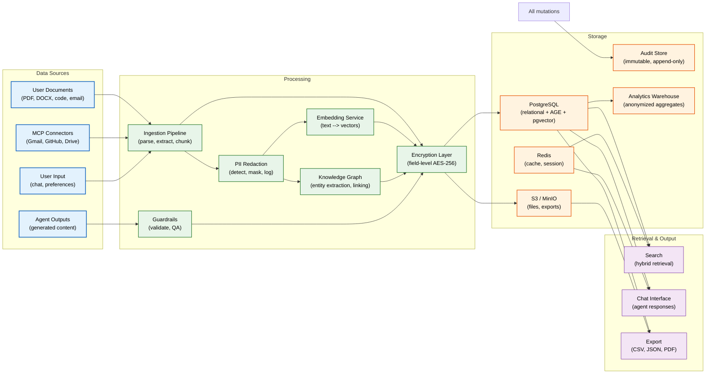
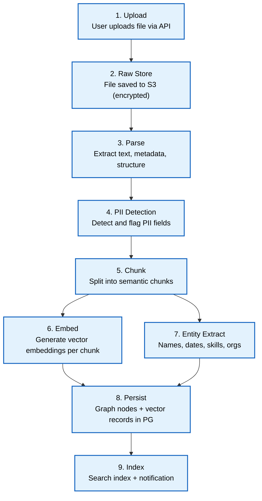
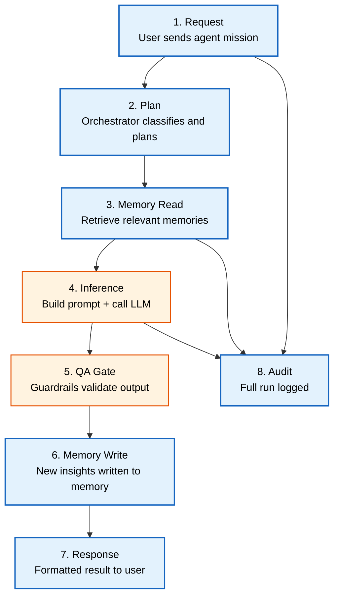
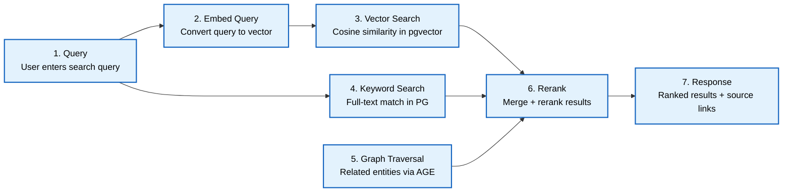
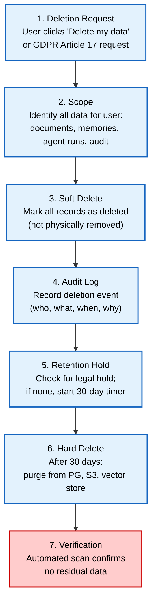

# Data Flow

> **Purpose:** Define all major data paths through Vaeloom — from ingestion through processing, storage, retrieval, and deletion — with classification, encryption, and retention at each stage
> **Status:** 🆕 New
> **Owner:** Architecture Team
> **Version:** 1.0
> **Last Updated:** 2026-07-16
> **Dependencies:** [`System-Design.md`](./System-Design.md), [`Event-Flow.md`](./Event-Flow.md), [`../Database/Schema.md`](../Database/Schema.md), [`../Database/Data-Dictionary.md`](../Database/Data-Dictionary.md), [`../Security/Encryption.md`](../Security/Encryption.md)
> **Implementation Status:** 📋 Spec Only

## Overview

Every byte that enters Vaeloom follows a defined path: ingestion, processing, storage, retrieval, and eventually deletion or archival. This document traces those paths for every major data type — user documents, AI-generated content, memory records, audit events, and analytics. At each stage, data is classified (PII, sensitive, internal, public), encrypted (at rest and in transit), and governed by retention policies.

Understanding data flow is critical for security (knowing where PII lives), compliance (proving data can be deleted on request), and performance (identifying bottlenecks in hot paths). This is the document a security auditor, a compliance officer, or a performance engineer reaches for first.

## Goals

- Trace every major data path through the system end-to-end
- Define data classification and encryption at each stage
- Establish retention policies per data type and classification
- Document data deletion and export flows
- Enable compliance reporting (GDPR Article 17, SOC 2 CC6.1)

## Scope

### In Scope

- Data flows: documents, AI outputs, memory, search, analytics, audit
- Data classification and encryption mapping
- Retention and deletion policies
- Data export flows

### Out of Scope

- Database schema (see [`../Database/Schema.md`](../Database/Schema.md))
- Event flow (see [`Event-Flow.md`](./Event-Flow.md))

## Architecture



> **Diagram:** High-level data flow architecture. All external data enters through the ingestion pipeline, passes through PII redaction and encryption, and lands in PostgreSQL or S3. Retrieval goes through search or chat. Every mutation generates an audit event.

## Data Classification

| Classification | Description | Examples | Encryption | Retention |
|----------------|-------------|----------|------------|-----------|
| **PII** | Personally identifiable information | Name, email, phone, address, SSN | AES-256 at field level; TLS in transit | Per GDPR; deleted on user request or after 7 years (audit) |
| **Sensitive** | Confidential but not PII | Resume content, salary data, performance reviews | AES-256 at rest; TLS in transit | Until user deletes or account closure + 90 days |
| **Internal** | Business data not for public release | Agent configurations, system metrics | AES-256 at rest; TLS in transit | 3 years (operational) |
| **Public** | Non-sensitive metadata | Agent names, feature flags, public docs | TLS in transit (no at-rest encryption required) | Indefinite |

## Data Flows

### Flow 1: Document Ingestion



> **Diagram:** Document ingestion flow. A file is uploaded, stored in S3, parsed, PII-flagged, chunked, embedded, entity-extracted, and persisted to the knowledge graph and vector store.

### Flow 2: AI Agent Execution



> **Diagram:** AI agent execution flow. The request is planned, memories read, inference performed via LLM, output validated, new memories written, and the full run audited.

### Flow 3: Search / RAG



> **Diagram:** Hybrid search flow. Vector, keyword, and graph traversals run in parallel; results are merged and reranked before returning.

## Data Deletion Flow



> **Diagram:** Data deletion flow. Deletions are soft-first (immediate logical delete), retained for 30 days (legal hold check), then hard-deleted with verification.

## Data Export Flow

```text
User data export (GDPR Article 20 / account closure):
  1. User requests export via Admin Portal.
  2. Backend compiles data from: documents (metadata + raw files), memories (graph + vector), agent runs (results + traces), profile, preferences.
  3. Package as encrypted ZIP (AES-256, password emailed separately).
  4. Upload to S3 with signed URL (expires in 7 days).
  5. Notify user with download link.
  6. After 7 days, delete the export from S3.
```

## Encryption Mapping

| Data Location | At Rest | In Transit | In Memory |
|-------------|---------|------------|-----------|
| PostgreSQL (relational) | AES-256 (TDE / column-level for PII) | TLS 1.3 | Plaintext (in PG buffers) |
| PostgreSQL (pgvector) | AES-256 (TDE) | TLS 1.3 | Plaintext |
| S3 (documents) | AES-256 (SSE-S3 or SSE-KMS) | TLS 1.3 | N/A |
| Redis (cache) | Optional (Redis AUTH + TLS) | TLS 1.3 | Plaintext |
| LLM API calls | N/A | TLS 1.3 | Prompt in memory (cleared after response) |
| Audit logs | AES-256 (S3 SSE-KMS) + hash chain | TLS 1.3 | N/A |

## Security

| Concern | Mitigation | Verification |
|---------|-----------|--------------|
| PII in event payloads | PII fields encrypted at field level before emission | Event schema validator rejects unencrypted PII fields |
| LLM provider sees user data | Prompts sanitized; PII masked before inference; no raw documents sent to LLM | Guardrail check; prompt audit log |
| Data residue after deletion | Hard delete + automated verification scan | Monthly verification scan for orphaned data |
| S3 bucket misconfiguration | Bucket policies deny public access; encryption required | AWS Config rule + nightly audit |

## Monitoring

| Metric | Alert Threshold | Severity | Dashboard |
|--------|-----------------|----------|-----------|
| `data_ingestion_lag_seconds` | >60s | P2 | Data Pipeline |
| `data_deletion_verification_failures` | Any | P1 | Compliance |
| `encryption_key_rotation_age_days` | >365 | P2 | Security |
| `s3_object_count_growth_rate` | >10% day-over-day | P3 | Storage |
| `pii_redaction_failures` | Any | P1 | Security |

## Best Practices

| # | Practice | Rationale |
|---|----------|-----------|
| 1 | Encrypt PII at the field level, not just at storage level | Field-level encryption survives a database dump or backup leak |
| 2 | Always soft-delete first, hard-delete after retention period | Enables recovery from accidental deletion and legal hold |
| 3 | Verify deletion with an automated scan | Manual verification is unreliable at scale |
| 4 | Log every data access, not just mutations | Read access logging is required for SOC 2 and GDPR |

## Risks

| Risk | Likelihood | Impact | Mitigation |
|------|-----------|--------|------------|
| LLM provider stores user prompts beyond our control | Medium | High | PII masking before inference; DPA with provider; use self-hosted model for sensitive data |
| Encryption key loss | Low | Critical (all data unrecoverable) | KMS-managed keys with automatic rotation; key backup in separate region |
| Deletion doesn't reach all replicas | Low | High (compliance violation) | Verification scan covers primary + replicas + backups |

## Limitations

| Limitation | Impact | Workaround | Future Resolution |
|------------|--------|------------|-------------------|
| No real-time PII detection in streaming data | PII may pass through momentarily unmasked | Batch PII detection in ingestion pipeline | Streaming PII detector (Q2 2027) |
| Analytics warehouse contains anonymized data only | Cannot re-identify users in analytics | Intentional — privacy by design | Differential privacy for aggregate queries |

## Future Improvements

| Improvement | Priority | Complexity | Timeline |
|-------------|----------|------------|----------|
| Streaming PII detection at ingestion | High | High | Q2 2027 |
| Data lineage tracking (which agent produced which memory) | Medium | Medium | Q2 2027 |
| Self-service data deletion with live progress tracking | High | Medium | Q1 2027 |

## Related Documents

- [`Event-Flow.md`](./Event-Flow.md) — event-driven data propagation
- [`../Database/Schema.md`](../Database/Schema.md) — database schema
- [`../Database/Data-Dictionary.md`](../Database/Data-Dictionary.md) — field-level data dictionary
- [`../Security/Encryption.md`](../Security/Encryption.md) — encryption implementation
- [`../Security/GDPR.md`](../Security/GDPR.md) — GDPR compliance
- [`../Security/Data-Retention-Policy.md`](../Security/Data-Retention-Policy.md) — retention schedules
