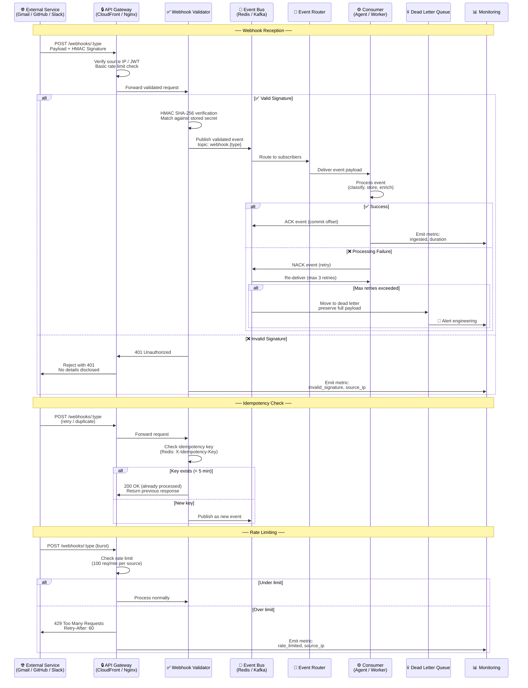

# Event Architecture

> **Purpose:** Define the event-driven architecture for Meridian
> **Status:** ✅ Upgraded to enterprise quality
> **Canonical source:** [`/Docs/Meridian-Complete-Documentation.md#46-events-realtime-and-notifications`](../../Docs/Meridian-Complete-Documentation.md#46-events-realtime-and-notifications)

## Webhook Ingestion Flow



> **Diagram:** Webhook ingestion flows through three scenarios. **Top:** valid signature → event published → consumer processes → ACK or retry → dead letter. **Middle:** idempotency check prevents duplicate processing. **Bottom:** rate limiting protects downstream services. All paths emit metrics and logs.

---

## Event Bus Architecture

Every agent action publishes an event. The event bus decouples "something happened" from "who needs to know."

## Event Types

| Event | Producer | Consumers |
|-------|----------|-----------|
| `document.ingested` | Ingestion pipeline | Memory Agent, Organization Agent |
| `memory.updated` | Memory Agent | Scheduler, Resume Agent |
| `application.submitted` | Application Agent | Career Memory |
| `connector.degraded` | Connector Agent | Notification dispatch |
| `schedule.conflict` | Scheduler Agent | Dashboard, Notification |
| `agent.error` | Any agent | Logging, Alerting |

## Event Schema

```json
{
  "id": "evt_abc123",
  "type": "memory.updated",
  "source": "memory_agent",
  "workspace_id": "ws_xyz",
  "timestamp": "2026-07-12T10:30:00Z",
  "data": {
    "entity_id": "ent_456",
    "entity_type": "Skill",
    "action": "created"
  }
}
```

## Technology Choices

| Environment | Technology | Rationale |
|-------------|------------|-----------|
| MVP | Redis + BullMQ | Simple to operate, already needed for queues |
| Enterprise | Kafka | Durable, replayable event log for multi-tenant scale |

## Common Mistakes

| Mistake | Why It's a Problem |
|---------|-------------------|
| Publishing events without idempotency keys | Duplicate event delivery (webhook retries, network reconnects) is normal — without idempotency, each duplicate retriggers the same processing, causing data corruption and duplicate work |
| No dead letter queue for failed events | Events that fail processing after max retries disappear silently — without a DLQ, the failure is invisible and data that triggered the event is permanently lost |
| Using the event bus for synchronous request/reply | Event buses are designed for fire-and-forget, not request/response — mixing patterns creates timeouts, orphaned callers, and complicated callback chains |
| Over-publishing granular events that overwhelm consumers | Publishing `entity.created`, `entity.updated`, `entity.field_updated` for every minor change floods consumers — batch related changes and publish meaningful aggregate events |

## Best Practices

| Practice | Rationale |
|----------|-----------|
| Include a unique idempotency key in every event | Consumer can safely deduplicate on the key — even if the event bus delivers the same event twice, the consumer processes it exactly once |
| Route all failed events to a dead letter queue after max retries | A DLQ preserves the full event payload for manual inspection and replay — without it, failed events are invisible and unrecoverable |
| Use event bus for asynchronous, fire-and-forget communication only | Synchronous request/response patterns belong on HTTP/RPC — the event bus is for "something happened, someone may care" not "do this and give me the result" |
| Design events at the semantic boundary level, not the field-change level | Publish `memory.updated` once after all entities are written rather than `entity.created` for each of 15 entities — reduces consumer fan-out by 15x |

## Security

| Concern | Mitigation |
|---------|------------|
| Event payload containing sensitive user data | Event payloads captured in the event bus, DLQ, or monitoring tooling may retain data longer than intended — avoid embedding PII in event bodies; use a reference ID pattern instead |
| Event injection via compromised webhook source | A compromised external service sending crafted webhooks could inject malicious events — validate webhook signatures and sanitize all event payloads before publishing to the bus |
| Consumer replay of old events after permission changes | A consumer whose permissions were revoked could replay old events to regain access — event consumers must re-check permissions at processing time, not depend on event-time authorization |

## Performance

| Concern | Guideline |
|---------|-----------|
| Event throughput vs consumer backlog | If consumers cannot keep up with event publish rate, backlog grows indefinitely — monitor consumer lag and scale consumers (or reduce event granularity) when backlog exceeds 10,000 events |
| Dead letter queue growth rate | A sudden spike in DLQ entries suggests a consumer bug or upstream data issue — alert when DLQ depth exceeds 100 and investigate before automatic replay |
| Idempotency key storage overhead | Storing every idempotency key indefinitely consumes memory — set a TTL on idempotency keys (e.g., 5 minutes) since duplicate delivery beyond that window is extremely unlikely |

## Goals

- Decouple all agent actions from their consumers through a central event bus
- Ensure every external webhook is validated, idempotent, and rate-limited before processing
- Provide a dead letter queue for every event type to prevent data loss
- Enable event replay for debugging and recovery without data loss
- Achieve at-least-once delivery semantics for all critical event types

## Scope

| In Scope | Out of Scope |
|----------|--------------|
| Event types, schemas, and producer/consumer mapping | Internal service message queuing for synchronous RPC |
| Webhook ingestion with HMAC validation and idempotency | REST API request/response event logging |
| Dead letter queue design and alerting | Long-term event archival and data retention policies |
| Event bus technology choices (Redis ↔ Kafka migration) | Third-party event streaming platform comparison |
| Idempotency key management and TTL settings | Event-driven workflow orchestration engine |

## Functional Requirements

| ID | Requirement | Priority |
|----|-------------|----------|
| EVT-FR-01 | Every agent action must publish an event to the bus | P0 |
| EVT-FR-02 | Webhook events must be validated with HMAC SHA-256 before processing | P0 |
| EVT-FR-03 | Duplicate webhook deliveries must be idempotently handled via idempotency keys | P0 |
| EVT-FR-04 | Failed events after max retries must be routed to a dead letter queue | P0 |
| EVT-FR-05 | Events must include workspace_id for consumer-level filtering | P1 |

## Non-Functional Requirements

| ID | Requirement | Target | Measurement |
|----|-------------|--------|-------------|
| EVT-NFR-01 | Event publishing latency (producer to consumer) | < 100ms p99 | Event bus latency monitoring |
| EVT-NFR-02 | Maximum consumer retry attempts before dead letter | 3 retries | Per-event retry counter |
| EVT-NFR-03 | Idempotency key TTL for duplicate detection window | 5 minutes | Redis key TTL verification |
| EVT-NFR-04 | Maximum acceptable consumer lag before alerting | 10,000 events | Consumer offset monitoring |

## Components

| Component | Responsibility | Technology | Scale Strategy |
|-----------|---------------|------------|----------------|
| Event Bus | Decoupled publish/subscribe message distribution | Redis (MVP) / Kafka (Enterprise) | Redis cluster → Kafka partitioned topics |
| Webhook Validator | HMAC verification, idempotency check, rate limiting | FastAPI middleware | Stateless; scaled by webhook volume |
| Dead Letter Queue | Preserve failed event payloads for manual inspection | Redis (MVP) / Kafka DLQ (Enterprise) | Separate consumer group for DLQ processing |
| Event Router | Route published events to registered subscribers | In-process / Kafka consumer groups | Partitioned consumers for parallel processing |

## Data Flow

1. External service sends a webhook payload with HMAC signature to the API Gateway, which performs basic IP validation and rate limit checks
2. Webhook Validator verifies the HMAC against the stored secret, checks the idempotency key in Redis for duplicates, and publishes the validated event to the bus
3. Event Router delivers the event to all registered consumers based on the event type topic subscription
4. Consumer processes the event (classify, store, enrich) and sends an ACK to commit the offset, or NACK to trigger retry
5. If max retries (3) are exceeded, the event is moved to the Dead Letter Queue with the full payload preserved, and an alert is triggered for engineering review

## Scalability

| Dimension | Current Limit | 10x Strategy | 100x Strategy |
|-----------|--------------|--------------|---------------|
| Event throughput | 1,000 events/s | Redis cluster mode with sharding | Kafka with 32 partitions and consumer groups |
| Webhook ingestion rate | 100 webhooks/min | Horizontal scaling of webhook validator | Multi-region webhook endpoints with geo-routing |
| Consumer types | 6 event types | Dynamic consumer registration | Schema registry with avro serialization |
| Dead letter queue depth | 1,000 events | Separate DLQ per event type | Automated DLQ replay with approval workflow |

## Error Handling

| Error Scenario | Detection | Mitigation | Recovery |
|---------------|-----------|------------|----------|
| Invalid webhook signature (HMAC mismatch) | HMAC verification fails | Return 401 to sender; no details disclosed | Log invalid signature attempt for security review |
| Event processing failure in consumer | Consumer returns NACK or throws exception | Retry up to 3 times with exponential backoff | Move to DLQ; alert engineering for manual replay |
| Idempotency key Redis lookup failure | Redis connection error | Allow event through (fallback to process) | Verify no duplicate processing via database check |
| Event bus broker unavailable | Producer publish timeout | Queue events locally with retry mechanism | Restore connection and flush local queue |

## Monitoring

| Metric | Alert Threshold | Severity | Dashboard |
|--------|----------------|----------|-----------|
| Consumer lag (events behind) | > 10,000 events | Critical | Event Bus Consumer Lag |
| Dead letter queue depth | > 100 events | Warning | Dead Letter Queue Status |
| Webhook validation failure rate | > 5% of incoming webhooks | Warning | Webhook Security Dashboard |
| Event processing p99 latency | > 5s per event | Warning | Event Processing Latency |

## Configuration

| Variable | Purpose | Default | Required |
|----------|---------|---------|----------|
| `EVENT_BUS_TYPE` | Event bus technology selection | `redis` | Yes |
| `IDEMPOTENCY_TTL_SECONDS` | TTL for idempotency keys in Redis | `300` | No |
| `MAX_EVENT_RETRIES` | Maximum consumer retry attempts before DLQ | `3` | No |
| `WEBHOOK_RATE_LIMIT` | Max webhooks per minute per source | `100` | No |
| `DLQ_ALERT_THRESHOLD` | DLQ depth that triggers engineering alert | `100` | No |

## Risks

| Risk | Likelihood | Impact | Mitigation |
|------|------------|--------|------------|
| Event bus becomes single point of failure | Low | Critical | Redis sentinel for HA; Kafka with replication |
| Idempotency key collision causing skipped legitimate events | Low | Medium | UUID v4 for idempotency keys; collision detection |
| Event schema evolution breaking consumers | Medium | Medium | Backward-compatible schema changes; consumer versioning |
| DLQ filling unnoticed during weekend | Medium | High | DLQ depth alerts with PagerDuty escalation |

## Limitations

| Limitation | Impact | Workaround | Future Resolution |
|------------|--------|------------|-------------------|
| Redis lacks persistent event log for replay | Events lost on Redis restart | Kafka migration for enterprise | Kafka with configurable retention period |
| No event schema registry in MVP | Schema changes require consumer coordination | Shared event type definitions in monorepo | Schema Registry with Avro/Protobuf |
| Idempotency keys expire after TTL | Duplicate events beyond TTL window are processed | Set TTL to match maximum expected retry window | Persistent deduplication table in PostgreSQL |

## Examples

### Publish an event

```typescript
await meridian.events.publish({
  topic: "document.ingested",
  payload: { documentId: "doc_123", userId: "user_456" }
});
```

### Subscribe to events

```typescript
meridian.events.subscribe("memory.updated", async (event) => {
  await updateDashboard(event.payload);
});
```

### Check dead letter queue

```bash
meridian events dlq list --topic webhook.gmail --limit 10
```

## Future Improvements

| Improvement | Priority | Complexity | Timeline |
|-------------|----------|------------|----------|
| Migrate from Redis to Kafka for durable event log | High | High | Q4 2026 |
| Implement Schema Registry with backward compatibility checks | Medium | Medium | Q1 2027 |
| Automated DLQ replay with approval workflow | Medium | Medium | Q3 2026 |
| Event sourcing for critical state changes (audit trail) | Low | High | Q2 2027 |

## Related Documents

- [Service Architecture.md](./Service-Architecture.md)
- [`/Docs/Meridian-Complete-Documentation.md#46-events-realtime-and-notifications`](../../Docs/Meridian-Complete-Documentation.md#46-events-realtime-and-notifications)
