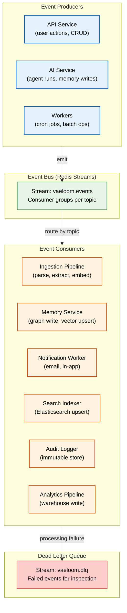
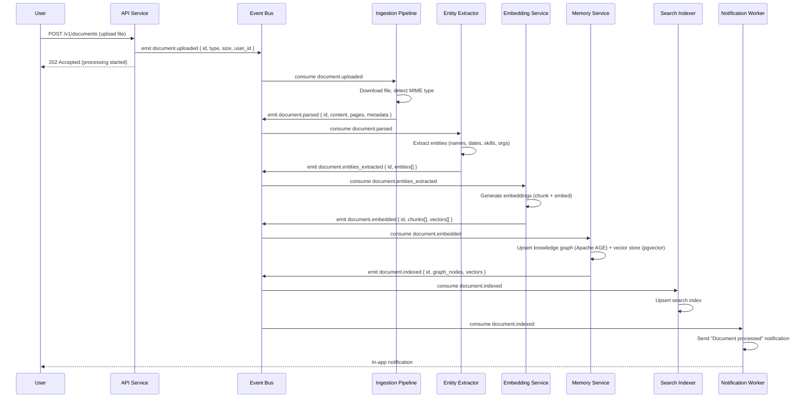
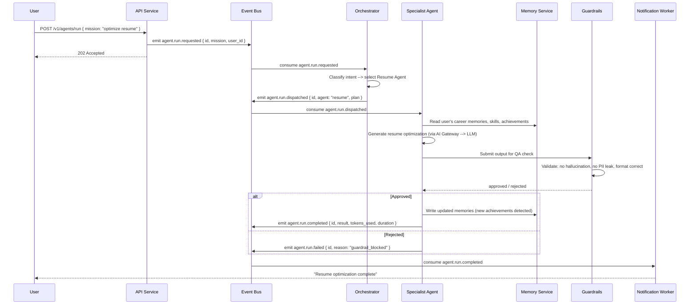
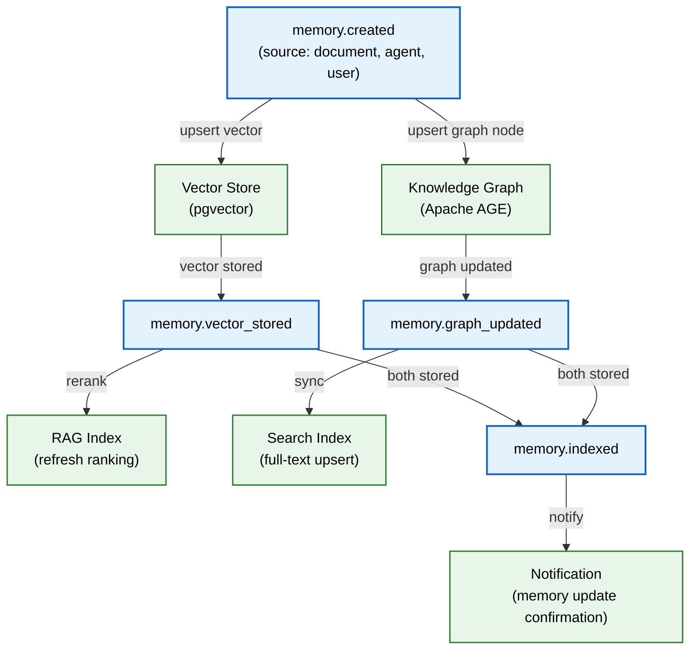

# Event Flow

> **Purpose:** Document how events flow through Vaeloom's event-driven architecture — from emission through processing, routing, dead-letter handling, and replay
> **Status:** 🆕 New
> **Owner:** Architecture Team
> **Version:** 1.0
> **Last Updated:** 2026-07-16
**Dependencies:** [`Event-Architecture.md`](./Event-Architecture.md), [`Queue.md`](./Queue.md), [`Data-Flow.md`](./Data-Flow.md), [`../Backend/Event-Catalog.md`](../Backend/Event-Catalog.md), [`../Backend/Workers.md`](../Backend/Workers.md)
> **Implementation Status:** 📋 Spec Only

## Overview

Vaeloom uses an event-driven architecture to decouple services and enable asynchronous processing. When a user uploads a document, an event is emitted; the ingestion pipeline picks it up, parses it, extracts entities, generates embeddings, and stores results — each step emitting its own events so other services can react independently. This document traces how events flow end-to-end for key scenarios, defines the event bus topology, and specifies dead-letter handling, replay, and schema evolution.

This complements [`Event-Architecture.md`](./Event-Architecture.md) (which covers the event bus types and schema design) and [`../Backend/Event-Catalog.md`](../Backend/Event-Catalog.md) (which catalogs every event). This doc is about *flow* — how events move through the system in practice.

## Goals

- Trace event flows for the three most critical scenarios (document ingestion, agent execution, memory update)
- Define the event bus topology and routing rules
- Specify dead-letter queue handling and event replay
- Document event versioning and schema evolution in practice
- Establish monitoring for event flow health

## Scope

### In Scope

- Event bus topology (Redis Streams as the transport)
- Event flow for document ingestion, agent execution, memory updates
- Dead-letter queue handling
- Event replay for recovery
- Event schema versioning

### Out of Scope

- Event catalog (see [`../Backend/Event-Catalog.md`](../Backend/Event-Catalog.md))
- Event schema design (see [`Event-Architecture.md`](./Event-Architecture.md))

## Architecture



> **Diagram:** Event bus topology. Producers emit events to a single Redis Stream. Consumer groups subscribe to topics. Processing failures route to a dead-letter stream for inspection and replay.

## Event Flow: Document Ingestion



## Event Flow: Agent Execution



## Event Flow: Memory Update Chain



> **Diagram:** The memory update chain. A `memory.created` event triggers parallel graph and vector upserts. Each completion triggers downstream indexing and notification events.

## Dead-Letter Queue Handling

```text
When an event consumer fails to process an event:
  1. Consumer catches the error and logs structured failure details.
  2. Event is moved to the DLQ stream (vaeloom.dlq) with original payload + error context.
  3. DLQ consumer emits a P3 alert with event type, error message, and affected entity.
  4. Ops reviews DLQ via admin dashboard or CLI.
  5. Ops can:
     a. Retry: re-emit the event to the main stream (after fixing root cause).
     b. Drop: acknowledge and discard (with justification logged).
     c. Edit: modify the payload and re-emit (for schema migration issues).
```

## Event Replay

Events are replayed in two scenarios:

| Scenario | Mechanism | Scope |
|----------|-----------|-------|
| **Recovery from failure** | Replay DLQ events after root cause fix | Single event or batch |
| **Feature backfill** | Replay all events of a type to populate a new consumer | All events of a type, time-bounded |
| **Debugging** | Replay specific events to a staging consumer | Single event, non-production |

```bash
# Replay a failed event from DLQ
vaeloom events replay --source dlq --event-id evt_abc123 --target main

# Backfill: replay all document.uploaded events from the last 7 days to re-index
vaeloom events replay --type document.uploaded --from 2026-07-09 --to 2026-07-16 --target main
```

## Event Schema Versioning

Events follow CloudEvents format with a `specversion` and `type` field. Schema evolution rules:

| Change type | Example | Action |
|-------------|---------|--------|
| Add optional field | Add `metadata.source_app` | No version bump; consumers ignore unknown fields |
| Add required field | Add `tenant_id` (required) | Bump to v2; consumer must handle both v1 and v2 |
| Rename field | `file_name` → `filename` | Add new field; deprecate old; support both for 90 days |
| Remove field | Remove `legacy_id` | Bump to v2; v1 consumers must be migrated first |
| Change type | `size: string` → `size: number` | Bump to v2; converter in consumer for backward compat |

## Security

| Concern | Mitigation | Verification |
|---------|-----------|--------------|
| Event injection (malicious event emitted) | Events are emitted by authenticated services only; producers sign events with HMAC | Consumer verifies signature before processing |
| Event tampering in transit | TLS between all services; Redis Streams support TLS | Network policy enforcement |
| Sensitive data in event payload | PII fields encrypted at event level; event schema marks sensitive fields | Schema validator rejects unencrypted PII |

## Monitoring

| Metric | Alert Threshold | Severity | Dashboard |
|--------|-----------------|----------|-----------|
| `event_consumer_lag_seconds` | >30s | P2 | Event Bus |
| `event_dlq_size` | >100 | P2 | Event Bus |
| `event_processing_error_rate` | >1% | P2 | Event Bus |
| `event_throughput_per_second` | Sudden drop >50% | P3 | Event Bus |

## Best Practices

| # | Practice | Rationale |
|---|----------|-----------|
| 1 | Every event must be idempotent | Consumers may receive duplicate events (at-least-once delivery) |
| 2 | Never include raw PII in event payloads | Encrypt sensitive fields; include only identifiers |
| 3 | Always set a TTL on events in the stream | Prevents unbounded stream growth (default: 7 days) |
| 4 | Monitor consumer lag continuously | Lag indicates a processing bottleneck that will cause delays |

## Future Improvements

| Improvement | Priority | Complexity | Timeline |
|-------------|----------|------------|----------|
| Event schema registry (Avro/Protobuf) | Medium | High | Q2 2027 |
| Exactly-once delivery semantics | Low | High | Q3 2027 |
| Self-healing DLQ (auto-retry transient failures) | High | Medium | Q1 2027 |

## Related Documents

- [`Event-Architecture.md`](./Event-Architecture.md) — event bus design
- [`Data-Flow.md`](./Data-Flow.md) — data flow through the system
- [`../Backend/Event-Catalog.md`](../Backend/Event-Catalog.md) — full event catalog
- [`../Backend/Workers.md`](../Backend/Workers.md) — worker processes
- [`../Backend/Queue.md`](../Backend/Queue.md) — queue architecture
