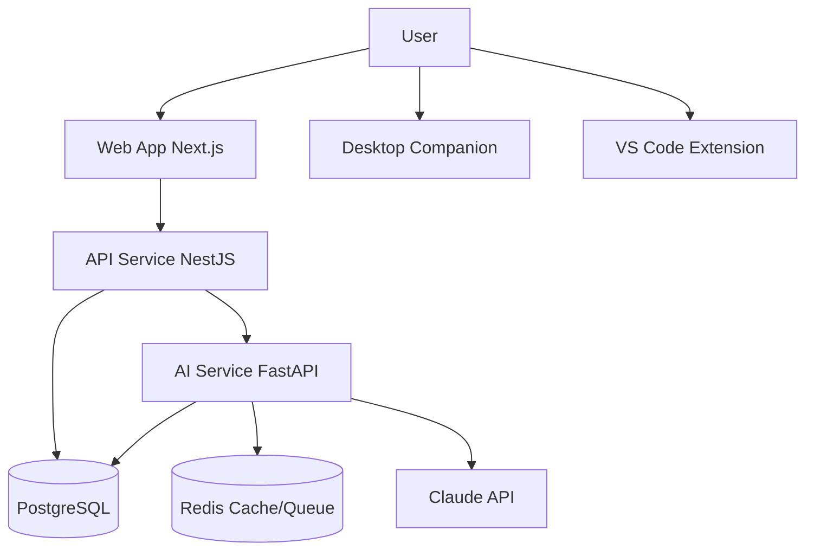

# High-Level Design

> **Purpose:** High-level architectural design for Meridian
> **Status:** ✅ Upgraded to enterprise quality
> **Canonical source:** [`/Docs/Meridian-Complete-Documentation.md#4-system-architecture`](../../Docs/Meridian-Complete-Documentation.md#4-system-architecture)

## System Context



## Service Responsibilities

| Service | Tech | Responsibility |
|---------|------|---------------|
| apps/web | Next.js, React | Frontend, SSR, UI |
| apps/api | NestJS, TypeScript | Auth, CRUD, permissions, events |
| apps/ai-service | FastAPI, Python | Agents, memory, RAG, model routing |

## Key Design Decisions

| Decision | Rationale |
|----------|-----------|
| Two-service backend | Different scaling and language needs for API vs AI |
| PostgreSQL + extensions at MVP | One database to operate; migrate to dedicated when needed |
| MCP-shaped tools from day one | Transport change, not rewrite, when real MCP arrives |
| Event bus for agent actions | Decouple "something happened" from "who needs to know" |

## Common Mistakes

| Mistake | Why It's a Problem |
|---------|-------------------|
| Frontend accessing the AI service or database directly | Every direct access path bypasses the permission engine and audit log — the API layer must be the sole gateway for all data access |
| Over-engineering scalability before proving the product | Building a Kubernetes cluster with auto-scaling for an MVP with 10 users adds months of complexity — start simple (PaaS, one database) and scale when validated |
| Ignoring the event bus for agent-to-agent communication | Agents calling each other directly (even via HTTP) creates tightly coupled, hard-to-debug chains — event-based communication decouples producers from consumers |
| Treating the two-service backend split as optional | A monolithic API+AI service makes it impossible to scale them independently or use Python's AI ecosystem properly — the split is non-negotiable |

## Best Practices

| Practice | Rationale |
|----------|-----------|
| Enforce that all frontend traffic routes through the API layer | The frontend talks to the API (NestJS); the API talks to the AI service (FastAPI); the AI service never exposes endpoints to the frontend directly |
| Start with the simplest viable infrastructure and upgrade only when metrics demand it | PaaS + managed PostgreSQL + Redis handles thousands of users — migrate to Kubernetes only when auto-scaling, multi-region, or complex traffic management requires it |
| Decouple agent actions through the event bus, not direct calls | When an agent publishes `memory.updated` instead of calling `MemoryAgent.update()`, any future consumer can subscribe without changing the producer |
| Adopt the two-service backend split from day one even if both run on the same box | Deploying them as separate processes (even on the same instance) enforces the API boundary and makes the eventual split to separate instances a deployment change, not an architecture change |

## Security

| Concern | Mitigation |
|---------|------------|
| Inter-service API exposure to the public internet | The AI service's internal RPC endpoints must not be publicly accessible — configure network policies (VPC, security groups) so the AI service only accepts traffic from the API service |
| Authentication bypass through internal service-to-service calls | Internal RPC calls between services must carry authentication (service tokens or mTLS) — an attacker who reaches an internal endpoint should still be authenticated |
| API gateway as a single point of trust | The API gateway is the only entry point for external traffic — ensure it enforces all auth, rate limiting, and input validation before forwarding to internal services |

## Performance

| Concern | Guideline |
|---------|-----------|
| Inter-service latency overhead | Each internal RPC call between API and AI service adds 5-50ms of network latency — batch related requests (e.g., fetch all dashboard data in one call) rather than making 5 sequential calls |
| SSR rendering cost for real-time pages | Server-side rendering every Chat or Memory Graph page adds unnecessary server load — use SSR for content pages (Dashboard, Settings) and CSR for interactive pages (Chat, Workspace) |
| CDN caching for static assets | Versioned static assets (JS, CSS, images) should be served through CDN with long cache headers (1 year) — eliminates repeat requests for unchanged assets after the first load |

## Goals

- Define the high-level service decomposition into frontend, API, and AI tiers
- Establish communication patterns between services to ensure clean boundaries
- Set security guidelines that prevent unauthorized inter-service access
- Define performance expectations for each architectural layer
- Document architectural invariants that must not be violated during development

## Scope

| In Scope | Out of Scope |
|----------|--------------|
| Three-service decomposition (web, API, AI) | Detailed class-level design and implementation |
| Inter-service communication protocols and patterns | Database schema design and indexing strategy |
| High-level security boundaries between service zones | Specific encryption algorithm configuration |
| Performance guidelines per service type | Exact auto-scaling thresholds and instance sizing |
| Architectural decision records and rationale | CI/CD pipeline and deployment workflow specifics |

## Functional Requirements

| ID | Requirement | Priority |
|----|-------------|----------|
| HLD-FR-01 | System must provide a web-based user interface for all features | P0 |
| HLD-FR-02 | All user requests must be authenticated before reaching internal services | P0 |
| HLD-FR-03 | System must support document upload, processing, and memory storage | P0 |
| HLD-FR-04 | Agent outputs must be validated before being presented to users | P1 |
| HLD-FR-05 | System must provide real-time notifications for async operations | P1 |

## Non-Functional Requirements

| ID | Requirement | Target | Measurement |
|----|-------------|--------|-------------|
| HLD-NFR-01 | Page load time for content pages | < 2s | Lighthouse performance audit |
| HLD-NFR-02 | AI service response for agent interactions | < 10s | End-to-end agent response timing |
| HLD-NFR-03 | Concurrent user capacity without degradation | 500 users | Load testing suite |
| HLD-NFR-04 | Maximum authentication processing time | < 200ms | Auth middleware timing metrics |

## Components

| Component | Responsibility | Technology | Scale Strategy |
|-----------|---------------|------------|----------------|
| Web Frontend | SSR rendering, client routing, static asset serving | Next.js, React, TypeScript | CDN caching + horizontal auto-scaling |
| API Gateway | Authentication, rate limiting, request routing to internal services | NestJS, TypeScript | Stateless horizontal scaling behind load balancer |
| AI Service | Agent orchestration, memory extraction, model routing | FastAPI, Python 3.11+ | Queue-driven scaling based on job backlog |
| PostgreSQL | Relational data, graph entities, vector embeddings | PostgreSQL 15 + AGE + pgvector | Vertical → read replicas → partitioning |

## Data Flow

1. User initiates a request from the browser which hits the CDN edge and is forwarded to the Web Frontend
2. Web Frontend authenticates the session via the API Gateway, which validates tokens with the Auth Provider
3. For AI operations, the API Gateway forwards authorized requests to the AI Service via internal RPC with mTLS
4. AI Service retrieves relevant context from PostgreSQL (entities + embeddings), constructs agent prompts, and calls the external Model API
5. The response flows back through the AI Service → API Gateway → Web Frontend, with structured logging at every hop

## Scalability

| Dimension | Current Limit | 10x Strategy | 100x Strategy |
|-----------|--------------|--------------|---------------|
| Frontend concurrent sessions | 500 | CDN caching + auto-scaling web instances | Multi-region edge deployment |
| API request throughput | 100 req/s | Horizontal auto-scaling + connection pooling | Global load balancing with traffic shaping |
| AI service concurrent agent runs | 20 | Queue-driven worker pool expansion | Dedicated GPU-backed agent workers |
| Data storage volume | 100GB | Vertical database scaling + archival | Read replicas + partitioning + cold storage |

## Error Handling

| Error Scenario | Detection | Mitigation | Recovery |
|---------------|-----------|------------|----------|
| Frontend fails to reach API Gateway | Network error in browser | Exponential backoff retry with cached UI state | Retry on connectivity restoration |
| API Gateway authentication service timeout | Auth provider unreachable | Fall back to cached session validation | Re-authenticate when auth service recovers |
| AI Service internal error propagating to API | Error response from internal RPC | Return generic 503 to frontend; log full error internally | Auto-restart AI service; notify operations |
| External model API unavailable | Model call returns connection error | Queue agent task for later retry; return "processing" status | Retry with backoff; switch to fallback model |

## Monitoring

| Metric | Alert Threshold | Severity | Dashboard |
|--------|----------------|----------|-----------|
| Frontend SSR response time | > 2s p95 for 5 minutes | Warning | Frontend Performance |
| API Gateway p99 latency | > 1s for 5 minutes | Critical | API Gateway Performance |
| AI service error rate | > 5% of agent runs | Critical | AI Service Health |
| Auth provider availability | < 99.9% uptime in 1 hour | Critical | External Dependency Status |

## Configuration

| Variable | Purpose | Default | Required |
|----------|---------|---------|----------|
| `NEXT_PUBLIC_API_URL` | Public-facing API endpoint URL | — | Yes |
| `INTERNAL_API_URL` | Internal API service URL for server-side calls | — | Yes |
| `AI_SERVICE_URL` | AI service internal RPC endpoint | — | Yes |
| `AUTH_PROVIDER_URL` | Authentication provider base URL | — | Yes |
| `SESSION_SECRET` | Secret key for session token encryption | — | Yes |

## Risks

| Risk | Likelihood | Impact | Mitigation |
|------|------------|--------|------------|
| Frontend bypassing API Gateway to reach services directly | Low | Critical | Network policies blocking direct access; API-only service exposure |
| Two-service backend split introducing coordination overhead | Medium | Medium | Well-defined API contracts with versioning; shared schema package |
| Auth provider single point of failure | Medium | High | Short-lived session cache; token refresh queue |
| AI service dependency slowing down non-AI API operations | Low | Medium | Separate API-only paths that don't require AI service calls |

## Limitations

| Limitation | Impact | Workaround | Future Resolution |
|------------|--------|------------|-------------------|
| Two-service backend requires documented API contracts | Development coordination overhead | Shared OpenAPI schema between services | Auto-generated client libraries from schema |
| Frontend SSR limited to content pages | Interactive pages have TTI delay | Use CSR for chat, workspace, and graph views | Islands architecture with selective hydration |
| No offline support for web application | User cannot work without connectivity | Desktop companion for offline operations | PWA with service worker and IndexedDB sync |

## Examples

### Service context diagram

```bash
meridian arch diagram --scope services --format mermaid
```

### API → AI service RPC call

```typescript
const result = await meridian.internalRpc.call({
  service: "ai-service",
  method: "agent.run",
  payload: { agent: "resume", action: "update" }
});
```

### Check service health

```bash
meridian health --services api,ai-service,worker
```

## Future Improvements

| Improvement | Priority | Complexity | Timeline |
|-------------|----------|------------|----------|
| Adopt GraphQL for frontend API queries | Medium | Medium | Q4 2026 |
| Implement edge-side rendering for global low latency | Medium | High | Q1 2027 |
| Add read-only API tier for public content access | Low | Low | Q3 2026 |
| Replace internal RPC with gRPC for typed contracts | Low | Medium | Q4 2026 |

## Related Documents

- [System Design.md](./System-Design.md)
- [Low Level Design.md](./Low-Level-Design.md)
- [`/Docs/Meridian-Complete-Documentation.md#4-system-architecture`](../../Docs/Meridian-Complete-Documentation.md#4-system-architecture)
