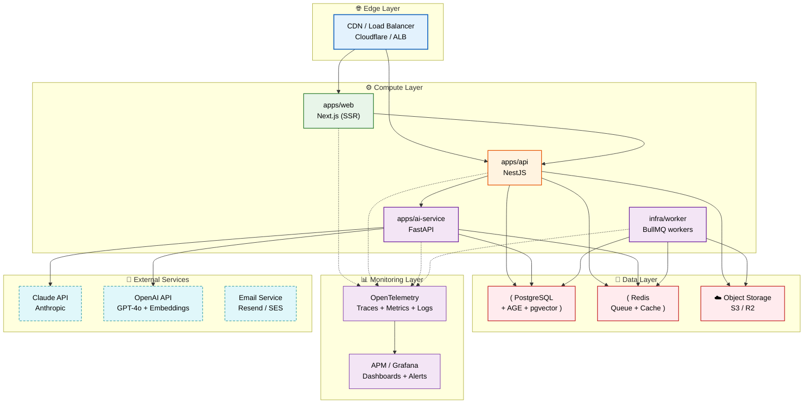

# Infrastructure

> **Purpose:** Define the infrastructure architecture for Meridian
> **Status:** ✅ Upgraded to enterprise quality

## Infrastructure Diagram



> **Diagram:** Production infrastructure spans five layers. **Edge** routes traffic to web and API services. **Compute** runs Next.js (frontend), NestJS (API), FastAPI (AI service), and BullMQ workers. **Data** includes PostgreSQL (+ AGE + pgvector), Redis (queue + cache), and S3 storage. **Monitoring** collects OpenTelemetry traces/metrics/logs into Grafana. **External** services include Claude API, OpenAI, and email providers.

---

## Infrastructure Components

| Component | MVP | Enterprise |
|-----------|-----|------------|
| Compute | PaaS (Render/Fly.io) | Kubernetes |
| Database | Managed PostgreSQL | PostgreSQL + read replicas |
| Cache | Managed Redis | Redis Cluster |
| Storage | S3-compatible | S3 + cross-region replication |
| CDN | Cloudflare / Fastly | Same |
| Queue | Redis + BullMQ | Kafka |
| Monitoring | OpenTelemetry + APM | Same, expanded retention |

## Provisioning

| Tool | Use Case |
|------|----------|
| Docker Compose | Local development |
| PaaS CLI (flyctl) | Staging deployment |
| Terraform | Production infrastructure (enterprise) |

## Common Mistakes

| Mistake | Why It's a Problem |
|---------|-------------------|
| Using the same environment configuration for staging and production | Staging with production data or credentials risks data leaks and accidental production changes — environments must be fully isolated with separate credentials, databases, and secrets |
| Manual infrastructure changes that aren't reflected in code | A manual change to a production database or load balancer that isn't committed to Terraform or configuration files creates "drift" — the next automated deploy may overwrite the manual change or break silently |
| No health check endpoints for orchestration | Auto-scaling and load balancing depend on health checks — without `/health` and `/ready` endpoints, the orchestrator can't distinguish between a service that's starting up and one that's unhealthy |
| Ignoring cost monitoring from day one | Infrastructure costs can grow unexpectedly — a runaway AI service or unoptimized database can multiply the monthly bill by 10x before anyone notices |

## Best Practices

| Practice | Rationale |
|----------|-----------|
| Maintain fully isolated environments with separate credentials | Staging, production, and development environments must have separate databases, storage buckets, and API credentials — never share credentials or data across environments |
| Define all infrastructure as code (IaC) using Terraform or equivalent | Every database, bucket, queue, and load balancer configuration is version-controlled and deployable — manual changes should trigger an alert and be reverted to match the IaC definition |
| Implement `/health` (liveness) and `/ready` (readiness) endpoints per service | Liveness checks tell the orchestrator the process is alive; readiness checks tell it the service can accept traffic — different endpoints enable graceful startup and shutdown |
| Set cost budgets and alerts from the first deployment | Configure budget alerts at 50%, 80%, and 100% of expected monthly cost — a sudden spike (runaway container, database burst) triggers an alert before it becomes a billing surprise |

## Security

| Concern | Mitigation |
|---------|------------|
| Secrets in environment variables exposed via logs or error pages | Environment variables containing database passwords or API keys can be leaked through error pages, log files, or process inspection — use a dedicated secrets manager (Vault, AWS Secrets Manager) with runtime injection |
| Unpatched container images with known vulnerabilities | Base images used in Dockerfiles accumulate CVEs over time — use minimal base images, run nightly vulnerability scans, and rebuild images weekly, and rebuild images weekly to pick up security patches |
| Overly permissive network policies between services | In a microservice architecture, services should only be able to communicate with the services they need — use network policies (Kubernetes NetworkPolicies or security groups) to enforce least-privilege networking |

## Performance

| Concern | Guideline |
|---------|-----------|
| Cold start latency in PaaS/serverless environments | PaaS platforms may spin down idle services after inactivity — the first request after idle triggers a cold start (5-30s); configure minimum instance counts to keep at least one warm instance per service |
| Database connection limits under scale | Each service instance opens connections to PostgreSQL — at 10 web instances × 20 connections each = 200 connections, which may exceed the database's max_connections; use PgBouncer for connection pooling |
| Monitoring overhead vs value | OpenTelemetry collection adds ~5% CPU overhead per service — this is acceptable for debugging and alerting; if monitoring overhead exceeds 10%, sample traces rather than collecting 100% of requests |

## Goals

- Define a five-layer production infrastructure spanning edge, compute, data, monitoring, and external services
- Establish infrastructure-as-code practices for all production resources using Terraform
- Ensure environment isolation (dev, staging, production) with separate credentials and networking
- Implement OpenTelemetry-based observability across all services from day one
- Set cost monitoring and budget alerts before the first production deployment

## Scope

| In Scope | Out of Scope |
|----------|--------------|
| Five-layer infrastructure architecture (edge, compute, data, monitoring, external) | Hardware procurement and data center management |
| Infrastructure components for MVP and enterprise phases | Specific cloud provider migration planning |
| OpenTelemetry-based observability stack (traces, metrics, logs) | Application-level instrumentation details |
| Environment isolation strategy (dev, staging, production) | Disaster recovery runbook specifics |
| Cost monitoring and budget alert configuration | Vendor contract negotiation |

## Functional Requirements

| ID | Requirement | Priority |
|----|-------------|----------|
| INF-FR-01 | All infrastructure must be defined as code (Terraform for production) | P0 |
| INF-FR-02 | Environments must be fully isolated with separate databases, buckets, and credentials | P0 |
| INF-FR-03 | Every service must emit OpenTelemetry traces, metrics, and logs | P0 |
| INF-FR-04 | CDN must serve all static assets with long cache headers | P1 |
| INF-FR-05 | Cost budgets must be configured with alerts at 50%, 80%, and 100% thresholds | P0 |

## Non-Functional Requirements

| ID | Requirement | Target | Measurement |
|----|-------------|--------|-------------|
| INF-NFR-01 | Infrastructure provisioning time (full stack) | < 30 minutes | Terraform apply duration |
| INF-NFR-02 | CDN cache hit ratio for static assets | > 90% | CDN analytics dashboard |
| INF-NFR-03 | Monitoring overhead per service | < 5% CPU | OpenTelemetry agent metrics |
| INF-NFR-04 | Database backup recovery time objective (RTO) | < 1 hour | Backup restore testing |

## Components

| Component | Responsibility | Technology | Scale Strategy |
|-----------|---------------|------------|----------------|
| Edge Layer | CDN, load balancing, DDoS protection, TLS termination | Cloudflare / ALB | Global anycast network |
| Compute Layer | Application runtime for web, API, AI, and worker services | PaaS (Render/Fly.io) → K8s | Horizontal auto-scaling per service |
| Data Layer | Relational storage, caching, object storage, queues | PostgreSQL, Redis, S3/R2 | Vertical → read replicas → partitioning |
| Monitoring Layer | Distributed tracing, metric collection, log aggregation, dashboards | OpenTelemetry + Grafana | Expanded retention for enterprise |

## Data Flow

1. User request hits the Edge Layer (CDN/LB), which terminates TLS, applies WAF rules, and routes traffic to the appropriate Compute Layer service based on the path and protocol
2. Compute Layer services (web, API, AI, worker) process the request, reading and writing to Data Layer components (PostgreSQL for relational data, Redis for cache/queue, S3 for objects)
3. External Service calls (Claude API, OpenAI, Email) are made from the Compute Layer with API keys retrieved from the secrets manager
4. Every request generates OpenTelemetry spans and metrics that flow from the Compute Layer to the Monitoring Layer
5. Monitoring Layer ingests traces, metrics, and logs into Grafana with pre-configured dashboards, alerts, and cost tracking

## Scalability

| Dimension | Current Limit | 10x Strategy | 100x Strategy |
|-----------|--------------|--------------|---------------|
| Compute instances | 3 per service | Auto-scaling groups per service | Multi-region K8s clusters |
| Data storage volume | 100GB | Vertical DB scale + archival | Read replicas + partitioning + cold storage |
| CDN bandwidth | 1TB/month | Cloudflare Enterprise plan | Multi-CDN with failover |
| Monitoring retention | 30 days | 90-day retention for metrics | 1-year retention with sampling |

## Error Handling

| Error Scenario | Detection | Mitigation | Recovery |
|---------------|-----------|------------|----------|
| Compute instance failure | Health check failure | Orchestrator replaces instance | Service auto-restart with same configuration |
| Database storage exhaustion | Disk usage monitoring alert | Auto-scale storage volume | Purge old data; increase allocated storage |
| CDN origin fetch failure | 5xx from origin | Serve stale cached content | Failover to secondary origin |
| Monitoring pipeline backpressure | OpenTelemetry exporter queue full | Drop non-critical spans | Scale collector instances |

## Monitoring

| Metric | Alert Threshold | Severity | Dashboard |
|--------|----------------|----------|-----------|
| Compute instance CPU utilization | > 80% for 10 minutes | Warning | Compute Layer Health |
| Database disk usage | > 85% capacity | Critical | Database Storage Dashboard |
| CDN error rate (5xx) | > 1% of requests | Critical | CDN Performance |
| Infrastructure cost (monthly burn rate) | > 80% of budget | Warning | Cost Monitoring Dashboard |
| OpenTelemetry collector drop rate | > 1% of spans | Warning | Observability Pipeline Health |

## Configuration

| Variable | Purpose | Default | Required |
|----------|---------|---------|----------|
| `CLOUDFLARE_API_TOKEN` | API token for CDN/DNS configuration | — | Yes |
| `DB_BACKUP_SCHEDULE` | Cron schedule for automatic database backups | `0 3 * * *` | No |
| `OTEL_EXPORTER_ENDPOINT` | OpenTelemetry collector endpoint URL | — | Yes |
| `COST_BUDGET_MONTHLY` | Monthly infrastructure budget in USD | — | Yes |
| `ENVIRONMENT_NAME` | Current deployment environment identifier | `development` | No |

## Risks

| Risk | Likelihood | Impact | Mitigation |
|------|------------|--------|------------|
| Cloud provider outage affecting multiple services | Low | Critical | Multi-region architecture; provider-agnostic IaC |
| Terraform state drift from manual changes | Medium | High | State locking; drift detection alerts; no manual changes |
| Database backup corruption going undetected | Low | Critical | Automated backup restore testing in staging |
| Cost overrun from runaway compute or AI model calls | Medium | Medium | Budget alerts; per-service cost tracking; instance caps |

## Limitations

| Limitation | Impact | Workaround | Future Resolution |
|------------|--------|------------|-------------------|
| PaaS compute lacks K8s-level traffic management | Limited canary deployments and traffic splitting | Separate staging environment for testing | Migrate to Kubernetes for production |
| Single-region deployment in MVP | Regional outage affects all users | DNS failover to backup region (manual) | Multi-region active-active deployment |
| 30-day monitoring data retention | Cannot investigate incidents older than 30 days | Export critical metrics to long-term storage | Tiered retention (hot/warm/cold) |

## Examples

### Deploy infrastructure stack

```bash
meridian infra deploy --environment staging --services api,ai-service
```

### Check resource utilization

```bash
meridian infra stats --service ai-service --metric cpu,memory --window 1h
```

### Scale a service

```bash
meridian infra scale --service worker --replicas 5 --reason "queue backlog"
```

### View infrastructure as code

```hcl
resource "meridian_service" "ai" {
  name    = "ai-service"
  runtime = "fastapi"
  scaling = { min: 2, max: 10, metric: "queue_depth" }
}
```

## Future Improvements

| Improvement | Priority | Complexity | Timeline |
|-------------|----------|------------|----------|
| Multi-region active-active deployment with automated failover | High | High | Q4 2026 |
| Migrate compute from PaaS to Kubernetes | High | High | Q1 2027 |
| Long-term metrics retention with tiered storage | Medium | Medium | Q3 2026 |
| Automated disaster recovery runbook with Chaos Engineering | Low | High | Q2 2027 |

## Related Documents

- [Service Architecture.md](./Service-Architecture.md)
- [Scalability.md](./Scalability.md)
- [`DevOps/Deployment.md`](../DevOps/Deployment.md)
