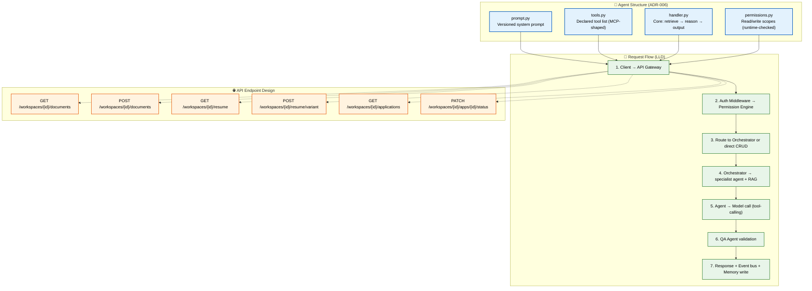

# Low-Level Design

> **Purpose:** Low-level design details for Meridian's core components
> **Status:** ✅ Upgraded to enterprise quality
> **Canonical source:** [`/Docs/Meridian-Complete-Documentation.md#13-implementation-blueprint`](../../Docs/Meridian-Complete-Documentation.md#13-implementation-blueprint)

## Low-Level Design Architecture



> **Diagram:** LLD showing **agent structure** (4-file pattern: prompt, tools, handler, permissions), **request flow** (7-step from client→API→auth→orchestrator→agent→QA→response), and **REST endpoint design** (resource-oriented with workspaces, documents, resume, applications).

---

## Agent Architecture Pattern

Every agent in `apps/ai-service/agents/` follows an identical internal structure:

```text
agents/
├── organization_agent/
│   ├── prompt.py      # Versioned system prompt
│   ├── tools.py       # Declared tool list (MCP-shaped)
│   ├── handler.py     # Core logic: retrieve → reason → output
│   └── permissions.py # Read/write memory scopes (runtime-checked)
├── memory_agent/
│   └── ...
└── ...
```

## Request Flow (LLD)

```text
1. Client → API Gateway → Auth Middleware → Permission Engine
2. Permission Engine → Route to Orchestrator or direct CRUD
3. Orchestrator → Select specialist agent → Agentic RAG retrieval
4. Agent → Model call (tool-calling) → QA Agent validation
5. Output → Response to client + Event bus publish + Memory write
```

## API Endpoint Design

REST-first, resource-oriented:

```text
GET    /workspaces/{id}/documents
POST   /workspaces/{id}/documents
GET    /workspaces/{id}/resume
POST   /workspaces/{id}/resume/variant
GET    /workspaces/{id}/applications
PATCH  /workspaces/{id}/applications/{id}/status
```

## Common Mistakes

| Mistake | Why It's a Problem |
|---------|-------------------|
| Writing endpoint specifications before defining the data model | Endpoints designed without a clear data model produce inconsistent APIs — similar resources get different response shapes, making client code complex and error-prone |
| Not including error response schemas in API designs | Clients need to know what error shapes to expect — an API that returns 400 with `{error: "invalid"}` for one endpoint and `{message: "Invalid", code: 400}` for another forces brittle error handling |
| Agent implementations that deviate from the shared contract | An agent that skips `permissions.py` or defines tools outside `tools.py` breaks the uniform structure that enables cross-agent tooling (eval, QA, monitoring) |
| API routes that bypass the permission engine for "internal" endpoints | An "internal" endpoint that doesn't check permissions is a backdoor — any service that discovers it can access data without authorization checks |

## Best Practices

| Practice | Rationale |
|----------|-----------|
| Define the data model (schemas, types, relationships) before API endpoints | A data model-first approach ensures consistent shapes across all endpoints — similar resources look similar; responses are predictable |
| Include error response schemas in every API endpoint specification | Every endpoint documents its possible error responses (400, 401, 403, 404, 500) with consistent shape — `{error: {code, message, details}}` for every error |
| Enforce the agent contract structure through code review and linting | An agent that doesn't follow the uniform structure (prompt.py, tools.py, handler.py, permissions.py) should fail code review — consistency is what makes 28 agents manageable |
| Apply permission checks on every route, including "internal" ones | An endpoint that is only called by another service still needs permission checks — internal services should have their own permissions scoped to what they legitimately need |

## Security

| Concern | Mitigation |
|---------|------------|
| API endpoint enumeration revealing resource IDs | Sequential resource IDs (workspaces, documents) allow enumeration — use ULID or UUID v7 for resource identifiers to prevent an attacker from guessing or enumerating valid IDs |
| Error responses leaking stack traces or query details | A 500 error that returns a stack trace or SQL query reveals internal system details — catch all errors at the API boundary and return sanitized error responses with a reference ID for log correlation |
| Permission check bypass via alternate route paths | If the same resource is accessible through multiple routes (e.g., `/workspaces/1/documents/2` and `/documents/2`), one path might skip permission checks — permission logic should be centralized, not repeated per route |

## Performance

| Concern | Guideline |
|---------|-----------|
| N+1 query patterns in REST API responses | An endpoint that returns a list of documents then queries each document's metadata individually creates N+1 database queries — use eager loading, batch queries, or GraphQL-style field selection to reduce query count |
| Serialization overhead for large response payloads | A single endpoint returning 1000+ documents with full entities serialized can take 500ms+ just in JSON serialization — paginate large responses (max 50 items per page) and use cursor-based pagination |
| Agent prompt loading time | Loading prompt.py, tools.py, and permissions.py from disk on every agent invocation adds file I/O overhead — cache loaded agent configurations in memory and invalidate only when the prompt version changes |

## Goals

- Standardize the agent architecture pattern (prompt, tools, handler, permissions) across all 28 enterprise agents
- Define precise API endpoint specifications with request/response schemas for every resource
- Establish a 7-step request flow that enforces permission checks at every stage
- Ensure consistent error response shapes across all API endpoints
- Document the data model relationships before endpoint implementation to maintain consistency

## Scope

| In Scope | Out of Scope |
|----------|--------------|
| Agent file structure and naming conventions (prompt.py, tools.py, handler.py, permissions.py) | Individual agent business logic and prompt content |
| REST API endpoint design for core resources | Authentication provider integration details |
| Request flow from client through orchestrator to agent | External API client SDK generation |
| Error response schema and error code conventions | Infrastructure-specific error handling (network, DNS) |
| Data model relationships for entities, workspaces, and documents | Database indexing strategy and query optimization |

## Functional Requirements

| ID | Requirement | Priority |
|----|-------------|----------|
| LLD-FR-01 | Every agent must implement prompt.py, tools.py, handler.py, and permissions.py | P0 |
| LLD-FR-02 | All API endpoints must return errors in `{error: {code, message, details}}` format | P0 |
| LLD-FR-03 | Every API route must pass through the permission engine before execution | P0 |
| LLD-FR-04 | Agent handler must follow retrieve → reason → output execution flow | P1 |
| LLD-FR-05 | Agent tools must be declared in MCP-shaped format for future compatibility | P1 |

## Non-Functional Requirements

| ID | Requirement | Target | Measurement |
|----|-------------|--------|-------------|
| LLD-NFR-01 | API endpoint response time for simple CRUD | < 200ms p95 | Endpoint-level latency monitoring |
| LLD-NFR-02 | Agent configuration load time from disk | < 50ms | Agent initialization timing |
| LLD-NFR-03 | Maximum pagination response size | 50 items per page | API response size enforcement |
| LLD-NFR-04 | Permission check execution latency | < 10ms per check | Permission engine profiling |

## Components

| Component | Responsibility | Technology | Scale Strategy |
|-----------|---------------|------------|----------------|
| Agent Module (per agent) | Prompt management, tool definition, handler logic, permission scopes | Python 3.11+ | Stateless; scaled by agent queue depth |
| API Router | Route dispatch, middleware chain, request validation | NestJS, TypeScript | Stateless; horizontal auto-scaling |
| Permission Engine | Runtime permission checking per request/resource | Custom TypeScript module | In-memory cache with DB-backed rules |
| QA Validator | Post-agent output validation before response delivery | Python 3.11+ | Queue-driven; validates asynchronously |

## Data Flow

1. Client sends request to API Gateway, which triggers Auth Middleware to validate the JWT token and extract user identity
2. Permission Engine checks that the authenticated user has the required scopes for the target resource and operation
3. Orchestrator receives the authorized request, selects the appropriate specialist agent based on intent classification
4. Agent loads its prompt, tools, and permissions from the cached configuration, retrieves relevant context via Agentic RAG, and calls the Model API with tool definitions
5. QA Agent validates the model output against expected schema and quality criteria before the response is returned to the client and the event is published to the bus

## Scalability

| Dimension | Current Limit | 10x Strategy | 100x Strategy |
|-----------|--------------|--------------|---------------|
| Number of agent types | 8 MVP agents | Add 20 enterprise agents with shared tool runtime | Dynamic agent loading from registry |
| API endpoints | 30 endpoints | Modular route registration per resource | API versioning with deprecation lifecycle |
| Concurrent agent invocations | 10 | Queue-driven worker-per-agent-type | Agent pool with dynamic instance allocation |
| Permission rules | 100 rules | Hierarchical rule inheritance | External policy engine (OPA) |

## Error Handling

| Error Scenario | Detection | Mitigation | Recovery |
|---------------|-----------|------------|----------|
| Missing or invalid permission scope | Permission Engine returns 403 | Return standardized `{error: {code: 403, message: "forbidden"}}` | Log incident for security audit |
| Agent handler exception during execution | Unhandled exception in handler.py | Return 500 with error reference ID; log full stack trace | Load agent config from backup version |
| Malformed API request body | Schema validation failure | Return 400 with field-level validation details | Client retries with corrected payload |
| QA Agent validation failure | Output fails quality checks | Return "needs review" status; surface discrepancies to user | Manual review or agent retry with refined prompt |

## Monitoring

| Metric | Alert Threshold | Severity | Dashboard |
|--------|----------------|----------|-----------|
| API endpoint p99 latency per route | > 500ms for 5 minutes | Warning | Per-Endpoint Latency |
| Permission engine p99 execution time | > 50ms for 5 minutes | Warning | Permission Engine Performance |
| Agent configuration cache miss rate | > 10% of invocations | Warning | Agent Cache Health |
| QA Agent rejection rate | > 15% of agent outputs | Warning | QA Validation Dashboard |

## Configuration

| Variable | Purpose | Default | Required |
|----------|---------|---------|----------|
| `MAX_PAGINATION_LIMIT` | Maximum items per page in list endpoints | `50` | No |
| `AGENT_CONFIG_CACHE_TTL` | Cache duration for loaded agent configurations | `300` | No |
| `PERMISSION_CHECK_TIMEOUT` | Maximum time for a permission check before fallback | `100ms` | No |
| `QA_AGENT_ENABLED` | Enable or disable post-agent QA validation | `true` | No |
| `ERROR_RESPONSE_INCLUDE_DETAILS` | Include debug details in error responses (dev only) | `false` | No |

## Risks

| Risk | Likelihood | Impact | Mitigation |
|------|------------|--------|------------|
| Agent contract violation (missing file or incorrect structure) | Medium | High | CI linting checks for required files; code review enforcement |
| Permission engine becoming a performance bottleneck | Low | High | In-memory caching of permission rules; async evaluation path |
| API endpoint explosion without versioning strategy | Medium | Medium | API version header from day one; deprecation policy |
| Agent configuration drift across environments | Low | Medium | Version-controlled agent configs; environment validation tests |

## Limitations

| Limitation | Impact | Workaround | Future Resolution |
|------------|--------|------------|-------------------|
| Four-file agent contract is rigid for simple agents | Small agents require boilerplate files | Base classes with defaults for optional files | Optional agent file contract with auto-generation |
| Permission engine checks on every request add latency | 5-10ms overhead per API call | Batch permission checks for multi-resource requests | Native permission check in database query layer |
| No automatic API endpoint generation from data models | Manual route implementation for each resource | NestJS resource generators | OpenAPI-to-code generation pipeline |

## Examples

### Define an agent handler

```python
# agents/resume/handler.py
class ResumeAgentHandler:
    async def handle(self, request: AgentRequest) -> AgentResponse:
        memory = await self.load_memory(request.user_id)
        updated = await self.merge_resume(memory, request.files)
        return AgentResponse(data=updated, permissions=["memory:write"])
```

### API endpoint pattern

```typescript
// POST /workspaces/:id/documents
@Post("workspaces/:id/documents")
async uploadDocument(@Param("id") wsId: string, @Body() body: UploadDto) {
  return this.documentsService.ingest(wsId, body);
}
```

### Permission check during request flow

```typescript
const permitted = await permissionEngine.check({
  user: req.userId, action: "memory:write", resource: wsId
});
```

## Future Improvements

| Improvement | Priority | Complexity | Timeline |
|-------------|----------|------------|----------|
| Auto-generate API clients from OpenAPI schema | High | Medium | Q3 2026 |
| Dynamic agent loading from registry without deployment | Medium | High | Q1 2027 |
| GraphQL API layer for complex frontend queries | Medium | Medium | Q4 2026 |
| Inline permission checks at database query level | Low | High | Q2 2027 |

## Related Documents

- [System Design.md](./System-Design.md)
- [High Level Design.md](./High-Level-Design.md)
- [`/Docs/Meridian-Complete-Documentation.md#13-implementation-blueprint`](../../Docs/Meridian-Complete-Documentation.md#13-implementation-blueprint)
