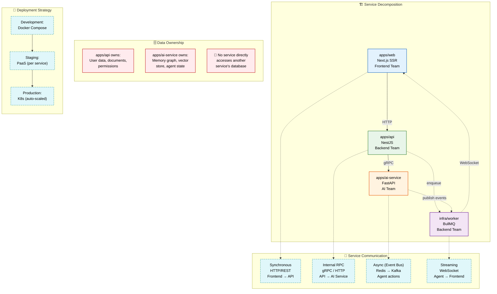

# Microservices

> **Purpose:** Define the microservices architecture for Meridian
> **Status:** ✅ Upgraded to enterprise quality

## Service Architecture



> **Diagram:** Four independently-scalable services communicate through well-defined patterns. **apps/web** talks to **apps/api** via HTTP. **apps/api** calls **apps/ai-service** via gRPC. Both enqueue async work via **infra/worker** through the event bus. WebSocket streaming delivers agent output to the frontend. Each service owns its data — no service directly accesses another's database.

---

## Service Decomposition

| Service | Responsibility | Team | Can Scale Independently |
|---------|---------------|------|------------------------|
| `apps/web` | Frontend rendering, SSR | Frontend | ✅ |
| `apps/api` | Auth, CRUD, permissions | Backend | ✅ |
| `apps/ai-service` | Agents, memory, RAG | AI | ✅ |
| `infra/worker` | Background jobs (ingestion, sync) | Backend | ✅ |

## Service Communication

| Pattern | Protocol | Example |
|---------|----------|---------|
| Synchronous | HTTP/REST | Frontend → API |
| Internal RPC | gRPC or HTTP | API → AI Service |
| Async | Event bus (Redis → Kafka) | Agent action → Event publish |
| Streaming | WebSocket | Agent output → Frontend |

## Service Boundaries

Each service owns its data and exposes it through defined APIs:

- `apps/api` owns user data, documents, permissions
- `apps/ai-service` owns memory graph, vector store, agent state
- No service directly accesses another service's database

## Deployment Strategy

| Environment | Method |
|-------------|--------|
| Development | Docker Compose (all services) |
| Staging | PaaS (separate per service) |
| Production | K8s (separate per service, auto-scaled) |

## Common Mistakes

| Mistake | Why It's a Problem |
|---------|-------------------|
| Allowing one service to read another service's database directly | Direct database access between services creates hidden coupling — a schema change in one service breaks the other without any compilation error or API contract violation |
| Synchronous calls between services for non-critical operations | Every synchronous inter-service call adds latency and failure risk — use async events for anything that doesn't need an immediate response |
| Deploying all services together as a monolith | If every service is deployed on every change, there's no independence — the whole point of microservices is independent deployability |
| No service-level monitoring or alerting | When the AI service is slow, operators need to know it's the AI service, not guess — each service must expose health, latency, and error metrics independently |

## Best Practices

| Practice | Rationale |
|----------|-----------|
| Each service owns its data and exposes it through defined APIs | No service directly accesses another service's database — all cross-service data access goes through the owning service's API |
| Prefer async event-based communication over synchronous RPC where possible | Use events for document.ingested → memory extraction → resume update chains; use RPC only when the caller needs a synchronous response to continue |
| Deploy each service independently with its own CI/CD pipeline | A frontend change should not require redeploying the AI service — independent pipelines enable each team to ship at their own cadence |
| Expose health, readiness, and metrics endpoints per service | Each service reports `/health`, `/ready`, and `/metrics` — the orchestrator uses these for routing decisions, auto-scaling, and alerting |

## Security

| Concern | Mitigation |
|---------|------------|
| Service-to-service authentication | Internal services must authenticate each other — use short-lived mTLS certificates or service account tokens; never allow unauthenticated inter-service calls |
| Cross-service data leakage through shared event bus topics | An event consumer must not receive events from a workspace it does not serve — include `workspace_id` in every event and filter at the consumer level |
| Dependency confusion in service package management | Each service installs packages from registries — pin exact versions, scan for vulnerabilities, and use a private registry for internal packages to prevent dependency confusion attacks |

## Performance

| Concern | Guideline |
|---------|-----------|
| Inter-service call latency budget | Each synchronous hop between services adds 5-50ms — for user-facing requests, minimize the number of sequential inter-service calls; parallelize independent calls |
| Service startup and scaling time | A service that takes 5+ minutes to start is impractical for auto-scaling — optimize Docker images for fast startup (under 30 seconds) so scaling events respond quickly to load changes |
| Event propagation delay | Events published to the bus are consumed asynchronously — latency-sensitive features (deadline notifications, urgent email alerts) should use a faster path (WebSocket for immediate delivery) and rely on the event bus for durable record-keeping |

## Goals

- Decompose the platform into four independently deployable, independently scalable services
- Enforce data ownership boundaries where no service directly accesses another's database
- Provide clear communication patterns (sync RPC, async events, streaming) for each service interaction
- Support three deployment environments (dev Docker Compose, staging PaaS, production K8s)
- Ensure each service has its own health, readiness, and metrics endpoints for orchestration

## Scope

| In Scope | Out of Scope |
|----------|--------------|
| Service decomposition into web, API, AI, and worker services | Monolithic deployment alternative |
| Communication patterns between services (HTTP, gRPC, events, WebSocket) | Internal service implementation details |
| Data ownership boundaries per service | Shared database access patterns (prohibited) |
| Deployment environment strategy (Docker Compose → PaaS → K8s) | Infrastructure-as-code provisioning scripts |
| CI/CD pipeline independence per service | Service-specific build tooling configuration |

## Functional Requirements

| ID | Requirement | Priority |
|----|-------------|----------|
| MCR-FR-01 | Each service must own its data and expose it only through its API | P0 |
| MCR-FR-02 | Services must communicate only through defined patterns (HTTP, gRPC, events, WebSocket) | P0 |
| MCR-FR-03 | Each service must have independent CI/CD pipeline for independent deployment | P0 |
| MCR-FR-04 | Services must expose /health, /ready, and /metrics endpoints | P0 |
| MCR-FR-05 | Workers must process background jobs from the event bus asynchronously | P1 |

## Non-Functional Requirements

| ID | Requirement | Target | Measurement |
|----|-------------|--------|-------------|
| MCR-NFR-01 | Service startup time for auto-scaling responsiveness | < 30s | Container startup time |
| MCR-NFR-02 | Maximum inter-service synchronous hop count per request | 2 hops | Distributed trace depth |
| MCR-NFR-03 | Event propagation delay for async communication | < 100ms p99 | Event bus monitoring |
| MCR-NFR-04 | Service deployment time (CI/CD to live) | < 10 minutes | Deployment pipeline duration |

## Components

| Component | Responsibility | Technology | Scale Strategy |
|-----------|---------------|------------|----------------|
| apps/web | Frontend rendering, client state, static assets | Next.js, React, TypeScript | Horizontal scaling via CDN + instance count |
| apps/api | Auth, CRUD, permissions, event publishing, orchestration | NestJS, TypeScript | Horizontal scaling based on request latency |
| apps/ai-service | Agent runtime, memory graph, vector store, model routing | FastAPI, Python 3.11+ | Queue-depth-based worker scaling |
| infra/worker | Background job processing (ingestion, sync, notifications) | BullMQ / Python | Queue-driven scaling per job type |

## Data Flow

1. Frontend (apps/web) sends an authenticated request to apps/api via HTTP/REST for any data access or action
2. apps/api validates permissions and determines if the request can be handled directly (CRUD on PostgreSQL) or requires AI processing
3. For AI tasks, apps/api sends a gRPC request to apps/ai-service, which retrieves relevant context from its owned data stores
4. apps/ai-service processes the request using specialist agents, calls external Model APIs, and returns the result
5. For background operations, apps/api or apps/ai-service publishes events to the bus, which infra/worker consumers process asynchronously (ingestion, sync, notification delivery)

## Scalability

| Dimension | Current Limit | 10x Strategy | 100x Strategy |
|-----------|--------------|--------------|---------------|
| Independent service scaling | 3 instances per service | Auto-scaling groups per service | Global multi-region per service |
| Worker job types | 5 job types | Dynamic worker registration per job type | Worker pool per job priority tier |
| gRPC throughput (API → AI) | 100 req/s | Connection multiplexing + streaming | Dedicated gRPC load balancer |
| Deployment frequency | Daily | Independent per-service deployment | Rolling deployments with canary |

## Error Handling

| Error Scenario | Detection | Mitigation | Recovery |
|---------------|-----------|------------|----------|
| One service crashes but others remain healthy | Health check failure / metrics drop | Load balancer removes from rotation | Auto-restart by orchestrator; alert operations |
| Worker job processing timeout (job takes > 30s) | Job timeout exception | Re-queue job with retry count increment | Move to dead letter queue after max retries |
| Cross-service data inconsistency | Integrity check on read | Publish reconciliation event to bus | Scheduled consistency check job |
| CI/CD pipeline failure on one service | Build/test step failure | Block deployment; notify team | Fix in isolation; deploy independently |

## Monitoring

| Metric | Alert Threshold | Severity | Dashboard |
|--------|----------------|----------|-----------|
| Per-service error rate | > 1% of requests | Critical | Per-Service Health |
| Per-service p99 latency | > 1s for 5 minutes | Critical | Service Latency Dashboard |
| Worker backlog per job type | > 1,000 jobs for 10 minutes | Warning | Worker Queue Status |
| Deployment failure rate | > 2 consecutive failures | Warning | CI/CD Pipeline Health |

## Configuration

| Variable | Purpose | Default | Required |
|----------|---------|---------|----------|
| `SERVICE_NAME` | Unique identifier for the service instance | — | Yes |
| `SERVICE_PORT` | Port the service listens on | Per-service default | No |
| `SERVICE_DISCOVERY_URL` | Service registry URL for dynamic discovery | — | Yes (Enterprise) |
| `DEPLOYMENT_ENV` | Current deployment environment (dev/staging/prod) | `development` | No |
| `HEALTH_CHECK_INTERVAL` | Interval for health check endpoint polling | `30s` | No |

## Risks

| Risk | Likelihood | Impact | Mitigation |
|------|------------|--------|------------|
| Service boundary violation via direct database access | Medium | Critical | Database network isolation per service; code review |
| gRPC API contract breaking changes between services | Medium | High | Protobuf schema versioning; backward compatibility checks |
| Worker job starvation (low-priority jobs never processed) | Low | Medium | Priority queues; fair scheduling config |
| Independent deployment leading to version drift | Medium | Low | Semantic versioning; integration test suite |

## Limitations

| Limitation | Impact | Workaround | Future Resolution |
|------------|--------|------------|-------------------|
| Four services require four separate CI/CD pipelines | Operational overhead | Shared CI templates with per-service configs | Unified deployment platform (ArgoCD) |
| No service mesh in MVP for traffic management | Manual load balancer configuration | Hardcoded service URLs per environment | Istio/Linkerd for automated traffic management |
| Worker and API share same database in MVP | Database becomes scaling bottleneck | Read replicas for worker queries | Separate worker database for enterprise |

## Examples

### Service-to-service communication

```typescript
// API service calls AI service via internal RPC
const response = await rpcClient.call("ai-service", {
  method: "memory.extract",
  payload: { documentId: "doc_123" }
});
```

### Enqueue a background job

```typescript
await queue.enqueue("ingestion", {
  type: "document.upload",
  payload: { fileId: "f_456", userId: "u_789" },
  priority: "high"
});
```

### Check service dependencies

```bash
meridian microservice graph --output png
```

## Future Improvements

| Improvement | Priority | Complexity | Timeline |
|-------------|----------|------------|----------|
| Add dedicated worker database for job isolation | High | Medium | Q3 2026 |
| Implement service mesh (Istio/Linkerd) | Medium | High | Q1 2027 |
| ArgoCD for unified multi-service deployment | Medium | Medium | Q4 2026 |
| Dynamic worker auto-scaling per job type | Low | Medium | Q2 2027 |

## Related Documents

- [Service Architecture.md](./Service-Architecture.md)
- [Infrastructure.md](./Infrastructure.md)
- [`/Docs/Meridian-Complete-Documentation.md#135-deployment-architecture`](../../Docs/Meridian-Complete-Documentation.md#135-deployment-architecture)
