# Performance

> **Purpose:** Define performance targets and optimization strategy for Vaeloom
> **Status:** ✅ Upgraded to enterprise quality
> **Owner:** DevOps Team
> **Last Updated:** 2026-07-13

## Performance Budgets

```mermaid
graph TD
    classDef target fill:#e3f2fd,stroke:#1565c0,color:#000,stroke-width:1.5px
    classDef cache fill:#e8f5e9,stroke:#2e7d32,color:#000,stroke-width:1.5px
    classDef queue fill:#fff3e0,stroke:#e65100,color:#000,stroke-width:1.5px
    classDef db fill:#f3e5f5,stroke:#6a1b9a,color:#000,stroke-width:1.5px
    classDef ai fill:#ffebee,stroke:#c62828,color:#000,stroke-width:1.5px

    subgraph Budgets["🎯 Performance Targets (p99)"]
        direction TB
        B1["🌐 Page Load<br/>Initial: < 2s<br/>Subsequent: < 500ms"]
        B2["🔌 API Response<br/>< 500ms"]
        B3["🤖 AI Agent<br/>< 10s"]
        B4["📄 Document Ingestion<br/>< 30s"]
        B5["🔍 Search Query<br/>< 3s"]
        B6["🧠 Memory Retrieval<br/>< 2s"]
    end

    subgraph Caching["âš¡ Caching Strategy"]
        direction TB
        CA1["Dashboard Data<br/>Event-invalidated"]
        CA2["Resume Renders<br/>Invalidated on memory change"]
        CA3["Agent Responses<br/>Cached for repeated queries<br/>TTL: 5 min"]
    end

    subgraph Queue_Opt["📊 Queue Management"]
        direction TB
        Q1["Priority Tiers<br/>Real-time > Normal > Batch"]
        Q2["Independent Workers<br/>Scale per queue type"]
        Q3["Debounced Reprocessing<br/>Don't re-embed on every touch"]
    end

    subgraph DB_Opt["🗄️ Database Optimization"]
        direction TB
        D1["workspace_id indexed<br/>on every table"]
        D2["Composite indexes<br/>on common query patterns"]
        D3["Connection pooling<br/>With limits per service"]
    end

    subgraph AI_Opt["🧠 AI Cost/Latency Optimization"]
        direction TB
        A1["Tiered Model Routing<br/>Haiku for classification<br/>Sonnet for reasoning"]
        A2["Prompt Caching<br/>Repeated invocations"]
        A3["Context Pruning<br/>Relevant memories only"]
    end

    B1 -.-> CA1
    B2 -.-> CA2 & D1 & D2 & D3
    B3 -.-> A1 & A2 & A3 & Q1
    B4 -.-> Q1 & Q2 & Q3
    B5 -.-> D1 & D2
    B6 -.-> CA3 & A3

    class B1,B2,B3,B4,B5,B6 target
    class CA1,CA2,CA3 cache
    class Q1,Q2,Q3 queue
    class D1,D2,D3 db
    class A1,A2,A3 ai

```



> **Diagram:** Performance targets mapped to optimization strategies. **Page loads** are served through caching. **API responses** rely on caching + database indexing + connection pooling. **AI agents** use tiered model routing, prompt caching, and context pruning. **Document ingestion** leverages priority queuing and debounced processing. **Search** and **memory retrieval** benefit from indexes and caching. All targets measured at p99 via OpenTelemetry.

---

## Performance Targets

| Metric | Target | Measurement |
|--------|--------|-------------|
| API p99 latency | < 500ms | OpenTelemetry traces |
| AI agent p99 latency | < 10s | Agent execution traces |
| Page load (initial) | < 2s | Lighthouse |
| Page load (subsequent) | < 500ms | Navigation API |
| Document ingestion | < 30s per document | Queue metrics |
| Search query | < 3s | Query timing |
| Memory retrieval | < 2s | RAG timing |

## Optimization Strategies

### Caching

- Frequently-read dashboard data cached with event-based invalidation
- Resume renders cached (invalidated on memory change)
- Agent responses cached for repeated queries

### Queue Management

- Ingestion jobs queued with priority tiers
- Background workers scaled independently
- Debounced re-processing (don't re-embed on every touch)

### Database

- workspace_id indexed on every table
- Composite indexes on common query patterns
- Connection pooling with limits per service

### AI Cost/Latency

- Tiered model routing (cheap model for classification, strong model for reasoning)
- Prompt caching for repeated agent invocations
- Context window management (prune to relevant memories only)

## Common Mistakes

| Mistake | Why It's a Problem |
|---------|-------------------|
| Optimizing performance before measuring | Premature optimization adds complexity without evidence — always profile first to find the real bottleneck, then optimize based on data, not intuition |
| Ignoring p99 latency in favor of averages | Average latency hides outliers — a service with 100ms average but 5s p99 is unusable for interactive features even though the "average" looks fine |
| Caching everything without an invalidation strategy | A cache without an invalidation plan serves stale data — eventually users notice and stop trusting the data, which is worse than having no cache at all |
| Over-optimizing cold paths that users rarely hit | Spending 2 weeks optimizing a data migration job that runs once per quarter is wasteful — focus optimization effort on the hot paths users interact with daily |

## Best Practices

| Practice | Rationale |
|----------|-----------|
| Measure p99, p95, p50, and average — optimize the tail, not the mean | p99 latency is what users actually experience for the worst 1% of requests — target p99 improvements and accept that average may not change much |
| Profile before optimizing; use the 80/20 rule | 80% of performance issues come from 20% of the code — profiling identifies which 20% matters, preventing wasted effort on optimizing already-fast paths |
| Define invalidation strategy before implementing the cache | Every cache key should know what event or condition invalidates it — event-based invalidation (invalidate on `document.ingested`) is more reliable than TTL-based guessing |
| Prioritize optimization on user-facing hot paths (page loads, API responses, agent responses) | A 500ms improvement on the dashboard (visited 1000x/day) has 100x the user impact of a 500ms improvement on a batch ingestion job (run 10x/day) |

## Security

| Concern | Mitigation |
|---------|------------|
| Performance profiling data revealing system internals | Response times, query plans, and cache hit rates can reveal database structure and workload patterns — ensure performance metrics are stored in internal monitoring only, not exposed in API responses |
| Timing attacks on authentication endpoints | Login endpoints that respond faster for valid usernames (because the hash comparison fails at a different point) enable username enumeration — use constant-time comparison and consistent response timing for all auth failures |
| Resource exhaustion leading to denial of service | An unoptimized query or endpoint that consumes excessive CPU/memory under normal load can be exploited by sending many concurrent requests — set rate limits and resource quotas per user |

## Performance Considerations

| Concern | Approach |
|---------|----------|
| Over-instrumentation degrading application throughput | OpenTelemetry auto-instrumentation can add 5-10% latency overhead per request; sample traces at 10% for high-throughput CRUD endpoints and reserve 100% sampling only for critical agent execution paths |
| P95/P99 accuracy with low traffic volume | Fewer than 1000 requests per endpoint per day makes percentile values statistically noisy; use adaptive percentile calculations that require a minimum sample size before triggering alert thresholds |
| Performance regression detection in CI pipelines | Add a performance gate in CI that compares p50/p95 latencies against the baseline from the previous deployment; reject deploys that increase p95 latency by more than 10% on any critical user-facing path |

## Goals

- Achieve p99 API latency under 500ms for all user-facing endpoints
- Maintain sub-2s initial page load and sub-500ms subsequent navigation across all routes
- Reduce AI agent end-to-end response time to under 10s at p99
- Optimize document ingestion pipeline to complete within 30s per document at p99
- Establish automated performance regression detection in CI to block deploys exceeding budgets

## Scope

| In Scope | Out of Scope |
|----------|--------------|
| API response time optimization across backend services | Hardware-level performance tuning (CPU pinning, NUMA) |
| Frontend page load performance with Lighthouse targets | Third-party service performance outside our control |
| AI model tier routing and prompt caching for latency | Network infrastructure optimization (ISP, BGP) |
| Database query optimization and index strategy | Client-side device and browser variability |
| Performance instrumentation via OpenTelemetry | Legacy browser or OS compatibility tuning |

## Functional Requirements

| ID | Requirement | Priority |
|----|-------------|----------|
| PERF-F1 | System shall measure and expose p50, p95, and p99 latency for every API endpoint | P0 |
| PERF-F2 | System shall enforce configurable performance budgets with automated CI gate | P0 |
| PERF-F3 | System shall sample OpenTelemetry traces at configurable rates per endpoint type | P1 |
| PERF-F4 | System shall automatically route AI queries to optimal model tier based on complexity | P0 |
| PERF-F5 | System shall alert engineering when any endpoint exceeds p99 latency threshold for 5+ minutes | P1 |

## Non-Functional Requirements

| ID | Requirement | Target | Measurement |
|----|-------------|--------|-------------|
| PERF-N1 | API response time shall be fast across all endpoints | p99 < 500ms | OpenTelemetry distributed traces |
| PERF-N2 | Page navigation shall feel instant to users | Initial < 2s, subsequent < 500ms | Lighthouse CI / Navigation API |
| PERF-N3 | AI agent execution shall complete within acceptable time | p99 < 10s | Agent execution trace spans |
| PERF-N4 | Document ingestion shall not block user workflows | < 30s per document | BullMQ job duration metrics |
| PERF-N5 | Search and memory retrieval shall return results quickly | p99 < 3s | Instrumented query timing |

## Components

| Component | Responsibility | Technology | Scale Strategy |
|-----------|---------------|------------|---------------|
| API Gateway | Route requests, enforce rate limits, collect latency metrics | Next.js + OpenTelemetry SDK | Horizontal auto-scaling with global load balancer |
| AI Model Router | Classify query complexity and dispatch to correct model | Custom classification service | Tiered model pool with overflow queue |
| Query Optimizer | Analyze and suggest improvements for slow queries | PostgreSQL + pg_stat_statements | Read replicas + connection pooling per service |
| Cache Layer | Serve frequently accessed data with minimal latency | Redis | Redis Cluster with consistent hash sharding |
| Performance Monitor | Collect, aggregate, alert on performance KPIs | OpenTelemetry + Prometheus + Grafana | Tail-based sampling at high throughput |

## Data Flow

1. User request reaches API Gateway which attaches trace context, checks rate limits, and records start timestamp
2. Gateway routes to the appropriate service — SSR pages go to Next.js renderer, API calls go to backend service handler
3. Service checks Redis cache layer: on cache hit, response is returned immediately and latency is recorded
4. On cache miss, service queries PostgreSQL using optimized indexed queries via connection pool and populates cache
5. Response is measured end-to-end by OpenTelemetry, aggregated into Prometheus, and visualized on Grafana dashboards with p50/p95/p99 percentile breakdowns

## Scalability

| Dimension | Current Limit | 10x Strategy | 100x Strategy |
|-----------|--------------|--------------|---------------|
| API throughput | 1K req/s per instance | Horizontal auto-scaling + CDN static offload | Multi-region active-active with global traffic manager |
| AI agent execution | 10 concurrent agent runs | Tiered model pool with queue-based overflow | Dedicated model instances per customer tier |
| Database query volume | 5K QPS on single primary | Read replicas + Redis query result caching | Sharding by workspace_id hash across Postgres clusters |
| Trace ingestion | 10K spans per minute | 10% sampling for CRUD, 100% for agent paths | Adaptive head-based sampling with tail processor |

## Error Handling

| Error Scenario | Detection | Mitigation | Recovery |
|----------------|-----------|------------|----------|
| API endpoint exceeds 1s p99 latency | OpenTelemetry latency breach alert | Circuit breaker trips, returns degraded response | Auto-retry after 30s cooldown, escalate if persistent |
| Database query timeout | pg_stat_activity detects long-running query | Kill query, return 503 with Retry-After header | DBA analyzes and optimizes query plan |
| AI model timeout > 15s | Agent execution trace timeout event | Fail over to faster model tier | Log full context, re-queue for retry with backoff |
| Cache stampede on key expiry | Sudden DB query spike on cache miss | Probabilistic early expiration refresh | Pre-warm all critical cache keys on deploy |

## Monitoring

| Metric | Alert Threshold | Severity | Dashboard |
|--------|----------------|----------|-----------|
| API p99 latency | > 500ms sustained for 5 min | Critical | Performance Overview |
| Page initial load time | > 2s for > 10% of samples | Warning | User Experience |
| AI agent execution p99 | > 10s | Critical | AI Performance |
| Database query time p50 | > 100ms for 5 min | Warning | Database Health |
| Cache hit ratio | < 80% | Warning | Cache Efficiency |

## Configuration

| Variable | Purpose | Default | Required |
|----------|---------|---------|----------|
| PERF_API_LATENCY_THRESHOLD_MS | API p99 latency alert threshold | 500 | Yes |
| PERF_AGENT_TIMEOUT_SECONDS | Max AI agent execution time before abort | 15 | Yes |
| PERF_TRACE_SAMPLE_RATE_CRUD | Trace sampling rate for high-throughput CRUD | 0.1 | Yes |
| PERF_TRACE_SAMPLE_RATE_AGENT | Trace sampling rate for agent execution paths | 1.0 | Yes |
| PERF_CACHE_HIT_RATIO_WARNING | Minimum acceptable cache hit ratio before alert | 0.8 | No |

## Risks

| Risk | Likelihood | Impact | Mitigation |
|------|------------|--------|------------|
| AI model latency spikes during peak concurrent usage | Medium | High | Tiered model routing with automatic fallback to faster model |
| Database query degradation from unoptimized schema migrations | Medium | High | Performance CI gate prevents migrations without query plan review |
| Over-instrumentation degrading application throughput | Low | Medium | Configurable sampling rates per endpoint type with overhead budgeting |
| Third-party API latency cascading to user experience | High | Medium | Circuit breakers with cached fallback responses |

## Limitations

| Limitation | Impact | Workaround | Future Resolution |
|------------|--------|------------|-------------------|
| OpenTelemetry adds 5-10% latency overhead per instrumented request | Slight throughput reduction on high-volume endpoints | Set 10% sampling for CRUD, 100% for agent paths | Tail-based sampling with OpenTelemetry Collector |
| Cold cache after every deploy degrades first-user experience | First requests after deploy are slow | Manual pre-warm via deploy hook script | Automated cache warming pipeline in CI/CD |
| Single-region database limits failover speed | Regional outage causes downtime | Read replicas in same region for failover | Multi-region active-active Postgres with pglogical |
| Vector exact nearest-neighbor search slows at scale | Query latency degrades as embedding count grows | Use IVFFlat approximate indexing with tuned lists | Migrate to dedicated vector DB (Qdrant) at 100K+ vectors |

## Examples

### Run a performance benchmark

```bash
Vaeloom perf test --endpoint /api/resume --concurrency 50 --duration 30s
```

### Check p99 latency

```bash
Vaeloom perf stats --metric p99 --service api --window 5m
```

### Optimize a slow query

```sql
EXPLAIN ANALYZE SELECT * FROM documents
WHERE workspace_id = 'ws_123' AND type = 'resume';
-- Expected: < 200ms at p99
```

### Set performance budget

```bash
Vaeloom perf budget set --page dashboard --lcp 2s --fid 100ms --cls 0.1
```

## Future Improvements

| Improvement | Priority | Complexity | Timeline |
|-------------|----------|------------|----------|
| Tail-based sampling for production trace storage | Medium | Medium | Q3 2026 |
| AI-powered performance anomaly detection and auto-remediation | Low | High | Q1 2027 |
| Multi-region active-active deployment | High | High | Q4 2026 |
| Automated query plan analysis and optimization in CI | Medium | Medium | Q3 2026 |
| Real-user monitoring (RUM) with Core Web Vitals dashboard | Low | Low | Q2 2026 |

## Related Documents

- [Scalability.md](./Scalability.md)
- [Caching.md](./Caching.md)
- [`/Docs/Vaeloom-Complete-Documentation.md#47-queues-workers-and-caching`](../../Docs/Vaeloom-Complete-Documentation.md#47-queues-workers-and-caching)
