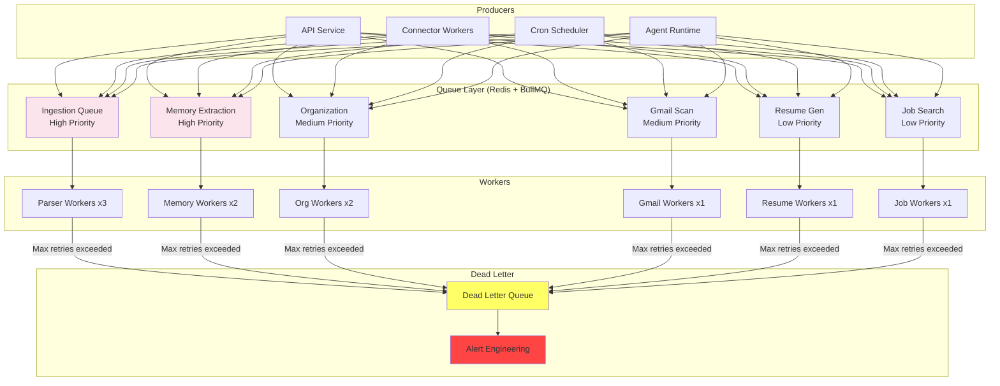
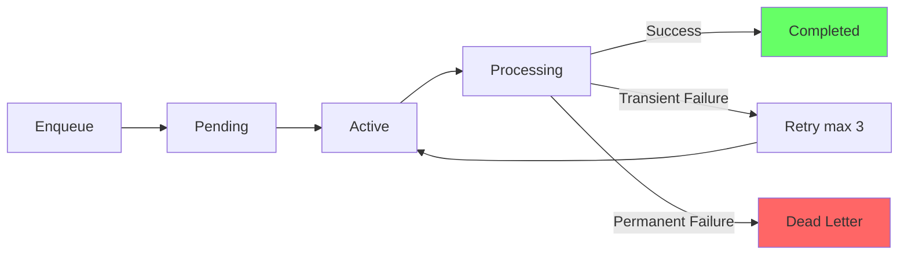

# Queue Architecture

> **Purpose:** Define the queue and async processing architecture for Vaeloom — how background jobs are enqueued, processed, retried, and monitored
> **Status:** ✅ Upgraded to enterprise quality
> **Owner:** DevOps Team
> **Last Updated:** 2026-07-12

---

## Overview

Vaeloom relies on async processing for document ingestion, agent execution, connector syncs, and scheduled tasks. Queues decouple request submission from processing, allowing the system to handle spikes, retry failures, and prioritize critical work.

This document defines the queue structure, job lifecycle, dead letter handling, and monitoring thresholds.

## Queue Architecture



## Queue Sequence Flow

```mermaid
sequenceDiagram
    participant P as 📤 Producer<br/>(API / Cron / Agent)
    participant R as 🗄️ Redis<br/>(BullMQ Backend)
    participant BS as ⏰ BullMQ Scheduler<br/>(Delayed Jobs)
    participant W as ⚙️ Worker
    participant M as 📊 Monitoring
    participant DL as 💀 Dead Letter

    Note over P,DL: ── Standard Job Enqueue & Process ──

    P->>R: LPUSH job to queue list
    P->>R: PUBLISH job:available<br/>on queue channel
    R-->>W: SUBSCRIBE job:available<br/>notify idle workers
    W->>R: BLPOP / BRPOP from queue<br/>claim job exclusively
    R-->>W: Return job payload
    W->>W: Execute job logic

    alt ✅ Success
        W->>R: ACK job (remove from queue)
        W->>M: Emit metric: duration,<br/>records_processed
        R-->>P: Optional: result callback

    else ❌ Transient Failure
        W->>R: NACK job (increment retryCount)
        alt Retries remaining (&lt; 3)
            W->>R: Add to delayed set<br/>with linear backoff
            R-->>BS: Schedule retry at t+0s/30s/5m
            BS->>R: ZPOPMIN: move delayed → active
            R-->>W: Notify via pub/sub
            W->>R: BLPOP job from queue<br/>process again

        else Max retries exceeded
            W->>R: RPUSH to dead letter queue
            R->>DL: Preserve full payload<br/>+ error context
            DL->>M: 🚨 Alert engineering
        end
    end

    Note over P,DL: ── Delayed / Scheduled Jobs ──

    P->>BS: Schedule job at<br/>specific cron/time
    BS->>R: ZADD: store in<br/>delayed sorted set
    Note over BS: Waits until scheduled time<br/>BullMQ polls every second
    BS->>R: ZPOPMIN: move delayed → active
    R-->>W: Notify idle workers
    W->>R: BLPOP job from active queue
    W->>W: Process job

    Note over P,DL: ── Pub / Sub Events ──

    W->>R: PUBLISH progress:job_id<br/>(percent, stage info)
    R-->>P: SUBSCRIBE progress<br/>events (optional callback)
    W->>R: PUBLISH log:job_id<br/>(structured log line)
    R-->>M: Scrape metrics<br/>Prometheus / CloudWatch
```

> **Diagram:** The sequence flows from left to right through three scenarios. **Top:** standard enqueue → pub/sub notification → worker claims job → success or retry → dead letter. **Middle:** delayed jobs scheduled via BullMQ's delayed sorted set with ZADD/ZPOPMIN. **Bottom:** real-time pub/sub events for progress, logs, and metrics.

---

## Queue Structure

| Queue Name | Priority | Consumers | Purpose | Backpressure Strategy |
|------------|----------|-----------|---------|---------------------|
| `ingestion` | High | 3 | Document parsing, OCR, extraction | Scale consumers first, then reject |
| `memory_extraction` | High | 2 | Entity extraction from agent outputs | Scale consumers first |
| `organization` | Medium | 2 | Organization Agent proposals | Buffer up to 10K, then shed load |
| `gmail_scan` | Medium | 1 | Gmail scheduled scans | Skip scan if previous still running |
| `resume_generation` | Low | 1 | Resume variant generation | Queue, process when resources available |
| `job_search` | Low | 1 | Background opportunity radar | Queue, process overnight if backlogged |

## Queue Technology

| Environment | Technology | Rationale | MVP Migration Path |
|-------------|------------|-----------|-------------------|
| MVP | Redis + BullMQ | Simple to operate, already needed for cache | — |
| Enterprise | Kafka | Durable, replayable, multi-consumer | Side-by-side until Kafka proves stable |

## Job Lifecycle



### Retry Policy

| Attempt | Delay | Backoff |
|---------|-------|---------|
| 1 | 0s | Immediate retry |
| 2 | 30s | Linear |
| 3 | 5 min | Exponential |
| > 3 | — | Dead letter queue |

## Dead Letter Queue

Jobs that fail after max retries (3 attempts) go to a dead letter queue for manual review:

1. **Alert sent** to engineering team via PagerDuty/Slack
2. **Job payload preserved** with full context (input, error, attempt count)
3. **Manual review** — engineer inspects the failure, applies fix
4. **Re-queue** the job after fix is deployed

## Queue Monitoring

| Metric | Warning | Critical | Action |
|--------|---------|----------|--------|
| Queue depth | > 500 | > 1000 | Scale consumers, investigate consumer health |
| Job age (oldest pending) | > 5 min | > 15 min | Check consumer availability |
| Failure rate | > 5% | > 10% | Check for systemic errors |
| Worker saturation | > 70% | > 90% | Add workers or reduce queue intake |
| Dead letter count | > 10/day | > 50/day | Investigate recurring failures |

## Best Practices

| Practice | Rationale |
|----------|-----------|
| Idempotent job processing | Same job enqueued twice should produce same result |
| Small job payloads | Store large data in S3, reference by key in job |
| Exponential backoff | Avoid thundering herd on retry |
| Always set job TTL | Stale jobs should expire, not linger in queue |
| Log every state transition | Debugging and performance analysis |

## Common Mistakes

| Mistake | Consequence | Fix |
|---------|-------------|-----|
| Non-idempotent jobs | Duplicate processing on retry | Make job handlers idempotent |
| No retry limit | Infinite retries for bad jobs | Max 3 retries, then dead letter |
| Large job payloads | Redis memory pressure, slow serialization | Store payload reference, not payload |
| Missing TTL | Zombie jobs accumulate in queue | Set job TTL of 24 hours |

## Performance Considerations

| Concern | Mitigation |
|---------|------------|
| Redis memory from large queues | Monitor queue depth, alert before memory pressure |
| Thundering herd on retry | Exponential backoff with jitter |
| Worker contention | Queue per worker type, not shared pool |
| Job overhead (serialization) | Keep payloads under 1KB where possible |

## Security Considerations

| Concern | Mitigation |
|---------|------------|
| Job payload contains secrets | Never include secrets in job payloads — use references |
| Queue injection | Authenticate all producers, validate payload schemas |
| Dead letter data exposure | DLQ access restricted to engineering team |

## Goals

- Guarantee at-least-once delivery for all critical jobs (ingestion, memory extraction)
- Maintain queue processing latency under 5s for high-priority queues at p99
- Achieve zero job loss during worker restarts or Redis failover
- Keep dead letter queue volume under 10 jobs per day through robust error handling
- Enable independent scaling of worker pools per queue type without cross-queue contention

## Scope

| In Scope | Out of Scope |
|----------|--------------|
| BullMQ queue configuration and job lifecycle management | Kafka cluster administration |
| Retry policy, backoff strategy, and dead letter handling | Message serialization format design |
| Worker pool scaling and queue depth monitoring | Inter-service RPC or synchronous messaging |
| Delayed and scheduled job processing | Event sourcing or CQRS event bus |
| Dead letter queue review and re-queue procedures | Long-term job audit log storage |

## Functional Requirements

| ID | Requirement | Priority |
|----|-------------|----------|
| QUEUE-F1 | All jobs shall have at-least-once delivery semantics | P0 |
| QUEUE-F2 | Jobs shall be retried up to 3 times with linear backoff before entering dead letter queue | P0 |
| QUEUE-F3 | Dead letter queue shall preserve full job payload, error context, and retry history | P0 |
| QUEUE-F4 | Queue depth and job age shall be monitored and alerted on threshold breach | P0 |
| QUEUE-F5 | Workers shall process jobs idempotently to allow safe retries | P1 |

## Non-Functional Requirements

| ID | Requirement | Target | Measurement |
|----|-------------|--------|-------------|
| QUEUE-N1 | High-priority queue processing latency | p99 < 5s | Job duration metrics |
| QUEUE-N2 | Job throughput per queue | At least 100 jobs/min per worker | Queue throughput metrics |
| QUEUE-N3 | Dead letter queue volume | < 10 jobs per day | DLQ count metric |
| QUEUE-N4 | Worker restart recovery time | < 30s | Recovery duration trace |
| QUEUE-N5 | Redis queue persistence | Zero job loss on restart | AOF + RDB persistence check |

## Components

| Component | Responsibility | Technology | Scale Strategy |
|-----------|---------------|------------|---------------|
| Job Producer | Enqueue jobs from API, cron, and agent services | TypeScript BullMQ producer | Stateless, auto-scale with service |
| Redis Backend | Store job payloads, manage queue state, handle pub/sub | Redis 7+ with AOF persistence | Redis Cluster for queue sharding |
| BullMQ Worker | Claim and process jobs with concurrency control | BullMQ worker library | Per-queue worker pool with horizontal auto-scaling |
| Dead Letter Handler | Monitor DLQ, alert engineering, support re-queue | BullMQ events + Slack webhook | Dedicated DLQ review process |
| Queue Monitor | Track depth, age, failure rate, worker saturation | Prometheus + BullMQ metrics | Grafana dashboard per queue |

## Data Flow

1. Producer creates a job with payload, job ID, and options (priority, delay, TTL) and adds it to BullMQ
2. BullMQ stores the job as a Redis hash, adds the job ID to the waiting list, and publishes a job:available event
3. Idle worker receives the event via Redis pub/sub, claims the job via BLPOP, and moves it to active state
4. Worker executes the job handler — on success, job is ACKed and removed; on failure, retry count increments
5. After max retries (3), job is moved to the dead letter queue, and an alert is sent to engineering for manual review

## Scalability

| Dimension | Current Limit | 10x Strategy | 100x Strategy |
|-----------|--------------|--------------|---------------|
| Queues | 6 typed queues | Add queues for new job types | Sharded queues per workspace hash |
| Workers | 10 total workers | Horizontal scale per queue type | Kubernetes HPA based on queue depth |
| Job throughput | 500 jobs/min | Add worker replicas per queue | Partition queues by priority tier |
| Redis queue storage | 10K pending jobs | Increase Redis memory + Cluster sharding | Migrate to Kafka for durable queue storage |
| DLQ capacity | 100 dead letter jobs | Automated DLQ cleanup after 7 days | DLQ analysis with ML failure classification |

## Error Handling

| Error Scenario | Detection | Mitigation | Recovery |
|----------------|-----------|------------|----------|
| Transient job failure (network, timeout) | Worker catches exception, increments retryCount | Linear backoff retry up to 3 attempts | Auto-retry, job remains in queue |
| Permanent job failure (invalid data, bug) | Worker catches exception, max retries exceeded | Move to dead letter queue with full context | Engineer inspects DLQ, fixes root cause, re-queues |
| Redis node failure | Sentinel detects primary loss | Queue operations pause during failover | Sentinel promotes replica, clients reconnect |
| Worker process crash mid-job | BullMQ detects stalled job via stalled interval | Job automatically re-queued after stall timeout | Worker restarts, picks up stalled jobs |
| Queue backlog exceeding threshold | Prometheus alert on queue depth | Auto-scale workers, throttle producers | Investigate consumer health |

## Monitoring

| Metric | Alert Threshold | Severity | Dashboard |
|--------|----------------|----------|-----------|
| Queue depth per queue | > 1000 pending jobs | Warning | Queue Overview |
| Job age (oldest pending) | > 15 min | Critical | Queue Latency |
| Failure rate per queue | > 10% of jobs | Critical | Queue Health |
| Worker saturation | > 90% busy for 5 min | Warning | Worker Pool |
| Dead letter count | > 10 per day | Warning | Dead Letter Queue |

## Configuration

| Variable | Purpose | Default | Required |
|----------|---------|---------|----------|
| QUEUE_RETRY_MAX_ATTEMPTS | Maximum retry attempts before dead letter | 3 | Yes |
| QUEUE_RETRY_BACKOFF_SECONDS | Base delay between retries (linear multiplier) | 30 | Yes |
| QUEUE_STALL_TIMEOUT_SECONDS | Time before a stalled job is re-queued | 120 | Yes |
| QUEUE_DEFAULT_TTL_SECONDS | Default job TTL before automatic removal | 86400 | Yes |
| QUEUE_MAX_CONCURRENCY | Maximum concurrent jobs per worker | 5 | No |

## Risks

| Risk | Likelihood | Impact | Mitigation |
|------|------------|--------|------------|
| Redis memory exhaustion from queue backlog | Medium | High | Set max queue depth, shed load by rejecting new jobs |
| Job payload containing secrets leaked in logs | Low | Critical | Secrets never in payload, use references |  
| Worker crash causing duplicate job execution | Medium | Medium | Idempotent job handlers with deduplication key |
| Queue configuration drift between environments | Medium | Medium | Infrastructure-as-code with GitOps for queue definitions |

## Limitations

| Limitation | Impact | Workaround | Future Resolution |
|------------|--------|------------|-------------------|
| BullMQ is single-region without native replication | Regional Redis failure stops all queue processing | AOF persistence for crash recovery | Migration to Kafka for multi-region durability |
| Large job payloads (> 1MB) stress Redis memory | Memory pressure and slower serialization | Store large payload references in S3 | Automatic payload offloading for > 100KB |
| No built-in job priority within a queue | All jobs in a queue are FIFO | Separate high/medium/low queues per type | BullMQ priority support with sorted sets |
| Limited delayed job precision (1s polling) | Scheduled jobs may fire up to 1s late | Acceptable for non-critical scheduled tasks | Sub-second scheduling with Redis streams |

## Examples

### Enqueue a document ingestion job

```typescript
await queue.enqueue("ingestion", {
  type: "pdf.parse",
  payload: { fileId: "f_789", bucket: "uploads" },
  priority: "high"
});
```

### Monitor queue depth

```bash
Vaeloom queue depth --queue ingestion --window 10m
```

### Reprocess failed jobs

```bash
Vaeloom queue retry --queue memory-extraction --max-attempts 3
```

### Configure dead letter handling

```typescript
queue.on("dead-letter", (job) => {
  alertSlack(`Job ${job.id} failed after 3 retries`);
});
```

## Future Improvements

| Improvement | Priority | Complexity | Timeline |
|-------------|----------|------------|----------|
| Kafka migration for enterprise multi-region durability | Medium | High | Q1 2027 |
| Job deduplication at enqueue time | High | Medium | Q3 2026 |
| ML-based failure prediction from job characteristics | Low | High | Q2 2027 |
| Webhook notifications on job completion | Medium | Low | Q3 2026 |
| Queue traffic replay for testing and debugging | Low | Medium | Q4 2026 |

## Related Documents

- [Event Architecture.md](./Event-Architecture.md)
- [Workers.md](../Backend/Workers.md)
- [Cron Jobs.md](../Backend/Cron-Jobs.md)
- [`DevOps/Monitoring.md`](../DevOps/Monitoring.md)
- [`Operations/SRE.md`](../Operations/SRE.md)
