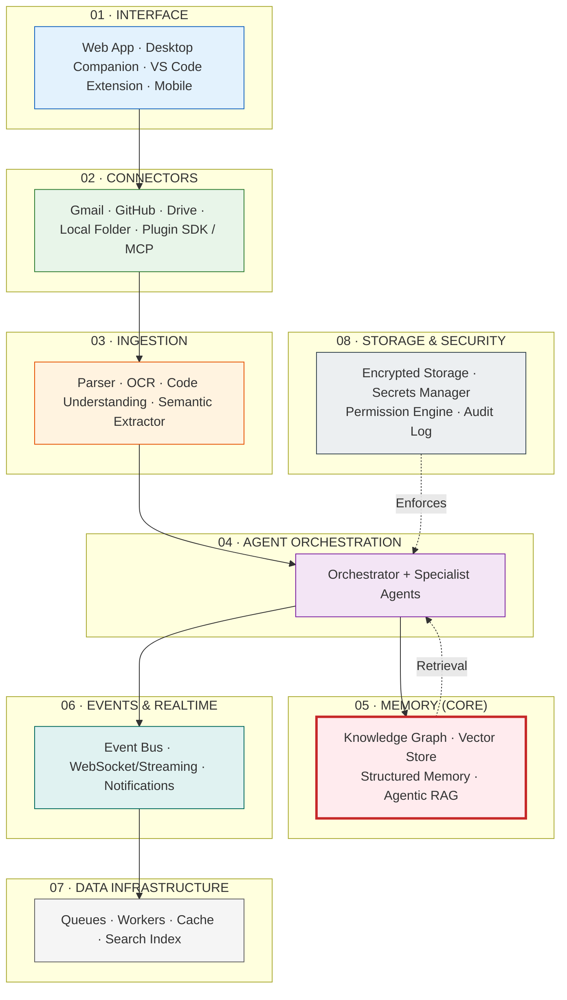

# Architecture

> **Purpose:** System architecture, deployment architecture, and architecture decision records
> **Status:** Active
> **Owner:** Architecture Team
> **Last Updated:** 2026-07-13

## Overview

The Architecture directory contains the foundational system architecture documentation for Meridian, including the 8-layer system architecture diagram, deployment architecture, and Architecture Decision Records (ADRs). These documents define the system's structural boundaries, non-negotiable architectural decisions, and the rationale behind key technology choices.

This index serves as the entry point for understanding how Meridian is structured across its interface, connector, ingestion, agent orchestration, memory, events, data infrastructure, and storage and security layers. All architecture discussions should reference the canonical documents listed here.

The architecture follows six non-negotiable principles: agent contract uniformity, the agentic loop, memory-before-features design, MCP-shaped tools, suggest-mode by default, and a two-service backend split between NestJS and FastAPI.

## What's here

| Document | Location | Status |
|----------|----------|--------|
| System Architecture (6-layer) | [`/Docs/02-system-architecture.md`](../../Docs/02-system-architecture.md) | ✅ Canonical |
| System Architecture (8-layer, extended) | [`/Docs/Meridian-Complete-Documentation.md#4-system-architecture`](../../Docs/Meridian-Complete-Documentation.md#4-system-architecture) | ✅ Extended |
| Deployment Architecture | [`/Docs/Meridian-Complete-Documentation.md#135-deployment-architecture`](../../Docs/Meridian-Complete-Documentation.md#135-deployment-architecture) | ✅ Canonical |
| Architecture Decision Records | [`03-adrs.md`](./03-adrs.md) | 🆕 Started |

## Architecture overview



## Non-negotiable architectural decisions

1. **Agent contract** — every agent shares one structure (mission, tools, permissions, autonomy, fallback)
2. **Agentic loop** — Plan → Act → Observe → Reflect → Improve, implemented once
3. **Memory before features** — every agent action is a memory write; every feature is a memory read
4. **MCP-shaped tools** — every connector and tool follows MCP schema from day one
5. **Suggest-mode by default** — no agent takes consequential actions without approval in MVP
6. **Two-service backend** — `apps/api` (NestJS) and `apps/ai-service` (FastAPI) with internal RPC boundary

## Common Mistakes

| Mistake | Why It's a Problem |
|---------|-------------------|
| Referencing architecture docs without checking they reflect the current system | Architecture docs that describe a 6-layer system while the deployed system has evolved to 8 layers create confusion — keep the index's layer count and design decisions in sync |
| Adding new architecture docs without updating this index | Any new document in the Architecture/ directory that isn't listed here is effectively hidden from readers who start at this index |
| Treating the non-negotiable decisions as suggestions | The 6 architectural decisions (agent contract, agentic loop, memory before features, MCP shapes, suggest-mode, two-service backend) are non-negotiable — every architecture discussion must start from them |
| Linking to implementation docs as canonical architecture references | Implementation files change faster than architecture docs — link to the canonical architecture doc first and reference implementation as a supplementary detail |

## Best Practices

| Practice | Rationale |
|----------|-----------|
| Keep the architecture overview diagrams and layer descriptions in sync with the deployed system | If a new layer (e.g., Analytics) is added, update the overview diagram and the layer descriptions in this index — stale architecture diagrams mislead new team members |
| Surface the 6 non-negotiable decisions prominently in every architecture discussion | These decisions represent the project's foundational architectural principles — they should be the starting point for any architecture design review |
| List every document in the Architecture/ directory in this index | New team members enter through this README — if a document isn't listed here, it may be overlooked entirely |
| Use canonical references (the Complete Documentation) as primary links, not implementation files | The Complete Documentation represents the agreed-upon architecture — implementation files document how it was built, not what was decided |

## Security

| Concern | Mitigation |
|---------|------------|
| Architecture overview revealing attack surface | The layer diagram and service topology shown in this index reveal the system's architectural attack surface — share the full diagram internally only; provide a redacted view for external stakeholders |
| Non-negotiable decisions creating security assumptions | The "two-service backend" and "MCP-shaped tools" decisions create specific security properties (API gateway auth, permission checks) — if these are changed, the security model must be re-evaluated |
| Links in this index exposing internal documentation structure | File paths in the index (e.g., `../../Engineering/Implementation/...`) reveal internal directory structure — these should not appear in external documentation |

## Performance

| Concern | Guideline |
|---------|-----------|
| Index page load time with Mermaid diagrams | The 8-layer architecture diagram can take 200-500ms to render on first load — consider caching the rendered SVG or using a static diagram image for the index |
| Cross-directory link resolution cost | Relative paths (e.g., `../../Docs/...`) resolve at render time in markdown — as the doc set grows, consider a build-time link checker that validates all references |
| Mermaid diagram complexity | The overview diagram has 8 layers with dashed and solid connections — keep diagrams at this granularity (no sub-diagrams embedded) to maintain render speed and readability |

---

## Goals

- **Define the architectural foundation** — document the 8-layer system architecture, deployment topology, and non-negotiable architectural decisions that govern all Meridian engineering work
- **Centralize architecture references** — provide a single entry point linking all Architecture/ documents so engineers and stakeholders find canonical architecture docs quickly
- **Encode architectural governance** — surface the six non-negotiable decisions (agent contract, agentic loop, memory-before-features, MCP-shaped tools, suggest-mode default, two-service backend) as the starting point for every design discussion
- **Reduce onboarding friction** — give new team members a clear, navigable map of the architecture directory and an understanding of how the eight layers connect

---

## Scope

### In Scope
- 8-layer architecture overview and layer descriptions (Interface, Connectors, Ingestion, Agent Orchestration, Memory, Events, Data Infrastructure, Storage & Security)
- Six non-negotiable architectural decisions with rationale
- Architecture Decision Records index (accepted and pending ADRs)
- Deployment architecture and tech stack references
- Common mistakes, best practices, security, and performance guidance for architecture contributors

### Out of Scope
- Per-service implementation details (covered in Backend/, AI/, Frontend/ docs)
- Infrastructure-as-Code and deployment pipeline configuration (covered in DevOps/)
- Code-level API documentation and SDK references
- Third-party integration details and plugin SDK documentation

---

## Examples

### List architecture documents

```bash
meridian docs list --category Architecture
```

### View the ADR decision log

```bash
meridian docs show --path Architecture/03-adrs.md
```

### Check architecture compliance

```bash
meridian arch check --layer memory --rules ./arch-rules.yaml
```

### Render the layer diagram

```bash
meridian arch diagram --format mermaid --output arch.mmd
```

## Future Improvements

| Improvement | Priority | Complexity | Timeline |
|-------------|----------|------------|----------|
| Architecture diagram auto-generation from code | High | High | Q2 2027 |
| Layer dependency validation CI checks | Medium | Medium | Q1 2027 |
| Architecture review automation tooling | Low | Low | Q4 2026 |

## Related categories

- [`AI/`](../AI/) — Agent system, memory, RAG
- [`Engineering/`](../Engineering/) — Implementation of this architecture
- [`Enterprise/`](../Enterprise/) — Enterprise-scale architecture decisions

## Related Documents

- [System Architecture](../02-system-architecture.md) — Six-layer system architecture overview
- [Architecture Decision Records](03-adrs.md) — Key architectural decisions
- [Enterprise Architecture](../Enterprise/Enterprise-Architecture.md) — Multi-tenant architecture
