# Scalability

> **Purpose:** Define the scalability strategy for Vaeloom
> **Status:** ✅ Upgraded to enterprise quality
> **Canonical source:** [`/Docs/Vaeloom-Complete-Documentation.md#10-tech-stack`](../../Docs/Vaeloom-Complete-Documentation.md#10-tech-stack)

## Scalability Architecture

```mermaid
graph TD
    classDef front fill:#e3f2fd,stroke:#1565c0,color:#000,stroke-width:1.5px
    classDef svc fill:#e8f5e9,stroke:#2e7d32,color:#000,stroke-width:1.5px
    classDef db fill:#fff3e0,stroke:#e65100,color:#000,stroke-width:1.5px
    classDef trigger fill:#f3e5f5,stroke:#6a1b9a,color:#000,stroke-width:1px
    classDef phase fill:#ffebee,stroke:#c62828,color:#000,stroke-width:1px

    subgraph AutoScaling["📈 Auto-Scaling Services"]
        direction TB
        WEB["apps/web<br/>Auto-scale: CPU > 70% 10m<br/>Scale-down: CPU < 30% 30m"]
        API["apps/api<br/>Auto-scale: p99 > 1s 5m<br/>Scale-down: p99 < 200ms 30m"]
        AI["apps/ai-service<br/>Auto-scale: Queue > 500 5m<br/>Scale-down: Queue < 50 30m"]
    end

    subgraph Triggers["âš¡ Scaling Triggers"]
        direction TB
        T1["CPU Threshold<br/>Scale up > 70% / Scale down < 30%"]
        T2["Latency p99<br/>Scale up > 1s / Scale down < 200ms"]
        T3["Queue Depth<br/>Scale up > 500 / Scale down < 50"]
    end

    subgraph Database_Scale["🗄️ Database Scaling Phases"]
        direction TB
        P1["Phase 1: Vertical<br/>Larger instance (MVP)"]
        P2["Phase 2: Read Replicas<br/>Query offloading"]
        P3["Phase 3: Partitioning<br/>By workspace_id"]
        P4["Phase 4: Sharding<br/>By workspace_id range"]
    end

    subgraph Stateful["🔒 Stateful Scaling"]
        REDIS["( Redis<br/>MVP: Vertical<br/>Enterprise: Cluster )"]
        PG["( PostgreSQL<br/>MVP: Vertical<br/>Enterprise: Replicas )"]
    end

    T1 -.->|triggers| WEB
    T2 -.->|triggers| API
    T3 -.->|triggers| AI
    WEB --> PG
    WEB --> REDIS
    API --> PG
    API --> REDIS
    AI --> PG
    AI --> REDIS

    P1 --> P2 --> P3 --> P4
    P4 -.-> PG

    class WEB front
    class API,AI svc
    class PG,REDIS db
    class T1,T2,T3 trigger
    class P1,P2,P3,P4 phase

```



> **Diagram:** Scalability is achieved through horizontal auto-scaling for stateless services and phased vertical-to-horizontal scaling for databases. **Frontend** and **API** services auto-scale based on CPU and latency. **AI service** auto-scales based on queue depth. **PostgreSQL** evolves through 4 phases: vertical → read replicas → partitioning → sharding. **Redis** grows from single instance to cluster mode.

---

## Horizontal Scaling

| Service | MVP | Enterprise |
|---------|-----|------------|
| apps/web | Add instances | Auto-scaling |
| apps/api | Add instances | Auto-scaling based on request latency |
| ai-service | Add instances | Auto-scaling based on queue depth |
| Postgres | Vertical (larger instance) | Read replicas + partitioning |
| Redis | Vertical (larger instance) | Cluster mode |

### Scaling Triggers

| Service | Scale-Up | Scale-Down |
|---------|----------|------------|
| apps/web | CPU > 70% for 10 min | CPU < 30% for 30 min |
| apps/api | Latency p99 > 1s for 5 min | Latency p99 < 200ms for 30 min |
| ai-service | Queue depth > 500 for 5 min | Queue depth < 50 for 30 min |

### Database Scaling

1. **Phase 1:** Vertical scaling (larger instance)
2. **Phase 2:** Read replicas for query offloading
3. **Phase 3:** Table partitioning (by workspace_id)
4. **Phase 4:** Sharding (by workspace_id range)

## Performance Budgets

| Operation | Target (p99) |
|-----------|-------------|
| Page load | < 2s |
| API response | < 500ms |
| Agent response | < 10s |
| Document ingestion | < 30s |
| Search query | < 3s |

## Common Mistakes

| Mistake | Why It's a Problem |
|---------|-------------------|
| Scaling prematurely before product validation | Building a horizontally-scaled, auto-scaling Kubernetes cluster before the product has 1000 users wastes engineering time that should be spent on product-market fit — start simple, scale when metrics demand it |
| Scaling stateless services without addressing stateful bottlenecks | Adding more web server instances doesn't help if the single PostgreSQL database is the bottleneck — address database scaling (read replicas, partitioning) at the same time as compute scaling |
| Auto-scaling based on the wrong metric | Scaling based on CPU alone is insufficient — a service blocked on I/O (database queries, external API calls) has low CPU but high latency; scale on latency p99 and queue depth in addition to CPU |
| Ignoring the cost of data migration during scaling phase changes | Moving from single-instance PostgreSQL to read replicas, or from replicas to sharding, requires data migration — each phase transition should be designed and tested before it's needed in production |

## Best Practices

| Practice | Rationale |
|----------|-----------|
| Prove product-market fit before investing in horizontal scaling | A PaaS with vertical scaling handles thousands of users — invest in Kubernetes, read replicas, and sharding only when metrics (latency p99 > 1s, CPU > 70% at peak) consistently demand it |
| Scale compute and data layers together | Auto-scaling web instances without addressing database capacity is like adding lanes to a highway without widening the bridge — the database becomes the bottleneck regardless of compute instances |
| Use multiple scaling signals — CPU, latency p99, queue depth, and memory | Each service has a different bottleneck — web services scale on CPU+latency, API services on latency+connection count, AI services on queue depth |
| Design and test each database scaling phase before it's needed | Vertical → read replicas → partitioning → sharding — each transition is complex and risky; validate the migration process in staging before the production need arises |

## Security

| Concern | Mitigation |
|---------|------------|
| Auto-scaling bypassing security controls | New instances spawned by auto-scaling should inherit the same security configuration (network policies, IAM roles, secrets) as existing instances — script instance initialization with immutable security configuration |
| Read replicas having different security posture than primary | A read replica intended for reporting might have weaker access controls than the primary — enforce the same security policies on all replicas, especially regarding data access and encryption |
| Scaling events as an attack vector | A sudden traffic spike (legitimate or attack) triggers auto-scaling, which costs money — set maximum instance caps per service to prevent unlimited scaling that burns through budget |

## Performance

| Concern | Approach |
|---------|----------|
| Database read replica lag affecting cache consistency | Read replicas may serve stale data immediately after a write; use primary database reads for write-after-read patterns and balance `max_standby_archive_delay` against replication freshness requirements |
| Auto-scaling latency during traffic spikes | Auto-scaling triggers have a 5-10 minute cooldown period after detection — cache warming and request queuing must absorb traffic spikes within that window without dropping or degrading requests |
| AI service instance startup time vs queue backlog | New AI service instances take 30-60s to become ready; the job queue must buffer 5-10 minutes of backlog at peak ingestion rate to prevent job loss or timeouts during scale-out events |

## Goals

- Define a phased database scaling strategy (vertical → read replicas → partitioning → sharding)
- Establish auto-scaling triggers based on multiple signals (CPU, latency, queue depth)
- Ensure stateless compute scaling is paired with stateful data layer capacity
- Document performance budgets for every critical user-facing operation
- Prevent premature scaling investment by proving product-market fit before horizontal expansion

## Scope

| In Scope | Out of Scope |
|----------|--------------|
| Horizontal auto-scaling strategy for stateless services | Specific Kubernetes cluster configuration |
| Four-phase database scaling evolution (vertical → replicas → partitioning → sharding) | Cloud provider-specific scaling service details |
| Scaling triggers and thresholds per service type | Load testing methodology and tooling |
| Performance budgets for page load, API, agent, and ingestion operations | Client-side performance optimization techniques |
| Cost-aware scaling with maximum instance caps | Reserved instance and savings plan procurement |

## Functional Requirements

| ID | Requirement | Priority |
|----|-------------|----------|
| SCL-FR-01 | Web service must auto-scale based on CPU > 70% for 10 minutes | P0 |
| SCL-FR-02 | API service must auto-scale based on p99 latency > 1s for 5 minutes | P0 |
| SCL-FR-03 | AI service must auto-scale based on queue depth > 500 for 5 minutes | P0 |
| SCL-FR-04 | PostgreSQL must support read replicas for query offloading | P1 |
| SCL-FR-05 | Each service must have a maximum instance cap to prevent runaway costs | P0 |

## Non-Functional Requirements

| ID | Requirement | Target | Measurement |
|----|-------------|--------|-------------|
| SCL-NFR-01 | Page load time at peak load (1000 concurrent users) | < 2s p99 | Load testing with k6 |
| SCL-NFR-02 | API response time at peak load | < 500ms p99 | Load testing with k6 |
| SCL-NFR-03 | Agent response time with queue backlog | < 10s p95 | Agent response time monitoring |
| SCL-NFR-04 | Document ingestion under peak upload rate | < 30s p95 | Ingestion pipeline metrics |
| SCL-NFR-05 | Auto-scaling trigger response time | < 5 minutes | Auto-scaling event logs |

## Components

| Component | Responsibility | Technology | Scale Strategy |
|-----------|---------------|------------|----------------|
| Web Auto-Scaler | Monitor CPU + latency; add/remove web instances | CloudWatch / K8s HPA | CPU > 70% scale-up; CPU < 30% scale-down |
| API Auto-Scaler | Monitor p99 latency; add/remove API instances | CloudWatch / K8s HPA | p99 > 1s scale-up; p99 < 200ms scale-down |
| AI Auto-Scaler | Monitor queue depth; add/remove AI workers | BullMQ / K8s HPA | Queue > 500 scale-up; Queue < 50 scale-down |
| Database Scaler | Phase vertical → read replicas → partitioning → sharding | PostgreSQL + AGE | Manual phase transitions with validation |

## Data Flow

1. During normal operation, services run at minimum instance count; the auto-scaler continuously monitors CPU, latency, and queue depth metrics from the observability pipeline
2. When a traffic spike causes web CPU to exceed 70% for 10 minutes, the auto-scaler provisions a new web instance and registers it with the load balancer
3. If the database becomes the bottleneck (connection pool exhaustion or query latency > 1s), the database scale-up is triggered (first vertical, then read replicas)
4. Under sustained growth, the database transitions through phases: read replicas offload SELECT queries, partitioning splits large tables by workspace_id, and sharding distributes data across database clusters
5. During scale-down, instances are gracefully drained (connection draining, active request completion) before removal, and cooldown periods prevent thrashing

## Scalability

| Dimension | Current Limit | 10x Strategy | 100x Strategy |
|-----------|--------------|--------------|---------------|
| Web instances | 3 | Auto-scale to 10 based on CPU | Auto-scale to 50 across regions |
| API instances | 3 | Auto-scale to 10 based on latency | Auto-scale to 50 with global LB |
| AI service instances | 3 | Auto-scale to 20 based on queue depth | Auto-scale to 100 with GPU workers |
| PostgreSQL connections | 100 | PgBouncer + read replicas | Sharding across 10 database clusters |
| Redis throughput | 10,000 ops/s | Redis cluster mode | Redis cluster with 16 shards |

## Error Handling

| Error Scenario | Detection | Mitigation | Recovery |
|---------------|-----------|------------|----------|
| Auto-scaler fails to provision new instance | Cloud API error | Fall back to existing instances; alert ops | Manual provisioning; fix cloud API permissions |
| Scale-down removes an instance with active connections | Connection draining timeout | Wait for all active requests to complete (max 30s) | Force stop after grace period; alert if persistent |
| Database read replica lag exceeds acceptable threshold | Replication lag monitoring | Route read-only queries to primary until lag resolves | Investigate replication slot; restart replica if needed |
| Auto-scaling thrashing (repeated scale-up/down) | Scale event frequency > 3 in 1 hour | Increase cooldown period; override to manual scaling | Review thresholds and adjust based on traffic patterns |

## Monitoring

| Metric | Alert Threshold | Severity | Dashboard |
|--------|----------------|----------|-----------|
| Auto-scaling events (scale-up/down) | > 3 events per hour | Warning | Auto-Scaling Activity |
| Database replication lag | > 10 seconds | Critical | Database Replication Health |
| PgBouncer connection pool utilization | > 80% | Warning | Connection Pool Dashboard |
| Instance count vs maximum cap | > 90% of max cap | Critical | Instance Capacity Dashboard |
| Load balancer 5xx rate during scale events | > 2% of requests | Critical | Scale Event Errors |

## Configuration

| Variable | Purpose | Default | Required |
|----------|---------|---------|----------|
| `WEB_INSTANCE_MIN` | Minimum web instance count | `2` | Yes |
| `WEB_INSTANCE_MAX` | Maximum web instance cap | `10` | Yes |
| `API_SCALE_UP_LATENCY_THRESHOLD` | p99 latency threshold for API scale-up | `1000ms` | No |
| `AI_QUEUE_DEPTH_THRESHOLD` | Queue depth threshold for AI scale-up | `500` | No |
| `SCALE_DOWN_COOLDOWN_MINUTES` | Cooldown period between scale-down events | `30` | No |

## Risks

| Risk | Likelihood | Impact | Mitigation |
|------|------------|--------|------------|
| Database partitioning migration causes downtime | Low | Critical | Online migration with zero-downtime tooling (pgroll) |
| Auto-scaling based on wrong metric (CPU not enough) | Medium | Medium | Multi-signal scaling (CPU + latency + queue depth) |
| Read replica lag causing stale data served to users | Medium | Medium | Write-after-read affinity; replica health monitoring |
| Cost explosion from uncontrolled auto-scaling | Medium | High | Maximum instance caps per service; budget alerts |

## Limitations

| Limitation | Impact | Workaround | Future Resolution |
|------------|--------|------------|-------------------|
| Database phase transitions require manual validation | Migration risk during scaling events | Test each phase transition in staging first | Automated validation and migration pipeline |
| Auto-scaling has 5-10 minute cooldown gap | Traffic spike within cooldown cannot be immediately handled | Over-provision by 20% for headroom | Predictive auto-scaling based on historical patterns |
| No cross-region scaling in MVP | Regional traffic cannot overflow to another region | Manual DNS failover for disaster recovery | Multi-region active-active deployment with global load balancer |

## Examples

### Configure auto-scaling

```bash
Vaeloom scale configure \
  --service ai-service \
  --min 2 --max 20 \
  --metric queue_depth \
  --threshold 500
```

### Check scaling history

```bash
Vaeloom scale history --service api --window 24h --format json
```

### Add a read replica

```bash
Vaeloom db replica create --region us-west-2 --source production
```

### Simulate traffic for scaling test

```bash
Vaeloom scale simulate --rps 1000 --duration 5m --service api
```

## Future Improvements

| Improvement | Priority | Complexity | Timeline |
|-------------|----------|------------|----------|
| Predictive auto-scaling using ML-based traffic forecasting | Medium | High | Q1 2027 |
| Automated database phase transitions with zero downtime | High | High | Q4 2026 |
| Multi-region active-active scaling with global load balancer | Medium | High | Q2 2027 |
| Read replica auto-scaling based on read query volume | Low | Medium | Q3 2026 |

## Related Documents

- [Performance.md](./Performance.md)
- [Infrastructure.md](./Infrastructure.md)
- [`/Docs/Vaeloom-Complete-Documentation.md#10-tech-stack`](../../Docs/Vaeloom-Complete-Documentation.md#10-tech-stack)
