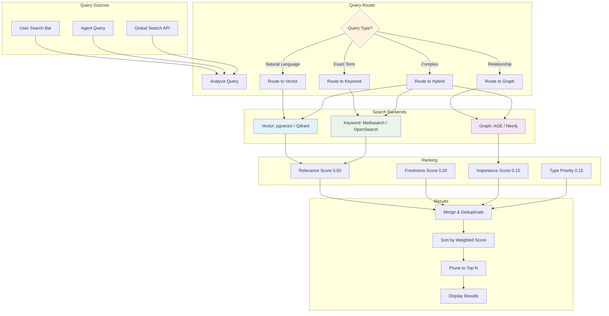

# Search Architecture

> **Purpose:** Define the search architecture for Vaeloom — how users and agents find information across documents, memory, knowledge graph, and connected services
> **Status:** ✅ Upgraded to enterprise quality
> **Owner:** AI Team
> **Last Updated:** 2026-07-12
> **Canonical source:** [`/Docs/Vaeloom-Complete-Documentation.md#18-global-search`](../../Docs/06-Vaeloom-Enterprise-Paper.md#18-global-search)

---

## Overview

Vaeloom provides a single, unified search surface that spans documents, memory records, knowledge graph entities, chat history, connected email, calendar events, and code repositories. The search system intelligently routes queries to the appropriate backend (keyword, vector, or graph) based on query characteristics.

This document covers the search architecture, backends, ranking algorithm, and query routing strategy.

## Search Architecture



## Search Types

| Search Type | Backend (MVP) | Backend (Enterprise) | Use Case | Strengths | Weaknesses |
|-------------|--------------|---------------------|----------|-----------|------------|
| Full-text keyword | Meilisearch | OpenSearch | Exact term search | Precise, fast | Misses synonyms, misspellings |
| Semantic / vector | pgvector | Qdrant | Concept search | Understands meaning | Slower, requires embeddings |
| Graph traversal | AGE (PG) | Neo4j | Relationship search | Entity connections | Complex setup, slower at scale |
| Hybrid | Combined router | Agentic RAG | Complex queries | Best of all three | Most complex, highest latency |

## Global Search

A single search surface spanning all data types:

- Documents (files, PDFs, images with OCR)
- Memory records (structured extractions)
- Projects (organized file groups)
- Chat history (past agent conversations)
- Connected email (Gmail, Outlook)
- Calendar events (deadlines, interviews)
- Knowledge graph entities (skills, organizations)
- Code (from connected repos)

## Search Ranking Algorithm

```typescript
// apps/ai-service/search/ranking.ts
interface RankedResult {
  id: string;
  source: string;
  score: number;
}

function rankResults(
  results: SearchResult[],
  query: string
): RankedResult[] {
  return results.map(result => ({
    id: result.id,
    source: result.source,
    score:
      result.relevanceScore * 0.50 +      // Primary: semantic + keyword match
      result.freshnessScore * 0.20 +       // Recent updates rank higher
      result.importanceScore * 0.15 +      // Entity centrality in knowledge graph
      typePriority(result.source) * 0.15   // Documents > memory > email
  })).sort((a, b) => b.score - a.score);
}

function typePriority(source: string): number {
  const priorities: Record<string, number> = {
    'document': 1.0,
    'memory_record': 0.8,
    'chat_history': 0.6,
    'email': 0.4,
    'calendar_event': 0.3,
    'code': 0.2,
  };
  return priorities[source] ?? 0.1;
}
```

## Query Types

| Query Signal | Example | Strategy | Expected Latency |
|-------------|---------|----------|-----------------|
| Natural language | "things I did related to ML last semester" | Semantic + graph | < 500ms |
| Exact term | "Resume_2026.pdf" | Keyword | < 100ms |
| Relationship | "projects using React" | Graph traversal | < 200ms |
| Hybrid | "backend internships matching my skills" | Hybrid (all three) | < 1s |
| Time-bounded | "documents from last month" | Vector + time filter | < 500ms |

## Best Practices

| Practice | Rationale |
|----------|-----------|
| Always scope search to workspace_id | Prevents cross-tenant data leakage |
| Cache frequent queries | Same search 5 minutes later should cost nothing |
| Use hybrid search as default | Catches more relevant results than any single method |
| Index by freshness | Stale results degrade user trust |
| Log query performance | Track p50/p95 latency per search type |

## Common Mistakes

| Mistake | Consequence | Fix |
|---------|-------------|-----|
| Vector-only search | Misses exact matches, relationship queries | Use hybrid by default |
| No freshness boost | Old results dominate | Always include freshness in ranking |
| Cross-tenant search results | Data leakage catastrophe | workspace_id enforced on every query |
| Ignoring type priority | Email results before documents | Weight by source type |

## Performance Considerations

| Concern | Mitigation |
|---------|------------|
| Vector search latency at scale | Dedicated vector DB (Qdrant) at enterprise tier |
| Hybrid search overhead | Parallel execution across backends |
| Index size growth | Partition by workspace_id hash |
| Re-indexing frequency | Real-time indexing for documents, daily for graph |

## Security Considerations

| Concern | Mitigation |
|---------|------------|
| Cross-tenant data leakage | workspace_id scoped on every query |
| Sensitive document exposure | Permission check on every result |
| Search query injection | Sanitize input before passing to backends |
| Index access control | Backend authentication for all search services |

## Goals

- Deliver unified search results across documents, memory, knowledge graph, and connected services in under 3s
- Achieve relevance score of 0.8+ on user satisfaction surveys for top-5 search results
- Support hybrid search (keyword + vector + graph) as default strategy for all complex queries
- Ensure zero cross-tenant data leakage by enforcing workspace_id scope on every query
- Index all new documents and memory records within 60 seconds of creation

## Scope

| In Scope | Out of Scope |
|----------|--------------|
| Unified multi-backend search (keyword, vector, graph) | Full-text search in binary file formats |
| Query classification and intelligent routing | Speech-to-text or voice search |
| Weighted ranking algorithm with freshness and relevance | Visual similarity or image search |
| workspace_id-scoped query enforcement | Cross-tenant admin search |
| Real-time indexing of documents and memory | External search engine federation |

## Functional Requirements

| ID | Requirement | Priority |
|----|-------------|----------|
| SEARCH-F1 | System shall support keyword, semantic, graph, and hybrid search strategies | P0 |
| SEARCH-F2 | All search queries shall be scoped to workspace_id | P0 |
| SEARCH-F3 | Search results shall be ranked using weighted relevance, freshness, importance, and type priority | P0 |
| SEARCH-F4 | System shall re-index documents and memory records within 60s of creation | P1 |
| SEARCH-F5 | System shall cache frequent queries for 60 seconds to reduce backend load | P1 |

## Non-Functional Requirements

| ID | Requirement | Target | Measurement |
|----|-------------|--------|-------------|
| SEARCH-N1 | Search query response time | p99 < 3s | Instrumented query timing |
| SEARCH-N2 | Relevance accuracy for top-5 results | > 80% user satisfaction | User feedback survey |
| SEARCH-N3 | Indexing freshness lag | < 60s from create to indexable | Index lag metric |
| SEARCH-N4 | Cache hit ratio for frequent queries | > 50% after warmup | Redis hit ratio |
| SEARCH-N5 | Search backend availability | > 99.9% uptime | Uptime monitoring |

## Components

| Component | Responsibility | Technology | Scale Strategy |
|-----------|---------------|------------|---------------|
| Query Router | Classify intent and dispatch to correct backend | TypeScript router service | Stateless horizontal scaling |
| Keyword Backend | Exact term and phrase matching | Meilisearch / OpenSearch | Cluster with sharding by workspace hash |
| Vector Backend | Semantic similarity search | pgvector / Qdrant | IVFFlat indexing, dedicated shards at scale |
| Graph Backend | Entity relationship traversal | Apache AGE / Neo4j | Read replicas for query offload |
| Indexer | Real-time indexing of new and updated content | Queue consumer worker | Per-source parallel indexing workers |

## Data Flow

1. User submits search query through search bar or API — query router captures intent, query text, and workspace context
2. Router classifies query type (natural language, exact term, relationship, or hybrid) and dispatches to appropriate backends
3. Each backend (keyword, vector, graph) executes search in parallel with workspace_id filter applied
4. Results are merged, deduplicated, and scored using the weighted ranking algorithm (relevance 0.5, freshness 0.2, importance 0.15, type priority 0.15)
5. Final top-N results are sorted by score, cached for 60 seconds, and returned to the user with source metadata

## Scalability

| Dimension | Current Limit | 10x Strategy | 100x Strategy |
|-----------|--------------|--------------|---------------|
| Documents indexed | 100K per workspace | Partition index by workspace hash | Dedicated search cluster per tenant tier |
| Queries per second | 100 QPS | Add read replicas per backend | Multi-region search with geo-routing |
| Vector search latency | < 200ms at 10K vectors | IVFFlat indexing with tuned lists | Migrate to Qdrant with GPU-accelerated search |
| Index throughput | 50 docs/min | Parallel indexing workers per source | Streaming index pipeline with Kafka |
| Cache storage | 10K cached queries | Redis Cluster with LRU eviction | Elasticache with auto-scaling |

## Error Handling

| Error Scenario | Detection | Mitigation | Recovery |
|----------------|-----------|------------|----------|
| Vector backend timeout | Query timer exceeds 2s threshold | Fall back to keyword-only results | Log error, alert on recurring timeouts |
| Indexing pipeline failure | Queue job fails with error | Re-queue with backoff up to 3 retries | Dead letter if persistent, manual re-index |
| Cross-tenant data leak (missing workspace_id) | Query audit log detects missing filter | Reject query, return error | Automated query validation middleware |
| Search backend unavailable (Meilisearch down) | Health check failure | Fail over to pgvector keyword search | Auto-reconnect when backend recovers |

## Monitoring

| Metric | Alert Threshold | Severity | Dashboard |
|--------|----------------|----------|-----------|
| Search p99 latency | > 3s for 5 min | Critical | Search Performance |
| Index lag | > 60s for any source | Warning | Indexing Health |
| Query failure rate | > 5% of queries | Warning | Search Reliability |
| Cache hit ratio | < 40% | Warning | Search Cache |
| Backend availability | < 99.9% uptime | Critical | Backend Status |

## Configuration

| Variable | Purpose | Default | Required |
|----------|---------|---------|----------|
| SEARCH_KEYWORD_BACKEND_URL | URL for keyword search backend (Meilisearch/OpenSearch) | http://meilisearch:7700 | Yes |
| SEARCH_VECTOR_BACKEND_URL | URL for vector search backend (pgvector/Qdrant) | postgresql://localhost:5432 | Yes |
| SEARCH_CACHE_TTL_SECONDS | Cache TTL for frequent search results | 60 | Yes |
| SEARCH_MAX_RESULTS | Maximum results returned per query | 20 | No |
| SEARCH_INDEXER_BATCH_SIZE | Documents per indexing batch | 10 | No |

## Risks

| Risk | Likelihood | Impact | Mitigation |
|------|------------|--------|------------|
| Vector search latency degrading at scale | High | Medium | IVFFlat indexing, migrate to Qdrant at 100K vectors |
| Cross-tenant data leak from missing workspace_id filter | Low | Critical | Mandatory query middleware, audit logging on every query |
| Relevance degradation from stale embeddings | Medium | Medium | Scheduled embedding refresh for changed documents |
| Indexer falling behind document creation rate | Medium | Medium | Auto-scale index workers based on queue depth |

## Limitations

| Limitation | Impact | Workaround | Future Resolution |
|------------|--------|------------|-------------------|
| pgvector exact search O(n) at high vector counts | Query latency increases with corpus size | Use IVFFlat approximate indexing | Migrate to Qdrant with HNSW indexing |
| Meilisearch lacks native graph traversal | No relationship search from keyword backend | Route relationship queries to graph backend | OpenSearch with graph plugin |
| No cross-lingual search support | Only searches in document language | Translation layer for queries | Multi-lingual embedding model |
| Index lag during high document ingestion volume | New docs not immediately searchable | Prioritize recently created docs in index queue | Streaming index pipeline with Kafka |

## Examples

### Full-text search across documents

```bash
Vaeloom search "React internship requirements" --type documents --limit 10
```

### Hybrid search (vector + keyword + graph)

```typescript
const results = await Vaeloom.search.hybrid({
  query: "machine learning projects",
  filters: { type: "resume", dateRange: { from: "2025-01-01" } }
});
```

### Query the search index API

```bash
curl -X POST "https://api.Vaeloom.dev/search" \
  -H "Authorization: Bearer $TOKEN" \
  -d '{"query": "backend intern", "hybrid": true, "limit": 5}'
```

## Future Improvements

| Improvement | Priority | Complexity | Timeline |
|-------------|----------|------------|----------|
| AI-powered query expansion and spelling correction | Medium | Medium | Q4 2026 |
| Multi-modal search (images, diagrams with OCR) | Low | High | Q2 2027 |
| Personalized search ranking per user | Medium | Medium | Q1 2027 |
| Federated search across connected external services | Low | High | Q2 2027 |
| Real-time search result streaming for agent queries | High | Medium | Q3 2026 |

## Related Documents

- [`AI/Agentic-RAG.md`](../AI/Agentic-RAG.md)
- [`AI/Embeddings.md`](../AI/Embeddings.md)
- [`AI/Knowledge-Graph.md`](../AI/Knowledge-Graph.md)
- [`Database/Indexes.md`](../Database/Indexes.md)
- [`/Docs/06-Vaeloom-Enterprise-Paper.md#18-global-search`](../../Docs/06-Vaeloom-Enterprise-Paper.md#18-global-search)
