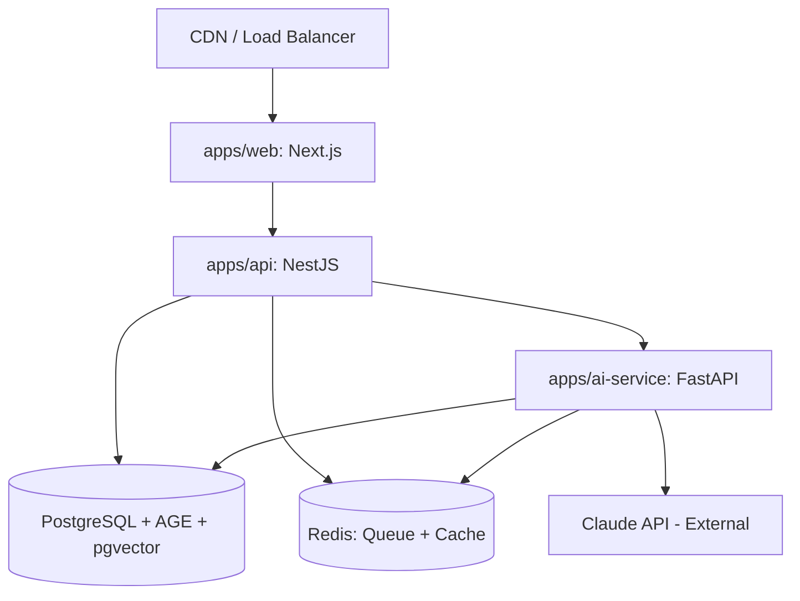

# Service Architecture

> **Purpose:** Define the service architecture and inter-service communication for Vaeloom
> **Status:** ✅ Upgraded to enterprise quality
> **Canonical source:** [`/Docs/Vaeloom-Complete-Documentation.md#135-deployment-architecture`](../../Docs/Vaeloom-Complete-Documentation.md#135-deployment-architecture)

## Service Map



## Service Responsibilities

### apps/web (Next.js)

- Server-side rendering for fast first paint
- Client-side routing and state management
- Static asset serving through CDN

### apps/api (NestJS + TypeScript)

- Authentication and session management
- CRUD operations for all resources
- Permission Engine enforcement
- Event publishing

### apps/ai-service (FastAPI + Python)

- Agent runtime and orchestration
- Memory extraction and knowledge graph management
- Agentic RAG retrieval
- Model routing and prompt management

## Inter-Service Communication

| Path | Protocol | Notes |
|------|----------|-------|
| Web → API | HTTP/REST | Standard API calls |
| API → AI | Internal RPC | Agent requests, not exposed externally |
| AI → API | Internal RPC | Memory writes, permission checks |

## Common Mistakes

| Mistake | Why It's a Problem |
|---------|-------------------|
| Exposing AI service endpoints directly to the frontend | The AI service should only be reachable through the API service — direct frontend→AI access bypasses permission checks, auth, and audit logging |
| Hardcoded service URLs and ports in configuration | Service locations change between environments (local dev vs staging vs production) — use environment variables or service discovery, not hardcoded connection strings |
| No circuit breaker for inter-service calls | When the AI service is slow or down, the API service should fail fast rather than hanging — circuit breakers prevent cascading failures across services |
| Mixing synchronous and async communication without clear patterns | Some calls use HTTP, others use events, others use WebSocket — without documented patterns, developers choose randomly, creating an unmaintainable mix |

## Best Practices

| Practice | Rationale |
|----------|-----------|
| Route all AI service access through the API service's internal RPC boundary | The API service enforces auth, permission checks, and rate limiting before forwarding to the AI service — never expose AI endpoints to the frontend |
| Use environment variables or a service registry for all inter-service URLs | A service registry (or even a simple environment variable per service URL) makes services portable across environments without code changes |
| Implement circuit breakers on all inter-service HTTP/gRPC calls | When a downstream service fails, the circuit breaker opens and subsequent calls fail fast (within 10ms) rather than hanging for 30s timeout — prevents resource exhaustion |
| Document communication patterns per service | Each service should document which other services it calls (sync), which events it publishes (async), and which events it consumes — makes the communication topology visible and reviewable |

## Security

| Concern | Mitigation |
|---------|------------|
| Internal service discovery exposing topology | Service registries (Consul, Kubernetes DNS) can reveal internal service topology — restrict access to the registry to authorized services only |
| Health check endpoints leaking system information | Health endpoints (`/health`, `/ready`) should return pass/fail status only — avoid including version numbers, dependency versions, or internal configuration in health responses |
| Stale service-to-service tokens | Service tokens used for inter-service auth that never expire create a long-lived credential risk — rotate service tokens every 24 hours; automate rotation with a sidecar or service mesh |

## Performance

| Concern | Guideline |
|---------|-----------|
| Serial inter-service call chains | If the API service must call the AI service to get data before it can respond to the frontend, that adds RTT latency — batch or parallelize requests where data from multiple services is needed |
| Connection pool exhaustion under load | Each service maintains a connection pool to PostgreSQL and Redis — under high load, connection pool limits can throttle request throughput before CPU becomes the bottleneck |
| Service mesh overhead | A service mesh (Istio/Linkerd) adds ~5-10ms of latency per hop via sidecar proxies — for latency-sensitive paths (Chat), consider bypassing the mesh for direct connections |

## Goals

- Define clear service boundaries and responsibilities for web, API, and AI service tiers
- Establish secure inter-service communication patterns with mTLS and service tokens
- Prevent direct service-to-service database access through well-defined API contracts
- Enable independent deployability and scaling of each service
- Document circuit breaker and retry patterns for all inter-service calls

## Scope

| In Scope | Out of Scope |
|----------|--------------|
| Three-service architecture (web, API, AI) responsibilities | Individual function-level implementation |
| Inter-service communication protocols (HTTP, gRPC, WebSocket) | Third-party API integration specifics |
| Service URL management and environment-based configuration | Database schema design and migrations |
| Circuit breaker and retry patterns for resilience | Client SDK generation for external consumers |
| Health check endpoint design per service | Monitoring dashboard configuration |

## Functional Requirements

| ID | Requirement | Priority |
|----|-------------|----------|
| SVC-FR-01 | API service must be the sole external gateway; AI service must not expose public endpoints | P0 |
| SVC-FR-02 | All inter-service communication must carry authentication tokens | P0 |
| SVC-FR-03 | Each service must expose /health and /ready endpoints | P0 |
| SVC-FR-04 | Circuit breakers must be implemented on all inter-service HTTP calls | P1 |
| SVC-FR-05 | Service URLs must be configurable via environment variables, not hardcoded | P0 |

## Non-Functional Requirements

| ID | Requirement | Target | Measurement |
|----|-------------|--------|-------------|
| SVC-NFR-01 | Inter-service call latency (API → AI) | < 50ms p99 | Distributed tracing (OpenTelemetry) |
| SVC-NFR-02 | Service startup time for auto-scaling readiness | < 30s | Container startup time metric |
| SVC-NFR-03 | Circuit breaker open timeout before retry | 30s | Circuit breaker state monitoring |
| SVC-NFR-04 | Maximum connection pool size per service | 20 connections per instance | Connection pool utilization metrics |

## Components

| Component | Responsibility | Technology | Scale Strategy |
|-----------|---------------|------------|----------------|
| API Service | Auth, CRUD, permission enforcement, event publishing | NestJS, TypeScript | Horizontal auto-scaling based on request latency |
| AI Service | Agent runtime, memory management, model routing | FastAPI, Python 3.11+ | Queue-driven scaling based on job backlog |
| Service Registry | Service discovery and health tracking | Environment variables (MVP) / Consul (Enterprise) | From static config to dynamic service discovery |
| Circuit Breaker | Fault isolation between services | Custom middleware / Opossum | Per-service circuit configuration |

## Data Flow

1. Frontend sends authenticated HTTP request to the API Service, which validates the JWT and checks permissions against the Permission Engine
2. API Service determines if the request requires AI processing or is a standard CRUD operation against PostgreSQL
3. For AI operations, API Service makes an internal RPC call to the AI Service with an mTLS-authenticated service token
4. AI Service processes the request, retrieves context from PostgreSQL/Redis, calls the external Model API, and returns the result to the API Service
5. API Service enriches the AI response with permission context, writes audit log entry, publishes relevant events to the bus, and returns the response to the frontend

## Scalability

| Dimension | Current Limit | 10x Strategy | 100x Strategy |
|-----------|--------------|--------------|---------------|
| API service instances | 3 instances | Auto-scaling group based on latency p99 | Multi-region deployment with global load balancer |
| AI service instances | 3 instances | Queue-depth-based auto-scaling | GPU-backed instance pool for batch processing |
| Inter-service throughput | 500 RPM | Connection pooling + keep-alive | gRPC streaming for high-throughput paths |
| Service discovery freshness | Static config | Consul with health-based routing | Service mesh (Istio) with traffic splitting |

## Error Handling

| Error Scenario | Detection | Mitigation | Recovery |
|---------------|-----------|------------|----------|
| AI service call timeout (service overloaded) | Circuit breaker detects timeout threshold | Open circuit; return 503 with retry-after header | Circuit closes after cooldown; health check passes |
| API service connection pool exhausted | Connection wait timeout | Queue incoming requests; return 429 with backoff | Scale up API instances; increase pool size |
| Service token expiration | Auth middleware rejects token | Automatically refresh token via token exchange | Retry with new token; alert if refresh fails |
| Health check endpoint failure | Orchestrator detects unhealthy endpoint | Remove from load balancer rotation | Service restarts; readiness check passes |

## Monitoring

| Metric | Alert Threshold | Severity | Dashboard |
|--------|----------------|----------|-----------|
| Inter-service call p99 latency | > 200ms for 5 minutes | Warning | Service Mesh Latency |
| Circuit breaker open count | > 3 open circuits in 1 hour | Critical | Circuit Breaker Status |
| Service health check failure rate | > 10% of checks in 5 minutes | Critical | Service Health Dashboard |
| Connection pool utilization | > 80% for 5 minutes | Warning | Connection Pool Metrics |

## Configuration

| Variable | Purpose | Default | Required |
|----------|---------|---------|----------|
| `API_SERVICE_URL` | Internal API service URL for frontend server | — | Yes |
| `AI_SERVICE_URL` | Internal AI service RPC endpoint | — | Yes |
| `CIRCUIT_BREAKER_TIMEOUT` | Timeout in ms for circuit breaker open state | `30000` | No |
| `MAX_RETRY_ATTEMPTS` | Maximum retry attempts for failed inter-service calls | `3` | No |
| `SERVICE_TOKEN` | Shared secret for inter-service authentication | — | Yes |

## Risks

| Risk | Likelihood | Impact | Mitigation |
|------|------------|--------|------------|
| Service mesh adds latency to critical request paths | Medium | Medium | Bypass mesh for latency-sensitive chat routes |
| Stale service token shared across environments | Low | Critical | Per-environment tokens; automated rotation |
| Circuit breaker cascading during partial outage | Medium | High | Half-open circuit state; gradual traffic reintroduction |
| Service URL misconfiguration in environment variables | Low | High | Validation on startup; CI checks for all env vars |

## Limitations

| Limitation | Impact | Workaround | Future Resolution |
|------------|--------|------------|-------------------|
| HTTP/REST for all inter-service calls (no gRPC) | Higher latency, no typed contracts | Protocol buffers for complex payloads | Migrate to gRPC for high-throughput paths |
| Static service URL configuration per environment | Deployment requires configuration update | Environment-specific config files | Dynamic service discovery (Consul) |
| No service mesh in MVP staging | Manual traffic management for canary deployments | Separate staging environment for testing | Istio/Linkerd service mesh for production |

## Examples

### Make an internal RPC call

```typescript
const resume = await rpc.call("ai-service", {
  method: "resume.generate",
  payload: { userId: "u_123", format: "pdf" }
});
```

### Check service health

```bash
Vaeloom service health --name api,ai-service,worker
```

### View communication topology

```bash
Vaeloom service map --format mermaid
```

## Future Improvements

| Improvement | Priority | Complexity | Timeline |
|-------------|----------|------------|----------|
| Migrate inter-service calls to gRPC for typed contracts | Medium | High | Q4 2026 |
| Implement service mesh (Istio) for traffic management | Medium | High | Q1 2027 |
| Dynamic service discovery with Consul | Medium | Medium | Q3 2026 |
| Canary deployment per service with traffic splitting | Low | High | Q2 2027 |

## Related Documents

- [Microservices.md](./Microservices.md)
- [Infrastructure.md](./Infrastructure.md)
- [`/Docs/Vaeloom-Complete-Documentation.md#135-deployment-architecture`](../../Docs/Vaeloom-Complete-Documentation.md#135-deployment-architecture)
