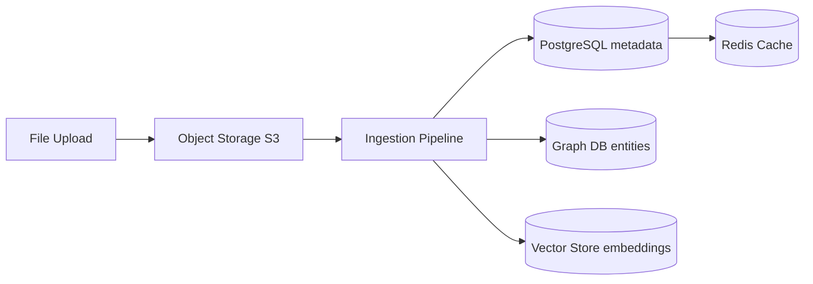

# Storage Architecture

> **Purpose:** Define the storage architecture for Meridian
> **Status:** ✅ Upgraded to enterprise quality
> **Owner:** DevOps Team
> **Last Updated:** 2026-07-13
>
> **Canonical source:** [`/Docs/Meridian-Complete-Documentation.md#11-database-design`](../../Docs/Meridian-Complete-Documentation.md#11-database-design)

## Storage Systems

| System | Purpose | MVP Technology | Enterprise |
|--------|---------|---------------|------------|
| Relational | Structured data, audit trail | PostgreSQL | PostgreSQL + replicas |
| Graph | Entity relationships | Apache AGE (PG extension) | Neo4j |
| Vector | Semantic embeddings | pgvector (PG extension) | Qdrant |
| Object | Raw document storage | S3-compatible | S3 + multi-region |
| Cache | Frequently-accessed data | Redis | Redis cluster |
| Queue | Background job processing | Redis + BullMQ | Kafka |

## Data Flow



## Storage Costs

| Store | Estimated Cost (1K users/month) |
|-------|-------------------------------|
| PostgreSQL | $15-50 |
| Object Storage | $5-20 |
| Redis | $15-30 |
| Total | $35-100 |

## Common Mistakes

| Mistake | Why It's a Problem |
|---------|-------------------|
| Choosing a dedicated database (Neo4j, Qdrant) before the MVP is validated | Running separate database systems for graph and vector at MVP adds operational complexity, cost, and migration risk before the product proves its value |
| No data retention policy for object storage | Raw uploaded documents accumulate indefinitely without a retention policy — storage costs grow linearly with time, and stale documents may contain outdated or superseded information |
| Using PostgreSQL for everything including ephemeral data | Session data, cache-hot data, and working memory should live in Redis, not PostgreSQL — storing ephemeral data in Postgres wastes connection pool slots and I/O on data that doesn't need durability |
| Ignoring the cost of vector storage at scale | Embeddings (1536 dimensions per vector) grow linearly with content — at 100K documents, the vector store alone can consume 2-3GB of storage and degrade query performance without proper indexing |

## Best Practices

| Practice | Rationale |
|----------|-----------|
| Start with PostgreSQL + AGE + pgvector at MVP; migrate to dedicated stores only when performance metrics demand it | One database to operate at MVP reduces complexity; the migration path (AGE→Neo4j, pgvector→Qdrant) is additive — the dedicated store runs alongside Postgres until the migration is validated |
| Define retention policies per data type | Raw documents: 90 days without read access → archive; memory records: permanent; session cache: 24 hours; agent logs: 30 days — each data type has a different durability and access pattern |
| Use the right storage for the right data class | Relational data → PostgreSQL; graph data → AGE/Neo4j; vectors → pgvector/Qdrant; ephemeral/queue → Redis; raw files → S3 — using one store for everything creates a single point of failure and performance bottleneck |
| Index vector stores with IVFFlat indexing for sub-100ms queries | Without proper indexing, vector similarity searches are O(n) — IVFFlat provides approximate nearest neighbor search that stays fast even with 100K+ vectors |

## Security

| Concern | Mitigation |
|---------|------------|
| Object storage bucket misconfiguration | S3 buckets containing raw documents must not be publicly accessible — enforce bucket policies that restrict access to the application service account only |
| Cache data including sensitive user information | Cached dashboard data, resume renders, and agent responses may contain PII — ensure Redis cache is encrypted at rest and flushed on workspace deletion |
| Cross-tenant data leakage in shared database instances | A shared PostgreSQL instance serving multiple workspaces must enforce workspace_id scoping on every query — a missing WHERE workspace_id clause is a cross-tenant data leak |

## Performance

| Concern | Guideline |
|---------|-----------|
| Connection pool sizing per service | Each service (api, ai-service, worker) needs its own connection pool — allocate extra connections to handle traffic spikes without exhausting database connections (max: 80% of DB's max_connections) |
| Query performance degradation with vector store growth | As embedding count grows, exact nearest-neighbor search slows linearly — use IVFFlat (inverted file) indexing with appropriate lists parameter (lists = sqrt(rows)) for sub-10ms approximate search |
| Cache hit ratio monitoring | If application cache (Redis) hit ratio falls below 80%, the cache configuration needs adjustment — increase cache TTL, pre-warm on deploy, or review invalidation policy |

## Goals

- Maintain PostgreSQL as the single operational database for MVP while supporting clear migration paths to dedicated stores
- Achieve 99.999% data durability for object storage via S3 replication and versioning
- Keep storage costs under $100/month per 1,000 active users at MVP scale
- Ensure zero data loss through automated daily backups with cross-region replication
- Enforce data retention policies that automatically archive or purge stale data per type

## Scope

| In Scope | Out of Scope |
|----------|--------------|
| Relational database design and optimization | Cold storage or tape archival systems |
| Object storage configuration and lifecycle policies | Database indexing and query tuning |
| Vector storage with pgvector and migration to Qdrant | Machine learning training data storage |
| Cache storage architecture and sizing | CDN asset storage and distribution |
| Graph database with AGE and migration to Neo4j | Data warehousing or OLAP systems |

## Functional Requirements

| ID | Requirement | Priority |
|----|-------------|----------|
| STOR-F1 | All structured data shall be stored in PostgreSQL with workspace_id enforcement | P0 |
| STOR-F2 | Raw uploaded documents shall be stored in S3-compatible object storage | P0 |
| STOR-F3 | Semantic embeddings shall be stored in pgvector with IVFFlat indexing | P1 |
| STOR-F4 | System shall enforce retention policies per data type with automated archival | P1 |
| STOR-F5 | All storage systems shall support encryption at rest | P0 |

## Non-Functional Requirements

| ID | Requirement | Target | Measurement |
|----|-------------|--------|-------------|
| STOR-N1 | Data durability for object storage | 99.999999999% (11 nines) | S3 durability SLA |
| STOR-N2 | Database backup recovery time | < 1 hour for full restore | Restore timer |
| STOR-N3 | Storage cost per 1K active users | < $100/month | Cloud billing |
| STOR-N4 | Vector query latency at 100K embeddings | < 100ms p99 | Query timing |
| STOR-N5 | Automated archival compliance | 100% of stale data meets retention policy | Audit scan |

## Components

| Component | Responsibility | Technology | Scale Strategy |
|-----------|---------------|------------|---------------|
| PostgreSQL Primary | Structured data, audit trail, query processing | PostgreSQL 16 | Vertical scale then read replicas |
| Object Storage | Raw documents, uploaded files | S3-compatible (MinIO / AWS S3) | Multi-region replication |
| Vector Store | Semantic embeddings for search and RAG | pgvector → Qdrant | IVFFlat then dedicated Qdrant cluster |
| Graph Store | Entity relationships and knowledge graph | Apache AGE → Neo4j | Read replicas then dedicated Neo4j |
| Cache Store | Frequently accessed data for low-latency reads | Redis | Redis Cluster with sharding |

## Data Flow

1. User uploads a document — the file is stored in S3 object storage with versioning enabled and metadata written to PostgreSQL
2. Ingestion pipeline reads the file from S3, processes it, and stores extracted entities in the graph store and embeddings in the vector store
3. Application queries data through PostgreSQL for structured queries, AGE for relationship traversal, and pgvector for semantic similarity
4. Frequently accessed results are cached in Redis with event-based invalidation to reduce load on primary stores
5. Backup pipeline runs daily full PostgreSQL backups with continuous WAL archiving to S3 cross-region replica

## Scalability

| Dimension | Current Limit | 10x Strategy | 100x Strategy |
|-----------|--------------|--------------|---------------|
| PostgreSQL storage | 100 GB per instance | Read replicas + connection pooling | Sharding by workspace_id hash |
| Object storage | Unlimited (S3 scale) | Multi-region bucket replication | S3 Object Lock for compliance |
| Vector store | 100K vectors on pgvector | Qdrant dedicated cluster with HNSW | GPU-accelerated indexing |
| Graph store | 1M nodes on AGE | Neo4j cluster with read replicas | Neo4j fabric database |
| Redis cache | 4 GB per node | Redis Cluster with 6 shards | Tiered cache (hot/warm/cold) |

## Error Handling

| Error Scenario | Detection | Mitigation | Recovery |
|----------------|-----------|------------|----------|
| PostgreSQL primary failure | Monitoring detects connection loss | Auto-failover to read replica promoted to primary | Rebuild failed instance from backup |
| S3 upload failure | API returns 5xx error | Retry with exponential backoff up to 5 times | Queue failed uploads for manual recovery |
| Vector store corruption | Query results show anomalies | Re-embed affected documents from source | Restore from last known good snapshot |
| Disk space exhaustion on PostgreSQL | Disk usage alert at 85% | Auto-scale storage volume | Purge archived data per retention policy |

## Monitoring

| Metric | Alert Threshold | Severity | Dashboard |
|--------|----------------|----------|-----------|
| PostgreSQL disk usage | > 85% | Warning | Database Capacity |
| S3 upload failure rate | > 1% of uploads | Warning | Storage Health |
| Vector query latency p99 | > 200ms | Warning | Query Performance |
| Redis memory usage | > 80% of maxmemory | Critical | Cache Resource |
| Backup age (last successful) | > 26 hours | Critical | Backup Status |

## Configuration

| Variable | Purpose | Default | Required |
|----------|---------|---------|----------|
| STORAGE_PG_CONNECTION_STRING | PostgreSQL connection string for primary | postgresql://localhost:5432/meridian | Yes |
| STORAGE_S3_BUCKET | S3 bucket name for document storage | meridian-documents | Yes |
| STORAGE_S3_REGION | S3 bucket region | us-east-1 | Yes |
| STORAGE_RETENTION_DAYS | Default retention period for raw documents | 90 | Yes |
| STORAGE_VECTOR_INDEX_TYPE | Vector index algorithm (ivfflat or hnsw) | ivfflat | No |

## Risks

| Risk | Likelihood | Impact | Mitigation |
|------|------------|--------|------------|
| PostgreSQL reaching connection limit under load | Medium | High | Connection pooling per service, monitor pool usage |
| S3 bucket misconfiguration exposing documents | Low | Critical | Bucket policies restrict to service account, quarterly audit |
| Vector store becoming query bottleneck at scale | Medium | Medium | IVFFlat indexing, migrate to Qdrant before threshold |
| Storage costs exploding from untracked data growth | Medium | Medium | Automated retention policies, cost anomaly alerts |

## Limitations

| Limitation | Impact | Workaround | Future Resolution |
|------------|--------|------------|-------------------|
| AGE graph queries slower than Neo4j at scale | Graph traversal degrades beyond 1M nodes | Keep graph queries simple, index relationship types | Migrate to Neo4j at enterprise tier |
| pgvector exact search O(n) without index | Linear scan on every vector query | Always use IVFFlat approximate indexing | Migrate to Qdrant with HNSW indexing |
| Single-region S3 bucket for MVP | Regional outage prevents document access | Cross-region replication replica bucket | Multi-region active-active S3 configuration |
| PostgreSQL connection pool per service complexity | Connection starvation under spike | Pool sizing with headroom per service | PgBouncer connection pooling layer |

## Examples

### Upload a document to object storage

```bash
meridian storage upload --file resume.pdf --bucket user-documents --region us-east-1
```

### Query PostgreSQL with graph extension

```sql
SELECT * FROM cypher('meridian_graph', $$
  MATCH (s:Skill {name: 'React'})-[r:USED_IN]->(p:Project)
  RETURN p.name, p.url
$$) AS (project_name text, url text);
```

### Check storage usage

```bash
meridian storage usage --workspace ws_123 --format table
```

### Migrate to vector index

```python
from meridian import VectorStore
store = VectorStore(backend="pgvector", index_type="ivfflat")
store.create_index(dimensions=1536, lists=100)
```

## Future Improvements

| Improvement | Priority | Complexity | Timeline |
|-------------|----------|------------|----------|
| Qdrant migration for dedicated vector search | Medium | Medium | Q4 2026 |
| Neo4j migration for dedicated graph traversal | Medium | High | Q1 2027 |
| Multi-region active-active PostgreSQL | High | High | Q2 2027 |
| Automated storage tiering (hot/warm/cold) | Low | Medium | Q3 2027 |
| Storage cost allocation per workspace for billing | Medium | Low | Q3 2026 |

## Related Documents

- [Database Design](../Database/Database-Design.md)
- [Caching.md](./Caching.md)
- [`/Docs/Meridian-Complete-Documentation.md#11-database-design`](../../Docs/Meridian-Complete-Documentation.md#11-database-design)
