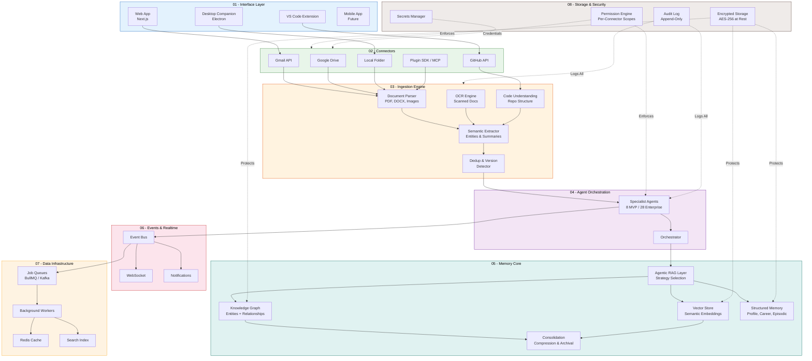
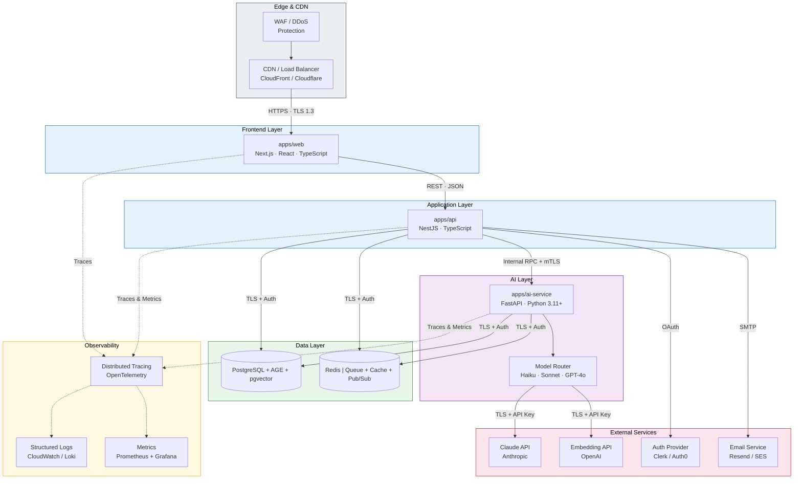
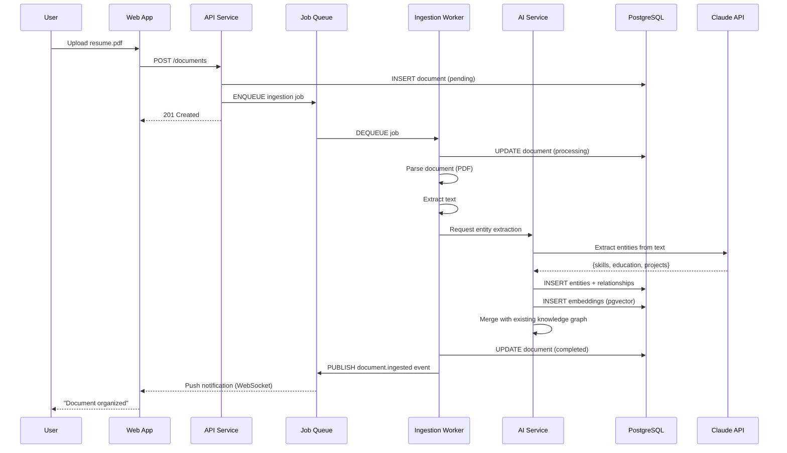
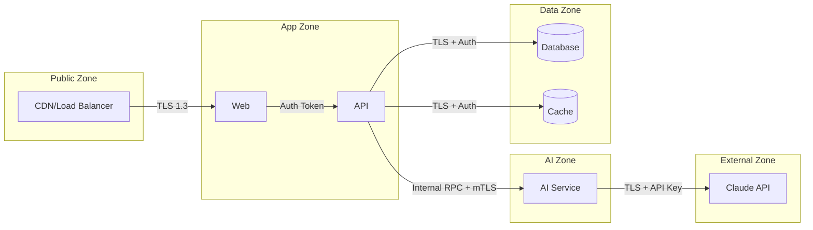

# System Design

> **Purpose:** Detailed system design for the Meridian platform, including all layers, services, and data flows
> **Status:** ✅ Upgraded to enterprise quality
> **Owner:** Architecture Team
> **Last Updated:** 2026-07-12
> **Canonical source:** [`/Docs/02-system-architecture.md`](../../Docs/02-system-architecture.md)

---

## Overview

Meridian is built as a layered architecture with a clear separation of concerns. Each layer exists to feed the memory layer at the center. Interfaces and connectors bring data in; agents act on it; everything that happens gets written back to memory — which is what every feature above ultimately reads from.

This document covers the complete system design: layer architecture, service topology, data flow, security boundaries, and key design decisions.

## Architecture Layers

The system is organized into eight distinct layers, each with a clear responsibility. Data flows upward from storage to the interface, while cross-cutting security and auditing layers protect every layer.



## Service Topology

The platform runs three primary services plus supporting infrastructure. All communication is authenticated, and the AI service is deliberately separated from the API service to allow independent scaling.



### Service Responsibilities

| Service | Stack | Responsibility | Port | Scale Strategy |
|---------|-------|---------------|------|----------------|
| `apps/web` | Next.js, React, TypeScript | Frontend rendering, SSR, client state | 3000 | Horizontal (auto-scaling) |
| `apps/api` | NestJS, TypeScript | Auth, CRUD, permissions, event publishing | 4000 | Horizontal (auto-scaling) |
| `apps/ai-service` | FastAPI, Python | Agents, memory, RAG, model routing | 5000 | Queue-driven, worker-per-agent |

### Data Flow Summary

```text
User → Web (Next.js) → API (NestJS) → AI Service (FastAPI) → Model API (Anthropic/OpenAI)
                                    ↓                                   ↓
                              PostgreSQL ←────────────────────────── Embeddings + Entities
                              Redis (Queue) ───→ Background Workers
```

## Data Flow: Document Upload → Memory



## Key Design Decisions

| Decision | Rationale | Alternatives Considered |
|----------|-----------|------------------------|
| Two-service backend (NestJS + FastAPI) | Optimize each for its ecosystem | Monolithic (rejected: different scaling needs) |
| MCP-shaped tools from day one | Future MCP adoption = transport change | Custom format then migrate (rejected: more work) |
| PostgreSQL + extensions at MVP | One DB to operate; migrate when needed | Three separate DBs (rejected: operational complexity) |
| Event bus for agent actions | Decouple "something happened" from "who knows" | Direct agent-to-agent calls (rejected: tight coupling) |
| Suggest-mode by default | Trust is earned, not assumed | Full autonomy (rejected: trust failure risk) |

## Security Boundaries



## Best Practices

| Practice | Why |
|----------|-----|
| Keep the API stateless | Horizontal scaling without session affinity |
| Use circuit breakers for AI calls | Prevent cascading failures when model API is slow |
| Prefer eventual consistency where possible | Better availability than strong consistency for non-critical reads |
| Log everything, alert on anomalies | Debug agent behavior across distributed services |

## Common Mistakes

| Mistake | Consequence | Correction |
|---------|-------------|------------|
| Direct agent-to-agent calls | Untraceable, unscalable | Route everything through Orchestrator + event bus |
| Permissions as afterthought | Security holes, compliance gaps | Permission Engine on every request from day one |
| Synchronous ingestion | Blocks UI, poor UX | Queue-driven ingestion from day one |

## Performance Considerations

- AI service is the bottleneck — queue-driven design prevents API from blocking
- Cache dashboard data with event-based invalidation (not TTL)
- Database connection pooling tuned per service
- Pre-warm agent tool definitions (rarely change)

## Security Considerations

- Every internal call is authenticated (no implicit trust)
- Secrets manager for all credentials (never in env files in production)
- mTLS between API and AI service for Enterprise deployment
- Audit log for every agent action (append-only)

## Goals

- Establish a layered architecture with clear separation of concerns across 8 independent layers
- Ensure every data access path routes through the permission engine for full audit compliance
- Enable independent horizontal scaling of API and AI service tiers based on demand
- Provide end-to-end encrypted data flow from ingestion through storage and retrieval
- Achieve event-driven agent orchestration that decouples producers from consumers

## Scope

| In Scope | Out of Scope |
|----------|--------------|
| 8-layer architecture design and inter-layer dependencies | Hardware-level server architecture and rack design |
| Service topology for web, API, and AI services | Client-side application architecture and offline mode |
| Security boundary zones and network isolation policies | Third-party SaaS provider internal architecture |
| End-to-end data flow from ingestion to memory persistence | Mobile application architecture (planned for future) |
| Background job queue and worker infrastructure | Real-time video processing pipeline |

## Functional Requirements

| ID | Requirement | Priority |
|----|-------------|----------|
| SYS-FR-01 | System must ingest documents from Gmail, GitHub, Google Drive, and local folders | P0 |
| SYS-FR-02 | System must route all agent actions through a central orchestrator | P0 |
| SYS-FR-03 | System must maintain an append-only audit log for every agent action | P0 |
| SYS-FR-04 | System must encrypt all stored data with AES-256 at rest | P0 |
| SYS-FR-05 | System must publish all agent actions as events to the event bus | P1 |
| SYS-FR-06 | System must validate user permissions on every API request | P0 |

## Non-Functional Requirements

| ID | Requirement | Target | Measurement |
|----|-------------|--------|-------------|
| SYS-NFR-01 | API response time under concurrent load | < 500ms p99 | Load testing with k6 (1000 concurrent users) |
| SYS-NFR-02 | System availability for production deployment | 99.9% uptime | Uptime monitoring (status page) |
| SYS-NFR-03 | Document ingestion end-to-end latency | < 30s p95 | Ingestion latency dashboard |
| SYS-NFR-04 | Inter-service authentication coverage | 100% of internal calls | Security audit scan per release |

## Components

| Component | Responsibility | Technology | Scale Strategy |
|-----------|---------------|------------|----------------|
| Web App | Frontend rendering, SSR, client-side state | Next.js, React, TypeScript | Horizontal auto-scaling via CPU/latency |
| API Service | Authentication, CRUD, permissions, event publishing | NestJS, TypeScript | Horizontal auto-scaling via request latency |
| AI Service | Agent runtime, memory extraction, RAG, model routing | FastAPI, Python 3.11+ | Queue-driven, worker-per-agent scaling |
| Knowledge Graph | Entity storage and relationship mapping | PostgreSQL + AGE | Vertical → partitioning → sharding |
| Event Bus | Decoupled agent event distribution | Redis / Kafka | Redis for MVP, Kafka for enterprise scale |

## Data Flow

1. User uploads a document through the Web App, which sends a POST request to the API Service with the file payload
2. API Service validates authentication and permissions, stores the document record as "pending" in PostgreSQL, and enqueues an ingestion job in the Redis job queue
3. Background Worker dequeues the job, updates the document status to "processing", parses the document content, and sends extracted text to the AI Service for entity extraction
4. AI Service calls the Claude API to extract entities, skills, and relationships, then inserts the extracted data into the Knowledge Graph and vector embeddings into pgvector
5. Worker marks the document as "completed", publishes a `document.ingested` event to the event bus, and a WebSocket push notifies the Web App to update the UI

## Scalability

| Dimension | Current Limit | 10x Strategy | 100x Strategy |
|-----------|--------------|--------------|---------------|
| Concurrent users | 1,000 | Horizontal auto-scaling web + API | Multi-region active-active deployment |
| Document ingestion throughput | 100/day | Queue-driven worker pool expansion | Dedicated ingestion service with workers |
| Knowledge graph entity count | 1M entities | Vertical scale PostgreSQL instance | AGE graph partitioning + database sharding |
| Event bus throughput | 1,000 events/s | Redis cluster mode | Migrate to Kafka with partitioned topics |

## Error Handling

| Error Scenario | Detection | Mitigation | Recovery |
|---------------|-----------|------------|----------|
| AI service unresponsive (down or timeout) | Health check failure / request timeout | Circuit breaker opens; API returns cached or degraded response | Automatic retry after 30s cooldown period |
| Document parsing failure (corrupt or unsupported format) | Parser exception in ingestion worker | Move event to dead letter queue; notify user via notification service | Manual re-upload or format conversion by user |
| Database connection pool exhaustion | Connection wait timeout error | PgBouncer connection queuing; scale connection pool size | Auto-scale API instances and increase max_connections |
| Model API rate limit exceeded (429) | 429 response from Claude/OpenAI | Exponential backoff retry with jitter; queue job for later retry | Retry with backoff; alert operations if persistent |

## Monitoring

| Metric | Alert Threshold | Severity | Dashboard |
|--------|----------------|----------|-----------|
| API p99 latency | > 1s for 5 minutes | Critical | API Service Performance |
| AI service queue depth | > 500 jobs for 5 minutes | Warning | AI Service Queue Status |
| Global error rate (all services) | > 1% of requests for 5 minutes | Critical | Global Error Dashboard |
| Event bus consumer lag | > 10,000 unconsumed events | Warning | Event Architecture Health |
| Document ingestion failure rate | > 5% of ingestion jobs in 1 hour | Warning | Ingestion Pipeline Status |

## Configuration

| Variable | Purpose | Default | Required |
|----------|---------|---------|----------|
| `DATABASE_URL` | PostgreSQL connection string for primary database | — | Yes |
| `REDIS_URL` | Redis connection string for queues and caching | — | Yes |
| `ANTHROPIC_API_KEY` | Authentication key for Claude API access | — | Yes |
| `OPENAI_API_KEY` | Authentication key for embedding API access | — | Yes |
| `LOG_LEVEL` | Structured logging verbosity level | `info` | No |

## Risks

| Risk | Likelihood | Impact | Mitigation |
|------|------------|--------|------------|
| Model API dependency causing system-wide outage | Medium | High | Circuit breakers on all model calls; cached fallback responses |
| Data breach via intercepted inter-service communication | Low | Critical | mTLS between all services; network isolation per zone |
| Ingestion pipeline backpressure blocking new uploads | Medium | Medium | Dead letter queue with alerting; auto-scale workers on queue depth |
| Knowledge graph inconsistency from concurrent writes | Low | Medium | Optimistic locking on entities; periodic consistency verification jobs |

## Limitations

| Limitation | Impact | Workaround | Future Resolution |
|------------|--------|------------|-------------------|
| Single PostgreSQL instance serves graph, vector, and relational data | Query performance degrades under mixed workload | Read replicas for reporting queries | Dedicated graph database (AGE cluster) and vector database |
| Synchronous model API calls block agent execution | Agent response time includes full LLM inference latency | Client-side optimistic UI updates | Streaming model responses for progressive output |
| Maximum 10MB file size per uploaded document | Large files (videos, datasets) cannot be ingested | Split-and-merge pipeline for large files | Chunked streaming ingestion with progress tracking |

## Examples

### Full request flow across layers

```python
# Client -> API -> Orchestrator -> Agent -> Memory
response = await meridian.pipeline.run(
    user_id="u_123",
    action="resume.update",
    files=["resume.pdf"],
    wait_for_completion=True
)
```

### Layer contract validation

```bash
meridian arch validate --layer ingestion --contract docs/contracts/ingestion.yaml
```

### Service topology query

```bash
meridian arch topology --format json | jq '.layers[].services[] | select(.status == "healthy")'
```

## Future Improvements

| Improvement | Priority | Complexity | Timeline |
|-------------|----------|------------|----------|
| Multi-region active-active deployment with failover | Medium | High | Q4 2026 |
| Streaming model responses for real-time agent output | Medium | Medium | Q3 2026 |
| Automatic knowledge graph repair and consistency checker | Low | High | Q1 2027 |
| Native mobile application with local-first architecture | Low | Medium | Q2 2027 |

## Related Documents

- [High Level Design.md](./High-Level-Design.md)
- [Event Architecture.md](./Event-Architecture.md)
- [Service Architecture.md](./Service-Architecture.md)
- [`/Docs/Meridian-Complete-Documentation.md#4-system-architecture`](../../Docs/Meridian-Complete-Documentation.md#4-system-architecture)
