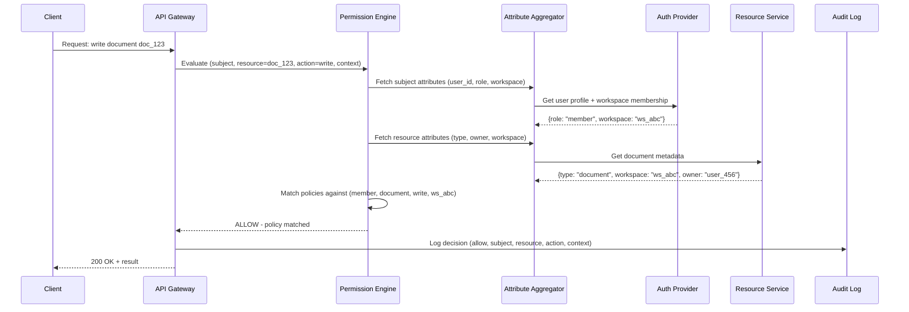

# Attribute-Based Access Control (ABAC)

> **Purpose:** Define ABAC model for Vaeloom's Permission Engine
> **Status:** 🆕 New

## ABAC Architecture

```mermaid
graph TD
    classDef subject fill:#e3f2fd,stroke:#1565c0,color:#000,stroke-width:2px
    classDef resource fill:#e8f5e9,stroke:#2e7d32,color:#000,stroke-width:1.5px
    classDef action fill:#fff3e0,stroke:#e65100,color:#000,stroke-width:1.5px
    classDef context fill:#f3e5f5,stroke:#6a1b9a,color:#000,stroke-width:1px
    classDef decision fill:#ffebee,stroke:#c62828,color:#000,stroke-width:2px

    subgraph Subject["👤 Subject Attributes"]
        S1["User / Agent identity<br/>agent: memory_agent<br/>role: admin"]
    end

    subgraph Resource["📄 Resource Attributes"]
        R1["Resource type + owner<br/>type: document<br/>workspace: ws_abc"]
    end

    subgraph Action["âš¡ Action Attributes"]
        A1["Operation type<br/>read / write / act / delete"]
    end

    subgraph Context["🌐 Context Attributes"]
        C1["Time, location, device<br/>ip_range: internal<br/>time: business_hours"]
    end

    subgraph Evaluation["🔍 Policy Evaluation Flow"]
        E1["Request: Agent=A, Action=W, Resource=R"]
        E2["Fetch subject attributes"]
        E3["Fetch resource attributes"]
        E4["Fetch context attributes"]
        E5["Evaluate policies against ALL attributes"]
        E6["Deny by default → Allow if policy matches"]
    end

    S1 & R1 & A1 & C1 --> E1 --> E2 & E3 & E4 --> E5 --> E6

    class S1 subject
    class R1 resource
    class A1 action
    class C1 context
    class E1,E2,E3,E4,E5,E6 decision
```



> **Diagram:** ABAC model — requests are evaluated against **4 attribute categories**: Subject (who), Resource (what), Action (how), Context (when/where). **Policy evaluation** fetches all attributes, evaluates policies, and denies by default — only allowing if a matching policy is found.

---

## ABAC Model

Vaeloom's Permission Engine uses **attribute-based access control** as the core model, with RBAC as an additional layer at the enterprise tier.

## Attributes Checked

| Attribute Category | Attributes | Examples |
|-------------------|------------|----------|
| Subject | User/Agent identity, role | `agent: memory_agent`, `role: admin` |
| Resource | Resource type, owner | `type: document`, `workspace: ws_abc` |
| Action | Operation type | `read`, `write`, `act` |
| Context | Time, location, device | `ip_range: internal`, `time: business_hours` |

## Permission Policy Example

```typescript
// Permission Engine policy for document access
const documentPolicy = {
  effect: 'allow',
  actions: ['read', 'write', 'delete'],
  resources: ['document:*'],
  conditions: {
    // Agents can only read documents, never delete
    'agent:organization_agent': { actions: ['read'] },
    'agent:memory_agent': { actions: ['read'] },
    
    // Users can read/write their own workspace documents
    'user:*': { 
      actions: ['read', 'write'],
      conditions: { workspace: '{user.workspace_id}' }
    },
    
    // Only workspace owner can delete
    'user:*': {
      actions: ['delete'],
      conditions: { workspace: '{user.workspace_id}', role: 'owner' }
    }
  }
};
```

## Policy Evaluation

```text
Request: Agent=memory_agent, Action=write, Resource=entity/ent_123
    ↓
Fetch subject attributes (agent=memory_agent, internal=true)
Fetch resource attributes (type=entity, workspace=ws_abc)
Fetch context attributes (time=10:30, source=internal)
    ↓
Evaluate policies against all attributes
    ↓
Deny by default → Allow if policy matches → Return decision
```

## Common Mistakes

| Mistake | Consequence |
|---------|-------------|
| Using too many attribute categories | Every additional attribute dimension multiplies policy complexity — start with Subject + Resource, add Context only when needed |
| Storing user attributes in the wrong system | Role and group membership must live in the auth provider, not duplicated in the Permission Engine — stale attributes cause authorization gaps |
| Policy explosion from over-specific rules | Writing individual policies for every (Subject, Resource, Action) combination creates thousands of unmaintainable rules — use resource hierarchy and wildcards |
| Ignoring the context attribute source | Context like IP range or time of day must come from the request itself, not user-supplied headers — attackers can spoof context |

## Best Practices

| Practice | Why |
|----------|-----|
| Deny by default, allow by explicit policy | Every request that doesn't match a policy must be denied — silent "allow" is a security vulnerability |
| Keep attribute sources authoritative | Subject attributes from auth provider, resource attributes from the resource service, context from the request environment — never mix sources |
| Test policies with a matrix | Every policy change should be validated against a permission matrix of all known (Subject, Resource, Action, Context) combinations |
| Log every policy decision | Denied requests are as important as allowed ones — audit trails of "why wasn't this allowed" are essential for debugging access issues |

## Security

| Concern | Mitigation |
|---------|------------|
| Policy injection via crafted attributes | Sanitize and validate all attribute values at the API boundary — an attacker supplying `role: admin` as a resource attribute should not elevate privileges |
| Attribute spoofing through request tampering | Context attributes (IP range, time) must come from the trusted request environment, not user-supplied headers — never trust `X-Forwarded-For` for authorization decisions |
| Policy evaluation bypass | Every request path must go through the Permission Engine — bypassing policy evaluation at the API layer shouldn't be possible via internal RPC or event bus consumers |

## Performance

| Concern | Mitigation |
|---------|------------|
| Policy evaluation latency with many attribute sources | Fetching subject, resource, action, and context attributes sequentially adds latency — batch attribute fetches and cache frequently accessed attribute values |
| Policy rule matching on every request | Evaluating every policy rule against every attribute combination is O(n×m) — index policies by (action, resource_type) and skip irrelevant rules early |
| Attribute source availability during evaluation | If a context service (e.g., IP geolocation) is slow, it blocks the entire evaluation — use timeouts and fallback defaults for non-critical attributes |

---

## Goals

1. **Fine-grained access control** — Enable policies that consider not just who the user is, but what resource they're accessing, what action they're performing, and under what context
2. **Multi-agent isolation** — Ensure that AI agents (Memory Agent, Organization Agent, Scheduler Agent) can only access resources within their authorized scope
3. **Auditable permission decisions** — Every allow/deny decision must be logged with the full attribute context for compliance and debugging
4. **Self-service policy management** — Allow workspace owners to define custom policies without engineering intervention

---

## Scope

### In Scope

- ABAC policy evaluation for documents, memory records, entities, connectors, and agent actions
- Policy definition language supporting attribute conditions, wildcard matching, and composite conditions
- Integration with Vaeloom's auth provider (Clerk/Auth0) for subject attribute resolution
- Audit logging of every policy decision with full attribute context

### Out of Scope

- User and role management (handled by auth provider and RBAC layer)
- Token issuance, session management, and authentication
- Network-level access controls (firewall rules, VPC boundaries)
- Data encryption at rest or in transit (handled by storage layer)

---

## Functional Requirements

| ID | Requirement | Priority |
|----|-------------|----------|
| F-001 | System SHALL evaluate ABAC policies using Subject, Resource, Action, and Context attributes | P0 |
| F-002 | System SHALL support wildcard matching (`*`) in action and resource patterns (e.g., `actions: ['read', 'write']`) | P0 |
| F-003 | System SHALL enforce deny-by-default — any request not matching a policy is denied | P0 |
| F-004 | System SHALL support attribute conditions (e.g., `workspace: '{user.workspace_id}'`) for dynamic policy matching | P1 |
| F-005 | System SHALL evaluate agent-specific policies separately from user-specific policies | P1 |
| F-006 | System SHALL cache evaluated permission decisions per (subject, resource, action) tuple for request duration | P1 |

---

## Non-Functional Requirements

| ID | Requirement | Target |
|----|-------------|--------|
| NF-001 | Policy evaluation latency | < 10ms p95 |
| NF-002 | Policy decision throughput | > 1000 decisions/sec per node |
| NF-003 | Policy cache TTL | 5 minutes maximum |
| NF-004 | Audit log completeness | 100% of all decisions (allow + deny) logged |
| NF-005 | Policy propagation delay | < 30 seconds from update to生效 |

---

## Sequence Diagrams


> **Diagram:** ABAC sequence — API Gateway delegates evaluation to Permission Engine, which aggregates attributes from Auth Provider and Resource Service, evaluates policies, and logs every decision to the audit log.

---

## Data Flow

```text
1. Request arrives at API Gateway with Bearer JWT
2. Gateway extracts subject identity from JWT claims
3. Permission Engine receives (subject, resource_id, action, context)
4. Subject attributes fetched from Auth Provider (role, groups, workspace membership)
5. Resource attributes fetched from Resource Service (type, owner, workspace)
6. Context attributes derived from request (IP, time, source)
7. Policies evaluated against all 4 attribute categories
8. Decision returned: ALLOW with access token or DENY with 403
9. Every decision logged to Audit Log with full attribute context
10. Cached permission tuple stored for request-duration reuse
```

---

## APIs

| Endpoint | Method | Description |
|----------|--------|-------------|
| `/v1/permissions/evaluate` | POST | Evaluate a single permission request (subject, resource, action) |
| `/v1/permissions/evaluate-batch` | POST | Batch evaluate multiple permission requests |
| `/v1/permissions/policies` | GET | List all active policies for a workspace |
| `/v1/permissions/policies` | POST | Create a new ABAC policy |
| `/v1/permissions/policies/:id` | PUT | Update an existing policy |
| `/v1/permissions/policies/:id` | DELETE | Remove a policy |
| `/v1/permissions/audit` | GET | Query permission decision audit log |

---

## Database

| Table | Purpose | Key Columns |
|-------|---------|-------------|
| `policies` | ABAC policy definitions | id, workspace_id, effect (allow/deny), actions[], resources[], conditions (jsonb), priority, created_at |
| `policy_conditions` | Individual condition rules within a policy | id, policy_id, attribute_type (subject/resource/context), attribute_name, operator, value |
| `permission_audit_log` | Append-only log of decisions | id, timestamp, subject_id, resource_id, action, decision (allow/deny), context_snapshot (jsonb) |
| `policy_cache` | Distributed cache of resolved permissions | subject_key, resource_pattern, action, decision, expires_at |

---

## Scalability

| Dimension | Current Limit | 10x Strategy | 100x Strategy |
|-----------|---------------|--------------|---------------|
| Policy count per workspace | 100 policies | Index policies by (action, resource_type) for O(1) matching | Shard policy storage by resource type domain |
| Decision throughput | 1,000 req/s per node | Add evaluation worker nodes behind load balancer | Distributed policy cache with local in-memory hot cache |
| Attribute sources | 3 (subject, resource, context) | Parallel attribute fetching with timeout per source | Event-driven attribute cache that pre-fetches on resource access |
| Audit log volume | 1M decisions/day | Partition audit log by date | Archive decisions > 90 days to cold storage |

---

## Error Handling

| Scenario | Detection | Mitigation | Recovery |
|----------|-----------|------------|----------|
| Attribute source unreachable | Timeout on attribute fetch | Use cached attributes with stale-while-revalidate | Retry with backoff, alert if source down > 30s |
| Policy rule parse error | Validation failure at policy creation | Reject invalid policy with detailed error message; log policy content | Admin fixes policy definition; no runtime impact |
| Cached permission expired | Cache miss on lookup | Fall through to full policy evaluation | Populate cache with fresh decision |
| Concurrent policy update | Write conflict on policy table | Use optimistic locking with version number | Retry update with refreshed policy state |

---

## Monitoring

| Metric | Alert Threshold | Severity | Dashboard |
|--------|-----------------|----------|-----------|
| P95 evaluation latency | > 10ms | Warning | Permission Engine > Latency |
| P99 evaluation latency | > 50ms | Critical | Permission Engine > Latency |
| Decision error rate | > 1% of requests | Critical | Permission Engine > Errors |
| Cache hit ratio | < 80% | Warning | Permission Engine > Cache |
| Attribute source timeout rate | > 5% | Warning | Permission Engine > Dependencies |
| Pending policy updates | > 10 unpublished | Info | Permission Engine > Policies |

---

## Deployment

| Environment | Method | Trigger | Verification |
|-------------|--------|---------|--------------|
| Development | Docker Compose with policy service | Git push to feature branch | `make test-permissions` passes |
| Staging | Helm chart with 2 replicas | PR merged to main | Smoke test: evaluate 100 known decisions against expected results |
| Production | Helm chart with 4+ replicas behind load balancer | Tagged release via CI/CD | Canary deployment: 10% traffic for 5 min, verify decision parity |

---

## Configuration

| Variable | Purpose | Default | Required |
|----------|---------|---------|----------|
| `PERMISSION_CACHE_TTL` | Cache TTL for evaluated decisions | 300 (seconds) | Yes |
| `PERMISSION_CACHE_MAX_ENTRIES` | Max cached decision tuples | 10000 | No |
| `ATTRIBUTE_FETCH_TIMEOUT` | Per-attribute source timeout | 500 (ms) | Yes |
| `POLICY_EVALUATION_TIMEOUT` | Max time for full policy evaluation | 1000 (ms) | Yes |
| `AUDIT_LOG_BATCH_SIZE` | Decisions per batch write to audit log | 100 | No |
| `MAX_ATTRIBUTE_SOURCES` | Maximum parallel attribute fetches | 5 | No |

---

## Limitations

| Limitation | Impact | Workaround | Future Resolution |
|------------|--------|------------|-------------------|
| No support for negative attribute conditions (except) | Policies must explicitly list allowed values; cannot express "deny if role != admin" | Use multiple allow policies with narrow scope | Add `negated` operator to condition expressions |
| Policy evaluation is synchronous | Request latency includes policy evaluation time | Cache decisions aggressively; use stale-while-revalidate | Move to async evaluation with pre-fetch for known resource types |
| Flat policy namespace | Policies cannot be organized into folders or hierarchies | Use naming convention (e.g., `documents/read/*`) | Implement policy folders with inheritance |
| No policy versioning | Policy changes are not rollbackable | Manual backup of policy definitions before changes | Add policy version history with rollback support |

---

## Examples

```typescript
// Evaluate ABAC policy for a document access request
import { abac } from '@vaeloom/auth';

const context = {
  user: { role: 'manager', department: 'engineering', clearance: 'l3' },
  resource: { type: 'document', classification: 'internal', owner: 'engineering' },
  action: 'read',
};

const result = await abac.evaluate(context);
console.log(result.allowed); // true | false
```

```python
# Vaeloom ABAC policy definition
from Vaeloom.access_control import ABACPolicy

policy = ABACPolicy(
    name="engineering_doc_access",
    rules=[
        {"attribute": "user.department", "operator": "eq", "value": "resource.owner"},
        {"attribute": "user.clearance", "operator": "gte", "value": "resource.classification"},
    ],
)
policy.save()
```

```bash
# Test ABAC policy via CLI
Vaeloom abac test --context '{"user.department":"engineering","action":"read"}' --resource "doc_99"
```

## Future Improvements

| Improvement | Priority | Complexity | Timeline |
|-------------|----------|------------|----------|
| Policy versioning with rollback support | High | Medium | Q4 2026 |
| Policy inheritance across workspace hierarchy | Medium | High | Q1 2027 |
| Real-time policy simulation sandbox | High | Low | Q3 2026 |
| Machine learning-driven policy recommendations based on access patterns | Low | High | Q2 2027 |
| Cross-workspace policy sharing with template marketplace | Low | Medium | Q4 2026 |

---

## Related Documents

- [Authorization.md](./Authorization.md)
- [RBAC.md](./RBAC.md)
- [`Security/IAM.md`](../Security/IAM.md)
